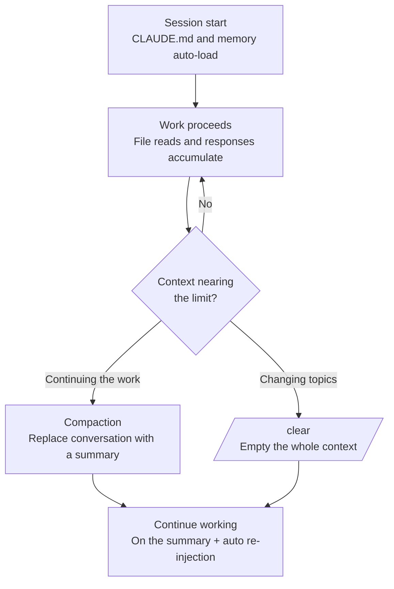

# Context Window

This page covers the context window — the space holding everything Claude Code remembers during a session — and how to manage it efficiently.


**One-line summary**: The context window is Claude's **workbench** and the ledger where token costs accrue. Clear space with auto-compaction and `/clear` before the desk fills up, and long tasks flow smoothly to the end in both quality and cost.



Picture the context window as the **size of your desk**. You spread out the papers you are working on (files, conversation), but the desk is not infinite. When it fills up, **summarizing older papers and filing them in a drawer** is compaction, and clearing the whole desk to start fresh is `/clear`. Even a large desk gets crowded if you pile on clutter, so the key is not a bigger desk but **putting less on it**.


## The Context Window and Tokens

The context window is the total amount of information Claude can "see" at once in a session. It includes not just the prompts you type, but also content that never appears in the terminal.

| What goes into context | Visible in the terminal? | Notes |
|------------------------|-------------------|------|
| System prompt | Not visible | Behavior rules. Always loaded first |
| Auto memory (`MEMORY.md`) | Not visible | Notes left by previous sessions. Only the first 200 lines or 25KB load |
| Environment info | Not visible | OS, shell, workspace path, etc. |
| MCP tool names (lazy-loaded) | Not visible | MCP tool definitions load only when needed, saving context |
| CLAUDE.md (global + project) | Not visible | Project rules and build commands |
| Skill descriptions (1 line) | Not visible | The actual body loads only when used |
| User prompts | Visible | The requests you actually typed |
| Files Claude read | One-line summary only | Only Claude sees the file body |
| Claude's analysis, edits, responses | Visible | Printed to the terminal as-is |

A token is the unit for counting this information. Roughly, one English word is 1-2 tokens, and Korean takes more tokens per character. One counterintuitive fact: **a substantial amount is already filled before the session even starts**, because CLAUDE.md, memory, the skill list, and MCP tool names load before your first prompt.

### File Reads Eat the Most Context

The files Claude reads while working dominate context usage. That is why writing specific prompts ("fix the bug in `auth.ts`") to reduce how many files Claude reads is the core of token saving. For work that must dig through many files, like research, delegate to a subagent — the large file reads happen in a separate context window and only a summary of the results returns to the main session.

## Sizes by Model

The context window size varies by model. Exact figures depend on the model in use, so read the following as general guidance.

| Size (general) | Meaning |
|---------------|------|
| ~200K tokens | The standard window for many models. Sufficient for typical code work |
| ~1M tokens | The extended window some models offer. Advantageous for a large codebase |

A bigger window holds more files and conversation at once, but no window is infinite. Whatever model you use, management becomes necessary as you approach the limit. The core principle: **keeping less in the window is more reliable than growing the window.**

## Auto-Compaction and /clear

As a session grows long, context approaches its limit. Claude Code handles this in two ways.

### Compaction

Compaction frees space by **replacing the accumulated conversation history with one structured summary**. You can run `/compact` yourself, and it also happens automatically as context nears the limit. The summary preserves:

- The user's requests and intent
- Key technical concepts
- Files examined or modified, and important code fragments
- Errors encountered and how they were resolved
- Remaining work and current progress

In exchange, full tool outputs and intermediate reasoning disappear. Claude can still reference what was done, but it no longer holds the original text of code it read earlier.

What happens to each piece of information after compaction depends on how it was loaded.

| Mechanism | State after compaction |
|----------|--------------|
| System prompt, output style | Kept as-is (not part of the message history) |
| Project-root CLAUDE.md, unscoped rules | Re-injected from disk |
| Auto memory | Re-injected from disk |
| Rules with a `paths:` frontmatter | Gone until the matching file is read again |
| Nested CLAUDE.md in subdirectories | Gone until a file in that directory is read again |
| Invoked skill bodies | Re-injected (5,000 tokens per skill, 25,000-token total cap, oldest removed first) |
| Hooks | Not applicable (hooks run as code and do not live in context) |

If you want a rule to survive compaction, remove its `paths:` frontmatter or move it to the project-root CLAUDE.md. Skills keep their beginning when truncated, so it is safest to put important instructions near the top of `SKILL.md`.

### Controlling When Auto-Compaction Fires

If you need to adjust when auto-compaction triggers, the environment variable `CLAUDE_AUTOCOMPACT_PCT_OVERRIDE` changes the threshold (default: roughly 75-80% of total context). For example, set a lower value to compact with more headroom.

```bash
export CLAUDE_AUTOCOMPACT_PCT_OVERRIDE=70  # start compaction at 70%
```

### /clear — Full Reset

`/clear` is different from compaction. It empties the conversation context entirely — not even a summary remains — starting **like a new session**. It is cleanest when moving to new work unrelated to what came before. Remember it as: summary (compaction) for "continuing the same work", reset (`/clear`) for "changing topics".


```mermaid
flowchart TD
    A[Session start<br>CLAUDE.md and memory auto-load] --> B[Work proceeds<br>File reads and responses accumulate]
    B --> C{Context nearing<br>the limit?}
    C -->|No| B
    C -->|Continuing the work| D[Compaction<br>Replace conversation with a summary]
    C -->|Changing topics| E[/clear<br>Empty the whole context/]
    D --> F[Continue working<br>On the summary + auto re-injection]
    E --> F
```

## Monitoring Usage

You cannot manage what you cannot see. Claude Code provides measurement tools.

| Command / location | What it shows |
|-------------|-------------|
| `/context` | Real-time context usage breakdown by category, with optimization suggestions |
| `/cost` | Token usage and cost for the current session |
| `/memory` | The list of CLAUDE.md and auto-memory files loaded at startup |
| Status line | Always displays usage as the session progresses |

Running `/context` once before or during a long task to see which items occupy context is a habit that makes a big difference.

## Management Strategies for Long Tasks

The larger the task, the more context becomes the primary constraint. Combining the following strategies carries one task reliably across multiple compaction boundaries.

- **Summarize, then continue**: finish a stage, tidy up with compaction, and run the next stage on top of the summary.
- **Split off to subagents**: hand exploration and research that read many files to subagents, protecting the main session's context.
- **Leave checkpoints in memory**: record important decisions and progress in memory so they survive compaction or `/clear`. Together with checkpointing, this sustains continuity in long sessions.
- **Put CLAUDE.md on a diet**: keep the project CLAUDE.md under 200 lines, and move reference material into skills or path-scoped rules so it loads only when needed.
- **Be specific in prompts**: narrow which files to read, cutting unnecessary file reads.

Of these, memory and checkpoints connect directly to MoAI-ADK's SPEC workflow and session handoff. MoAI-ADK extends the principles on this page into an operating discipline called the **context diet** — minimizing always-loaded guidance, saving progress to disk at model-specific thresholds (50% usage on 1M-context models, 90% on 200K models) with a session handoff that resumes the next session with a single paste, and displaying context usage (CW%) in the statusline at all times to warn of threshold approach. Here, it is enough to remember the best practices: "empty context before it fills, and persist important state to disk."

## Related Documents

- [Memory and Auto-Memory](/claude-code/context-memory/memory)
- [Checkpointing](/claude-code/context-memory/checkpointing)

## References

- [Claude Code Docs — Context window](https://code.claude.com/docs/en/context-window)


Run `/clear` once right before starting new work. Entering a new task with the previous task's file reads and conversation still piled up lets unrelated tokens occupy the desk, degrading both response quality and cost.

