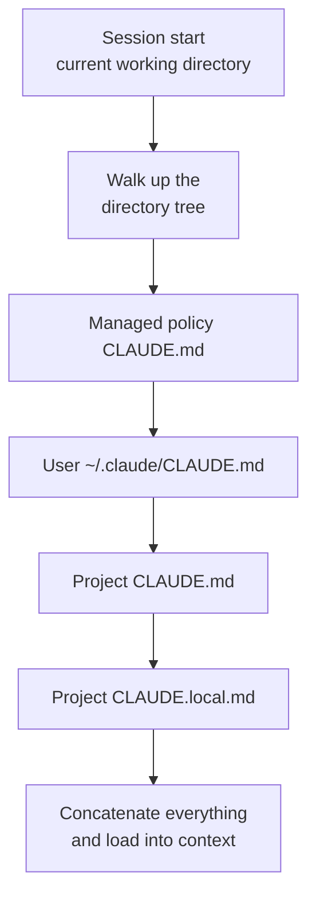
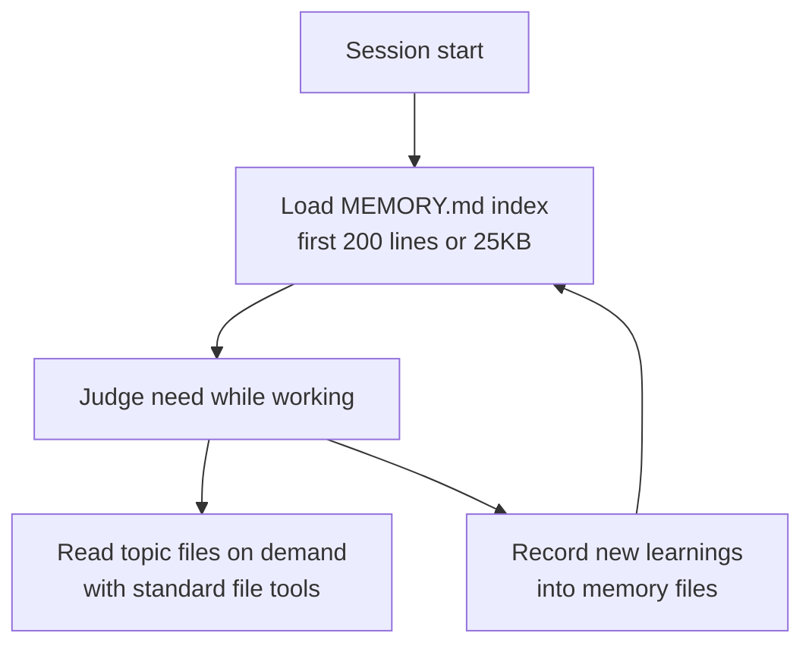

This page covers the two memory mechanisms that help Claude Code avoid losing project knowledge even though it starts each session with a fresh context window.


**TL;DR**: CLAUDE.md is the permanent guidance a human writes down, while auto memory is the learning notes Claude collects on its own as it works — both are loaded as context at the start of every session.


## Two Memory Mechanisms

Every Claude Code session starts with an empty context window. There are two ways to carry knowledge across sessions. The two complement each other and are loaded together at the start of every conversation.

| Aspect | CLAUDE.md file | Auto memory |
| :--- | :--- | :--- |
| **Authored by** | Human (written directly) | Claude (written by itself) |
| **Content** | Guidance and rules | Learnings and patterns |
| **Scope** | Project / user / organization | Per repository, shared across worktrees |
| **Load timing** | Every session (in full) | Every session (first 200 lines or 25KB) |
| **Use cases** | Coding standards, workflows, architecture | Build commands, debugging insights, discovered preferences |

Both kinds of memory are **context, not enforced configuration**. That is, Claude reads them and tries to follow them, but compliance is not guaranteed unconditionally. To strictly block a particular behavior, you must use a `PreToolUse` hook rather than memory.

## CLAUDE.md-Based Memory

CLAUDE.md is a Markdown file that holds permanent guidance for a project, your personal workflow, or your whole organization. A human writes it in plain text, and Claude reads it at the start of every session.

### When to Add to CLAUDE.md

It is the place to record facts you find yourself explaining again and again. Add to it when you see signals like these.

- When Claude repeats the same mistake a second time
- When code review catches a codebase fact Claude should have known
- When you are entering a correction you already entered in a previous session
- When the context is something you would have to explain identically to a new team member

Focus on facts that need to persist across every session — build commands, conventions, project layout, and rules like "always do X." If something is a multi-step procedure or only applies to part of the codebase, it is better moved to a skill or a path-scoped rule.

### Memory Hierarchy

CLAUDE.md can live in several locations, each with a different scope. The table below is ordered by load sequence (from broad scope to narrow), so more specific guidance enters the context later.

| Scope | Location | Purpose | Shared with |
| :--- | :--- | :--- | :--- |
| **Managed policy** | macOS: `/Library/Application Support/ClaudeCode/CLAUDE.md`<br>Linux/WSL: `/etc/claude-code/CLAUDE.md`<br>Windows: `C:\Program Files\ClaudeCode\CLAUDE.md` | Organization-wide guidance (managed by IT/DevOps) | All users in the organization |
| **User** | `~/.claude/CLAUDE.md` | Personal preferences common to all projects | Yourself (all projects) |
| **Project** | `./CLAUDE.md` or `./.claude/CLAUDE.md` | Team-shared project guidance | Teammates via source control |
| **Local** | `./CLAUDE.local.md` | Personal per-project preferences (subject to `.gitignore`) | Yourself (current project) |

The managed policy file cannot be excluded by personal settings, so organization guidance always applies. Instead of a separate file, you can also embed managed CLAUDE.md content directly through the `claudeMd` key in `managed-settings.json`.

### CLAUDE.md Load Order

Claude Code walks up the directory tree from the current working directory, looking for `CLAUDE.md` and `CLAUDE.local.md` in each directory. Discovered files are not overwritten by one another but are all concatenated into the context. Because the order runs from the filesystem root down toward the working directory, the guidance closest to the execution location is read last.



Files in the layers above the working directory are all loaded at startup, but files in subdirectories are only included when Claude reads a file in that directory. When files from other teams get picked up in a monorepo, you can skip specific files with the `claudeMdExcludes` setting.

### Including Other Files with Import Syntax

CLAUDE.md can pull in other files with the `@path/to/import` syntax. An imported file is expanded at startup and loaded into the context together with the CLAUDE.md that referenced it.

```text
See @README for project overview and @package.json for available npm commands.

# Additional Instructions
- git workflow @docs/git-instructions.md
```

- You can use both relative and absolute paths; a relative path is resolved against **the file containing the import**, not the working directory.
- An imported file can import other files in turn, up to a maximum depth of **4 hops**.
- The first time an external import is encountered, an approval dialog appears. If you reject it, the import stays inactive.

To share personal guidance across multiple worktrees, importing a file from your home directory is useful.

```text
# Individual Preferences
- @~/.claude/my-project-instructions.md
```

### Writing Effective Guidance

CLAUDE.md is loaded into the context window every session and consumes tokens along with the conversation. How you write it directly affects the compliance rate.

| Principle | Recommended | Avoid |
| :--- | :--- | :--- |
| **Size** | Aim for 200 lines or fewer per file | The longer it gets, the more context it consumes and the lower compliance drops |
| **Structure** | Group with headers and bullets | Dense paragraphs |
| **Specificity** | "Use 2-space indentation" | "Keep the code clean" |
| **Consistency** | Periodically clean up contradictory rules | When conflicts arise, Claude chooses arbitrarily |

Using a `.claude/rules/` directory lets you split guidance into topic files, and the `paths` field in the frontmatter can scope a rule to specific file paths so it loads only when working with matching files.

## Auto Memory

Auto memory lets Claude accumulate knowledge across sessions without a human writing anything down. As it works, it records build commands, debugging insights, architecture notes, code style preferences, workflow habits, and more on its own. It does not save something every session — it judges whether something will be useful in future conversations and keeps only what is worth recording.

Auto memory requires Claude Code v2.1.59 or later. You can check the version with `claude --version`.

### What Is Saved Where

Each project has its own memory directory.

```text
~/.claude/projects/<project>/memory/
├── MEMORY.md          # Concise index, loaded every session
├── debugging.md       # Detailed debugging-pattern notes
├── api-conventions.md # API design decisions
└── ...                # Other topic files Claude creates
```

The `<project>` path is derived from the git repository, so **all worktrees and subdirectories of the same repository share a single memory directory** (outside a git repository, the project root is used). Auto memory is **machine-local**, so it is not shared with other machines or cloud environments.

The `autoMemoryDirectory` setting lets you change the storage location. The value must be an absolute path or start with `~/`.

```json
{
  "autoMemoryDirectory": "~/my-custom-memory-dir"
}
```

### How Recall Works

`MEMORY.md` serves as the index of the memory directory. **Only up to the first 200 lines or 25KB, whichever comes first,** is loaded at the start of every conversation; anything beyond that is not loaded at startup. That is why Claude moves detailed notes into separate topic files to keep `MEMORY.md` concise.



Topic files like `debugging.md` and `patterns.md` are not loaded at startup; Claude reads them directly with standard file tools when it needs the information. When you see "Writing memory" or "Recalled memory" on the Claude Code screen, it is actually updating or reading the memory directory.

This 200-line/25KB limit applies only to `MEMORY.md`. A CLAUDE.md file is loaded in full regardless of length (though shorter is better for compliance).

### Turning It On and Off, and Auditing

Auto memory is on by default. You can toggle it by opening `/memory` or turn it off with the `autoMemoryEnabled` setting, and it is also disabled by the environment variable `CLAUDE_CODE_DISABLE_AUTO_MEMORY=1`.

```json
{
  "autoMemoryEnabled": false
}
```

The `/memory` command lists every CLAUDE.md, `CLAUDE.local.md`, and rule file loaded into the current session, and provides the auto-memory toggle and a link to open the memory folder. All auto-memory files are plain Markdown, so you can edit or delete them directly at any time. If you ask it to remember something like "always use pnpm, not npm," it is saved to auto memory, and if you say "add this to CLAUDE.md," it is added to CLAUDE.md.

## Best Practices for Writing Memory

Good memory is short and verifiable. Following these principles raises both compliance and readability.

- **Keep it concise**: Keep `MEMORY.md` as an index and separate the details into topic files. Aim for 200 lines or fewer per CLAUDE.md file.
- **One fact per file**: Gather one topic into one file. Use descriptive file names like `testing.md` and `api-design.md`.
- **Be specific**: Write verifiable sentences instead of vague expressions (such as "run `npm test` before committing").
- **Clean up contradictions**: Periodically remove conflicting guidance. If a conflict remains, Claude decides arbitrarily which side to follow.
- **Use a hook when enforcement is needed**: For things that must run at a specific point, such as before every commit, write a hook rather than memory.

## Relationship to the MoAI-ADK Memory System

MoAI-ADK operates on top of the Claude Code memory foundation above. It uses the CLAUDE.md at the project root as the orchestrator's execution guidance, and it leverages the auto-memory `MEMORY.md` index and topic files for session handoff and accumulating lessons during SPEC work. The memory operation rules and index management approach unique to MoAI are covered in detail in a separate document.

## Related Docs

- [CLAUDE.md Guide](/advanced/claude-md-guide)

## References

- [How Claude remembers your project (Claude Code Docs)](https://code.claude.com/docs/en/memory)
- [Auto memory (Claude Code Docs)](https://code.claude.com/docs/en/memory#auto-memory)


If you are curious what has accumulated in auto memory right now, run `/memory` in a session and open the folder. It is all plain Markdown, so you can read, refine, and delete it right there.

