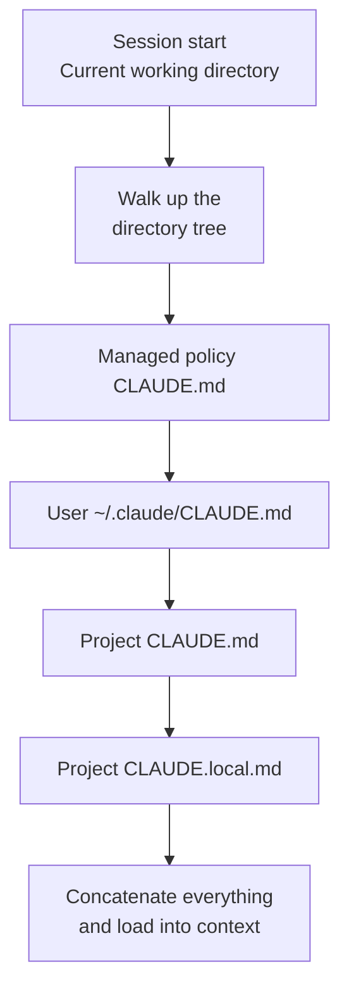
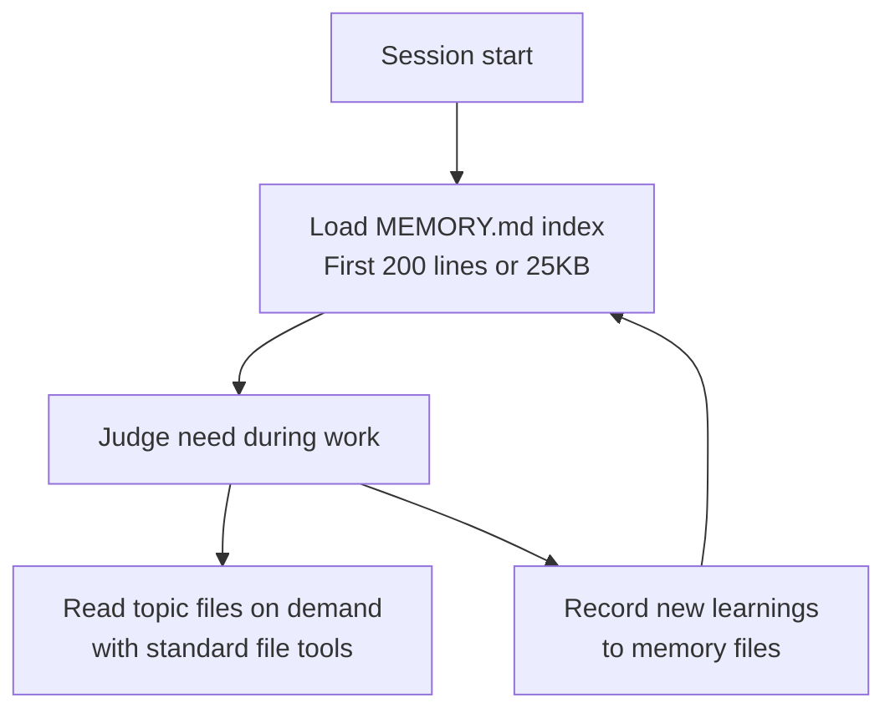

This page looks at the two memory mechanisms that keep Claude Code from losing project knowledge even though every session starts with a fresh context window.


**One-line summary**: CLAUDE.md is permanent guidance a human writes down, and auto memory is a learning notebook Claude writes for itself while working — both load into context at the start of every session.


## Two Memory Mechanisms

Every Claude Code session starts with an empty context window. There are two ways to carry knowledge across sessions. They complement each other, and both load together at the start of every conversation.

| Aspect | CLAUDE.md files | Auto memory |
| :--- | :--- | :--- |
| **Author** | Human (written directly) | Claude (writes on its own) |
| **Contents** | Guidance and rules | Learnings and patterns |
| **Scope** | Project / user / organization | Repository-level, shared across worktrees |
| **Load timing** | Every session (in full) | Every session (first 200 lines or 25KB) |
| **Use cases** | Coding standards, workflows, architecture | Build commands, debugging insights, discovered preferences |

Both memories are **context, not enforced configuration**. That is, Claude reads them and tries to follow them, but unconditional compliance is not guaranteed. To definitively block a specific action, use a `PreToolUse` hook, not memory.

## CLAUDE.md-Based Memory

CLAUDE.md is a markdown file holding permanent guidance for a project, a personal workflow, or an entire organization. A human writes it in plain prose; Claude reads it at the start of every session.

### When to Add to CLAUDE.md

It is the place for facts you keep re-explaining. Add to it when these signals appear:

- Claude repeats the same mistake a second time
- Code review catches a codebase fact Claude should have known
- You are typing the same correction you typed last session
- It is context you would have to explain identically to a new teammate

Focus on facts that must persist every session — build commands, conventions, project layout, "always do X" rules. If it is a multi-step procedure or applies to only part of the codebase, it is better moved to a skill or a path-scoped rule.

### The Memory Hierarchy

CLAUDE.md can live in several locations, each with a different scope. The table below lists them in load order (broadest to narrowest scope) — more specific guidance enters context later.

| Scope | Location | Purpose | Shared with |
| :--- | :--- | :--- | :--- |
| **Managed policy** | macOS: `/Library/Application Support/ClaudeCode/CLAUDE.md`<br>Linux/WSL: `/etc/claude-code/CLAUDE.md`<br>Windows: `C:\Program Files\ClaudeCode\CLAUDE.md` | Organization-wide guidance (managed by IT/DevOps) | All users in the organization |
| **User** | `~/.claude/CLAUDE.md` | Personal preferences across all projects | Yourself (all projects) |
| **Project** | `./CLAUDE.md` or `./.claude/CLAUDE.md` | Team-shared project guidance | Teammates via source control |
| **Local** | `./CLAUDE.local.md` | Personal per-project preferences (target of `.gitignore`) | Yourself (current project) |

The managed policy file cannot be excluded by personal settings, so organizational guidance always applies. Instead of a separate file, the `claudeMd` key in `managed-settings.json` can carry managed CLAUDE.md content directly.

### CLAUDE.md Load Order

Claude Code walks up the directory tree from the current working directory, looking for `CLAUDE.md` and `CLAUDE.local.md` in each directory. Found files are all **concatenated** into context rather than overriding one another. The order runs from the filesystem root down toward the working directory, so guidance closest to where you launched is read last.


```mermaid
flowchart TD
    A["Session start<br>Current working directory"] --> B["Walk up the<br>directory tree"]
    B --> C["Managed policy CLAUDE.md"]
    C --> D["User ~/.claude/CLAUDE.md"]
    D --> E["Project CLAUDE.md"]
    E --> F["Project CLAUDE.local.md"]
    F --> G["Concatenate everything<br>and load into context"]
```

Files in the hierarchy above the working directory all load at startup, but files in subdirectories are included only when Claude reads a file in that directory. In a monorepo where other teams' files get picked up, the `claudeMdExcludes` setting can skip specific files.

### Including Other Files with Import Syntax

CLAUDE.md can pull in other files with the `@path/to/import` syntax. Imported files are expanded at startup together with the CLAUDE.md that referenced them and loaded into context.

```text
See @README for project overview and @package.json for available npm commands.

# Additional Instructions
- git workflow @docs/git-instructions.md
```

- Both relative and absolute paths work; relative paths resolve against **the file containing the import**, not the working directory.
- Imported files can import other files in turn, up to a maximum depth of **4 hops**.
- The first time an external import is encountered, an approval dialog appears. Declined imports remain inactive.

To share personal guidance across multiple worktrees, importing a file from your home directory is a useful pattern.

```text
# Individual Preferences
- @~/.claude/my-project-instructions.md
```

### Writing Effective Guidance

CLAUDE.md loads into the context window every session and consumes tokens alongside the conversation. How you write it directly affects compliance.

| Principle | Do | Avoid |
| :--- | :--- | :--- |
| **Size** | Aim for 200 lines or fewer per file | Longer files raise context consumption and lower compliance |
| **Structure** | Group with headers and bullets | Dense paragraphs |
| **Specificity** | "Use 2-space indentation" | "Keep the code clean" |
| **Consistency** | Periodically clean up contradictory rules | On conflict, Claude picks arbitrarily |

The `.claude/rules/` directory lets you split guidance into per-topic files, and the frontmatter `paths` field can scope a rule to load only when handling files matching specific paths.

## Auto Memory

Auto memory lets Claude accumulate knowledge across sessions without a human writing anything. As it works, it records build commands, debugging insights, architecture notes, code-style preferences, and workflow habits on its own. It does not save something every session — it judges whether an item will be useful to future conversations and keeps only what is worth recording.

Auto memory requires Claude Code v2.1.59 or later. Check your version with `claude --version`.

### What Is Stored Where

Each project has its own memory directory.

```text
~/.claude/projects/<project>/memory/
├── MEMORY.md          # concise index, loaded every session
├── debugging.md       # detailed notes on debugging patterns
├── api-conventions.md # API design decisions
└── ...                # other topic files Claude creates
```

The `<project>` path is derived from the git repository, so **all worktrees and subdirectories of the same repository share one memory directory** (outside a git repository, the project root is used). Auto memory is **machine-local** — it is not shared with other machines or cloud environments.

The `autoMemoryDirectory` setting changes the storage location. The value must be an absolute path or start with `~/`.

```json
{
  "autoMemoryDirectory": "~/my-custom-memory-dir"
}
```

### How Recall Works

`MEMORY.md` acts as the index of the memory directory. **Only the first 200 lines or 25KB, whichever comes first**, loads at the start of every conversation; anything beyond that is not loaded at startup. That is why Claude moves detailed notes into separate topic files, keeping `MEMORY.md` concise.


```mermaid
flowchart TD
    A["Session start"] --> B["Load MEMORY.md index<br>First 200 lines or 25KB"]
    B --> C["Judge need during work"]
    C --> D["Read topic files on demand<br>with standard file tools"]
    C --> E["Record new learnings<br>to memory files"]
    E --> B
```

Topic files like `debugging.md` and `patterns.md` do not load at startup; Claude reads them directly with standard file tools when the information is needed. When you see "Writing memory" or "Recalled memory" on the Claude Code screen, it is actually updating or reading the memory directory.

The 200-line/25KB limit applies only to `MEMORY.md`. CLAUDE.md files load in full regardless of length (though shorter ones get better compliance).

### Toggling and Auditing

Auto memory is on by default. Toggle it via `/memory`, turn it off with the `autoMemoryEnabled` setting, or disable it with the environment variable `CLAUDE_CODE_DISABLE_AUTO_MEMORY=1`.

```json
{
  "autoMemoryEnabled": false
}
```

The `/memory` command lists every CLAUDE.md, `CLAUDE.local.md`, and rule file loaded in the current session, and offers the auto-memory toggle and a link to open the memory folder. Auto-memory files are all plain markdown, so you can edit or delete them directly at any time. Asking Claude to remember something like "always use pnpm, not npm" saves it to auto memory; saying "add this to CLAUDE.md" adds it to CLAUDE.md.

## Memory-Writing Best Practices

Good memory is short and verifiable. Following these principles raises compliance and readability together.

- **Be concise**: keep `MEMORY.md` as an index and split details into topic files. Aim for 200 lines or fewer per CLAUDE.md file.
- **One topic per file**: gather one subject in one file. Use descriptive filenames like `testing.md` and `api-design.md`.
- **Be specific**: write verifiable statements instead of vague ones (like "run `npm test` before committing").
- **Resolve contradictions**: periodically remove conflicting guidance. If conflicts remain, Claude decides arbitrarily which to follow.
- **Use hooks when enforcement is needed**: work that must run at a specific point, like before every commit, belongs in a hook, not memory.

## Relationship to the MoAI-ADK Memory System

MoAI-ADK operates on top of this Claude Code memory foundation. It uses the project-root CLAUDE.md as orchestrator execution guidance, and uses auto memory's `MEMORY.md` index and topic files for SPEC-work session handoffs and accumulating lessons.

File-based persistent memory is also the raw material of MoAI-ADK's **recursive self-learning** pillar. The observations the loop leaves behind — user corrections, failure patterns, routing decisions — accumulate in memory files, and the harness improves skills and agent guidance based on that accumulation. The first link in the sentence "the loop accumulates observations, the harness learns, and the guidance evolves" is precisely the memory mechanism on this page. MoAI's own memory operating rules and index management are covered in detail in separate documents.

## Related Documents

- [CLAUDE.md Guide](/advanced/claude-md-guide)

## References

- [How Claude remembers your project (Claude Code Docs)](https://code.claude.com/docs/en/memory)
- [Auto memory (Claude Code Docs)](https://code.claude.com/docs/en/memory#auto-memory)


Curious what has accumulated in auto memory? Run `/memory` in a session and open the folder. It is all plain markdown — read, refine, and delete on the spot.

