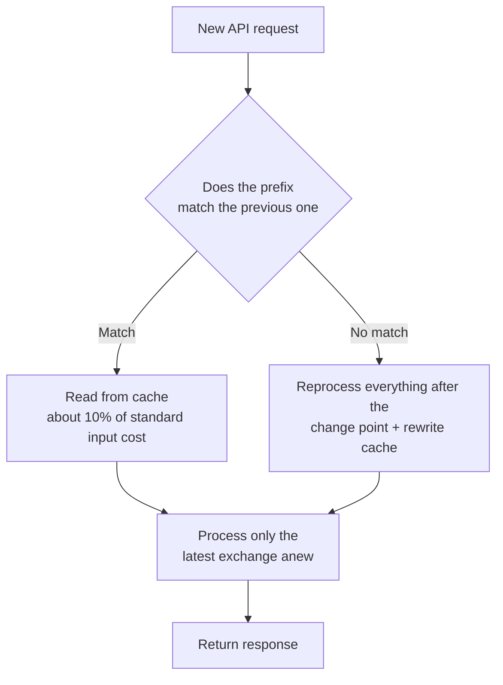

Instead of reprocessing the entire conversation on every turn, Claude Code automatically manages prompt caching to reuse the portions it has already processed.


**TL;DR**: The unchanging front portion (the prefix) is read straight from the cache, so the same work is never processed twice — dramatically reducing cost and response time.


## Why Prompt Caching Is Needed

The model remembers nothing between one request and the next. So every time Claude Code sends a message, it creates a new API request and resends the **entire context** (system prompt, project context, every prior message and tool result, and the new message).

The key point is that new content is always **appended at the very end**. As a result, most of each request is identical to the previous one. Prompt caching is precisely the mechanism that avoids reprocessing this "unchanged portion."

## How the Cache Works

The API compares the **beginning** of each request against content it processed recently. This beginning is called the **prefix**. On a typical turn, the entire previous request becomes the prefix, and only the most recent single exchange is new content.

Matching uses an **exact-match** approach, so if anything in the prefix changes, everything after it is recomputed. There is no per-file or per-segment caching.



### Three-Layer Structure for Caching

To improve prefix-matching efficiency, Claude Code places **content that rarely changes at the front**.

| Layer | Contents | When invalidated |
|-------|----------|------------------|
| System prompt | Core instructions, tool definitions, output style | MCP server connect/disconnect, Claude Code upgrade |
| Project context | `CLAUDE.md`, auto memory, unscoped rules | Session start, after `/clear` or `/compact` |
| Conversation | User messages, Claude responses, tool results | Every turn |

When only the conversation layer changes, the system prompt and project context remain cached. Conversely, if the system prompt changes, everything after it sits behind a different prefix, so the **entire cache is invalidated**.

There are two more things that are not part of the prompt text but are part of the cache key.

- **Model**: Caches are separate per model. Switching models with `/model` recomputes everything, even when the content is identical.
- **Effort level**: Even for the same model, caches are separate per effort level. Changing it mid-session with `/effort` recomputes everything, and Claude Code asks for confirmation before applying.

## What Gets Cached

What gets cached ultimately is the **large chunk at the front of the request that rarely changes**.

- **System prompt**: Core instructions and output style
- **Tool definitions**: The full definitions of built-in tools and MCP tools
- **Project context**: `CLAUDE.md`, auto memory, rules
- **Accumulated conversation history**: Prior messages, Claude responses, tool results, large context (such as large codebase files that were read in)

These chunks are processed once per turn and written to the cache; on subsequent turns they are read back as-is for only about 10% of the standard input cost.

## Cost and Latency Savings (Conceptually)

Cache performance is revealed by two token figures the API reports with every response.

| Field | Meaning |
|-------|---------|
| `cache_creation_input_tokens` | Tokens **written** to the cache this turn, billed at the cache-write rate |
| `cache_read_input_tokens` | Tokens **read** from the cache this turn, billed at about 10% of the standard input rate |

- **Cost**: Read tokens are billed at about 10% of the standard input rate. The higher the cache-read ratio, the cheaper the same work becomes.
- **Latency**: Because the unchanged prefix is not reprocessed, responses are faster. Conversely, a turn where the cache is invalidated becomes slow and expensive once.

**The higher the read-to-creation ratio**, the better caching is working. If writes keep coming out high turn after turn, that is a signal that something in the prefix is changing every time.

## Actions That Invalidate the Cache

The following actions cause the next request to miss part or all of the cache. After one slow and expensive turn, the new prefix is cached again.

| Action | Impact |
|--------|--------|
| Switching models (`/model`, `opusplan` toggle) | Full recompute (caches are separate per model) |
| Changing effort level (`/effort`) | Full recompute, confirmation requested before applying |
| MCP server connect/disconnect | System prompt layer invalidated |
| Denying an entire tool (a bare-name deny rule such as `Bash` or `WebFetch`) | System prompt layer invalidated |
| Compacting the conversation (`/compact`) | Conversation layer invalidated (intended behavior) |
| Claude Code upgrade | System prompt / tool definitions change → full rebuild |

> **Scoped** deny rules such as `Bash(rm *)`, and all allow/ask rules, do not change the tool set Claude sees, so the prefix stays intact.

## Actions That Preserve the Cache

Conversely, the following actions only append to the end of the conversation or don't touch the request at all, so the cache stays alive.

- Editing files in the repository (when Claude reads them again, it appends to the end of the conversation)
- Editing `CLAUDE.md` mid-session (the cache is preserved, but the edits are **not applied** until the next `/clear`, `/compact`, or restart)
- Changing the output style (likewise applied at the next `/clear` or restart)
- Changing the permission mode (except `opusplan` plan mode)
- Invoking a skill or command (the instructions are inserted as a user message)
- Running `/recap`, rewinding with `/rewind`

## Automatic Use in Claude Code

Prompt caching is **on by default** and managed automatically by Claude Code. No separate setting is needed to turn it on. The best practices for raising the cache hit rate are simple.

- Decide on the model, effort level, and MCP servers **at the start of the session**, and don't change them mid-task.
- Run `/compact` at the natural boundaries between tasks.
- If you've gone down a path you want to discard, use `/rewind` to roll back to an already-cached earlier turn instead of `/compact`.

In practice the cache is scoped **per machine and per directory**, because the system prompt contains the working directory, platform, shell, OS version, and auto-memory path. Even worktrees of the same repository have different directories, so they do not share each other's caches.

### Cache Lifetime (TTL)

A cached prefix expires after a period of inactivity. Every request that hits the cache resets the timer, so the cache stays warm while you keep working.

| Auth method | Default TTL | Tuning environment variable |
|-------------|-------------|-----------------------------|
| Claude subscription | 1 hour (automatic, no extra cost) | Automatically 5 minutes when limits are exceeded |
| API key / third party | 5 minutes | Switch to 1 hour with `ENABLE_PROMPT_CACHING_1H=1` |
| (Common override) | — | Force 5 minutes with `FORCE_PROMPT_CACHING_5M=1` |

## How to Monitor

To see whether the cache is working well, watch the two token figures above (`cache_read_input_tokens`, `cache_creation_input_tokens`).

- **statusline script**: A statusline script that reads the `current_usage` object lets you check in real time every turn.
- **OpenTelemetry exporter**: When you need org-wide visibility, it reports per-user and per-session cache read/write tokens.

If cache-write tokens stay high turn after turn, look for the cause in the "Actions That Invalidate the Cache" table.

### Disabling Caching

You only need to turn caching off about as far as debugging the behavior of a specific model or provider. Normally, leave it on.

```bash
# Disable for all models
export DISABLE_PROMPT_CACHING=1

# Disable for a specific model only
export DISABLE_PROMPT_CACHING_OPUS=1
```

## Going Deeper in MoAI-ADK

MoAI-ADK is designed to maintain a stable prefix (system prompt, `CLAUDE.md`, rules) within its SPEC-based workflow to raise the cache hit rate. The **break-even analysis** of when caching actually pays off on the cost side is covered in the document below.

## Related Docs

- [Prompt Caching — Break-Even Analysis](/cost-optimization/prompt-caching)

## References

- [How Claude Code uses prompt caching](https://code.claude.com/docs/en/prompt-caching)


Practical tip: When you start a session, lock in the model, effort level, and MCP servers first, and don't change them until the work is done. The fewer mid-task changes, the higher the cache hit rate and the faster the responses.

