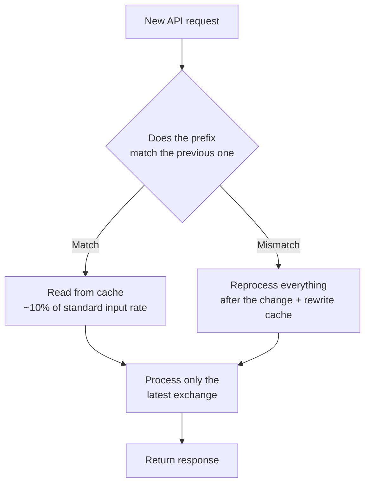

Instead of reprocessing the entire conversation every turn, Claude Code automatically manages prompt caching, which reuses the parts already processed.


**One-line summary**: The unchanging front portion (the prefix) is read straight from the cache each time, so the same work is never processed twice — dramatically reducing cost and response time.


## Why Prompt Caching Is Needed

The model remembers nothing between requests. So every time Claude Code sends a message, it makes a new API request and retransmits the **entire context** (system prompt, project context, all previous messages and tool results, the new message).

The key point is that new content is always **appended at the end**. Most of each request is therefore identical to the previous one. Prompt caching is precisely the mechanism that avoids reprocessing this "unchanged part".

## How the Cache Works

The API compares the **beginning** of each request against recently processed content. This beginning is called the **prefix**. On a typical turn, the entire previous request becomes the prefix, and only the most recent exchange is new content.

Matching is **exact-match**: if anything anywhere in the prefix changes, everything after it is recomputed. There is no per-file or per-segment caching.


```mermaid
flowchart TD
    A[New API request] --> B{Does the prefix<br>match the previous one}
    B -->|Match| C[Read from cache<br>~10% of standard input rate]
    B -->|Mismatch| D[Reprocess everything<br>after the change + rewrite cache]
    C --> E[Process only the<br>latest exchange]
    D --> E
    E --> F[Return response]
```

### The 3-Layer Structure for Caching

To maximize prefix-match efficiency, Claude Code places **the content that almost never changes at the front**.

| Layer | Contents | When invalidated |
|------|-----------|-----------------|
| System prompt | Core instructions, tool definitions, output style | MCP server connect/disconnect, Claude Code upgrades |
| Project context | `CLAUDE.md`, auto memory, unscoped rules | Session start, after `/clear` or `/compact` |
| Conversation | User messages, Claude responses, tool results | Every turn |

If only the conversation layer changes, the system prompt and project context remain cached. Conversely, if the system prompt changes, everything after it now sits behind a different prefix, so **the whole thing is invalidated**.

Two more things are part of the cache key without appearing in the prompt text:

- **Model**: each model has a separate cache. Switching models with `/model` recomputes everything even if the content is identical.
- **Effort level**: even on the same model, each effort level has its own cache. Changing it mid-session with `/effort` recomputes everything, and Claude Code asks for confirmation before applying.

## What Gets Cached

What ends up cached is, in the end, **the big chunks near the front of the request that rarely change**.

- **System prompt**: core instructions and output style
- **Tool definitions**: the full definitions of built-in and MCP tools
- **Project context**: `CLAUDE.md`, auto memory, rules
- **Accumulated conversation history**: previous messages, Claude responses, tool results, large context (such as large-codebase files that were read)

These chunks are processed once in a turn and written to the cache; subsequent turns read them back for roughly 10% of the standard input rate.

## Cost and Latency Savings (Conceptually)

Cache performance shows up in two token figures the API reports with every response.

| Field | Meaning |
|------|------|
| `cache_creation_input_tokens` | Tokens **written** to the cache this turn, billed at the cache-write rate |
| `cache_read_input_tokens` | Tokens **read** from the cache this turn, billed at ~10% of the standard input rate |

- **Cost**: read tokens cost roughly 10% of the standard input rate. The higher the cache-read ratio, the cheaper the same work.
- **Latency**: unchanged prefixes are not reprocessed, so responses come faster. Conversely, a turn where the cache is invalidated is once-off slower and more expensive.

**The higher the read-to-creation ratio, the better caching is working.** If writes stay high turn after turn, it is a signal that something in the prefix is changing every time.

## Actions That Invalidate the Cache

The following actions cause the next request to miss part or all of the cache. After one slow, expensive turn, the new prefix is cached again.

| Action | Impact |
|------|------|
| Model switch (`/model`, `opusplan` toggle) | Full recompute (caches are per-model) |
| Effort-level change (`/effort`) | Full recompute; confirmation requested before applying |
| MCP server connect/disconnect | Invalidates the system-prompt layer |
| Whole-tool deny (bare-name deny rules like `Bash`, `WebFetch`) | Invalidates the system-prompt layer |
| Conversation compaction (`/compact`) | Invalidates the conversation layer (intended behavior) |
| Claude Code upgrade | System prompt / tool definitions change → full rebuild |

> **Scoped** deny rules like `Bash(rm *)` and all allow/ask rules do not change the tool set Claude sees, so the prefix stays intact.

## Actions That Preserve the Cache

Conversely, the following actions only append to the end of the conversation or do not touch the request at all, so the cache stays alive.

- Editing repository files (when Claude re-reads them, they append to the end of the conversation)
- Editing `CLAUDE.md` mid-session (the cache is preserved, but the edits are **not applied** until the next `/clear`, `/compact`, or restart)
- Changing the output style (likewise applied at the next `/clear` or restart)
- Changing the permission mode (except `opusplan` plan mode)
- Invoking skills and commands (the instructions are inserted as a user message)
- Running `/recap`, rewinding with `/rewind`

## Automatic Use in Claude Code

Prompt caching is **on by default** and Claude Code manages it for you. No setting is needed to enable it. The best practices for raising the hit rate are simple:

- Decide model, effort level, and MCP servers **at session start**, and do not change them mid-work.
- Run `/compact` at natural breaks between pieces of work.
- If you have gone down a path you will abandon, use `/rewind` to return to an already-cached earlier turn instead of `/compact`.

The cache is effectively scoped **per machine, per directory**, because the system prompt embeds the working directory, platform, shell, OS version, and auto-memory path. Worktrees of the same repository are different directories, so they do not share each other's cache.

### Cache Lifetime (TTL)

A cached prefix expires after a period of inactivity. Every cache-hitting request resets the timer, so the cache stays warm while you keep working.

| Auth method | Default TTL | Adjusting env var |
|-----------|----------|----------------|
| Claude subscription | 1 hour (automatic, no extra cost) | Automatically 5 minutes when over quota |
| API key / third party | 5 minutes | Switch to 1 hour with `ENABLE_PROMPT_CACHING_1H=1` |
| (Force, either) | — | Force 5 minutes with `FORCE_PROMPT_CACHING_5M=1` |

## How to Monitor

To see whether caching is working well, watch the two token figures above (`cache_read_input_tokens`, `cache_creation_input_tokens`).

- **Statusline scripts**: a status line script reading the `current_usage` object gives real-time visibility every turn.
- **OpenTelemetry exporter**: for organization-wide visibility, it reports cache read/write tokens per user and session.

If cache-write tokens stay high every turn, look for the cause in the "Actions That Invalidate the Cache" table.

### Disabling Caching

Caching only needs to be turned off when debugging the behavior of a specific model or provider. Otherwise, leave it on.

```bash
# Disable for all models
export DISABLE_PROMPT_CACHING=1

# Disable for a specific model only
export DISABLE_PROMPT_CACHING_OPUS=1
```

## Going Deeper with MoAI-ADK — The Most Measurable Axis of Tokenomics

Prompt caching is the easiest axis to measure in MoAI-ADK's **Tokenomics** pillar. MoAI-ADK exploits the cache in two directions.

- **Design that raises the hit rate**: within the SPEC-based workflow, it keeps the prefix stable (system prompt, `CLAUDE.md`, rules) and diets the always-loaded context, making the cache-surviving front portion as large and stable as possible.
- **Instrumentation that shows the hit rate**: it displays a cache-hit signal in the statusline, so the effect of the context diet is visible mid-session. On the GLM backend (z.ai), implicit prompt caching applies automatically.

A **break-even analysis** of when caching actually pays off cost-wise is covered in the document below.

## Related Documents

- [Prompt Caching — Break-Even Analysis](/cost-optimization/prompt-caching)

## References

- [How Claude Code uses prompt caching](https://code.claude.com/docs/en/prompt-caching)


Practical tip: fix your model, effort level, and MCP servers at the start of a session, and do not change them until the work is done. The fewer mid-session changes, the higher the cache hit rate and the faster the responses.

