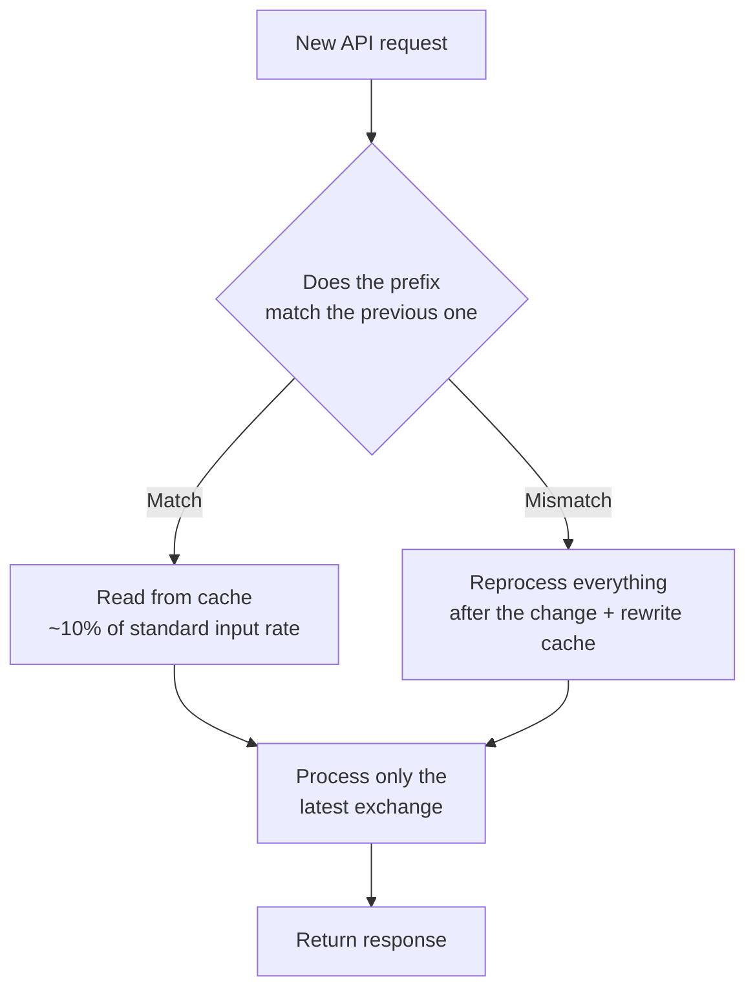

Claude Code does not resend the whole conversation from scratch every turn. Instead it takes the part it has already processed right before and reuses it from the cache, and processes only the newly-added tail. This mechanism is **prompt caching**, and Claude Code turns it on automatically.


This page is background material on **Claude Code itself**, the platform MoAI-ADK runs on. The MoAI-ADK-side treatment of prompt caching is [Prompt Caching — Break-Even Analysis](/en/cost-optimization/prompt-caching).



**One-line summary**: The unchanging front portion (the prefix) is read straight from the cache every request, so the same content is never processed twice. Cache reads cost roughly 10% of standard input, and when the cache is invalidated, recomputation starts from that point.



Prompt caching is like a **bookmark** in a book. Claude Code re-sends the system prompt, project rules, and the conversation so far from the beginning with every request — but if the front portion is identical to the previous request, it skips to the bookmark instead of re-reading from page one. The longer the front stays unchanged, the bigger the cache win; once it changes, everything after that point has to be re-read.


## Why Prompt Caching Is Needed

The model remembers nothing between requests. So every time Claude Code sends a message, it makes a new API request and retransmits the **entire context** — system prompt, project rules, tool definitions, all previous messages and tool results, and the new message.

The key point is that new content is always **appended at the end**. Most of each request is therefore identical to the previous one; the only genuinely new thing is the single most-recent exchange. Prompt caching is precisely what keeps this "unchanged front portion" from being recomputed every time.

## How the Cache Works

The API compares the **beginning** of each incoming request against recently processed content. This beginning is called the **prefix**. On a typical turn, the entire previous request becomes the prefix, and only the most recent exchange is new content.

Matching must be **exact** to succeed. If anything anywhere in the prefix changes, everything after it is recomputed. There is no per-file or per-segment caching.


```mermaid
flowchart TD
    A[New API request] --> B{Does the prefix<br>match the previous one}
    B -->|Match| C[Read from cache<br>~10% of standard input rate]
    B -->|Mismatch| D[Reprocess everything<br>after the change + rewrite cache]
    C --> E[Process only the<br>latest exchange]
    D --> E
    E --> F[Return response]
```

### A Request Is Assembled in Three Chunks

A request is always assembled in a fixed order. This order is the structure of the prefix, and it decides how long the cache survives.

| Order | Layer | What goes in | When it changes |
|------|------|-----------------|-------------|
| 1 | Tool definitions (tools) | Full schemas of built-in + MCP tools | MCP server connect/disconnect, Claude Code upgrades |
| 2 | System prompt (system) | Core instructions, permission rules, output style, `CLAUDE.md`, auto memory | Permission rule changes, session-start file edits, `/clear` |
| 3 | Messages (messages) | User input + Claude responses + tool results | Every turn (appended at the end) |

Content that almost never changes is placed at the front. If only the messages layer changes, the tool-definition and system-prompt layers stay cached. Conversely, if the system prompt or tool definitions change, everything after sits behind a different prefix, so **the whole thing is invalidated**.

Two more things are part of the cache key without showing up in the request text:

- **Model**: each model has a separate cache. Even with identical content, switching models via `/model` recomputes everything. The fact that context window size also varies per model is covered in the [Context Window](/en/claude-code/context-memory/context-window) document.
- **Effort level**: even on the same model, each effort level has its own cache. Changing it mid-session via `/effort` recomputes everything, and Claude Code asks for confirmation before applying.

## Cache Lifetime: 5 Minutes (idle-based)

A cached prefix stays warm as long as cache-hitting requests keep coming, but **if no request arrives for 5 minutes it expires**. This lifetime is **idle-based** — once 5 minutes pass from the last request, the cache disappears, and the next request has to write the prefix from scratch.

A long human-intervention wait (time spent answering a question, time spent waiting for review) that crosses this 5-minute window cools the cache. The larger the context, the larger this expiration cost — because the prefix to refill is bigger. So unless a gate is genuinely necessary, do not pause for long with a large context.

| Auth method | Default TTL | Adjusting |
|-----------|----------|------|
| Claude subscription | 1 hour (automatic, no extra cost) | Automatically 5 minutes when over quota |
| API key · third party | 5 minutes | Switch to 1 hour with `ENABLE_PROMPT_CACHING_1H=1` |
| (Force, either) | — | Force 5 minutes with `FORCE_PROMPT_CACHING_5M=1` |

Think of it as 5 minutes being the baseline and the subscription environment auto-extending to 1 hour.

## Cost: Reads Are Cheap, Writes Slightly Expensive

Whether the cache is working shows up in two token figures the API reports with every response.

| Field | Meaning | Cost |
|------|------|------|
| `cache_read_input_tokens` | Tokens **read** from the cache this turn | **~0.1×** the standard input rate (≈10%) |
| `cache_creation_input_tokens` | Tokens **written** to the cache this turn | **1.25×** the standard input rate (5-minute TTL) |

- **Reads** cost about 10% of standard input, so the higher the proportion of reads, the cheaper the same work becomes.
- **Writes** cost 25% more than standard input. A turn that invalidates the cache pays this write cost once and rebuilds the prefix. The 1-hour TTL carries a higher write premium but is applied automatically and for free on subscriptions.

The **read-to-write ratio** is the key cache-health signal. Reads vastly outnumbering writes means caching is working. Conversely, if write tokens stay high turn after turn, something in the prefix is changing every time — look for the cause in the "Actions That Invalidate the Cache" table below.

There is also a latency win. Unchanged prefixes are not reprocessed, so responses come faster. Only the turn where the cache is invalidated is once-off slower and more expensive.

## Actions That Invalidate the Cache

The following actions cause the next request to miss part or all of the cache. After one slow, expensive turn, the new prefix is cached again.

| Action | Impact |
|------|------|
| Model switch (`/model`, `opusplan` toggle) | Full recompute (caches are per-model) |
| Effort-level change (`/effort`) | Full recompute; confirmation requested before applying |
| MCP server connect/disconnect | Invalidates the tool-definition layer → full |
| Whole-tool deny (bare-name deny rules like `Bash`, `WebFetch`) | Invalidates the tool-definition layer → full |
| Conversation compaction (`/compact`, auto-compact) | Rewrites the messages layer (intended behavior) |
| Claude Code upgrade | System prompt / tool definitions change → full rebuild |

> **Scoped** deny rules like `Bash(rm *)` and all allow/ask rules do not change the tool set Claude sees, so the prefix stays intact.

### Editing Session-Start Files Invalidates Everything

`CLAUDE.md`, rules under `.claude/rules/`, output styles, and always-loaded skills enter the system-prompt layer when a session starts. **Editing these files mid-session changes the system-prompt layer, invalidating the cache along with every message after it.**

Why is that painful? Because in a context that has already grown, you have to rewrite the entire prefix. You pay the 5-minute-TTL write cost (1.25× standard input) in one shot — and if enough time has passed for the cache to cool at that moment, you rebuild it from scratch.

So batch such edits at **the end of a task, or right before a `/clear`** for cost. When the next session starts, the new content is reflected cleanly and the cache is rebuilt fresh.

## Actions That Preserve the Cache

Conversely, the following actions only append to the end of the conversation or do not touch the request at all, so the cache stays alive.

- Editing repository files (when Claude re-reads them, the result is appended to the end of the conversation)
- Changing the permission mode (ordinary transitions)
- Invoking skills and commands (the instructions are inserted as a user message)
- Running `/recap`, rewinding with `/rewind`

## Cache-Aware Execution: Working Cache-Consciously

Prompt caching is on automatically, but working **cache-consciously** saves far more cost and latency. The core principle is one — the longer the unchanged front portion lasts, the bigger the win, so keep that front portion stable.

1. **Decide at session start, do not change mid-work**: settle the model, effort level, and MCP servers at the start of the session and leave them until the work is done. These three are the most common cause of full recompute.
2. **Edit always-loaded files at the end of work**: editing `CLAUDE.md`, rules, output styles, or always-loaded skills mid-session changes the system-prompt layer and invalidates everything. Batch these edits after a task finishes or right before a `/clear`.
3. **Do not pause long with a large context**: a wait over 5 minutes cools the cache. The larger the context, the bigger the refill cost, so avoid long waits in a large context unless the gate is genuinely necessary.
4. **Run `/compact` at natural breakpoints**: invoke it at meaningful boundaries between pieces of work. If you went down the wrong path, **`/rewind`, which rewinds to a cached earlier turn, is cheaper than `/compact`, which re-summarizes everything**.
5. **Use `/clear` only when truly needed**: `/clear` throws away the warm cache wholesale. If only short cleanup remains, finishing while keeping the cache is cheaper than starting a big task with stale context on your back.

## Automatic Use in Claude Code

Prompt caching is **on by default** and Claude Code manages it for you. No setting is needed to enable it. All the user does is follow the cache-aware execution principles above to raise the hit rate.

The cache scope is effectively **per machine, per directory**, because the system prompt embeds the working directory, platform, shell, OS version, and auto-memory path. Worktrees of the same repository are different directories, so they do not share each other's cache.

## How to Monitor

To see whether caching is working, watch the two token figures (`cache_read_input_tokens`, `cache_creation_input_tokens`).

- **Statusline scripts**: a status line script can show cache read/write tokens in real time every turn.
- **OpenTelemetry exporter**: for organization-wide visibility, it reports cache tokens per user and per session.

If cache-write tokens stay high every turn, look for the cause in the "Actions That Invalidate the Cache" table.

### Disabling Caching

Caching only needs to be turned off when debugging the behavior of a specific model or provider. Otherwise, leave it on.

```bash
# Disable for all models
export DISABLE_PROMPT_CACHING=1

# Disable for a specific model only
export DISABLE_PROMPT_CACHING_OPUS=1
```

## The Most Measurable Part of Tokenomics

Prompt caching is the easiest-to-measure element of MoAI-ADK's **Tokenomics** pillar. MoAI-ADK exploits the cache in two directions.

- **Design that raises the hit rate**: within the SPEC-based workflow, it keeps the prefix (system prompt, `CLAUDE.md`, rules) stable and diets the always-loaded context, making the cache-surviving front portion as large and stable as possible.
- **Instrumentation that shows the hit rate**: it surfaces a cache-hit signal in the statusline, so the effect of the context diet is visible mid-session. On the GLM backend (z.ai), implicit prompt caching applies automatically.

A **break-even analysis** of when caching actually pays off cost-wise is covered in the document below.

## Related Documents

- [Context Window](/en/claude-code/context-memory/context-window) — context window size, per-model differences, and auto-compaction
- [Prompt Caching — Break-Even Analysis](/en/cost-optimization/prompt-caching) — the point at which caching becomes a cost win

## References

- [How Claude Code uses prompt caching](https://code.claude.com/docs/en/prompt-caching)


Practical tip: fix your model, effort level, and MCP servers at the start of a session and do not change them until the work is done. Edit `CLAUDE.md` and rules files after a task finishes — the fewer mid-session changes, the higher the cache hit rate and the faster the responses.

