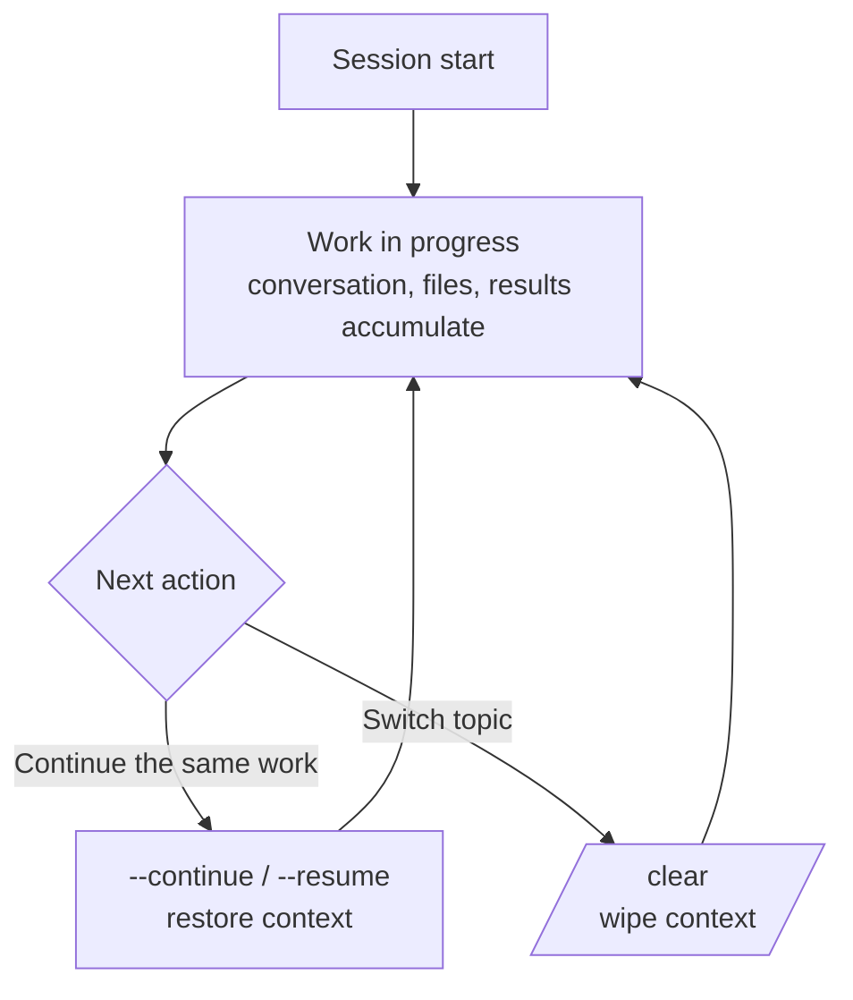

# Session Management

In Claude Code, one conversation is one session. This page summarizes how to start, continue, and clean up sessions, and how a session meshes with checkpoints and handoff.


**One-line summary**: A session is a single **unit of conversation**. To continue working, you reload a previous session (`--resume` / `--continue`); when the topic changes, you wipe it clean with `/clear`. Understanding how sessions flow lets you carry a long task across several days without losing it.


## What a Session Is

A session is one continuous conversation you had with Claude Code. Inside it, the messages exchanged, summaries of files read, and execution results accumulate in the [context window](/claude-code/context-memory/context-window). Closing a session preserves the record, so you can reopen and continue it later.

## Continuing and Cleaning Up

The core actions for handling a session are as follows.

| Command / Flag | Behavior |
|---------------|------|
| `claude --continue` | Start by continuing the most recent session |
| `claude --resume` | Pick from a list of previous sessions and continue |
| `/rename` | Give the current session a recognizable name |
| `/clear` | Wipe the conversation context entirely and start as if new |

`--continue` and `--resume` are for reviving the context of a previous conversation to carry work forward, while `/clear` does the opposite — discarding the context so far and starting clean. Remember it as: resume/continue for work you are continuing, `/clear` when moving on to an unrelated new task.

## Sessions and Checkpoints

Sessions and [checkpointing](/claude-code/context-memory/checkpointing) address different layers.

| Concept | What it handles | What it reverts |
|------|-----------|---------------|
| Session | Starting, continuing, and cleaning up the whole conversation | Conversation context |
| Checkpoint | A snapshot of the state just before an edit, within a session | Code + conversation back to an earlier point |

If a session is "which conversation do I open and continue," a checkpoint is "within this conversation, do I rewind to a moment ago." The flow of reverting to an earlier checkpoint with `/rewind` when work gets tangled inside a session is covered in detail in the checkpointing document.

## MoAI-ADK's Session Handoff

However far a session continues, the [context window](/claude-code/context-memory/context-window) has limits, and a moment comes when you must wipe it with `/clear`. To avoid losing progress at that moment, you need a mechanism that hands state across the session boundary.

MoAI-ADK provides this as **session handoff**. As context usage approaches the per-model threshold, the orchestrator saves the progress state to disk and produces a paste-ready resume message you can paste into the next session to continue as-is. After `/clear`, this single message lets a new session pick up the previous work self-sufficiently.

The 6-block structure of session handoff, the threshold policy, the auto-memory integration, and other details are covered in [Token Budget Management](/advanced/token-budget). Here it is enough to remember the principle: "a session can be wiped at any time, so hand important state across the session boundary to a file."

## Related Documents

- [Context Window](/claude-code/context-memory/context-window)
- [Checkpointing](/claude-code/context-memory/checkpointing)
- [Token Budget Management](/advanced/token-budget)

## References

- [Claude Code Docs — Sessions](https://code.claude.com/docs/en/sessions)


When you finish a long task and step away, you can just close the session. Later you can pick it from the list with `claude --resume`; and if you move between several sessions, naming them with `/rename` makes them much easier to find again.

