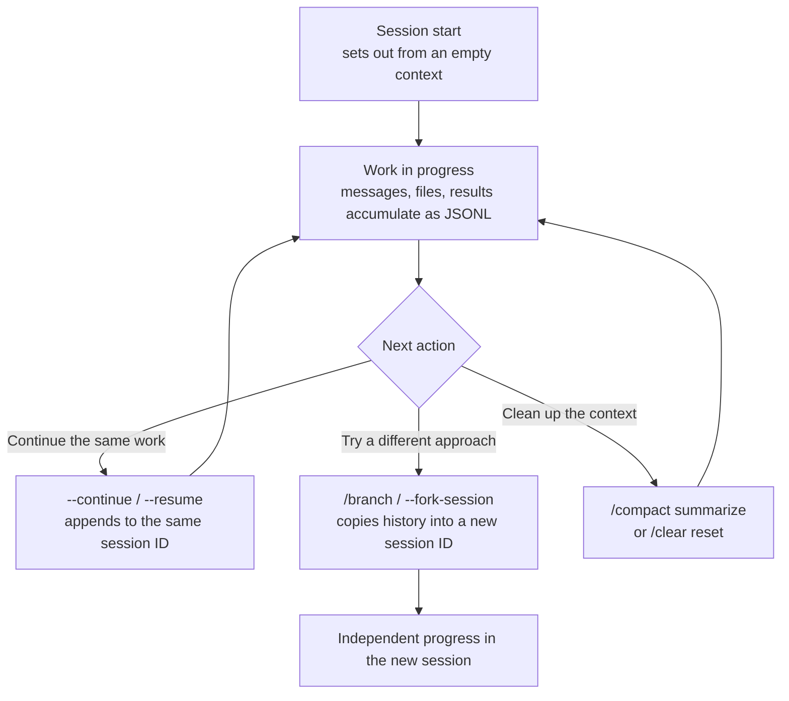

# Session Management

In Claude Code, one conversation is one session. A session does not disappear when you close the terminal — it is stored locally, so you can reopen it later and continue. This page walks through how to start, continue, branch, and clean up sessions.


This page is background material on **Claude Code itself**, the platform MoAI-ADK runs on. How to use MoAI-ADK is covered in [/moai](/en/utility-commands/moai).



**One-line summary**: A session is a single unit of conversation that stays alive even when closed. To continue working, reload the previous session (`--resume` / `--continue`); to try a different approach, branch it (`/branch` / `--fork-session`); when the topic changes, wipe it clean with `/clear`.



Picture a session as a **browser tab**. Each tab is independent, a closed tab can be reopened (resume), and a tab can be duplicated to try a different path (fork). When you want to start a completely new topic, opening a new tab (`/clear`) is the cleanest option. Sessions work the same way.


## What a Session Is

A session is one continuous conversation you had with Claude Code. Each time you start fresh, you set out from an **empty context window**, and the messages exchanged, files read, and execution results accumulate one by one in the [context window](/en/claude-code/context-memory/context-window).

Two properties are worth highlighting up front.

- **Independence**: each session has its own context. Files seen and conversations held in one session do not leak into another. That keeps the context clean and prevents unrelated topics from mixing.
- **Persistence**: even when you close a session, the record is preserved locally. Turn the terminal off and on, let days pass — you can still reopen the previous conversation and pick up from where you left off.

## Where Sessions Are Stored

The reason sessions survive being closed is local storage. While you work, Claude Code saves the conversation as **JSONL files** under `~/.claude/projects/`. JSONL (JSON Lines) is a format that records one event (a message, a tool call, a result) per line as a JSON object.

```
~/.claude/projects/
└── <project path hash>/
    ├── *.jsonl                    # session transcripts for this project
    └── memory/                    # auto-memory for this project
        ├── MEMORY.md
        └── feedback_*.md
```

Each working directory (project root) gets one subdirectory. Inside it, per-session JSONL files accumulate, and [auto-memory](/en/claude-code/context-memory/memory) is kept under the same tree. Because this record exists, **continuing** (resume), **rewinding** (rewind), and **branching** (fork) a session all become possible.


**Storage is local-only**. The session transcript lives only on the user's machine; nothing is uploaded to a server. The Claude API calls themselves go to the cloud, but the conversation record and memory stay on the user's disk.


## Reopening a Session: Continuing Work

You can reopen a previous conversation even after closing the terminal or restarting it. There are two entry points.

| Command | Behavior | When to use |
|------|------|-----------|
| `claude --continue` | Continue the most recent session right away | When picking up the work you just stopped |
| `claude --resume` | Pick from a list of previous sessions | When looking for a specific piece of work from days ago |

Both append to **the same session ID**. The original conversation's context is intact, so you do not need to re-explain the files you just read or the decisions you made. `--continue` opens the most recent one with no choice required; `--resume` lists them and lets you pick.

Reopening also restores session-scoped state. For example, a goal armed with `/moai goal` or a scheduled task comes back as-is if it has not expired yet. Execution statistics like turn count or timers, however, reset at the resume point.

## Naming a Session: /rename

Once the `--resume` list grows, it gets confusing which session was which work. `/rename` helps here. Giving a session a recognizable **durable name** makes it much easier to find by name later in the list.

```
/rename auth-migration
```

For example, naming a session by its topic — `auth-migration`, `refactor-parser` — keeps you from losing your way when juggling several sessions. As a convention, **map one work stream to one session** and name it; then sessions behave like work branches.

## Branching Sessions: /branch and --fork-session

Continuing is "keep writing to the same session ID"; branching is "copy the history into a **new session ID** and split it off." Use it when you want to leave the original intact and try a different approach.

| Method | Entry point | Behavior |
|------|------|------|
| `/branch` | Inside a session | Copies the current history into a new session to branch |
| `claude --continue --fork-session` | From the terminal | Opens the most recent session as a copy to branch |

For example, while pushing code in one direction you might think "instead of this path, let me try a different approach from the start." Branching lets you try that new attempt without losing the original. The branched session then grows completely independently of the original.


Rewind (`/rewind`) and branch (`/branch`) are different. `/rewind` returns to an earlier point **within the same session**; `/branch` splits off **into a new session**. The detailed behavior of rewind is covered in [checkpointing](/en/claude-code/context-memory/checkpointing).


## Context Cleanup: /compact and /clear

As a session runs long, the context approaches its limit. There are two cleanup tools for this moment. Their directions are exact opposites, so pick the one that matches your purpose.

| Command | Behavior | When to use |
|------|------|-----------|
| `/compact` | Keeps the same session and **replaces** what has happened so far with a summary, freeing space | When you want to keep the conversation going but the context is tight |
| `/clear` (alias `/reset`, `/new`) | **Empties the context entirely** and starts as if new | When moving on to a completely new topic |

`/compact` continues the flow on top of the summarized context. Your intent, the key decisions, the files reviewed, and the remaining work stay in the summary, but the raw tool output and intermediate reasoning disappear. Summarization also happens automatically — as the context nears its limit, Claude Code kicks off compaction on its own (since CC 2.1.196+, an idle watchdog that auto-aborts and retries a stalled stream after 5 minutes of no response is on by default, softening the case where a session hangs near the limit).

`/clear` does not even leave a summary. It is a heavy restart that wipes not just the context but the prompt cache too, but it fully sheds the residue of unrelated previous work, which is good for both response quality and cost.

In one line: **"I want to keep the conversation going → `/compact`", "I want a fresh start → `/clear`"**.



## Sessions and Checkpoints

Sessions and [checkpointing](/en/claude-code/context-memory/checkpointing) address different layers. They are more powerful together, but easy to confuse, so it helps to draw the line.

| Concept | What it handles | What it reverts |
|------|-----------|---------------|
| Session | Starting, continuing, branching, and cleaning up the whole conversation | Which conversation to open |
| Checkpoint | A snapshot of the state just before an edit, within a session | Code + conversation back to the point just before |

If a session is "which conversation do I open," a checkpoint is "within this conversation, do I rewind to a moment ago." The flow of reverting to an earlier checkpoint with `/rewind` when work gets tangled inside a session is covered in detail in the checkpointing document.

## Sessions Are Independent

Revisiting the independence noted earlier, from a practical angle: each session starts in its own context window, so **sessions do not share memory**. A fact learned while debugging in one session does not automatically carry over to another.

So knowledge that must survive across sessions belongs in **files**, not in context. [CLAUDE.md](/en/claude-code/context-memory/memory) and auto-memory play exactly this role. They are reloaded from disk at the start of every session, so project knowledge stays alive whichever session you open. The day's conversational context, by contrast, lives only inside a session — so before you close a session, it is safest to move important state into memory.

## MoAI-ADK's Session Handoff

However far a session continues, the [context window](/en/claude-code/context-memory/context-window) has limits, and a moment comes when you must wipe it with `/clear`. The window size differs by model — 200K-context models reach it relatively early, 1M-context models later — but the limit arrives eventually. To avoid losing progress at that moment, you need a mechanism that hands state across the session boundary.

MoAI-ADK provides this as **session handoff**. As context usage approaches the per-model threshold (about 50% for 1M models, about 90% for 200K models), the orchestrator saves the progress state to disk and produces a paste-ready resume message you can paste into the next session to continue as-is. After `/clear`, this single message lets a new session pick up the previous work self-sufficiently.

The 6-block structure of session handoff, the threshold policy, the auto-memory integration, and other details are covered in [Token Budget Management](/en/advanced/token-budget). Here it is enough to remember the principle: "a session can be wiped at any time, so hand important state across the session boundary to a file."

## Related Documents

- [Context Window](/en/claude-code/context-memory/context-window)
- [Memory and auto-memory](/en/claude-code/context-memory/memory)
- [Checkpointing](/en/claude-code/context-memory/checkpointing)
- [Token Budget Management](/en/advanced/token-budget)

## References

- [Claude Code Docs — Sessions](https://code.claude.com/docs/en/sessions)


When you finish a long task and step away, you can just close the session. Later you can pick it from the list with `claude --resume`; and if you move between several sessions, naming them with `/rename` at the start makes them much easier to find again.

