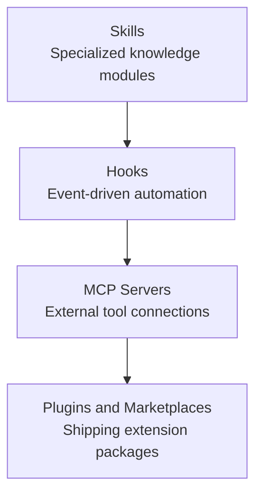

This group covers four ways to extend Claude Code's behavior beyond its built-in capabilities. It explains, with a focus on concepts, how to modularize specialized knowledge with Skills, attach automation to events with Hooks, connect external tools with MCP, and ship all of these as a single package with Plugins. This group is for engineers who want to tame Claude Code to fit their own workflow.


**TL;DR**: Once you understand the four extension points — Skills, Hooks, MCP, and Plugins — you can turn Claude Code into a tool tailored to your own project.


## Learning Path

We recommend reading in this order: start with Skills, the lightest extension point; then Hooks for automation; then MCP, which links you to the outside world; and finally Plugins, which bundle these together for distribution. Skills, Hooks, and MCP connect deeply into the MoAI-ADK advanced docs, so you can dig further once you've grasped the concepts.

## Contents

| Document | Description |
|------|------|
| [Skills](/claude-code/extensibility/skills) | Specialized knowledge modules and progressive disclosure |
| [Hooks](/claude-code/extensibility/hooks) | Event-driven automation |
| [MCP Servers](/claude-code/extensibility/mcp) | The external-tool connection protocol |
| [Plugins and Marketplaces](/claude-code/extensibility/plugins) | Extension packages and code intelligence |

Once you've mastered the four extension points, head to the next group to see how to integrate them into your real development workflow.
