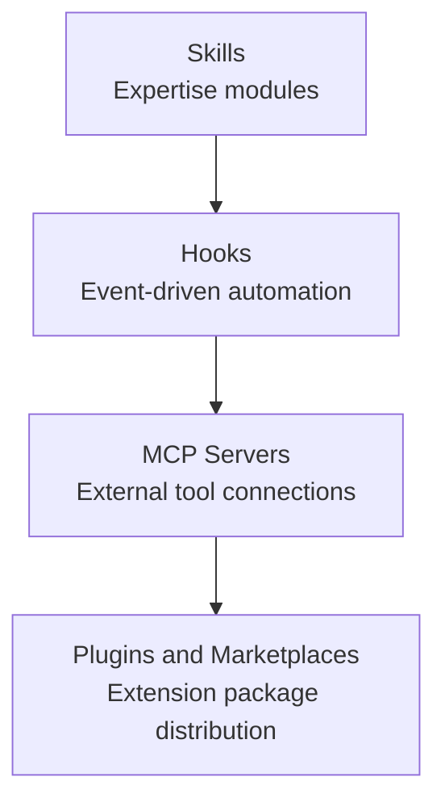

This group covers the four ways to extend Claude Code's behavior beyond its built-in capabilities. It explains, concept-first, the flow of modularizing expertise with skills, attaching automation to events with hooks, connecting external tools with MCP, and shipping all of it as one package with plugins.



These four are exactly the materials for building an **Agentic Harness**. In harness engineering — designing an environment where the agent works well instead of writing the code yourself — skills carry the agent's knowledge, hooks carry deterministic discipline, MCP carries the connection to the outside world, and plugins carry the deployment unit for the combination. What MoAI-ADK deploys with a single `moai init`, and what `/moai project` generates project-specifically, are ultimately combinations of these materials.


**One-line summary**: Once you understand the four extension points — skills, hooks, MCP, and plugins — you can turn Claude Code into a harness unique to your project.


## Learning Flow

```mermaid
flowchart TD
    A[Skills<br/>Expertise modules] --> B[Hooks<br/>Event-driven automation]
    B --> C[MCP Servers<br/>External tool connections]
    C --> D[Plugins and Marketplaces<br/>Extension package distribution]
```

We recommend reading in this order: start with skills, the lightest extension point, then hooks for automation, MCP for connecting to the outside world, and finally plugins, which bundle them for distribution. Skills, hooks, and MCP link deeply into the MoAI-ADK advanced documents, so grasp the concepts first and dig deeper afterwards.

## Contents

| Document | Description |
|------|------|
| [Skills](/claude-code/extensibility/skills) | Expertise modules and progressive disclosure |
| [Hooks](/claude-code/extensibility/hooks) | Event-driven automation |
| [MCP Servers](/claude-code/extensibility/mcp) | The external tool connection protocol |
| [Plugins and Marketplaces](/claude-code/extensibility/plugins) | Extension packages and code intelligence |

Once you know the four materials, head to the next group, [Agents and Automation](/claude-code/agentic), to see how to run agentic loops on top of the harness built from them.
