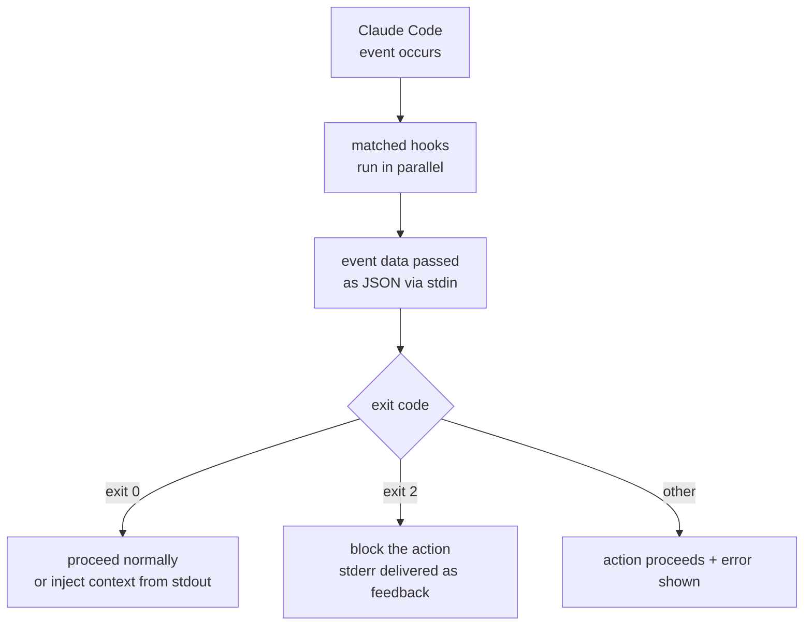

A hook is a shell command that runs automatically at a specific point in the Claude Code lifecycle. It deterministically guarantees "actions that must always happen" without relying on the model's judgment.


**TL;DR**: A hook is an "if-this-then-that" script that fires automatically whenever Claude Code edits a file or finishes a task, enforcing formatting, linting, and security blocks without any human intervention.



This page focuses on the concept. How MoAI-ADK actually registers and operates hooks (the shell wrapper pattern, per-event behavior, quality-gate integration) is covered in the in-depth MoAI-ADK guides. For hands-on, practical material, see the [Hooks Guide](/advanced/hooks-guide) and the [Hooks Event Reference](/advanced/hooks-reference).


## What Is a Hook

A hook is a user-defined shell command that runs when an **event** occurs in Claude Code — such as calling a tool, finishing a response, or starting a session. Instead of waiting for the model to decide "I should run the linter," a hook runs **without fail** every time that event occurs. This deterministic execution is the core value of a hook.

Hooks are registered in the `hooks` block of `settings.json`. Each entry defines which event it responds to, which tools to narrow it down to (`matcher`), and what to execute (`command`).

```json
{
  "hooks": {
    "PostToolUse": [
      {
        "matcher": "Edit|Write",
        "hooks": [
          { "type": "command", "command": "jq -r '.tool_input.file_path' | xargs npx prettier --write" }
        ]
      }
    ]
  }
}
```

The example above automatically runs `prettier` whenever a file is modified with the `Edit` or `Write` tool, keeping formatting consistent.

## Key Events

Hooks can respond to a variety of events; the following are the most commonly used.

| Event | When It Fires |
| :--- | :--- |
| `SessionStart` | When a session starts or resumes (used for context injection) |
| `UserPromptSubmit` | Right after the user submits a prompt, before Claude processes it |
| `PreToolUse` | Just before a tool call executes (can block) |
| `PostToolUse` | Right after a tool call succeeds (used for formatting and linting) |
| `SubagentStop` | When a subagent finishes its task |
| `Stop` | When Claude finishes a response |
| `PreCompact` | Just before the context window is compacted |
| `SessionEnd` | When a session ends |

The full list of events and the per-event input schemas are documented in the official [Hooks Reference](https://code.claude.com/docs/en/hooks).

## How Hooks Work

Hooks communicate with Claude Code through standard input (stdin), standard output (stdout), standard error (stderr), and exit codes. When an event occurs, Claude Code passes the event information to stdin as JSON; the script reads and processes that data, then uses the exit code to dictate the next action.



The exit code convention is as follows.

| Exit Code | Meaning |
| :--- | :--- |
| `0` | No objection. The action proceeds normally. For events like `SessionStart` and `UserPromptSubmit`, the stdout content is injected into Claude's context |
| `2` | Block the action. The reason written to stderr is delivered to Claude as feedback |
| other | The action proceeds, but a hook error is shown in the transcript |

If you need finer-grained control, instead of using an exit code you can print structured JSON to stdout to make decisions such as `permissionDecision` (`allow`/`deny`/`ask`).

## Where to Use Them

Hooks shine when automating tasks that "must always happen," such as the following.

- **Auto-format**: Run `prettier` or `gofmt` right after an edit using a `PostToolUse` + `Edit|Write` matcher
- **Lint**: Run a linter after edits to catch style and static-analysis violations immediately
- **Security block**: Use `PreToolUse` to block edits to protected files like `.env` or `.git/`, or dangerous commands like `rm -rf` or `drop table`, with exit code `2`
- **Notification**: Send a desktop notification with the `Notification` event when Claude is waiting for input
- **Context injection**: Re-inject project rules and recent work at `SessionStart` or after compaction

The scope of effect varies depending on where the hook is registered (`~/.claude/settings.json` globally, `.claude/settings.json` for the project, or in plugin/skill frontmatter). When the case requires judgment rather than a deterministic rule, you can also use prompt-based (`type: "prompt"`) or agent-based (`type: "agent"`) hooks that are evaluated by the model.

## MoAI-ADK and Hooks

MoAI-ADK operates hooks with a pattern in which a shell-script wrapper calls the `moai hook <event>` binary, enforcing status-transition ownership, sync-phase quality gates, agent-team task-completion verification, and more via hooks. The practical registration methods and per-event details of this part are covered in the in-depth guides below.

## Related Docs

- [Hooks Guide](/advanced/hooks-guide)
- [Hooks Event Reference](/advanced/hooks-reference)

## References

- [Automate workflows with hooks (official docs)](https://code.claude.com/docs/en/hooks-guide)
- [Hooks reference (official docs)](https://code.claude.com/docs/en/hooks)


If a hook is registered but doesn't run, type `/hooks` in Claude Code and first check whether the hook appears under the relevant event and whether the matcher exactly (case-sensitive) matches the tool name. Don't forget to grant the script execute permission with `chmod +x`.

