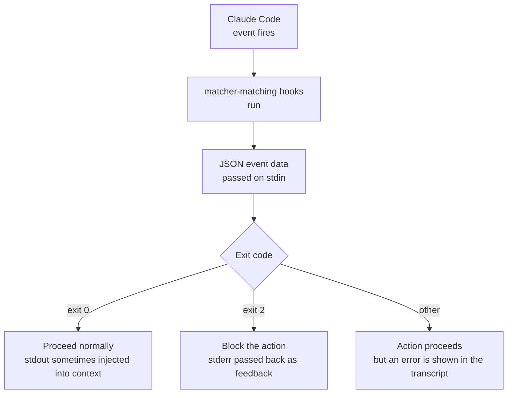
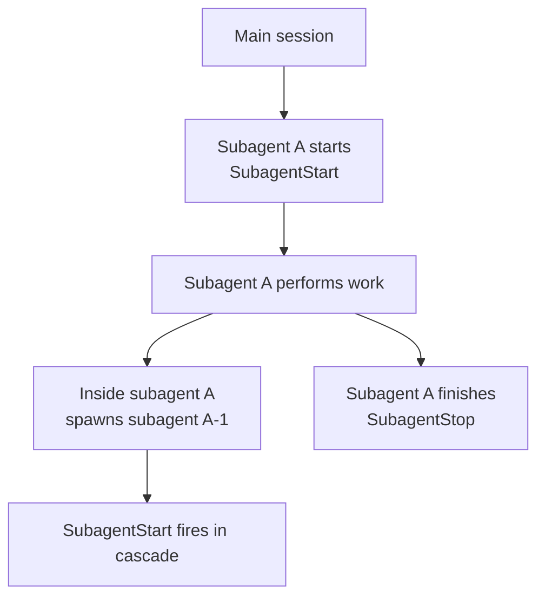

# Hooks

A hook is a small shell script that fires on its own every time Claude Code edits a file or finishes a task. Instead of hoping the model remembers rules like "run the formatter after edits" or "block dangerous commands", the runtime enforces them deterministically.


This page is background material on **Claude Code itself**, the platform MoAI-ADK runs on. How MoAI-ADK registers and operates hooks is covered in [Hooks Guide](/en/advanced/hooks-guide), and the per-event input schemas are collected in [Hooks Event Reference](/en/advanced/hooks-reference).



**One-line summary**: A hook is an "if-this-then-that" script that fires automatically whenever Claude Code edits a file or finishes a task, enforcing formatting, lint, and security blocks without a human hand.



A hook is like an **automatic door sensor**. The rule "open the door when someone approaches" is not checked by a person each time — the sensor mechanically trips when the condition is detected. In Claude Code, the rule "run the formatter when a file changes" is not delegated to the model's judgment either; the hook fires on its own when the predefined event happens.


## Why Hooks Are Needed

The more autonomously an AI agent runs, the more powerful it becomes — but the greater the risk that "rules which must always be kept" slip. Expecting the model to recall on its own, every time, that the linter must run on every edit, that `.env` must never be touched, or that tests must pass before a commit, is fragile. The moment the model forgets or decides "this once is fine", the rule collapses.

Hooks solve this with "machinery, not memory." Move the rule out of the model's head and into **code the runtime enforces**, and the hook fires unfailingly every time that event occurs, however long the agent runs autonomously. Acting deterministically without going through the model's judgment is the core value of a hook. This deterministic enforcement is what keeps quality gates and safety nets alive inside an autonomous loop.

## Main Events

The **events** a hook responds to are scattered throughout the Claude Code lifecycle. The core, frequently used events are these.

| Event | When it fires | Typical use |
| :--- | :--- | :--- |
| `SessionStart` | When a session starts or resumes | Inject project rules and recent-work context |
| `UserPromptSubmit` | Right after the user submits a prompt, before Claude processes it | Normalize prompt and inject additional context |
| `PreToolUse` | Right before a tool call executes | Block dangerous commands and protected files (narrow with `matcher`) |
| `PostToolUse` | Right after a tool call succeeds | Auto-format, lint, and post-process |
| `PostToolBatch` | After a batch of tools run together | Per-batch post-processing and summary |
| `Stop` | At turn end, when Claude finishes its response | Evaluate completion conditions and notify |
| `SubagentStart` | When a subagent starts | Log and prepare for subtask entry |
| `SubagentStop` | When a subagent finishes its work | Verify and clean up subtask results |
| `PreCompact` | Right before context window compaction | Preserve important state before compaction |
| `ConfigChange` | When settings (`settings.json` etc.) change | Detect and notify on configuration changes |

Many more events exist, and the JSON schema arriving on stdin differs per event. The full list and field definitions are in the official [Hooks reference](https://code.claude.com/docs/en/hooks). 

## Registering Hooks: settings.json

Hooks are registered in the `hooks` block of `settings.json`. The structure has three layers: "to which event" → "narrow to which tools (`matcher`)" → "what to run (`hooks` array)".

```json
{
  "hooks": {
    "PostToolUse": [
      {
        "matcher": "Edit|Write",
        "hooks": [
          {
            "type": "command",
            "command": "jq -r '.tool_input.file_path' | xargs npx prettier --write"
          }
        ]
      }
    ]
  }
}
```

A quick walk through the reading order.

1. **Event key** (`PostToolUse`): which event to respond to. The value is an array.
2. **Matcher block** (`matcher: "Edit|Write"`): narrows which tools to react to within this event. It is a regular expression — fire only on the `Edit` or `Write` tool. Omit `matcher` to match every firing of that event.
3. **Hooks array** (`hooks: [ ... ]`): the actual commands to run. Each entry has `type: "command"` and a `command` to execute. Multiple commands under the same matcher run in parallel when the condition matches.

For events that need a `matcher` (those tied to tools, like `PreToolUse`, `PostToolUse`, `PostToolBatch`), the tool name must match exactly (case-sensitive). For events unrelated to tool names (`Stop`, `SessionStart`, etc.), do not set a `matcher`.


The same `hooks` block applies to different scopes depending on where it lives. Placed in `~/.claude/settings.json` it applies to every project; placed in a project's `.claude/settings.json` it applies only to that project. Plugins and skills can also declare hooks in their frontmatter, so you can ship them bundled with the deployment unit.


## Practical Example: Auto-Format on Edit

Unpacking the example above, every time a file is modified via the `Edit` or `Write` tool, `prettier` runs automatically to keep formatting consistent. Instead of Claude promising "I will not forget to format", the runtime reliably kicks it off the moment the file changes.

Let us build a slightly more serious shell handler ourselves. The script below reads the Bash command passed in via `PreToolUse` and blocks dangerous commands like `rm -rf`.

```bash
#!/usr/bin/env bash
# hooks/pre-tool-guard.sh
# Reads the tool input from the event JSON on stdin and detects dangerous commands.

input=$(cat)
tool_input=$(echo "$input" | jq -r '.tool_input.command // empty')

if echo "$tool_input" | grep -qE 'rm[[:space:]]+-rf[[:space:]]*/'; then
  echo "Blocked: recursive deletion of the root directory is not allowed." >&2
  exit 2   # exit 2 = block the action
fi

exit 0     # exit 0 = no objection, proceed normally
```

This script uses `jq` to read the `tool_input.command` field of the event JSON, catches the `rm -rf /` pattern, and on a match writes the reason to stderr and exits with code `2`. Wire it into `settings.json` like this.

```json
{
  "hooks": {
    "PreToolUse": [
      {
        "matcher": "Bash",
        "hooks": [
          { "type": "command", "command": "$CLAUDE_PROJECT_DIR/.claude/hooks/pre-tool-guard.sh" }
        ]
      }
    ]
  }
}
```

Do not forget to give the script file execute permission.

```bash
chmod +x .claude/hooks/pre-tool-guard.sh
```

 Now if Claude tries to run a command containing `rm -rf /`, the hook blocks it just before execution and feeds the reason back to Claude.

## Communicating with Hooks: stdin, stdout, Exit Codes

Hooks talk to Claude Code over the **standard streams**. When an event fires, Claude Code pipes the event information as JSON to standard input (stdin); the hook reads that data, processes it, and directs the next action with an **exit code**.


```mermaid
flowchart TD
    A[Claude Code<br/>event fires] --> B[matcher-matching hooks<br/>run]
    B --> C[JSON event data<br/>passed on stdin]
    C --> D{Exit code}
    D -->|exit 0| E[Proceed normally<br/>stdout sometimes injected into context]
    D -->|exit 2| F[Block the action<br/>stderr passed back as feedback]
    D -->|other| G[Action proceeds<br/>but an error is shown in the transcript]
```

The exit-code convention is simple but powerful.

| Exit code | Meaning |
| :--- | :--- |
| `0` | No objection. The action proceeds normally. For events like `SessionStart` and `UserPromptSubmit`, what is written to stdout is injected into Claude's context. |
| `2` | Block the action. The reason written to stderr is passed to Claude as feedback, so Claude knows why it was blocked and tries a different path. |
| Other | The action proceeds, but a hook error is shown in the transcript. Useful for non-fatal warnings. |

The nice thing about this convention is that a hook script is just "an ordinary shell script." Parsing JSON with `jq`, checking a condition with `grep`, and returning a verdict with `exit 0` / `exit 2` — ordinary shell programming is all it takes to build a complete hook.

## Finer Control with JSON decision Blocks

When exit codes alone are not enough, you can output **structured JSON** on stdout for finer-grained decisions. With this approach you can directly instruct one of three outcomes: "allow / deny / ask the user".

```json
{
  "hookSpecificOutput": {
    "hookEventName": "PreToolUse",
    "permissionDecision": "deny",
    "permissionDecisionReason": "The .env file is protected and cannot be edited."
  }
}
```

`permissionDecision` takes one of three values.

| Value | Meaning |
| :--- | :--- |
| `allow` | Allow the tool to run without a permission prompt. |
| `deny` | Refuse execution and tell Claude the reason. |
| `ask` | Raise a permission dialog for the user. |

Going beyond simply "block", you can also control "this is safe, skip the approval step" (`allow`), which is useful for cutting down prompts on repeated safe commands. Note that the stdout JSON is interpreted meaningfully only when the hook ends with exit code `0`, so when deciding via JSON, make sure your script finishes with `exit 0`.

## Timeout: Must Finish in 5 Seconds

Hooks must finish fast. The default **timeout** is 5 seconds; if the hook does not finish in that time, it is treated as a failure. That is plenty for light work like formatting or a quick check, but if you need to run something heavier you have to extend it.

The `timeout` field extends it up to 60 seconds. The unit is milliseconds.

```json
{
  "hooks": {
    "PostToolUse": [
      {
        "matcher": "Edit|Write",
        "hooks": [
          {
            "type": "command",
            "command": "make lint-full",
            "timeout": 60000
          }
        ]
      }
    ]
  }
}
```


Even with a long timeout, a hook that takes tens of seconds on every edit breaks Claude's workflow and crashes productivity. Bundle heavy checks with `PostToolBatch`, or push them to the `Stop` point. 


## Subagent Hooks: SubagentStart / SubagentStop

When Claude Code launches or tears down a subagent, the `SubagentStart` and `SubagentStop` events fire. These hooks are used to observe subtask entry and exit, and to verify or clean up results.

Here is how recent Claude Code changes intersect with these hooks.

- **Subagent name surfacing** (since v2.1.186): the event data delivered to `SubagentStart` / `SubagentStop` hooks includes the name of which subagent is starting or stopping. In environments where multiple subagents interleave, tracking "who owns this work" has become much easier.
- **Background by default** (since v2.1.198): subagents run in the background by default. But permission prompts still surface in the main session, and `SubagentStart` / `SubagentStop` hooks fire normally regardless of whether the subagent runs in the background.
- **Nested spawning enabled by default** (since v2.1.219): subagents can spawn further subagents nested up to depth 3 by default. That means `SubagentStart` fires in cascade when a subagent spawns another subagent inside itself. To disable this nesting, set the environment variable `CLAUDE_CODE_MAX_SUBAGENT_SPAWN_DEPTH=1`.


```mermaid
flowchart TD
    A[Main session] --> B[Subagent A starts<br/>SubagentStart]
    B --> C[Subagent A performs work]
    C --> D[Inside subagent A<br/>spawns subagent A-1]
    D --> E[SubagentStart fires in cascade]
    C --> F[Subagent A finishes<br/>SubagentStop]
```


Following the harness design principle that evaluators and permission controls should live outside the agent's judgment, subagent hooks are the natural implementation of "do not let an agent inspect itself; inspect it from outside the loop." Verifying the result of a finished subagent in `SubagentStop` lets you guarantee subtask quality without trusting the model's self-report.


## Where to Use Them

Hooks shine when automating work that "must always happen". The typical use cases are:

- **Auto-format**: run `prettier` or `gofmt` right after edits with `PostToolUse` + an `Edit|Write` matcher to keep style consistent.
- **Auto-lint**: run the linter after edits to catch style and static-analysis violations immediately.
- **Security blocks**: use `PreToolUse` to block edits to protected files like `.env` and `.git/`, or dangerous commands like `rm -rf` and `drop table`, with exit code `2`.
- **Context injection**: re-inject project rules and recent work at `SessionStart`, or preserve important state just before `PreCompact`.
- **Completion verification**: mechanically verify at `Stop` whether the work is actually done by evaluating the turn-end condition.
- **Subagent observation**: log subagent entry and exit and verify results with `SubagentStart` / `SubagentStop`.

If a task has a clear judgment and can be checked mechanically, a hook is the right tool. For work that needs judgment, like "is this code good or bad", you can also consider prompt-based (`type: "prompt"`) or agent-based (`type: "agent"`) hooks evaluated by a model.

## MoAI-ADK and Hooks

MoAI-ADK operates hooks with a pattern where shell-script wrappers call the `moai hook <event>` binary, enforcing things like status-transition ownership, sync-phase quality gates, and agent-team task-completion verification through hooks.

From a harness-engineering perspective, a hook is the embodiment of the principle "keep evaluators and permission controls outside the agent's judgment." Because the runtime enforces the rules instead of hoping the model remembers them, quality gates operate deterministically no matter how long the autonomous loop runs. The reason MoAI-ADK's `/goal` autonomous execution and self-evolving harness can be safe is precisely that Stop-hook-based condition evaluation and user-approval gates are enforced by hooks outside the loop. Hands-on registration and per-event details are covered in the in-depth guides below.

## Related Documents

- [Hooks Guide](/en/advanced/hooks-guide)
- [Hooks Event Reference](/en/advanced/hooks-reference)

## References

- [Automate workflows with hooks (official docs)](https://code.claude.com/docs/en/hooks-guide)
- [Hooks reference (official docs)](https://code.claude.com/docs/en/hooks)


If a hook is registered but does not fire, start by typing `/hooks` in Claude Code and confirming the hook appears under that event. Next, check that the `matcher` matches the tool name exactly (case-sensitive), and that the script has execute permission via `chmod +x`. The three common causes are almost always in there. 

