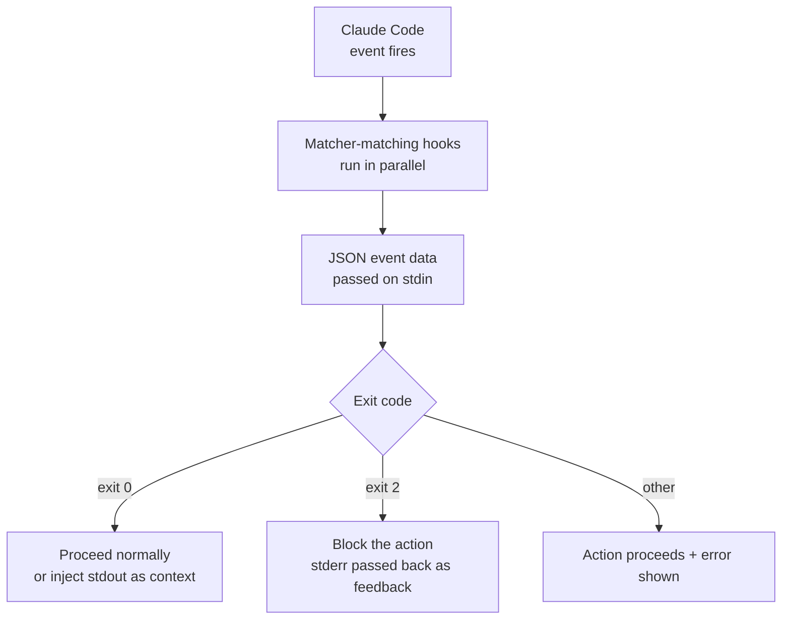

# Hooks

A hook is a shell command that runs automatically at specific points in Claude Code's lifecycle, deterministically guaranteeing "actions that must always happen" without depending on the model's judgment.


**One-line summary**: A hook is an "if-this-then-that" script that fires automatically whenever Claude Code edits a file or finishes a task, enforcing formatting, lint, and security blocks without a human hand.



This page focuses on the concept. How MoAI-ADK actually registers and operates hooks (the shell-wrapper pattern, per-event behavior, quality-gate integration) is covered in the in-depth MoAI-ADK guides. For hands-on content, see the [Hooks Guide](/advanced/hooks-guide) and the [Hooks Event Reference](/advanced/hooks-reference).


## What Is a Hook

A hook is a user-defined shell command that runs when an **event** occurs — Claude Code calling a tool, finishing a response, starting a session, and so on. Instead of waiting for the model to decide "I should run the linter", the hook runs **without fail** every time that event fires. This deterministic execution is the hook's core value.

Hooks are registered in the `hooks` block of `settings.json`. Each entry defines which event to respond to, which tools to narrow to (`matcher`), and what to run (`command`).

```json
{
  "hooks": {
    "PostToolUse": [
      {
        "matcher": "Edit|Write",
        "hooks": [
          { "type": "command", "command": "jq -r '.tool_input.file_path' | xargs npx prettier --write" }
        ]
      }
    ]
  }
}
```

The example above auto-runs `prettier` whenever a file is modified via the `Edit` or `Write` tool, keeping formatting consistent.

## Main Events

Hooks can respond to more than 30 events; these are the most commonly used.

| Event | When it fires |
| :--- | :--- |
| `SessionStart` | When a session starts or resumes (useful for context injection) |
| `Setup` | When Claude Code starts via `/init` or the `--init` flag |
| `UserPromptSubmit` | Right after the user submits a prompt, before Claude processes it |
| `UserPromptExpansion` | When a user input command is expanded into a prompt |
| `PreToolUse` | Right before a tool call executes (can block) |
| `PermissionRequest` | When a permission dialog appears |
| `PostToolUse` | Right after a tool call succeeds (useful for formatting and lint) |
| `PostToolUseFailure` | When a tool call fails |
| `SubagentStart` | When a subagent starts |
| `SubagentStop` | When a subagent finishes its work |
| `TaskCreated` | When a task is created |
| `TaskCompleted` | When a task is marked complete |
| `Stop` | When Claude finishes its response |
| `PreCompact` | Right before context window compaction |
| `PostCompact` | After context compaction completes |
| `SessionEnd` | When the session ends |

The full event list and each event's input schema are documented in the official [Hooks reference](https://code.claude.com/docs/en/hooks).

## How Hooks Work

Hooks communicate with Claude Code via standard input (stdin), standard output (stdout), standard error (stderr), and exit codes. When an event fires, Claude Code passes event information as JSON on stdin; the script reads that data, processes it, and directs the next action through its exit code.


```mermaid
flowchart TD
  A[Claude Code<br>event fires] --> B[Matcher-matching hooks<br>run in parallel]
  B --> C[JSON event data<br>passed on stdin]
  C --> D{Exit code}
  D -->|exit 0| E[Proceed normally<br>or inject stdout as context]
  D -->|exit 2| F[Block the action<br>stderr passed back as feedback]
  D -->|other| G[Action proceeds + error shown]
```

The exit-code convention:

| Exit code | Meaning |
| :--- | :--- |
| `0` | No objection. The action proceeds normally. For `SessionStart`, `UserPromptSubmit`, etc., stdout content is injected into Claude's context |
| `2` | Block the action. The reason written to stderr is passed to Claude as feedback |
| Other | The action proceeds, but the hook error is shown in the transcript |

For finer control, output structured JSON on stdout instead of relying on exit codes, making decisions like `permissionDecision` (`allow`/`deny`/`ask`).

## Where to Use Them

Hooks shine when automating work that "must always happen":

- **Auto-format**: run `prettier` or `gofmt` right after edits with `PostToolUse` + an `Edit|Write` matcher
- **Auto-lint**: run the linter after edits to catch style and static-analysis violations immediately
- **Security blocks**: use `PreToolUse` to block edits to protected files like `.env` and `.git/`, or dangerous commands like `rm -rf` and `drop table`, with exit code `2`
- **Notifications**: send a desktop notification via the `Notification` event when Claude is waiting for input
- **Context injection**: re-inject project rules and recent work at `SessionStart` or after compaction

Where a hook is registered (`~/.claude/settings.json` global, `.claude/settings.json` project, plugin/skill frontmatter) determines its scope. When judgment rather than a deterministic rule is needed, you can also use prompt-based (`type: "prompt"`) or agent-based (`type: "agent"`) hooks evaluated by a model.

## MoAI-ADK and Hooks

MoAI-ADK operates hooks with a pattern where shell-script wrappers call the `moai hook <event>` binary, enforcing things like status-transition ownership, sync-phase quality gates, and agent-team task-completion verification through hooks.

From a harness-engineering perspective, a hook is the embodiment of the principle "keep evaluators and permission controls outside the agent's judgment." Because the runtime enforces the rules instead of hoping the model remembers them, quality gates operate deterministically no matter how long the autonomous loop runs. The reason MoAI-ADK's `/goal` autonomous execution and self-evolving harness can be safe is precisely that Stop-hook-based condition evaluation and user-approval gates are enforced by hooks outside the loop. Hands-on registration and per-event details are covered in the in-depth guides below.

## Related Documents

- [Hooks Guide](/advanced/hooks-guide)
- [Hooks Event Reference](/advanced/hooks-reference)

## References

- [Automate workflows with hooks (official docs)](https://code.claude.com/docs/en/hooks-guide)
- [Hooks reference (official docs)](https://code.claude.com/docs/en/hooks)


If a registered hook does not run, type `/hooks` in Claude Code and check whether the hook appears under that event, and whether the matcher matches the tool name exactly (case-sensitive). Do not forget to give scripts execute permission with `chmod +x`.

