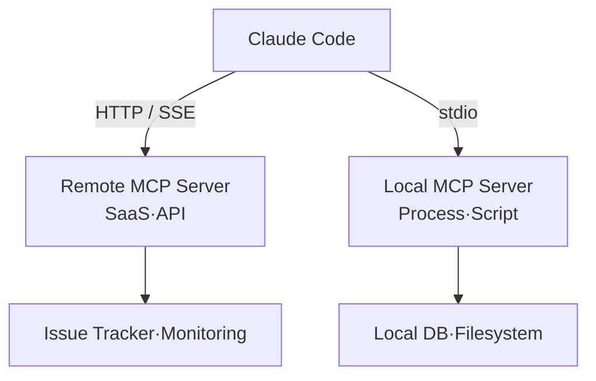

Through MCP, Claude Code can connect to external systems such as issue trackers, databases, and monitoring dashboards in a standardized way, reading from and operating on them directly.


**TL;DR**: MCP eliminates the copy-and-paste shuffle of moving data between tools and lets Claude Code operate external systems directly — it is the "standard wall socket" for AI-to-tool connections.



This page is a conceptual overview. The actual server registration, authentication, and how to put MCP to work in MoAI-ADK workflows are covered in detail, with a hands-on focus, in the [MCP Server Usage Guide](/advanced/mcp-servers).


## What Is MCP

MCP (Model Context Protocol) is an **open-source standard protocol** that links AI to external tools. Because it connects through the same specification regardless of model vendor or tool type, an MCP server you build once can be reused across many AI clients.

An MCP server grants Claude Code access to tools, data, and APIs. Once connected, Claude can handle tasks like the following directly.

| Scenario | Without MCP | With MCP connected |
| --- | --- | --- |
| Implementing issue-based features | Copy and paste the issue content | Read directly from the issue tracker and create a PR |
| Monitoring analysis | Attach a dashboard screenshot | Query errors directly from Sentry and similar tools |
| DB queries | Pass query results manually | Query PostgreSQL schemas and data directly |

> Servers that fetch external content carry a risk of prompt injection, so always verify that a server is trustworthy before connecting it.

## Server Types (Transports)

MCP servers are categorized by the **transport** they use to communicate with Claude Code. The common practice is to use HTTP for cloud services and stdio for local tools.

| Transport | Location | Best suited for | Notes |
| --- | --- | --- | --- |
| HTTP | Remote | Cloud SaaS integration | Recommended, OAuth 2.0 support |
| stdio | Local process | System access, custom scripts | No automatic reconnection |
| SSE | Remote | Legacy remote connections | Deprecated, replaced by HTTP |
| WebSocket | Remote | When the server pushes events | No OAuth or `--transport` support |



### Installation Overview

You add a server with the `claude mcp add` family of commands. Place all options **before** the server name, and for stdio use `--` to separate the launch command.

```bash
# Add a remote HTTP server
claude mcp add --transport http notion https://mcp.notion.com/mcp

# Add a local stdio server (everything after -- is the launch command)
claude mcp add --transport stdio --env API_KEY=YOUR_KEY airtable \
  -- npx -y airtable-mcp-server

# Check registrations / check status within a session
claude mcp list
```

The `--scope` flag specifies where the configuration is saved. There are three levels: `local` (the default — just you, current project), `project` (shared with the team via `.mcp.json`), and `user` (all projects). When the same name exists in multiple places, precedence runs local > project > user.

## What a Server Exposes: Tools, Resources, Prompts

An MCP server provides three kinds of capabilities to Claude Code.

| Exposed item | Role | How to use it in Claude Code |
| --- | --- | --- |
| Tools | Actions or functions Claude invokes | Called automatically during work |
| Resources | Referenceable data or documents | Mention with `@server:protocol://path` |
| Prompts | Predefined commands | `/mcp__servername__promptname` |

For example, a resource can be pulled in with an `@` mention, just like a file.

```text
Analyze @github:issue://123 and propose a fix
```

Running the `/mcp` command within a session shows the list of connected servers along with each server's tool count and OAuth authentication status. For remote servers that require authentication, you log in through the browser OAuth flow from `/mcp`.

> Tool Search is enabled by default, so MCP tool definitions are not loaded into the context window until they are needed. Even with many connected servers, the context burden stays low.

## Usage in MoAI-ADK

MoAI-ADK integrates documentation-lookup MCP servers such as `mcp__context7` into its workflows. The practical details — server registration steps, authentication patterns, scope selection, and how MoAI agents invoke MCP tools — are gathered in a separate in-depth guide. Once you have grasped the concepts here, the recommended next step is to refer to that guide.

## Related Docs

- [MCP Server Usage Guide](/advanced/mcp-servers)

## References

- [Connect Claude Code to tools via MCP](https://code.claude.com/docs/en/mcp)


We recommend starting with just one or two trustworthy servers added at `local` scope to confirm their behavior, and once their value for team sharing is proven, moving them to `--scope project` so that `.mcp.json` is included in version control.

