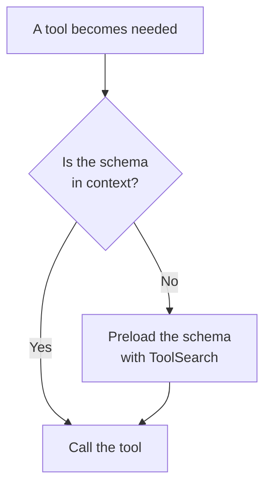

# MCP Integration

MCP (Model Context Protocol) is a standard connector for plugging external tools and data sources into Claude. This page summarizes the concept and the registration methods at an overview level.


**One-line summary**: MCP is a **USB port for AI**. When you connect different external tools — a database, an issue tracker, a browser — through one standard specification to Claude, you can plug them in the same way without writing separate integration code for each tool.


## What MCP Is

MCP is an open protocol that standardizes how AI applications connect to external systems. Just as one USB-C cable connects many peripherals instead of a different cable per device, MCP connects different external tools to Claude through **one specification**.

A connected MCP server can provide Claude with three things.

| Offering | Description |
|--------|------|
| Tools | Actions Claude can call (e.g., run a query, create an issue) |
| Resources | Data Claude can read (e.g., files, records) |
| Prompts | Reusable prompt templates |

Thanks to this standard, you do not have to rewrite integration logic every time you attach a new tool.  Once you follow the standard, every tool that supports it comes in through the same door.

## Registering a Server

MCP servers are registered in two ways.

- **CLI**: add a server with `claude mcp add <name> <run command>`.
- **Config file**: write the server definition directly in `.mcp.json` at the project root.

```json
{
  "mcpServers": {
    "example": {
      "command": "npx",
      "args": ["-y", "@example/mcp-server"]
    }
  }
}
```

You can check and authenticate the status of registered servers within a session with the `/mcp` command.

### Scopes

The same server has a different reach depending on where you register it.

| Scope | Reach |
|--------|-----------|
| `user` | All of my projects |
| `project` | The current project (shared with the team, included in version control) |
| `local` | My local session in the current project (not shared) |

It is common to put a server you share with the team in the `project` scope, and a server that needs personal credentials in the `local` scope.

### Transport Types

MCP servers are distinguished by how they communicate with Claude (transport).

| Type | How it works |
|------|-----------|
| stdio | Runs a local process and communicates over standard I/O |
| HTTP | Connects to a remote endpoint over the network |

Local tools usually use stdio; remote SaaS tools use HTTP.

## Deferred Loading and Tool Search

Connecting several MCP servers increases the number of tool definitions accordingly. If you keep all tool definitions loaded in context at all times, the [context window](/claude-code/context-memory/context-window) fills up before you even send the first prompt.

That is why Claude Code **defers loading** tool definitions by default. It fetches a tool's full schema only when that tool is actually needed, and otherwise keeps only a short piece of metadata in context. To actually call one of these deferred tools, a preliminary step is required to load its schema into the active context first.

MoAI-ADK raises this mechanism to a HARD discipline. Before calling a deferred tool (e.g., `AskUserQuestion`), you must first load the schema with `ToolSearch`, and skipping this preliminary step causes the tool call to be rejected with a validation error. The detailed rule is defined in the ToolSearch Preload procedure of `.claude/rules/moai/core/askuser-protocol.md`.


```mermaid
flowchart TD
    A[A tool becomes needed] --> B{Is the schema<br/>in context?}
    B -->|No| C[Preload the schema<br/>with ToolSearch]
    B -->|Yes| D[Call the tool]
    C --> D
```

## Interaction with Caching

Connecting or disconnecting an MCP server changes the set of tool definitions placed at the front of the context (the prefix). When the prefix changes, [prompt caching](/claude-code/context-memory/prompt-caching) reuse is invalidated from that point on, so it is better for cache efficiency to settle the server configuration early in the session.

## MoAI-ADK's MCP Operation

MoAI-ADK **does not provision MCP servers by default**. Instead, when external material is needed, it uses a fallback strategy of looking up official documentation and best practices with the built-in `WebSearch` / `WebFetch` (`.claude/rules/moai/core/agent-common-protocol.md` § MCP Fallback Strategy). This is a design intended to keep architecture and analysis quality from depending on MCP availability.

One exception is backend routing. When running in the GLM panes of `moai glm` or `moai cg`, web search and web fetch are routed to the z.ai MCP tools instead of the built-in tools (`.claude/rules/moai/core/glm-web-tooling.md`). Whatever the backend, the search/fetch capability itself is preserved — only the path changes.

## Related Documents

- [Skills](/claude-code/extensibility/skills)
- [Hooks](/claude-code/extensibility/hooks)
- [Context Window](/claude-code/context-memory/context-window)

## References

- [Claude Code Docs — MCP](https://code.claude.com/docs/en/mcp)


Settle new MCP servers when you start a session. Attaching or detaching a server mid-session changes the tool-definition prefix, invalidating the prompt cache from that point and forcing the prefix to be reprocessed on every subsequent turn.

