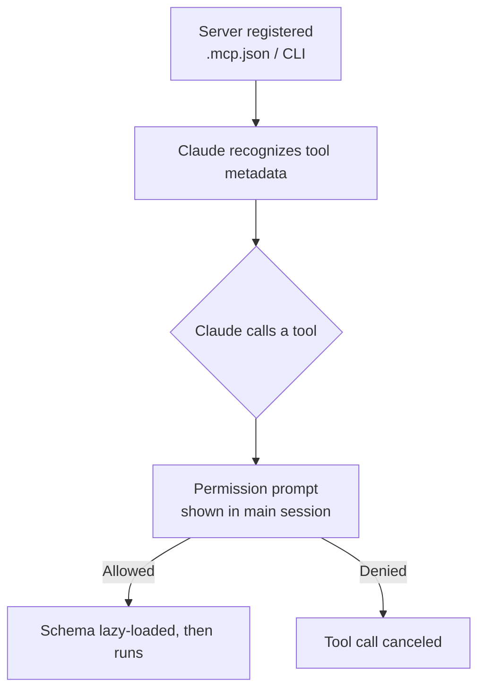
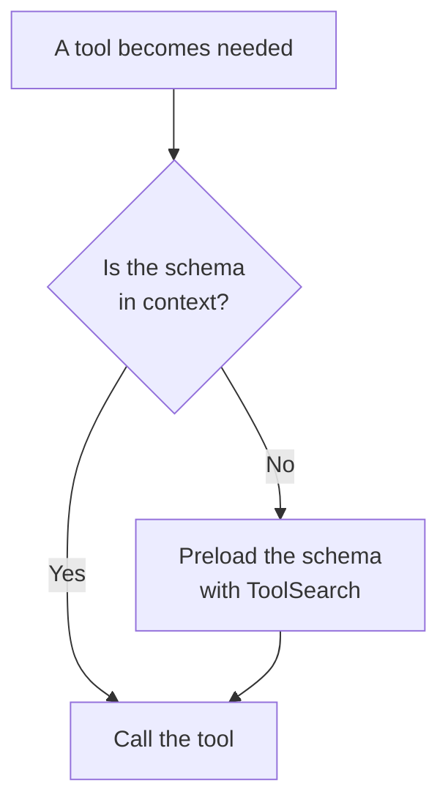

# MCP Integration

MCP (Model Context Protocol) is a standard connector for plugging external tools and data sources into Claude. Database, issue tracker, browser — every tool that would otherwise need its own integration code is bundled into one format, sparing you the work of rewriting the integration every time you swap a tool.


This page is background material on **Claude Code itself**, the platform MoAI-ADK runs on. MoAI-ADK's own features are covered in the sections above it in the sidebar.



**One-line summary**: MCP is a **USB port for AI**. When you connect different external tools — a database, an issue tracker, a browser — through one standard specification to Claude, you can plug them in the same way without writing separate integration code for each tool.


## What MCP Is

MCP is an open protocol that standardizes how AI applications connect to external systems. Just as one USB-C cable connects many peripherals instead of a different cable per device, MCP connects different external tools to Claude through **one specification**.

A connected MCP server can provide Claude with three things. These three are called the MCP **primitives** (basic building blocks).

| Primitive | What it does | Example |
|--------|------|------|
| Tools | Claude **calls** them to make something happen | Run a query, create an issue, search files |
| Resources | Provide data Claude can **read** | Log files, database records, API responses |
| Prompts | Reuse frequently-used **prompt templates** | Structured instructions like "code review", "reproduce a bug" |

Tools "do something", resources "show something", and prompts handle "how to ask". Once you follow the standard, every tool that supports it comes in through the same door.  That is why you do not have to rewrite integration logic every time you attach a new tool.

## Registering a Server

MCP servers are registered in two main ways.

- **CLI**: add a server with `claude mcp add <name> <run command>`. A single run writes the entry to the config file.
- **Config file**: write the server definition directly in `.mcp.json` at the project root. To share a server with the team, put this file under version control.

The example below is a `.mcp.json` with both a local (stdio) and a remote (HTTP) server. What you write differs by transport type.

```json
{
  "mcpServers": {
    "local-db": {
      "command": "npx",
      "args": ["-y", "@example/db-mcp-server"]
    },
    "remote-api": {
      "type": "http",
      "url": "https://mcp.example.com/sse"
    }
  }
}
```

### Scopes

The same server has a different **reach** depending on where you register it. This reach is called the **scope**.

| Scope | Reach |
|--------|-----------|
| `user` | All of my projects |
| `project` | The current project (shared with the team, included in version control) |
| `local` | My local session in the current project (not shared) |

It is common to put a server you share with the team in the `project` scope (in `.mcp.json`), and a server that needs personal credentials in the `local` scope. The `user` scope is the place for common tools you use everywhere.

### Transport Types

MCP servers are classified by how they communicate with Claude — that is, the **transport**.

| Type | How it works | When to use |
|------|-----------|-----------|
| stdio | Runs a local process and communicates over standard I/O | Locally installed tools |
| SSE | Connects to a remote endpoint and the server pushes events | Remote SaaS tools (HTTP-based) |
| HTTP | Streams over a single endpoint with a remote endpoint | Modern remote tools (streamable HTTP) |

Local tools usually connect over stdio; remote tools over SSE or HTTP. SSE is the long-standing remote method, and recently **streamable HTTP**, which works over a single endpoint, has become the standard. From Claude's side, any of them surfaces as the same primitives (tools, resources, prompts), so you usually do not have to be deeply aware of transport types on the consuming side.

## The `/mcp` Command and Authentication

You can check the connection status of registered servers with the `/mcp` command inside a session. One command shows at a glance which servers are connected, how many tools were discovered, and whether authentication is needed.

Remote servers (HTTP, SSE) that require login are authenticated with **OAuth**. Since v2.1.186 the `/mcp` command handles OAuth authentication as well — it opens a browser to walk through the login flow, receives a token, and completes the connection. When a token expires, run the same command to re-authenticate.


**Version note**: OAuth authentication management in `/mcp` is available from Claude Code v2.1.186 onward. Earlier versions only support checking server status, so if you need to authenticate a remote server, upgrade the version first.


## Permissions and Approval

MCP tools pass through the same **permission gate** as Claude's ordinary tools. The first time Claude tries to call an MCP tool, an approval prompt appears in the main session, just like any other tool. Once allowed, the same tool can be used again without being asked.

If being asked every time is inconvenient, you can pre-list a tool in the allowlist. Put a tool pattern in `permissions.allow` in `settings.json`.

```json
{
  "permissions": {
    "allow": [
      "mcp__local-db__query",
      "mcp__remote-api__*"
    ]
  }
}
```

The form `mcp__<server-name>__<tool-name>` is the identifier of an MCP tool. Using `*` allows every tool from one server at once. Pick only trusted tools to allow, and for tools that perform sensitive actions (payments, deletions, etc.), leaving them to ask each time is safer.

Because an MCP server reaches the outside world, which server you connect and which tool you allow is equivalent to what permissions you give Claude. For an unfamiliar server, start by allowing only the minimum set of tools and grow from there.


```mermaid
flowchart TD
    A[Server registered<br/>.mcp.json / CLI] --> B[Claude recognizes tool metadata]
    B --> C{Claude calls a tool}
    C --> D[Permission prompt<br/>shown in main session]
    D -->|Allowed| E[Schema lazy-loaded, then runs]
    D -->|Denied| F[Tool call canceled]
```

## Deferred Loading and Tool Search

Connecting several MCP servers increases the number of tool definitions accordingly. If you keep all tool definitions loaded in context at all times, the [context window](/en/claude-code/context-memory/context-window) fills up before you even send the first prompt.

That is why Claude Code **defers loading** MCP tool definitions by default. It fetches a tool's full schema only when that tool is actually needed, and otherwise keeps only a short piece of metadata in context. Thanks to that, even with about ten servers connected, the steady-state context cost barely grows. To actually call one of these deferred tools, however, a preliminary step is required to load its schema into the active context first.


```mermaid
flowchart TD
    A[A tool becomes needed] --> B{Is the schema<br/>in context?}
    B -->|No| C[Preload the schema<br/>with ToolSearch]
    B -->|Yes| D[Call the tool]
    C --> D
```

MoAI-ADK raises this mechanism to a HARD discipline. Before calling a deferred tool (e.g., `AskUserQuestion`), you must first load the schema with `ToolSearch`, and skipping this preliminary step causes the tool call to be rejected with a validation error. The detailed rule is defined in the ToolSearch Preload procedure of `.claude/rules/moai/core/askuser-protocol.md`.

## Interaction with Caching

Connecting or disconnecting an MCP server changes the set of tool definitions placed at the front of the context (the prefix). When the prefix changes, [prompt caching](/en/claude-code/context-memory/prompt-caching) reuse is invalidated from that point on, so it is better for cache efficiency to settle the server configuration early in the session.

## MoAI-ADK's MCP Operation

MoAI-ADK **does not provision MCP servers by default**. Instead, when external material is needed, it uses a fallback strategy of looking up official documentation and best practices with the built-in `WebSearch` / `WebFetch` (`.claude/rules/moai/core/agent-common-protocol.md` § MCP Fallback Strategy). This is a design intended to keep architecture and analysis quality from depending on MCP availability.

One exception is backend routing. When running in the GLM panes of `moai glm` or `moai cg`, web search and web fetch are routed to the z.ai MCP tools instead of the built-in tools (`.claude/rules/moai/core/glm-web-tooling.md`). Whatever the backend, the search/fetch capability itself is preserved — only the path changes.

## Related Documents

- [Skills](/en/claude-code/extensibility/skills)
- [Hooks](/en/claude-code/extensibility/hooks)
- [Context Window](/en/claude-code/context-memory/context-window)
- [Prompt Caching](/en/claude-code/context-memory/prompt-caching)

## References

- [Claude Code Docs — MCP](https://code.claude.com/docs/en/mcp)


Settle new MCP servers when you start a session. Attaching or detaching a server mid-session changes the tool-definition prefix, invalidating the prompt cache from that point and forcing the prefix to be reprocessed on every subsequent turn. For an unfamiliar server, start by allowing only the minimum tools and grow gradually.

