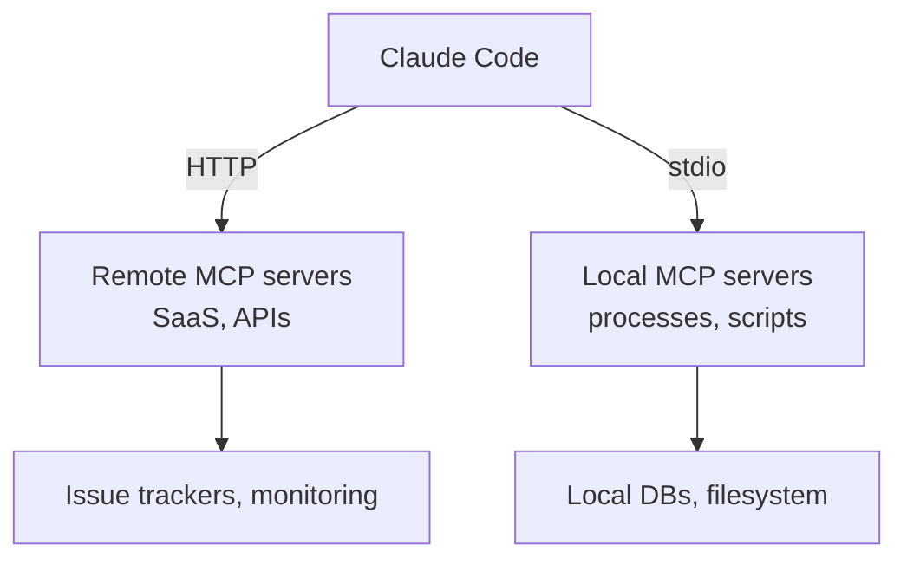

Through MCP, Claude Code connects external systems like issue trackers, databases, and monitoring dashboards in a standardized way, reading and operating them directly.


**One-line summary**: MCP is the "standard power socket for AI-tool connections" — it eliminates copy-pasting data from other tools and lets Claude Code work with external systems directly.



This page is a conceptual overview. Actual server registration, authentication, and usage in MoAI-ADK workflows are covered hands-on in the [MCP Server Guide](/advanced/mcp-servers).


## What Is MCP

MCP (Model Context Protocol) is an **open-source standard protocol** connecting AI and external tools. Because the same convention applies regardless of model vendor or tool type, an MCP server built once can be reused across multiple AI clients.

An MCP server grants Claude Code access to tools, data, and APIs. Once connected, Claude handles things like these directly.

| Scenario | Without MCP | With MCP connected |
| --- | --- | --- |
| Implementing a feature from an issue | Copy-paste the issue contents | Read directly from the issue tracker and create the PR |
| Monitoring analysis | Attach dashboard screenshots | Query errors directly from Sentry and the like |
| DB queries | Manually relay query results | Query PostgreSQL schema and data directly |

> Servers that ingest external content carry prompt-injection risk, so always verify a server is trustworthy before connecting.

## Server Types (Transports)

MCP servers are classified by the **transport** they use to communicate with Claude Code. HTTP is recommended; legacy SSE is deprecated.

| Transport | Location | Best for | Notes |
| --- | --- | --- | --- |
| HTTP | Remote | Cloud SaaS integration | Recommended (OAuth 2.0 support) |
| stdio | Local process | System access, custom scripts | No auto-reconnect |
| SSE | Remote | Legacy remote connections | Deprecated; replaced by HTTP |
| WebSocket | Remote | Servers that push events | HTTP or stdio preferred |


```mermaid
flowchart TD
    CC[Claude Code]
    CC -->|HTTP| Remote[Remote MCP servers<br>SaaS, APIs]
    CC -->|stdio| Local[Local MCP servers<br>processes, scripts]
    Remote --> Ext1[Issue trackers, monitoring]
    Local --> Ext2[Local DBs, filesystem]
```

### Installation Overview

Add servers with the `claude mcp add` family of commands. All options go **before** the server name, and for stdio the execution command is separated by `--`.

```bash
# Add a remote HTTP server (recommended)
claude mcp add --transport http notion https://mcp.notion.com/mcp

# Add a local stdio server (after -- is the execution command)
claude mcp add --transport stdio --env API_KEY=YOUR_KEY airtable \
  -- npx -y airtable-mcp-server

# Check registrations
claude mcp list
```

The `--scope` flag sets where the configuration is stored. There are three levels: `local` (default; just me, current project), `project` (team-shared via `.mcp.json`), and `user` (all projects). When the same name exists in multiple places, priority runs local > project > user.

## What a Server Exposes: Tools, Resources, Prompts

An MCP server provides three kinds of capabilities to Claude Code.

| Exposed item | Role | How to use in Claude Code |
| --- | --- | --- |
| Tools | Actions/functions Claude calls | Auto-invoked during work |
| Resources | Referenceable data and documents | Mention via `@server:protocol://path` |
| Prompts | Predefined commands | `/mcp__servername__promptname` |

Resources, for example, can be pulled in with an `@` mention just like files.

```text
Analyze @github:issue://123 and propose a fix
```

Run `/mcp` inside a session to see the list of connected servers, each server's tool count, and OAuth authentication status. Remote servers requiring auth log in via the browser OAuth flow from `/mcp`.

> Tool Search is enabled by default, so MCP tool definitions do not enter the context window until needed. Even with many servers connected, the context burden stays small.

## Use in MoAI-ADK

MoAI-ADK integrates documentation-lookup MCPs like `mcp__context7` into its workflows, and the harness auto-composition stage of `/moai project` includes provisioning MCPs suited to the project domain.

From a token perspective, note the Tool Search lazy loading above. MCP tool definitions are a fairly large chunk of context, but since they load only when needed, connecting several servers costs almost nothing at rest — one of the platform mechanisms MoAI-ADK's context diet leans on. Hands-on content — server registration procedures, auth patterns, scope selection, and how MoAI agents invoke MCP tools — is compiled in the separate advanced guide. Once you have the concept from this page, head there next.

## Related Documents

- [MCP Server Guide](/advanced/mcp-servers)

## References

- [Connect Claude Code to tools via MCP](https://code.claude.com/docs/en/mcp)


Start by adding just one or two trusted servers at `local` scope to verify behavior; once their value to the team is proven, move them to `--scope project` and put `.mcp.json` under version control.

