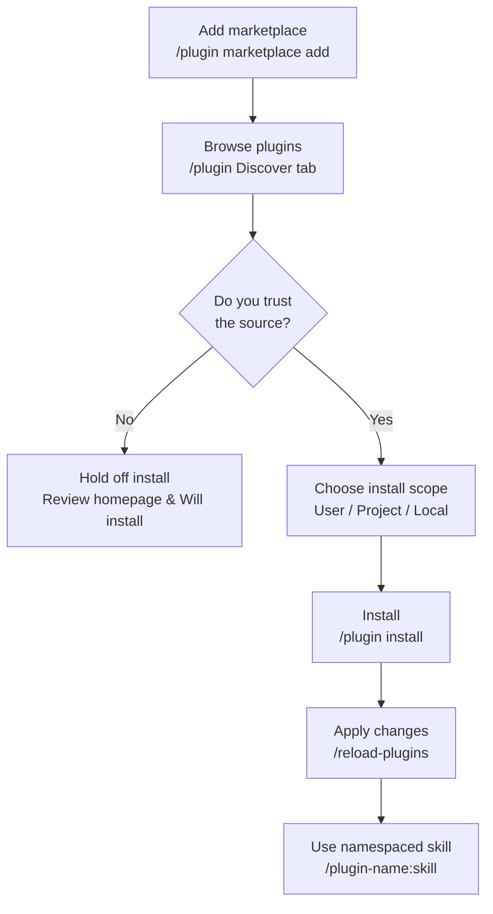

A Claude Code plugin is the unit that bundles scattered extensions into a single package to distribute to teams and the community, and a marketplace is the catalog where you discover and install those packages.


**TL;DR**: A plugin is an "extension bundle" that packages commands, agents, skills, hooks, and MCP into one folder for versioning and distribution, while a marketplace is the app store you pick those bundles from.


## What Is a Plugin

A plugin is a package that bundles several Claude Code extension elements into a single directory so they can be **shared, reused, and version-managed**. Unlike standalone settings placed directly in the `.claude/` directory, a plugin has an identity defined by a manifest file and is distributed to other projects and teams through a marketplace.

The difference between standalone settings and a plugin is clear.

| Category | Standalone settings (`.claude/`) | Plugin |
|------|------------------------|----------|
| Skill name | `/hello` | `/plugin-name:hello` (namespaced) |
| Best fit | Personal workflows, project-only experiments | Team/community sharing, version releases, reuse across multiple projects |
| Distribution | Manual copy | Install via `/plugin install` |
| Conflict prevention | None | Automatic namespace separation by plugin name |

The core of a plugin is the `.claude-plugin/plugin.json` **manifest**. This file defines the plugin's name, description, and version, and the `name` field becomes the namespace prefix for skills.

```json
{
  "name": "my-first-plugin",
  "description": "A greeting plugin to learn the basics",
  "version": "1.0.0",
  "author": { "name": "Your Name" }
}
```

`version` is optional. If you specify it, updates are delivered to users only when you bump this value; if you omit it and distribute via git, the commit SHA acts as the version, so every commit is treated as a new version.

> During development, use `claude --plugin-dir ./my-plugin` to load a local plugin directly without installing it for testing, and after changes apply them with `/reload-plugins` without restarting.

## What a Plugin Can Contain

In the plugin root, you place a directory per element. One common mistake is putting these directories inside `.claude-plugin/`, but `.claude-plugin/` should contain only `plugin.json`, and everything else must live in the **plugin root**.

| Element | Location | Contents |
|------|------|-----------|
| Skill | `skills/<name>/SKILL.md` | A capability the model invokes automatically based on context |
| Command | `commands/*.md` | Slash commands (new plugins should prefer `skills/`) |
| Agent | `agents/` | Custom subagent definitions |
| hook | `hooks/hooks.json` | Event handlers (PostToolUse, etc.) |
| MCP server | `.mcp.json` | Configuration for connecting external tools and services |
| LSP server | `.lsp.json` | Code intelligence (language server) configuration |
| Monitor | `monitors/monitors.json` | A background watcher that monitors logs and files in the background |
| Executables | `bin/` | Executables added to the Bash tool `PATH` while the plugin is active |
| Default settings | `settings.json` | A default settings.json applied on activation (currently only the `agent` and `subagentStatusLine` keys are supported) |

In this way a single plugin can contain skills, hooks, and MCP at the same time, delivering "all the extensions needed for this work" in one install. For example, the `commit-commands` plugin bundles commit, push, and PR-creation skills together, and `pr-review-toolkit` ships agents dedicated to PR review.

## Marketplace: Discover, Install, Manage

A marketplace is a catalog containing a list of plugins someone created. Using it is a two-step process. First you **add** a catalog so you can browse it, then you **install** the plugins you want individually. It helps to think of registering an app store and downloading individual apps as separate things.

### Adding a Marketplace

With `/plugin marketplace add` you can register various sources.

```bash
# GitHub repository (owner/repo format)
/plugin marketplace add anthropics/claude-plugins-official

# Other Git hosts (.git suffix required)
/plugin marketplace add https://gitlab.com/company/plugins.git

# Pin to a specific branch/tag
/plugin marketplace add https://gitlab.com/company/plugins.git#v1.0.0

# Local path / remote marketplace.json
/plugin marketplace add ./my-marketplace
/plugin marketplace add https://example.com/marketplace.json
```

The official Anthropic marketplace (`claude-plugins-official`) is automatically available when Claude Code starts. Community marketplaces are added manually.

```bash
# Install from the official marketplace
/plugin install hello@claude-plugins-official

# Add a community marketplace, then install
/plugin marketplace add anthropics/claude-plugins-community
/plugin install <plugin-name>@claude-plugins-community
```

### Installing and Managing

Running `/plugin` opens a plugin manager with four tabs: **Discover / Installed / Marketplaces / Errors**. In the detail panel of the Discover tab, before installing you can preview the Context cost estimate, the last update date, and the list of commands, agents, skills, hooks, MCP, and LSP that will be installed.

There are three install scopes.

| Scope | Applies to | Recorded in |
|------|-----------|-----------|
| User | All of my projects | User settings |
| Project | All collaborators of this repository | `.claude/settings.json` |
| Local | Only me in this repository | Not shared with collaborators |

Install, enable, disable, and remove are also possible via the CLI.

```bash
/plugin install plugin-name@marketplace-name   # Install (default user scope)
/plugin disable plugin-name@marketplace-name    # Disable (not removed)
/plugin enable  plugin-name@marketplace-name    # Re-enable
/plugin uninstall plugin-name@marketplace-name  # Fully remove
/reload-plugins                                 # Apply changes without restarting
```

At the team level, if you declare a marketplace in the `extraKnownMarketplaces` key of `.claude/settings.json`, Claude Code will guide collaborators through that marketplace and plugin installation when they trust the repository folder.

## Code Intelligence Plugins

A code intelligence plugin activates Claude Code's built-in code intelligence tools through LSP (Language Server Protocol). It's the very technology that powers VS Code's code navigation. It works when you install a per-language plugin and the corresponding **language server binary** is present on the system.

| Language | Plugin | Required binary |
|------|----------|-----------------|
| Go | `gopls-lsp` | `gopls` |
| Python | `pyright-lsp` | `pyright-langserver` |
| TypeScript | `typescript-lsp` | `typescript-language-server` |
| Rust | `rust-analyzer-lsp` | `rust-analyzer` |
| Java | `jdtls-lsp` | `jdtls` |

When the plugin is active, Claude gains two capabilities.

- **Automatic diagnostics**: Every time Claude edits a file, the language server analyzes the change and automatically reports type errors, missing imports, and syntax errors. Without separately running a compiler or linter, it catches errors in the same turn and fixes them right away. When the "diagnostics found" indicator appears, press `Ctrl+O` to inspect them inline.
- **Code navigation**: Go to definition, find references, hover type information, symbol lists, find implementations, and call hierarchy tracking are all possible. It provides far more accurate navigation than grep-based search.

> If an `Executable not found in $PATH` error appears in the `/plugin` Errors tab, install the language server binary from the table above. `rust-analyzer`, `pyright`, and others can use a lot of memory on a large codebase, so if it's burdensome you can disable that plugin and rely on Claude's built-in search.

## Trust and Security

Plugins and marketplaces are **components that require very high trust**. This is because they can execute arbitrary code with your permissions. Install only from sources you trust.

- Anthropic does not control the MCP servers, files, and software included in a plugin, and does not verify that they behave as intended. For third-party plugins, review the homepage and the "Will install" list in the Discover tab yourself before installing.
- Community marketplace plugins are distributed pinned to a specific commit SHA after passing Anthropic's automated verification and safety screening. Even so, the final trust judgment is up to the installer.
- Organizations can restrict which marketplaces users may add via managed settings.

## Plugin Install/Activation Flow



## Related Docs

- [Skills](/claude-code/extensibility/skills)
- [Hooks](/claude-code/extensibility/hooks)
- [MCP Servers](/claude-code/extensibility/mcp)

## References

- [Create plugins (code.claude.com)](https://code.claude.com/docs/en/plugins)
- [Discover and install plugins (code.claude.com)](https://code.claude.com/docs/en/discover-plugins)
- [What Claude gains from code intelligence plugins](https://code.claude.com/docs/en/discover-plugins#what-claude-gains-from-code-intelligence-plugins)


If the plugin you want to install doesn't appear, the marketplace may be out of date. Refresh the list with `/plugin marketplace update <marketplace-name>` and try installing again.

