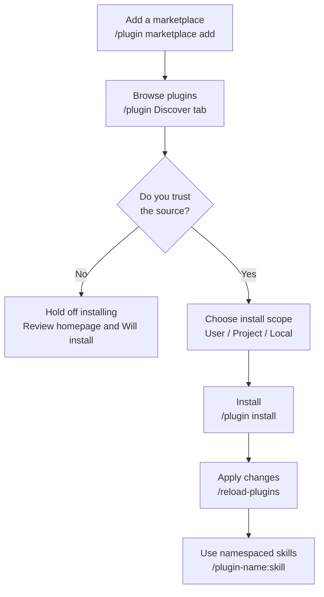

A Claude Code plugin is the unit that bundles scattered extensions into one package for distribution to teams and the community, and a marketplace is the catalog where those packages are discovered and installed. Seen through the harness lens, this is the distribution layer that packages the materials from the previous three documents — skills, hooks, MCP — into "one installable piece of harness".


**One-line summary**: A plugin is an "extension bundle" that packs commands, agents, skills, hooks, and MCP into one folder, versioned and distributed — and a marketplace is the app store where you pick those bundles.


## What Is a Plugin

A plugin is a package that bundles multiple Claude Code extension elements into one directory for **sharing, reuse, and versioning**. Unlike standalone configuration placed directly in the `.claude/` directory, a plugin has an identity via its manifest file and is distributed to other projects and teams through marketplaces.

The difference between standalone configuration and a plugin is clear-cut.

| Aspect | Standalone config (`.claude/`) | Plugin |
|------|------------------------|----------|
| Skill name | `/hello` | `/plugin-name:hello` (namespaced) |
| Best for | Personal workflows, project-local experiments | Team/community sharing, versioned releases, reuse across projects |
| Distribution | Manual copy | Install via `/plugin install` |
| Collision prevention | None | Automatic namespacing by plugin name |

The heart of a plugin is the `.claude-plugin/plugin.json` **manifest**. This file defines the plugin's name, description, and version, and the `name` field becomes the namespace prefix for its skills. The manifest is optional — a plugin works without one — but versioning and marketplace distribution are far easier with it.

```json
{
  "name": "my-first-plugin",
  "description": "A greeting plugin to learn the basics",
  "version": "1.0.0",
  "author": { "name": "Your Name" }
}
```

`version` is optional. If specified, updates reach users only when you bump this value; if omitted and distributed via git, the commit SHA acts as the version and every commit is treated as a new version.

> During development, load a local plugin without installing via `claude --plugin-dir ./my-plugin`, and after changes apply them without a restart via `/reload-plugins`.

## What a Plugin Can Contain

Place per-element directories at the plugin root (the plugin directory itself, not `.claude-plugin/`). **Important caution:** `.claude-plugin/` contains **only** `plugin.json`; all components — skills, commands, agents, hooks — live at the plugin root.

| Element | Location | Contents |
|------|------|-----------|
| Skills | `skills/<name>/SKILL.md` | Capabilities the model auto-invokes by context |
| Commands | `commands/*.md` | Slash commands (`skills/` recommended for new plugins) |
| Agents | `agents/` | Custom subagent definitions |
| Hooks | `hooks/hooks.json` | Event handlers (PostToolUse and the like) |
| MCP servers | `.mcp.json` | External tool/service connection config |
| LSP servers | `.lsp.json` | Code intelligence (language server) config |
| Monitors | `monitors/monitors.json` | Background watchers observing logs and files |
| Executables | `bin/` | Executables added to the Bash tool `PATH` while the plugin is active |
| Default settings | `settings.json` | Default settings.json applied on activation (currently only the `agent` and `subagentStatusLine` keys are supported) |

Because one plugin can carry skills, hooks, and MCP simultaneously, "every extension this job needs" arrives in a single install. For example, the `commit-commands` plugin bundles commit, push, and PR-creation skills, and `pr-review-toolkit` ships a set of agents dedicated to PR review.

## Marketplaces: Discover, Install, Manage

A marketplace is a catalog holding a list of plugins someone has built. Usage is two steps: first **add** the catalog so you can browse it, then **install** individual plugins you want. Think of it as registering an app store versus downloading individual apps.

### Adding a Marketplace

`/plugin marketplace add` accepts various sources.

```bash
# GitHub repository (owner/repo form)
/plugin marketplace add anthropics/claude-plugins-official

# Other Git hosts (.git suffix required)
/plugin marketplace add https://gitlab.com/company/plugins.git

# Pin a specific branch or tag
/plugin marketplace add https://gitlab.com/company/plugins.git#v1.0.0

# Local path / remote marketplace.json
/plugin marketplace add ./my-marketplace
/plugin marketplace add https://example.com/marketplace.json
```

The official Anthropic marketplace (`claude-plugins-official`) is automatically available when Claude Code starts. Community marketplaces are added manually.

```bash
# Install from the official marketplace
/plugin install hello@claude-plugins-official

# Add a community marketplace, then install
/plugin marketplace add anthropics/claude-plugins-community
/plugin install <plugin-name>@claude-plugins-community
```

### Installing and Managing

Running `/plugin` opens the plugin manager with four tabs: **Discover / Installed / Marketplaces / Errors**. The detail panel in the Discover tab lets you preview, before installing, the estimated context cost, the last update date, and the list of commands, agents, skills, hooks, MCP, and LSP that will be installed.

There are three install scopes.

| Scope | Applies to | Recorded in |
|------|-----------|-----------|
| User | All my projects | User settings |
| Project | All collaborators on this repository | `.claude/settings.json` |
| Local | Just me on this repository | Not shared with collaborators |

Install, enable, disable, and remove are also available via CLI.

```bash
/plugin install plugin-name@marketplace-name   # install (default user scope)
/plugin disable plugin-name@marketplace-name    # disable (does not remove)
/plugin enable  plugin-name@marketplace-name    # re-enable
/plugin uninstall plugin-name@marketplace-name  # remove entirely
/reload-plugins                                 # apply changes without a restart
```

At the team level, declare marketplaces under the `extraKnownMarketplaces` key in `.claude/settings.json`, and when a collaborator trusts the repository folder, Claude Code guides them through those marketplaces and plugin installs.

## Code Intelligence Plugins

Code intelligence plugins activate Claude Code's built-in code intelligence tools via LSP (Language Server Protocol) — the very technology underpinning code navigation in VS Code. Install the per-language plugin, and the corresponding **language server binary** must be present on the system for it to work.

| Language | Plugin | Required binary |
|------|----------|-----------------|
| Go | `gopls-lsp` | `gopls` |
| Python | `pyright-lsp` | `pyright-langserver` |
| TypeScript | `typescript-lsp` | `typescript-language-server` |
| Rust | `rust-analyzer-lsp` | `rust-analyzer` |
| Java | `jdtls-lsp` | `jdtls` |

With the plugin active, Claude gains two capabilities.

- **Automatic diagnostics**: every time Claude edits a file, the language server analyzes the change and automatically reports type errors, missing imports, and syntax errors. Without separately running a compiler or linter, Claude notices errors in the same turn and fixes them immediately. When "diagnostics found" appears, press `Ctrl+O` to view them inline.
- **Code navigation**: go to definition, find references, hover type info, symbol lists, find implementations, and call-hierarchy tracing. Far more precise navigation than grep-based search.

> If an `Executable not found in $PATH` error shows in the `/plugin` Errors tab, install the language server binary from the table above. Note that `rust-analyzer`, `pyright`, and the like can use a lot of memory on a large codebase — if that is a burden, disable the plugin and rely on Claude's built-in search.

## Trust and Security

Plugins and marketplaces are **components requiring very high trust**, because they can execute arbitrary code with your user permissions. Install only from sources you trust.

- Anthropic does not control the MCP servers, files, or software included in plugins, and does not verify they behave as intended. Review a third-party plugin's homepage and the Discover tab's "Will install" list yourself before installing.
- Community-marketplace plugins are distributed pinned to a specific commit SHA after passing Anthropic's automated verification and safety screening. The final trust judgment still belongs to the installer.
- Organizations can restrict which marketplaces users may add via managed settings.

## The Plugin Install and Activation Flow


```mermaid
flowchart TD
    A[Add a marketplace<br>/plugin marketplace add] --> B[Browse plugins<br>/plugin Discover tab]
    B --> C{Do you trust<br>the source?}
    C -- No --> D[Hold off installing<br>Review homepage and Will install]
    C -- Yes --> E[Choose install scope<br>User / Project / Local]
    E --> F[Install<br>/plugin install]
    F --> G[Apply changes<br>/reload-plugins]
    G --> H[Use namespaced skills<br>/plugin-name:skill]
```

## MoAI-ADK and Plugins

MoAI-ADK itself is not a plugin — `moai init` deploys harness assets (skills, agents, hooks, settings) directly into the `.claude/` directory. Still, two things on this page apply directly to MoAI-ADK users. First, the **context cost** estimate in the Discover tab is a metric that reflects tokenomics thinking exactly — every time you install an extension, check how much always-on context it adds before deciding. Second, code intelligence (LSP) plugins are in the same family as the diagnostic signals MoAI-ADK's per-language quality gates use, so installing the LSP plugin for your language makes the loop that catches type errors in the same turn as the edit much tighter.

## Related Documents

- [Skills](/claude-code/extensibility/skills)
- [Hooks](/claude-code/extensibility/hooks)
- [MCP Servers](/claude-code/extensibility/mcp)

## References

- [Create plugins (code.claude.com)](https://code.claude.com/docs/en/plugins)
- [Discover and install plugins (code.claude.com)](https://code.claude.com/docs/en/discover-plugins)
- [What Claude gains from code intelligence plugins](https://code.claude.com/docs/en/discover-plugins#what-claude-gains-from-code-intelligence-plugins)


If a plugin you want to install is not visible, the marketplace may be stale. Refresh the list with `/plugin marketplace update <marketplace-name>` and try the install again.

