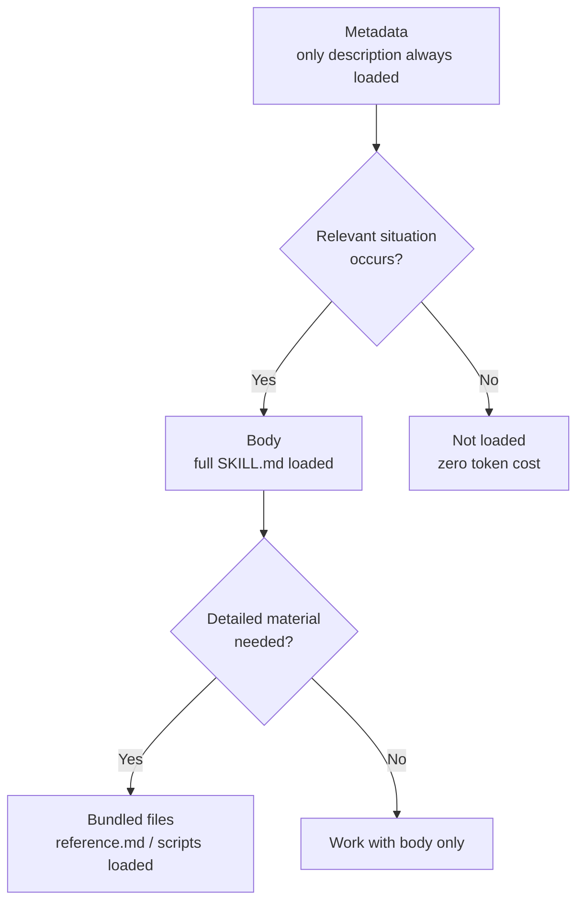

A Claude Code skill is an extension mechanism that bundles a recurring procedure or specialized knowledge into a single `SKILL.md` file and adds it to Claude's toolbox.


**TL;DR**: Turn the checklists and procedures you used to paste into chat every time into a single `SKILL.md` page, and Claude gets a "pocket expert" whose contents it pulls out only when needed.



This document is a conceptual overview of Claude Code skills. The practical procedures for writing skills directly in MoAI-ADK and auto-generating them with builder agents are covered in detail in the [Skill Guide](/advanced/skill-guide) and the [Builder Agents Guide](/advanced/builder-agents).


## What Is a Skill

A skill is a `SKILL.md` file containing instructions for Claude to follow. Once you create a single file, Claude can load it automatically in relevant situations, or you can invoke it directly with the `/skill-name` form.

The following situations are signals that you should create a skill:

- When you keep pasting the same instructions or checklist into chat
- When a section of CLAUDE.md grows from "factual information" into a "multi-step procedure"

CLAUDE.md content always resides in the context, but a skill's body loads only when it is actually used. As a result, you can keep long, detailed reference material with almost no token cost until it is needed.

### Skill and Custom Commands

Custom commands (`.claude/commands/`) have been integrated into skills. Existing command files still work as before, but new extensions should be written as skills. If both a command file and a skill with the same name exist, the skill takes precedence.

### Skill Structure

Each skill is a directory whose entry point is `SKILL.md`. The body consists of YAML frontmatter and Markdown instructions, and you can include supporting files alongside it.

```text
my-skill/
├── SKILL.md       # Required: instructions + frontmatter
├── reference.md   # Optional: detailed reference (loaded when needed)
├── examples.md    # Optional: example output
└── scripts/
    └── helper.py  # Optional: a script Claude runs
```

All frontmatter is optional, but `description` — which tells Claude when to use this skill — is effectively required.

```yaml
---
name: api-conventions
description: API design patterns for this codebase. Use when writing or reviewing endpoints.
allowed-tools: Read Grep
---

When writing API endpoints:
- Follow RESTful naming conventions
- Return a consistent error format
- Include request validation
```

The main frontmatter fields are as follows.

| Field | Role |
| :--- | :--- |
| `description` | What it does and when to use it. Claude's criterion for automatic loading |
| `name` | The name shown in the skill list (default: the directory name) |
| `disable-model-invocation` | When `true`, only the user can invoke it; Claude's automatic loading is blocked |
| `user-invocable` | When `false`, it is hidden from the `/` menu; only Claude uses it |
| `allowed-tools` | Tools that can be used without approval while the skill is active |
| `context` | When set to `fork`, runs in a separate subagent context |
| `paths` | Auto-loads only when handling specific file patterns |
| `shell` | Optional: shell to use when running shell commands |

## Progressive Disclosure

The core design of skills is **Progressive Disclosure** — revealing only as much as needed, step by step. It is a way to conserve the context window while still keeping deep knowledge on hand.



| Stage | When loaded | Content |
| :--- | :--- | :--- |
| Metadata | Always | Only `description` and the name reside in the context |
| Body | When invoked | The full `SKILL.md` instructions enter the context |
| Bundled | When needed | Reference docs, examples, and scripts are referenced on demand |

In a normal session, only every skill's `description` is always loaded, so Claude knows "what is available," and the actual body enters only at the moment of invocation. If you point to supporting files via links in `SKILL.md`, Claude reads them only when it needs them.

## When It Auto-Loads

Claude automatically loads a skill when the user's request matches the skill's `description` (and the optional `when_to_use`). In other words, the trigger is not a separate setting but **keyword matching against the description text**.

- The more you include keywords the user would naturally say in the `description`, the better it triggers.
- If it triggers too often regardless of intent, narrow the description further or allow manual invocation only with `disable-model-invocation: true`.
- When you want to invoke it directly, simply call it explicitly with the `/skill-name` form.

Where a skill is stored determines its scope of use.

| Location | Path | Scope |
| :--- | :--- | :--- |
| Personal | `~/.claude/skills/<name>/SKILL.md` | All of my projects |
| Project | `.claude/skills/<name>/SKILL.md` | This project only |
| Plugin | `<plugin>/skills/<name>/SKILL.md` | Wherever the plugin is enabled |

When names collide, precedence is enterprise > personal > project. Plugin skills use a namespace of the form `plugin-name:skill-name` so they do not conflict.

## A Small Example

The following is a skill that summarizes uncommitted changes. The `` !`git diff HEAD` `` syntax is dynamic context injection that runs the command before Claude sees it and splices the result into the body.

```yaml
---
description: Summarize uncommitted changes and flag risks. Use when asked what has changed.
---

## Current Changes

!`git diff HEAD`

## Instructions

Summarize the changes above in two or three bullets, then list risks such as missing error handling or hardcoding.
```

This skill is invoked automatically when the user asks "what did I change?", or directly via `/summarize-changes`.

## Skills in MoAI-ADK

MoAI-ADK operates on top of this skill mechanism. General-purpose skills such as `moai-foundation-core` and `moai-workflow-spec` hold knowledge of the SPEC workflow and quality gates, while skills tailored to a project's domain are auto-generated by builder agents. For practical details such as authoring rules, namespaces, and the progressive-disclosure token budget, please refer to the MoAI-ADK in-depth documents below.

## Related Docs

- [Skill Guide](/advanced/skill-guide)
- [Builder Agents Guide](/advanced/builder-agents)

## References

- [Claude Code Official Docs — Extend Claude with skills](https://code.claude.com/docs/en/skills)


If a skill does not trigger as expected, run `/doctor` to check whether the description budget has been exceeded, and verify that the `description` contains keywords the user would actually type.

