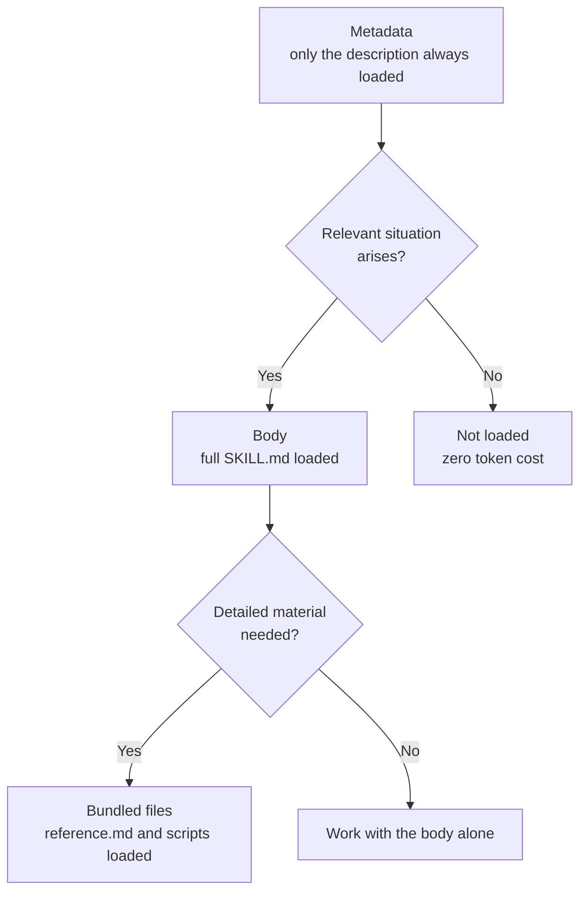

# Skills

A Claude Code skill is an extension mechanism that bundles a repeated procedure or piece of expertise into a single `SKILL.md` file, adding it to Claude's toolbox.


**One-line summary**: Turn the checklist or procedure you kept pasting into chat into one `SKILL.md`, and it becomes an "expert in your pocket" whose contents Claude pulls out only when needed.



This document is a conceptual overview of Claude Code skills. Hands-on procedures for writing skills in MoAI-ADK and auto-generating them with builder agents are covered in detail in the [Skill Guide](/advanced/skill-guide) and the [Builder Agents Guide](/advanced/builder-agents).


## What Is a Skill

A skill is a `SKILL.md` file holding instructions for Claude to follow. Create the file once, and Claude either loads it automatically in relevant situations or you invoke it directly as `/skill-name`.

These situations are signals to create a skill:

- You keep pasting the same instructions or checklist into chat
- A section of CLAUDE.md has grown from "factual information" into a "multi-step procedure"

CLAUDE.md content resides in context at all times, but a skill's body loads only when actually used. So you can keep long, detailed reference material with almost no token cost until it is needed.

### Skills and Custom Commands

Before skills, custom commands lived in the `.claude/commands/` directory. Today **skills subsume the command feature**: if both `.claude/commands/deploy.md` and `.claude/skills/deploy/SKILL.md` exist, the skill wins. Existing command files still work, but writing new extensions as skills is recommended.

### Skill Structure

Each skill is a directory with `SKILL.md` as its entry point. The body consists of YAML frontmatter plus markdown instructions, and supporting files can sit alongside.

```text
my-skill/
├── SKILL.md       # required: instructions + frontmatter
├── reference.md   # optional: detailed reference (loaded when needed)
├── examples.md    # optional: example output
└── scripts/
    └── helper.py  # optional: a script Claude runs
```

Most frontmatter fields are optional, but `description` — what Claude uses to decide when to apply the skill — is effectively required.

```yaml
---
name: api-conventions
description: API design patterns for this codebase. Use when writing or reviewing endpoints.
allowed-tools: Read Grep
---

When writing API endpoints:
- Follow RESTful naming conventions
- Return a consistent error format
- Include request validation
```

The main frontmatter fields:

| Field | Role |
| :--- | :--- |
| `description` | What it does and when to use it. Claude's basis for auto-load decisions |
| `name` | Name shown in the skill list (default: directory name) |
| `disable-model-invocation` | If `true`, only users can invoke it; blocks Claude's auto-load |
| `user-invocable` | If `false`, hidden from the `/` menu; used only by Claude |
| `allowed-tools` | Tools usable without approval while the skill is active |
| `context` | With `fork`, runs in a separate subagent context |
| `paths` | Auto-loads only when handling specific file patterns |
| `shell` | Optional: the shell to use when running shell commands |

## Progressive Disclosure

The core design of skills is **Progressive Disclosure** — revealing content in stages, only as much as needed. It conserves the context window while storing deep knowledge.


```mermaid
flowchart TD
    A[Metadata<br/>only the description always loaded] --> B{Relevant situation<br/>arises?}
    B -->|Yes| C[Body<br/>full SKILL.md loaded]
    C --> D{Detailed material<br/>needed?}
    D -->|Yes| E[Bundled files<br/>reference.md and scripts loaded]
    D -->|No| F[Work with the body alone]
    B -->|No| G[Not loaded<br/>zero token cost]
```

| Stage | Load timing | Contents |
| :--- | :--- | :--- |
| Metadata | Always | Only the `description` and name reside in context |
| Body | On invocation | The full `SKILL.md` instructions enter context |
| Bundle | When needed | Reference docs, examples, scripts consulted as needed |

In a normal session only every skill's `description` is always loaded — Claude knows "what exists" — and the actual body enters only at the moment of invocation. Point to supporting files with links inside `SKILL.md`, and Claude reads them only when needed.

## When Does It Auto-Load

Claude loads a skill automatically when your request lines up with the skill's `description` (and the optional `when_to_use`). In other words, the trigger is not a separate setting but **keyword matching against the description text**.

- The more your `description` carries keywords users would naturally type, the better it triggers.
- If it triggers too often regardless of intent, narrow the description further or allow manual invocation only with `disable-model-invocation: true`.
- To invoke directly, call it explicitly as `/skill-name`.

Where a skill is stored determines its reach.

| Location | Path | Applies to |
| :--- | :--- | :--- |
| Personal | `~/.claude/skills/<name>/SKILL.md` | All my projects |
| Project | `.claude/skills/<name>/SKILL.md` | This project only |
| Plugin | `<plugin>/skills/<name>/SKILL.md` | Wherever the plugin is enabled |

On name collisions, priority runs enterprise > personal > project. Plugin skills use the `plugin-name:skill-name` namespace, so they never collide.

## A Small Example

The following skill summarizes uncommitted changes. The `` !`git diff HEAD` `` syntax is dynamic context injection — the command runs before Claude sees the content, and its output is spliced into the body.

```yaml
---
description: Summarize uncommitted changes and flag risks. Use when asked what has changed.
---

## Current changes

!`git diff HEAD`

## Instructions

Summarize the changes above in two or three bullets, then list risks such as missing error handling or hardcoding.
```

This skill triggers automatically when the user asks "what did I change?", or directly via `/summarize-changes`.

## Skills in MoAI-ADK

MoAI-ADK operates on top of this skill mechanism. General-purpose skills like `moai-foundation-core` and `moai-workflow-spec` carry SPEC-workflow and quality-gate knowledge, and skills tailored to your project domain are auto-generated by builder agents.

From the MoAI-ADK perspective, skills straddle two pillars at once. On the **Tokenomics** side, progressive disclosure is token-budget design — you carry only the one-line description (~100 tokens) at all times and pay for the body (~5K tokens) only at use time, which is far more economical than parking knowledge in CLAUDE.md. On the **recursive self-learning** side, skills are the edit target of harness evolution — the harness upgrading skill instructions based on observations the loop has accumulated is the core path of MoAI-ADK's self-evolution. For hands-on details like authoring rules, namespaces, and the progressive-disclosure token budget, see the MoAI-ADK advanced documents below.

## Related Documents

- [Skill Guide](/advanced/skill-guide)
- [Builder Agents Guide](/advanced/builder-agents)

## References

- [Claude Code official docs — Extend Claude with skills](https://code.claude.com/docs/en/skills)


If a skill does not trigger as expected, check with `/doctor` whether the description budget was exceeded, and verify the `description` contains keywords users would actually type.

