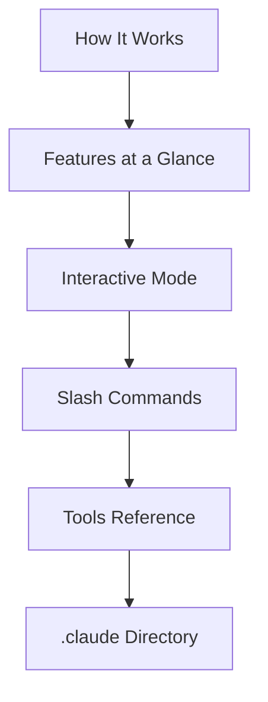

This group covers the fundamentals you need before putting Claude Code to serious use. It is written for developers who want to learn, step by step, how the agentic loop works, what features are available, how to enter input in interactive mode, how to use slash commands and tools, and where settings are stored.


**Learning goal (TL;DR)**: Understand how Claude Code works and its core usage interfaces, so you have a foundation that lets you follow the later workflow docs without friction.


## Learning Path

First, get the big picture from how it works, then skim the feature map to grasp which tools exist. Next, learn the actual ways to enter input through interactive mode and slash commands, and finally wrap up the behavior and environment with the tools reference and the configuration directory — and your fundamentals are complete.

## Contents

| Document | Description |
|------|------|
| [How It Works](/claude-code/foundations/how-claude-code-works) | The agentic loop and core building blocks |
| [Features at a Glance](/claude-code/foundations/features-overview) | The full feature catalog and learning path |
| [Interactive Mode](/claude-code/foundations/interactive-mode) | REPL, shortcuts, and permission modes |
| [Slash Commands](/claude-code/foundations/commands) | Built-in and custom commands, and their relation to /moai |
| [Tools Reference](/claude-code/foundations/tools-reference) | Built-in tools and permissions |
| [.claude Directory](/claude-code/foundations/claude-directory) | Configuration directory structure and scopes |

Once you have the fundamentals, the next group moves on to real development workflows and integrated usage of MoAI-ADK.
