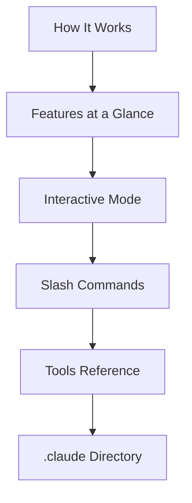

This group covers the fundamentals you need before using Claude Code in earnest. You will learn, in order, how the agentic loop works, what features exist, how to type in interactive mode, how to use slash commands and tools, and where settings are stored. Everything you learn here — the loop, tools, permissions, the settings directory — is exactly the material MoAI-ADK builds its harness on.


**Learning goal (one-line summary)**: Understand how Claude Code works and its core usage interfaces, so you can follow the workflow documents and MoAI-ADK harness design that come later without getting stuck.


## Learning Flow

```mermaid
flowchart TD
    A[How It Works] --> B[Features at a Glance]
    B --> C[Interactive Mode]
    C --> D[Slash Commands]
    D --> E[Tools Reference]
    E --> F[.claude Directory]
```

First get the big picture with How It Works, then scan the feature map to see what tools exist. Next, learn the actual input methods with Interactive Mode and slash commands, and finish off behavior and environment with the Tools Reference and the settings directory — that completes your fundamentals.

## Contents

| Document | Description |
|------|------|
| [How It Works](/claude-code/foundations/how-claude-code-works) | The agentic loop and core components |
| [Features at a Glance](/claude-code/foundations/features-overview) | Full feature catalog and learning path |
| [Interactive Mode](/claude-code/foundations/interactive-mode) | REPL, shortcuts, permission modes |
| [Slash Commands](/claude-code/foundations/commands) | Built-in and custom commands, and the /moai relationship |
| [Tools Reference](/claude-code/foundations/tools-reference) | Built-in tools and permissions |
| [.claude Directory](/claude-code/foundations/claude-directory) | Settings directory structure and scopes |

Once you have the fundamentals, move on to the next group, [Context and Memory](/claude-code/context-memory), to learn how to handle token costs — the starting point of MoAI-ADK tokenomics.
