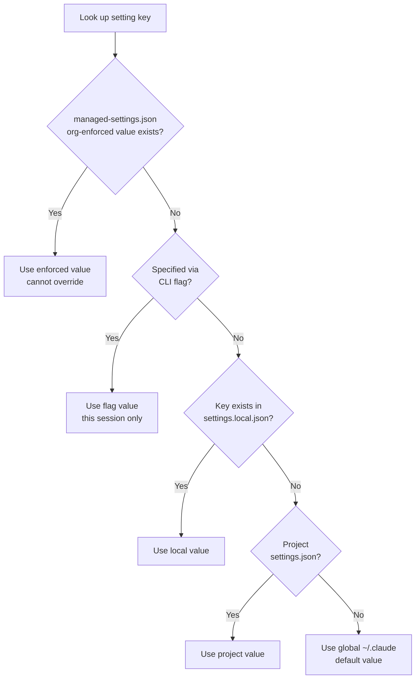

The `.claude` directory is the single configuration root from which Claude Code reads each project's instructions, settings, and extensions.


**TL;DR**: `.claude` is the project-specific "control panel" that Claude Code consults at the start of every session. Most of it is committed to git and shared with the team, while only personal files are kept separate.


For most users, editing just two files — `CLAUDE.md` and `settings.json` — is enough. The rest (skills, rules, sub-agents) can be added one at a time as the need arises.

## What the .claude Directory Does

Claude Code reads settings from two places: the `.claude/` directory of the project you are working in, and `~/.claude/` in your home directory. Files inside the project are committed to git and shared with the team, while files in `~/.claude/` remain personal settings that apply to every project.

- **Delivering project context**: instructions that Claude "reads and follows," such as `CLAUDE.md`
- **Enforcing behavior**: settings that are "enforced" regardless of whether Claude complies, such as `settings.json` permissions and hooks
- **Storing extensions**: reusable assets such as skills, sub-agents, and dynamic workflows

The key distinction here is between **guidance** and **configuration**. `CLAUDE.md` and rules are advisory notes that Claude consults, so there is no guarantee they are always honored, whereas hooks and permissions are enforced directly by the runtime and are therefore deterministic. When you need guaranteed behavior, implement it with hooks or permissions rather than guidance.

## Directory Structure

Below are the main entries that live under the project's `.claude/` directory. `CLAUDE.md`, `.mcp.json`, and `.worktreeinclude` are exceptions that sit in the project root.

| Item | Location | Commit | Role |
| --- | --- | --- | --- |
| `CLAUDE.md` | project root or `.claude/` | ✓ | Project instructions loaded as context at every session |
| `settings.json` | `.claude/` | ✓ | Enforced settings: permissions, hooks, environment variables, default model, etc. |
| `settings.local.json` | `.claude/` | - | Personal settings override (automatically gitignored) |
| `rules/` | `.claude/` | ✓ | Instructions split by topic, can be loaded conditionally by file path |
| `skills/` | `.claude/` | ✓ | Skills invoked with `/name` or called automatically by Claude |
| `commands/` | `.claude/` | ✓ | Single-file prompts (same mechanism as skills) |
| `agents/` | `.claude/` | ✓ | Sub-agent definitions with their own independent context windows |
| `workflows/` | `.claude/` | ✓ | Dynamic workflow scripts that orchestrate multiple sub-agents |
| `hooks/` | `.claude/` | ✓ | Scripts that hooks execute (registered in settings.json) |
| `agent-memory/` | `.claude/` | ✓ | Persistent memory dedicated to sub-agents |
| `.mcp.json` | project root | ✓ | Team-shared MCP server configuration |

> The interactive explorer in the official docs does not show a `hooks/` directory as a separate node. Hooks are registered under the `hooks` key in `settings.json`, with the script files they execute placed under `.claude/` and their paths referenced in the configuration.

### Guidance Files (what Claude reads)

- **`CLAUDE.md`**: holds the project's rules, frequently used commands, and architectural context. Because the entire file is loaded as context every session, 200 lines or fewer is recommended; when it grows longer, split it into rules.
- **`rules/*.md`**: loaded at session start when there is no `paths:` frontmatter, and loaded only when the matching file enters context when a `paths:` glob is present. When `CLAUDE.md` approaches 200 lines, the best practice is to split it into topic-based rules.

### Enforced Configuration (what Claude Code enforces)

- **`settings.json`**: holds the `permissions` (allow/deny tools and commands), `hooks` (run scripts at event points), `statusLine`, `model`, `env`, and `outputStyle` keys.
- **`settings.local.json`**: the same schema but personal and not committed. Use it when you need permissions that differ from the team defaults.

### Extension Assets

- **`skills/<name>/SKILL.md`**: folder-based skills that can bundle reference docs, templates, and scripts together.
- **`commands/*.md`**: single-file prompts. Officially the same mechanism as skills; writing new workflows as skills is recommended.
- **`agents/*.md`**: sub-agents with their own system prompt and tool access. They run in a fresh context window, keeping the main conversation clean.
- **`workflows/*.js`**: dynamic workflow scripts that spawn and orchestrate multiple sub-agents.

## Configuration Scopes and Precedence

The same setting can exist in multiple locations, and the more specific scope wins. Scopes are divided into three levels: enterprise, user, and project.

| Scope | Location | Applies to | Notes |
| --- | --- | --- | --- |
| Enterprise | `managed-settings.json` (OS-specific system path) | Entire organization | Cannot be overridden by users; highest priority |
| User (global) | `~/.claude/` | All projects | Personal defaults, not committed |
| Project | `.claude/` | Current project | Team-shared, committed |
| Project local | `.claude/settings.local.json` | Current project, personal | Highest priority among user-edited files |

The precedence of `settings.json` is applied as follows.

- **Organization-managed managed-settings.json** overrides everything.
- **CLI flags** (`--permission-mode`, `--settings`, etc.) override the `settings.json` for that session.
- **`settings.local.json`** has the highest priority among user-edited files and overrides the project `settings.json`.
- The project `settings.json` overrides the global `~/.claude/settings.json`.

There is an important difference in how settings are merged.

- **Array-type settings** (such as `permissions.allow`) **combine** values from all scopes.
- **Scalar-type settings** (such as `model`) **use the single value** from the most specific scope.
- `CLAUDE.md` is not merged key by key; instead, both the global and project files are **loaded into context**, and when instructions conflict, the project file takes precedence.

> On Windows, `~/.claude` resolves to `%USERPROFILE%\.claude`. Setting the `CLAUDE_CONFIG_DIR` environment variable moves all `~/.claude` paths under that directory.

## Version-Controlled vs Excluded

Whether files inside `.claude/` are committed depends on whether they are shared with the team. Assets the team uses together are committed, while personal and machine-specific values are excluded from git.

| File | Commit | Reason |
| --- | --- | --- |
| `CLAUDE.md`, `rules/`, `settings.json` | ✓ | Context and policy shared by the team |
| `skills/`, `commands/`, `agents/`, `workflows/` | ✓ | Extension assets shared by the team |
| `.mcp.json` | ✓ | Team-shared MCP server configuration |
| `settings.local.json` | - | Personal override (automatically gitignored) |
| All of `~/.claude/` | - | Personal settings applied to every project; never commit |
| `CLAUDE.local.md` | - | Per-project personal instructions; create manually and add to `.gitignore` |

Claude Code automatically adds `settings.local.json` to `~/.config/git/ignore` when it first creates the file. If you use a custom `core.excludesFile` or want to share ignore rules with your team, you should also add the pattern to the project `.gitignore` directly.

This is equally important in MoAI-ADK. MoAI-ADK treats `settings.local.json` as a runtime-managed file, never includes it in templates, and isolates machine-specific tokens, paths, and session state there. See the dedicated guide for detailed per-key behavior.

## Related Files That Live Elsewhere

Some files do not appear in the explorer but are closely tied to the `.claude` ecosystem.

| File | Location | Role |
| --- | --- | --- |
| `managed-settings.json` | OS-specific system path | Enterprise settings enforced by the organization |
| `CLAUDE.local.md` | project root | Personal instructions loaded alongside `CLAUDE.md` |
| Installed plugins | `~/.claude/plugins` | Plugin data managed by the `claude plugin` command |

`~/.claude` also stores data that Claude Code records while working (conversation transcripts, prompt history, file snapshots, caches, logs). By default this data is automatically cleaned up after 30 days (`cleanupPeriodDays`).

## Related Docs

- [settings.json Guide](/advanced/settings-json)
- [CLAUDE.md Guide](/advanced/claude-md-guide)
- [Statusline System](/advanced/statusline)

## References

- [Explore the .claude directory (Claude Code official docs)](https://code.claude.com/docs/en/claude-directory)


For a new project, fill in just the two files `CLAUDE.md` and `settings.json` first; put team permissions and hooks in the project `settings.json` and permissions only you use in `settings.local.json`, and you can start cleanly without git conflicts.

