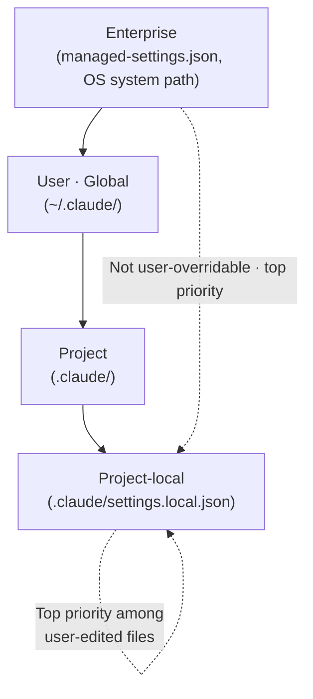

# .claude Directory

The `.claude` directory is the configuration bundle that tells Claude Code "this is how we work on this project." Put project rules, permissions, and extensions here, and Claude Code looks into this directory first every session and takes its contents as the starting point of the work.


**One-line summary**: `.claude` is the project-specific "control panel" Claude Code inspects every session. Commit most of it to git to share with the team, and isolate only the personal files that must stay on your machine.


If you are just starting out, you do not need to be overwhelmed by all the folders in the directory. In practice the files you touch often are just two — `CLAUDE.md` and `settings.json` — and the rest (skills, rules, subagents) are added one at a time as you find yourself thinking "I am repeating this same work again." This page starts from those two files and step by step unfolds how the whole directory fits together.

## Why a Configuration Directory Is Needed

The biggest cost in agentic coding is "re-explaining the context." If you had to spell out every time you opened a new session — "this project is Go, run tests this way, commit messages follow this rule" — that alone is token waste and fatigue. The `.claude` directory fixes this context in one place so that Claude Code does not forget the project when the session changes.

Claude Code reads configuration from two places.

- **Project `.claude/`** — the directory inside the repository you are working in. Holds the rules and policies you want to share with the team, and is committed to git.
- **Global `~/.claude/`** — under your home directory. Holds personal defaults that apply across all projects, and is not committed.

When the same item exists in both, the more specific one wins. For example, if you set a default model in global and a different model in the project, the project value takes precedence. This priority rule is covered in detail in the [Setting Scopes](#setting-scopes-where-they-apply) section below.

## Guidance and Enforcement: The Single Most Important Distinction

Files inside `.claude` fall into two classes. Holding this distinction in mind makes the whole directory much clearer.

- **Guidance** — notes Claude "consults and follows." `CLAUDE.md` and `rules/` belong here. Claude reads and respects them, but they have no enforcing power, so a strong temptation can override them.
- **Enforcement** — rules the Claude Code runtime "executes" directly. Permissions and hooks in `settings.json` belong here. They operate mechanically, independent of Claude's judgment, so they are deterministic.

Why does this distinction matter? Write "never push directly to `main`" in `CLAUDE.md` and Claude will mostly honor it, but not 100%. Implement the same rule as a permission or a hook and the runtime blocks the command even if Claude tries to ignore it. Anything that must be guaranteed should be implemented as enforcement, not guidance — that is the first design decision of harness engineering. MoAI-ADK also uses a single `moai init` to deploy orchestrator guidance, quality-gate hooks, and agent/skill assets into this directory, composing a project-specific harness.

## Project .claude/ Directory Structure

The table below summarizes what goes in the project `.claude/`. The "Commit" column marks whether the item is committed to git and shared with the team.

| Item | Location | Commit | Role | Class |
| --- | --- | --- | --- | --- |
| `CLAUDE.md` | Project root or `.claude/` |  | Project guidance loaded into context every session | Guidance |
| `settings.json` | `.claude/` |  | Enforced settings: permissions, hooks, env vars, default model | Enforcement |
| `settings.local.json` | `.claude/` |  | Personal settings override (auto-gitignored) | Enforcement |
| `rules/` | `.claude/` |  | Guidance split by topic; can be conditionally loaded by file path | Guidance |
| `skills/` | `.claude/` |  | Skills invoked via `/name` or auto-invoked by Claude | Extension |
| `commands/` | `.claude/` |  | Single-file prompts (same mechanism as skills) | Extension |
| `agents/` | `.claude/` |  | Subagent definitions with independent context | Extension |
| `workflows/` | `.claude/` |  | Dynamic workflow scripts coordinating multiple subagents | Extension |
| `hooks/` | `.claude/` |  | Scripts run by hooks (registered in settings.json) | Enforcement |
| `agent-memory/` | `.claude/` |  | Persistent memory dedicated to subagents | Data |
| `.mcp.json` | Project root |  | Team-shared MCP server configuration | Enforcement |
| `.worktreeinclude` | Project root |  | Gitignore patterns to copy when creating worktrees | Data |

### Guidance Files — What Claude Reads

**`CLAUDE.md`**: holds the project's rules, frequent commands, and architectural context. The whole file loads into context every session, so keeping it under 200 lines is recommended; when it grows, split it into `rules/`.

**`rules/*.md`**: per-topic guidance files. If the frontmatter has no `paths:` glob, the file loads at session start; if it has a `paths:` glob, it loads only when a matching file enters context. As `CLAUDE.md` approaches 200 lines, splitting it into per-topic rules is the best practice. This conditional loading is precisely **tokenomics** — only always-needed guidance comes up front; the rest comes up when needed.

### Enforced Settings — What Claude Code Forces

**`settings.json`**: holds the settings the runtime enforces directly. The main keys are:

- `permissions` — allow/deny lists for tools and commands
- `hooks` — scripts to run on lifecycle events (e.g., `PostToolUse`, `SessionStart`)
- `model` — the session's default model
- `env` — environment variables to inject into the session
- `statusLine` — status bar configuration
- `outputStyle` — output style

Scripts under `hooks/` do not work on their own. They must be registered per-event under the `hooks` key in `settings.json` to be enforced. Make only the scripts and forget the registration, and nothing happens.

**`settings.local.json`**: the same schema as `settings.json` but personal and never committed. Use it when you need permissions that differ from the team defaults. Claude Code automatically adds this file to `.gitignore` when first creating it.


**The permission mode propagates parent → child.** A subagent inherits the permission mode of the session that spawned it. If the parent is in `acceptEdits` or `bypassPermissions` mode, the child inherits that mode too — the parent wins even if the child tries to narrow it. So to isolate a subagent as read-only, implement it through **tool restriction** (omit write tools from the `tools:` list), not through the permission mode.


### Extension Assets — Expanding Capability

**`skills/<name>/SKILL.md`**: folder-based skills. They can bundle reference docs, templates, and scripts together, so they hold much richer workflows than a single file.

**`commands/*.md`**: single-file prompts. Officially the same mechanism as skills; for new workflows, writing them as skills is recommended.

**`agents/*.md`**: subagent definitions with their own system prompt and tool access. Each runs in a fresh context window, keeping the main conversation clean.


**Subagent nesting** (CC 2.1.219+). Since Claude Code v2.1.219, subagents can nest-spawn up to depth 3 by default. That means a subagent can call another subagent inside itself. If you do not want this behavior, set the environment variable `CLAUDE_CODE_MAX_SUBAGENT_SPAWN_DEPTH=1` to allow only one level. (v2.1.217–218 had a brief default-off period; it was re-enabled in 219.)


**`workflows/*.js`**: dynamic workflow scripts that spawn and coordinate many subagents. Use them to fan out, in one shot, parallel work too large for a single session.

## Global ~/.claude/ Directory Structure

If the project `.claude/` is "within this repository", the global `~/.claude/` is "everywhere I work". It is the place for your own defaults that do not need to be shared with the team.

| Item | Location | Role |
| --- | --- | --- |
| `CLAUDE.md` | `~/.claude/` | Personal guidance applied to all projects |
| `settings.json` | `~/.claude/` | Default settings for all projects (overridden by project settings) |
| `keybindings.json` | `~/.claude/` | Custom keyboard shortcuts |
| `skills/` | `~/.claude/` | Personal skills available in all projects |
| `commands/` | `~/.claude/` | Personal commands available in all projects |
| `agents/` | `~/.claude/` | Personal subagents available in all projects |
| `workflows/` | `~/.claude/` | Personal workflows available in all projects |
| `output-styles/` | `~/.claude/` | Personal output styles |
| `projects/` | `~/.claude/` | Per-project session records, conversation transcripts, auto memory |

Under `projects/`, session records accumulate as JSONL files per repository. Thanks to that, you can rewind, resume, or fork sessions, and auto memory is stored here as well.

## Setting Scopes: Where They Apply

The same setting can exist at multiple locations, and the more specific scope wins. Scopes come in four tiers: enterprise, user, project, and project-local.

```mermaid
flowchart TD
    A["Enterprise<br/>(managed-settings.json, OS system path)"] --> B["User · Global<br/>(~/.claude/)"]
    B --> C["Project<br/>(.claude/)"]
    C --> D["Project-local<br/>(.claude/settings.local.json)"]
    A -.->|"Not user-overridable · top priority"| D
    D -.->|"Top priority among<br/>user-edited files"| D
```

| Scope | Location | Applies to | Priority |
| --- | --- | --- | --- |
| Enterprise | `managed-settings.json` (OS-specific system path) | Entire organization | Top priority (not user-overridable) |
| User (global) | `~/.claude/` | All projects | Personal defaults |
| Project | `.claude/` | The current project | Team-shared |
| Project-local | `.claude/settings.local.json` | The current project, personal | Top priority among user-edited files |

How priority works depends on the setting kind. Without knowing this difference, it is easy to fall into "why is my setting not taking effect?" confusion.

- **Array settings** (like `permissions.allow`) — values from **all scopes are merged**. Commands allowed by enterprise, by user, and by project all accumulate and apply together.
- **Scalar settings** (like `model`) — only the **single value** from the most specific scope is used. If global says Sonnet and project says Opus, the project's Opus wins.

## What to Commit and What to Exclude

The basic principle of version control here is simple. **Commit what the team must share; exclude what is personal-only.**

| File | Commit | Reason |
| --- | --- | --- |
| `CLAUDE.md`, `rules/`, `settings.json` |  | Team-shared context and policy |
| `skills/`, `commands/`, `agents/`, `workflows/` |  | Team-shared extension assets |
| `hooks/` (scripts) |  | Team-shared automation (incl. settings.json registration) |
| `.mcp.json` |  | Team-shared MCP server configuration |
| `settings.local.json` |  | Personal overrides (auto-gitignored) |
| `CLAUDE.local.md` |  | Per-project personal guidance (create manually, then add to `.gitignore`) |
| All of `~/.claude/` |  | Personal settings applied to all projects |

Claude Code automatically adds `settings.local.json` to `.gitignore` when first creating it, so it needs no manual care. `CLAUDE.local.md`, on the other hand, is an officially supported filename but is not auto-ignored — to use it, you must add one line to `.gitignore` yourself to keep personal notes from landing in the team repository by accident.

## How MoAI-ADK Connects

MoAI-ADK takes this `.claude` directory as its working board. Run `moai init` and the orchestrator constitution (`CLAUDE.md`), quality-gate hooks (`hooks` in `settings.json`), 11 manager-agent definitions (`agents/`), and workflow skills (`skills/`) land in this directory. That is, the guidance/enforcement distinction, scope priority, and commit principles shown on this page are precisely the foundation the MoAI-ADK harness stands on.

From the **tokenomics** perspective, this directory is also decisive. `CLAUDE.md` and the always-loaded `rules/` take up context every session, so every line is a token cost. That is why the official docs recommend keeping `CLAUDE.md` under 200 lines and bringing up only what is needed via conditional loading (`paths:`). This point is covered in more depth in the [CLAUDE.md guide](/en/advanced/claude-md-guide).

## Related Documents

- [settings.json Guide](/en/advanced/settings-json)
- [CLAUDE.md Guide](/en/advanced/claude-md-guide)
- [Statusline System](/en/advanced/statusline)
- [How Claude Code Works](/en/claude-code/foundations/how-claude-code-works)

## References

- [Explore the .claude directory (Claude Code official docs)](https://code.claude.com/docs/en/claude-directory)


For a new project, do not try to fill every folder from the start. Fill in just `CLAUDE.md` and `settings.json` first, put team permissions and hooks in the project `settings.json`, and permissions only you use in `settings.local.json` — a clean start with no git conflicts. From there, every time you think "I am doing this again", add one more thing in the order rules → skills → hooks.

