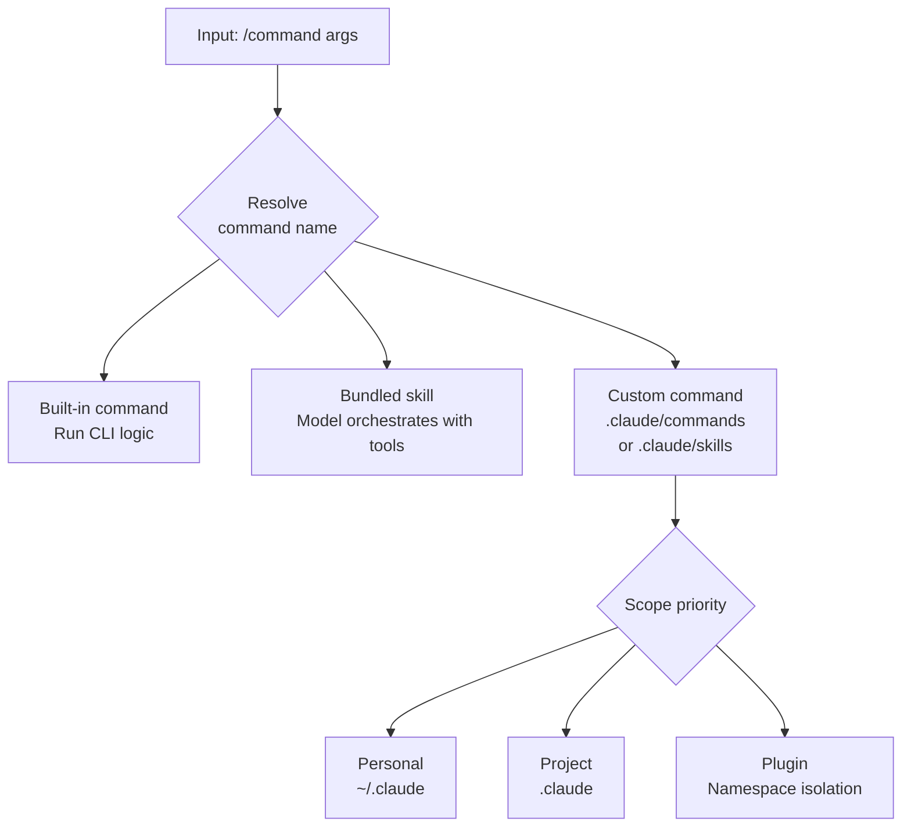

# Slash Commands

A slash command is the fastest way to control Claude Code directly: a single line starting with `/` inside a session.


**TL;DR**: A single input line starting with `/` puts the session at your fingertips — from switching models to clearing context to running workflows you built yourself.


## What Is a Slash Command

Slash commands control Claude Code from inside a session. Switching models, managing permissions, clearing context, or running a workflow all happen in a single line. Type `/` in the input box and every available command is listed; keep typing after the `/` to filter.

There is exactly one core rule. **A command is only recognized at the very start of a message.** Any text that follows the command name is passed to that command as an argument.

Commands fall into three broad categories.

| Category | Defined in | How it works |
| :--- | :--- | :--- |
| Built-in command | Coded into the CLI | Runs fixed logic directly |
| Bundled skill | A skill shipped with Claude Code | Hands instructions to the model, which orchestrates the work with tools |
| Custom command | `.claude/commands/` or `.claude/skills/` | Defined by the user directly in Markdown |

## Built-in Commands and Skills

Slash commands comprise built-in commands, bundled skills, and custom workflows. The commonly used commands are summarized below. For the full list, check `/` in the input box or the official command reference.

### Built-in Commands

| Command | Purpose | Version |
| :--- | :--- | :--- |
| `/goal <condition>` | Set a completion condition and proceed autonomously across multiple turns (Haiku checks periodically) | v2.1.139+ |
| `/workflows` | Manage and review active dynamic workflow runs | v2.1.139+ |
| `/rewind` (alias: `/checkpoint`, `/undo`) | Roll code and conversation back to an earlier checkpoint | v2.1.191+ |
| `/context [all]` | Analyze current context window usage | Default |
| `/memory` | Load and toggle `CLAUDE.md` + auto memory | v2.1.59+ |
| `/compact` | Summarize the conversation so far to free up context while keeping the same conversation | Default |
| `/clear` (alias: `/reset`, `/new`) | Clear context and start a new conversation | Default |
| `/agents` | Manage subagent configuration | v2.1.139+ |
| `/mcp` | Manage MCP server connections and authentication | v2.1.186+ |
| `/plugin` | Manage plugins | Default |
| `/effort [low|medium|high|xhigh|max|ultracode|auto]` | Set the model's reasoning depth or orchestration setting | Default |
| `/model` | Switch the AI model | Default |
| `/background` (alias: `/bg`) | Run in background | v2.1.139+ |
| `/fork <directive>` | Create a forked subagent inheriting this conversation | v2.1.161+ |
| `/recap` | Generate a session summary | Default |
| `/btw` | Ask a side question without polluting conversation history | v2.1.187+ |
| `/cd` | Change session working directory, preserving prompt cache | v2.1.169+ |
| `/schedule` (alias: `/routines`) | Schedule tasks for later | v2.1.72+ |
| `/branch`, `/tasks`, `/plan`, `/doctor`, `/skills`, `/reload-skills`, `/reload-plugins` | Other management commands | Default |

### Bundled Skills

| Command | Purpose |
| :--- | :--- |
| `/loop` (alias: `/proactive`) | Run an iterative fix loop (Ralph/interval-based) |
| `/batch` | Run batch operations |
| `/simplify` | Simplify code (v2.1.154+) |
| `/code-review` | Review code |

### Workflow Commands

| Command | Purpose |
| :--- | :--- |
| `/deep-research` | Run research with parallel web searches and cross-verification (requires WebSearch) |

### Note on Command Availability

- Many features can be called by several names (aliases).
- Some commands are exposed differently depending on platform, plan, and environment.
- `ultracode` is both a workflow trigger keyword (pre-v2.1.160 it was `workflow`) and an `/effort` level.

## Custom Slash Commands

Commands you write yourself are defined as Markdown files. A `.claude/commands/deploy.md` file creates the `/deploy` command, and you can build the same thing as a `.claude/skills/deploy/SKILL.md` skill. Both approaches create the same command and behave identically. Existing `.claude/commands/` files keep working, and if a skill and a command have the same name, the skill takes precedence.

> Custom commands have been consolidated into skills. When creating a new command, the skill format — which lets you keep supporting files alongside it — is recommended, but `.claude/commands/` is plenty for a simple single-file command.

### Frontmatter Fields

YAML frontmatter at the top of the Markdown file tunes the behavior. All fields are optional, but at least `description` is recommended so the model can decide when to invoke the command automatically.

| Field | Description |
| :--- | :--- |
| `description` | What the command does and when to use it. Used by the model to decide whether to invoke it automatically |
| `allowed-tools` | Tools usable without approval while the command is active. A space/comma-separated string or a YAML list |
| `argument-hint` | The argument hint shown during autocompletion. e.g. `[issue-number]` |
| `disable-model-invocation` | When `true`, blocks automatic model invocation; only the user can run it with `/name` |
| `model` | The model to use while the command runs (current turn only) |

```yaml
---
description: Fix a GitHub issue following our coding standards
argument-hint: [issue-number]
disable-model-invocation: true
allowed-tools: Bash(git add *) Bash(git commit *)
---

Fix GitHub issue $ARGUMENTS following our coding standards.

1. Read the issue description
2. Implement the fix
3. Write tests
4. Create a commit
```

`disable-model-invocation: true` is useful for workflows with side effects — like deploying or committing — where you want to control the timing yourself. It stops the model from deploying on its own just because the code looks ready.

### $ARGUMENTS Substitution

The text you type after the command name is substituted in place of `$ARGUMENTS`. In the example above, running `/fix-issue 123` turns `$ARGUMENTS` into `123`. If the command body has no `$ARGUMENTS`, what you typed is appended to the end of the body in the form `ARGUMENTS: <input>`.

You can also use positional arguments.

| Notation | Meaning |
| :--- | :--- |
| `$ARGUMENTS` | The entire argument string you entered |
| `$ARGUMENTS[N]` | The Nth argument, zero-indexed |
| `$N` | Shorthand for `$ARGUMENTS[N]` (`$0` is the first) |

For example, if the body says `Migrate the $0 component from $1 to $2` and you run `/migrate-component SearchBar React Vue`, then `$0` becomes `SearchBar`, `$1` becomes `React`, and `$2` becomes `Vue`. Pass a value containing spaces as a single argument by wrapping it in quotes.

### Dynamic Context Injection

In the body, the `` !`<command>` `` syntax runs a shell command **before** the command content is passed to the model and fills the slot with its output. The model receives actual data, not the command.

```markdown
## Current Changes

!`git diff HEAD`

## Instructions

Summarize the changes above in two or three bullets and list any risks.
```

This inline form is recognized only when `!` appears at the very start of a line or right after whitespace. For multi-line commands, use the `` ```! `` fenced block. You can also reference file contents into the body in the form `@file-path`.

## Scope: Project vs Personal

Where you place commands and skills determines their scope of use.

| Scope | Path | Applies to |
| :--- | :--- | :--- |
| Personal | `~/.claude/commands/` or `~/.claude/skills/` | All of my projects |
| Project | `.claude/commands/` or `.claude/skills/` | That project only |
| Plugin | `<plugin>/skills/` | Wherever the plugin is enabled |

When the same name exists at multiple levels, personal overrides project (if an organization-wide enterprise setting exists, it takes top priority). The `allowed-tools` of a project-scoped command applies only after you accept the workspace trust dialog for that folder. A command in an untrusted repository can grant itself broad tool permissions, so review it before use.

Placing subdirectories naturally creates namespaces. In addition, project skills are discovered by walking every `.claude/skills/` along the path from the starting directory up to the repository root, so starting Claude Code in a subfolder still recognizes the commands at the root.



## Commands Provided by Plugins

A plugin can distribute commands by placing them in its own `skills/` directory. Plugin skills use the `plugin-name:skill-name` namespace, so they never collide with commands at other levels. For example, `my-plugin/skills/review/SKILL.md` is invoked as `/my-plugin:review`. Plugins themselves are managed with the `/plugin` command.

## Relationship to MoAI-ADK's /moai Commands

The `/moai` command and its subcommands (`/moai plan`, `/moai run`, `/moai sync`, and so on) provided by MoAI-ADK are implemented as skills right on top of this slash command mechanism. In other words, MoAI-ADK uses Claude Code's custom command standard as-is to expose SPEC-based workflows as single-line commands.

| Aspect | Claude Code slash command | MoAI-ADK `/moai` command |
| :--- | :--- | :--- |
| Identity | A session-control mechanism | A bundle of skills implemented with that mechanism |
| Defined in | `.claude/commands` or `.claude/skills` | Skills distributed by MoAI-ADK |
| Role | Switching models, managing context, etc. | Agent orchestration workflows |

The behavior of the `/moai` command itself and its subcommands is covered in separate documents.

## Related Docs

- [/moai commands](/utility-commands/moai)
- [Workflow commands](/workflow-commands)
- [Interactive mode](/claude-code/foundations/interactive-mode)

## References

- [Claude Code Commands (official docs)](https://code.claude.com/docs/en/commands)
- [Extend Claude with skills (official docs)](https://code.claude.com/docs/en/skills)


For commands with side effects (deploying, committing, sending data externally, etc.), add `disable-model-invocation: true` so the model cannot run them arbitrarily, and keep the timing of execution in your own hands.

