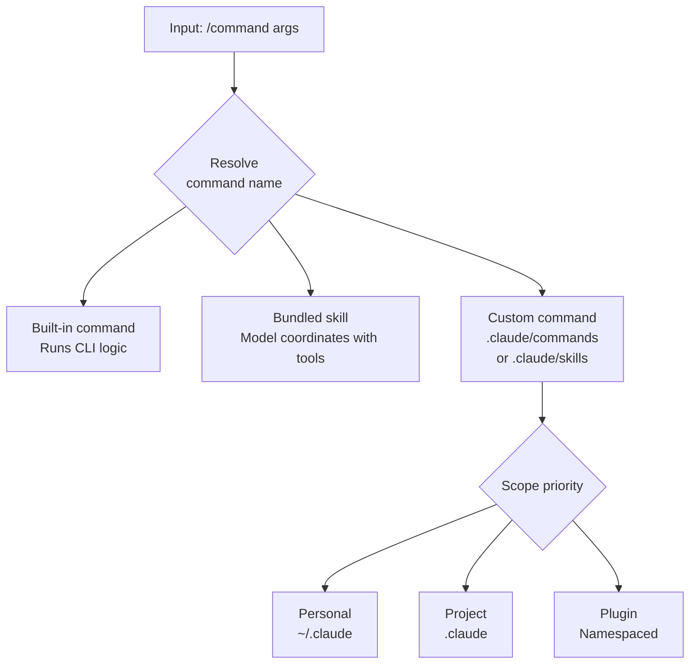

# Slash Commands

A slash command — a single line starting with `/` inside a session — is the fastest way to operate Claude Code directly.



**One-line summary**: A single line of input starting with `/` puts session control at your fingertips — from switching models to clearing context to running workflows you built yourself.


## What Is a Slash Command

Slash commands control Claude Code from inside a session. Switching models, managing permissions, clearing context, running workflows — all handled in one line. Type just `/` in the input box to list every available command; keep typing after `/` to filter.

There is exactly one core rule: **commands are recognized only at the very start of a message.** Text following the command name is passed to that command as arguments.

Commands fall into three broad classes.

| Class | Where defined | How it works |
| :--- | :--- | :--- |
| Built-in commands | Coded into the CLI | Executes fixed logic directly |
| Bundled skills | Skills shipped with Claude Code | Hands instructions to the model, which coordinates work with tools |
| Custom commands | `.claude/commands/` or `.claude/skills/` | Defined by users in markdown |

## Built-in Slash Commands and Skills

Slash commands come in three kinds. Frequently used commands are summarized below. See the full list by typing `/` in the input box; the official command reference is at [code.claude.com/docs/en/commands](https://code.claude.com/docs/en/commands).

### Built-in Commands

| Command | Purpose | Version |
| :--- | :--- | :--- |
| `/goal <condition>` | Set a completion condition and proceed autonomously across turns (Haiku checks periodically) | v2.1.139+ |
| `/workflows` | Management UI for dynamic workflow runs | v2.1.139+ |
| `/rewind` (aliases: `/checkpoint`, `/undo`) | Revert code and conversation to an earlier checkpoint | v2.1.191+ |
| `/context [all]` | Analyze current context window usage | Base |
| `/memory` | List/toggle `CLAUDE.md` + auto-memory loads | v2.1.59+ |
| `/compact` | Summarize the conversation so far to free context while keeping the same dialogue | Base |
| `/clear` (aliases: `/reset`, `/new`) | Clear the context and start a new conversation | Base |
| `/agents` | Manage subagent configuration (v2.1.198 removed the creation wizard — ask Claude or edit `.claude/agents/` directly; official docs still document the tabbed UI as of 2026-07) | v2.1.139+ |
| `/mcp` | Manage MCP server connections and OAuth authentication | v2.1.186+ |
| `/plugin` | Manage plugins | Base |
| `/effort [low\|medium\|high\|xhigh\|max\|ultracode\|auto]` | Set the model's reasoning intensity or orchestration | Base |
| `/model` | Select the AI model | Base |
| `/background` (alias: `/bg`) | Run in the background | v2.1.139+ |
| `/fork <directive>` | A forked subagent that inherits the conversation | v2.1.161+ |
| `/recap` | Session recap | Base |
| `/btw` | Side questions | v2.1.187+ |
| `/cd` | Change the session working directory, preserving the prompt cache | v2.1.169+ |
| `/schedule` (alias: `/routines`) | Scheduled tasks | v2.1.72+ |
| `/branch`, `/tasks`, `/plan`, `/doctor`, `/skills`, `/reload-skills`, `/reload-plugins` | Other management commands | Base |

### Skill Commands `[Skill]`

| Command | Purpose |
| :--- | :--- |
| `/loop` (alias: `/proactive`) | Run an iterative fix loop (Ralph/interval-based) |
| `/batch` | Run batch operations |
| `/simplify` | Simplify code (v2.1.154+) |
| `/code-review` | Review code |
| `/dataviz` | Generate data visualizations from your data (v2.1.198+) |

### Workflow Commands `[Workflow]`

| Command | Purpose |
| :--- | :--- |
| `/deep-research` | Research that runs web searches in parallel and cross-checks results (requires WebSearch) |

### Notes on Command Availability

- The same functionality often goes by multiple names (aliases).
- Some commands are exposed differently depending on platform, plan, and environment.
- `ultracode` is currently a workflow trigger keyword (it was `workflow` pre-v2.1.160) and simultaneously an `/effort` level.

## Custom Slash Commands

Commands you write yourself are defined as markdown files. A `.claude/commands/deploy.md` file creates the `/deploy` command, and the same job can also be built as the skill `.claude/skills/deploy/SKILL.md`. Both approaches create the same command and behave identically. Existing `.claude/commands/` files keep working, and if a skill and a command share a name, the skill wins.

> Custom commands have been unified into skills. For new commands the skill format is recommended because supporting files can live alongside, but for a simple single-file command `.claude/commands/` is perfectly fine.

### Frontmatter Fields

The YAML frontmatter at the top of the markdown file tunes behavior. Every field is optional; `description` at minimum is recommended so the model can judge when to auto-invoke.

| Field | Description |
| :--- | :--- |
| `description` | What the command does and when to use it. Used by the model to decide auto-invocation |
| `allowed-tools` | Tools usable without approval while the command is active. Space/comma-separated string or a YAML list |
| `argument-hint` | Argument hint shown during autocomplete. E.g., `[issue-number]` |
| `disable-model-invocation` | If `true`, blocks model auto-invocation; only the user can run it via `/name` |
| `model` | The model to use while the command runs (current turn only) |

```yaml
---
description: Fix a GitHub issue following our coding standards
argument-hint: [issue-number]
disable-model-invocation: true
allowed-tools: Bash(git add *) Bash(git commit *)
---

Fix GitHub issue $ARGUMENTS following our coding standards.

1. Read the issue description
2. Implement the fix
3. Write tests
4. Create a commit
```

`disable-model-invocation: true` is useful for workflows with side effects — deploys, commits — where you want direct control over timing. It stops the model from deploying on its own just because the code looks ready.

### $ARGUMENTS Substitution

Text typed after the command name is substituted into `$ARGUMENTS`. In the example above, running `/fix-issue 123` replaces `$ARGUMENTS` with `123`. If the command body has no `$ARGUMENTS`, the input is appended to the end of the body as `ARGUMENTS: <input>`.

Positional arguments are also available.

| Notation | Meaning |
| :--- | :--- |
| `$ARGUMENTS` | The full argument string as typed |
| `$ARGUMENTS[N]` | The Nth argument, zero-based |
| `$N` | Shorthand for `$ARGUMENTS[N]` (`$0` is the first) |

For example, write `Migrate the $0 component from $1 to $2` in the body and run `/migrate-component SearchBar React Vue`: `$0` becomes `SearchBar`, `$1` becomes `React`, `$2` becomes `Vue`. Values containing spaces are quoted to pass as a single argument.

### Dynamic Context Injection

In the body, the `` !`<command>` `` syntax runs the shell command **before** the command content is handed to the model, filling the slot with its output. The model receives real data, not the command.

```markdown
## Current changes

!`git diff HEAD`

## Instructions

Summarize the changes above in two or three bullet points and list the risks.
```

This inline form is recognized only when `!` comes at the start of a line or right after whitespace. Multi-line commands use a `` ```! `` fenced block. You can also reference file contents into the body with the `@filepath` form.

## Scope: Project vs Personal

Where a command or skill lives determines its reach.

| Scope | Path | Applies to |
| :--- | :--- | :--- |
| Personal | `~/.claude/commands/` or `~/.claude/skills/` | All my projects |
| Project | `.claude/commands/` or `.claude/skills/` | That project only |
| Plugin | `<plugin>/skills/` | Wherever the plugin is enabled |

If the same name exists at multiple levels, personal overrides project (an organization-level enterprise setting, if present, takes top priority). A project-scoped command's `allowed-tools` applies only after you accept the workspace trust dialog for that folder. Commands in untrusted repositories can grant themselves broad tool permissions, so review before use.

Subdirectories naturally create namespaces. Project skills are also discovered along every ancestor path's `.claude/skills/` from the starting directory up to the repository root, so commands at the root are recognized even when Claude Code starts in a subfolder.


```mermaid
flowchart TD
    A["Input: /command args"] --> B{"Resolve<br/>command name"}
    B --> C["Built-in command<br/>Runs CLI logic"]
    B --> D["Bundled skill<br/>Model coordinates with tools"]
    B --> E["Custom command<br/>.claude/commands<br/>or .claude/skills"]
    E --> F{"Scope priority"}
    F --> G["Personal<br/>~/.claude"]
    F --> H["Project<br/>.claude"]
    F --> I["Plugin<br/>Namespaced"]
```

## Commands Provided by Plugins

A plugin can ship commands in its own `skills/` directory. Plugin skills use the `plugin-name:skill-name` namespace, so their names never collide with commands at other levels. For example, `my-plugin/skills/review/SKILL.md` is invoked as `/my-plugin:review`. Plugins themselves are managed with the `/plugin` command.

## Relationship to MoAI-ADK's /moai Command

MoAI-ADK's `/moai` and its subcommands (`/moai plan`, `/moai run`, `/moai sync`, and so on) are implemented as skills on exactly this slash-command mechanism. In other words, MoAI-ADK uses Claude Code's custom-command standard as-is, exposing the SPEC-based workflow as one-line commands. Send a natural-language request without a subcommand, like `/moai "fix the login bug"`, and it routes to the right workflow through intent analysis (Analyze-First) — semantic classification that works regardless of language.

| Aspect | Claude Code slash commands | MoAI-ADK `/moai` commands |
| :--- | :--- | :--- |
| What it is | A session control mechanism | A bundle of skills built on that mechanism |
| Where defined | `.claude/commands` or `.claude/skills` | Skills deployed by MoAI-ADK |
| Role | Model switching, context management, etc. | Agent orchestration workflows |

The behavior of the `/moai` command itself and its subcommands are covered in separate documents.

## Related Documents

- [/moai Command](/utility-commands/moai)
- [Workflow Commands](/workflow-commands)
- [Interactive Mode](/claude-code/foundations/interactive-mode)

## References

- [Claude Code Commands (official docs)](https://code.claude.com/docs/en/commands)
- [Extend Claude with skills (official docs)](https://code.claude.com/docs/en/skills)


For commands with side effects (deploys, commits, external sends), add `disable-model-invocation: true` so the model cannot run them arbitrarily — keep the execution timing in your own hands.

