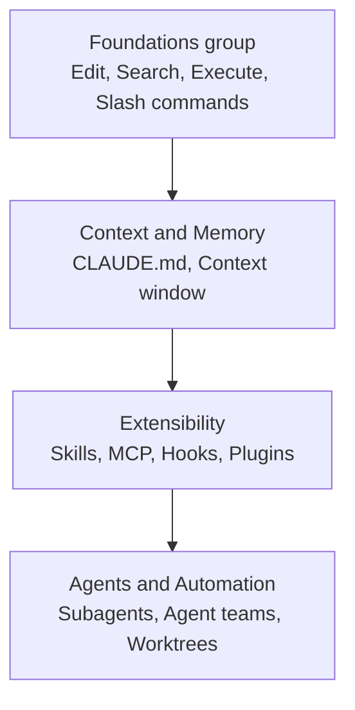

This page is a hub that helps you survey the entire set of features Claude Code offers at a glance and quickly grasp exactly which problem each feature solves.


**TL;DR**: Claude Code is a model that reasons about code, equipped with built-in tools such as file editing, search, and execution, with context, extension, and automation layers stacked on top.


## What This Page Is For

Claude Code's features fall broadly into two branches. One is the **built-in tools** the model always uses to work with code, and the other is the **extension layer** you add as needed. This page lays out both branches and, alongside a one-line description of each feature, points you to the in-depth detailed documents.

MoAI-ADK is a workflow tool that runs precisely on top of this Claude Code. So once you have a handle on the concepts of the features introduced here, you can understand much faster how MoAI-ADK orchestrates subagents, skills, and hooks.

## Feature Catalog

The table below organizes Claude Code's major features with a one-line description. Follow the link in the last column to jump to the detailed document for each feature.

| Feature | One-line description | Learn more |
| --- | --- | --- |
| Code editing | The core built-in feature where the model reads and modifies files directly. | [Foundations group](/claude-code/foundations) |
| Search | A built-in tool that finds patterns, files, and symbols within the codebase. | [Foundations group](/claude-code/foundations) |
| Command execution | Runs shell commands to perform build, test, and git operations. | [Foundations group](/claude-code/foundations) |
| Slash commands | Commands starting with `/` that instantly invoke skills or built-in behaviors. | [Foundations group](/claude-code/foundations) |
| Interactive modes | Session modes that change how permissions are handled or the working style. | [Foundations group](/claude-code/foundations) |
| CLAUDE.md / Memory | Holds persistent context that is automatically loaded every session. | [Context and Memory](/claude-code/context-memory) |
| Context window | The token limit a single session can hold and the strategy for managing it. | [Context and Memory](/claude-code/context-memory) |
| Skills | A markdown unit holding reusable knowledge and workflows. | [Extensibility](/claude-code/extensibility) |
| MCP | A protocol that connects external services and tools to the model. | [Extensibility](/claude-code/extensibility) |
| Hooks | Automatically run scripts, requests, or prompts on lifecycle events. | [Extensibility](/claude-code/extensibility) |
| Plugins | A packaging unit that bundles skills, hooks, subagents, and MCP for distribution. | [Extensibility](/claude-code/extensibility) |
| Subagents | Workers that run independently in an isolated context and return only a summary. | [Agents and Automation](/claude-code/agentic) |
| Agent teams | Several independent sessions collaborate by sharing tasks and messages. | [Agents and Automation](/claude-code/agentic) |
| Worktrees | Develop the same repository in parallel using separate working directories. | [Agents and Automation](/claude-code/agentic) |
| Checkpoints | Save state mid-task so you can roll back. | [Agents and Automation](/claude-code/agentic) |

### Built-in Tools Family

Built-in tools always work without any extra configuration, and most coding tasks are handled with these tools alone.

- **Code editing**: The most basic feature, where the model opens files to read and fix them directly.
- **Search**: Finds text patterns or files across the entire codebase. In typed languages or a large codebase, language-server-based code intelligence makes symbol-level navigation more accurate.
- **Command execution**: Runs shell commands such as build, test, lint, and git.
- **Slash commands**: Instantly invoke commands provided in a bundle, like `/code-review` and `/debug`, or skills you build yourself.
- **Interactive modes**: Switch session behaviors such as auto-accepting edits or bypassing permissions.

### Context and Memory Family

- **CLAUDE.md / Memory**: Persistent context whose entire content is automatically loaded at the start of every session. Place coding rules or directives like "always do X" here. The official docs recommend keeping `CLAUDE.md` under 200 lines and separating growing reference material into skills or `.claude/rules/`.
- **Context window**: The limit on input and output tokens a single session can hold. Understanding how much context each feature occupies is the key to efficient configuration.

### Extension Layer

The extension layer expands what the model knows, connects it to external services, or automates workflows.

- **Skills**: Markdown files holding knowledge, workflows, and directives. Invoke them directly with `/<name>`, or the model loads them automatically when they are highly relevant. They are the most flexible means among extensions.
- **MCP**: A protocol that connects external services and data to the model, such as querying a database, posting to Slack, or controlling a browser.
- **Hooks**: Run scripts, HTTP requests, prompts, or subagents on lifecycle events such as `PostToolUse` and `SessionStart`. Suited for automation that must happen the same way every time (for example, linting after an edit).
- **Plugins**: Bundle skills, hooks, subagents, and MCP servers into a single installation unit. Use them to reuse the same configuration across multiple repositories or to distribute it to others.

### Agents and Automation Family

- **Subagents**: Handle a task in their own context window, then return only the summary result to the main conversation. Useful when intermediate artifacts should not clutter the main context, such as an investigation task that reads dozens of files.
- **Agent teams**: Several mutually independent Claude Code sessions collaborate via a shared task list and messages. Suited for investigations that verify competing hypotheses or parallel code reviews; this is an experimental feature, disabled by default.
- **Worktrees**: Keep the same repository in separate working directories so you can work on multiple branches in parallel without conflicts.
- **Checkpoints**: Record state during work so you can undo changes or return to a safe point.

## The Difference Between Skills and Subagents

Let's address the two extension features that are most often confused. The key is how they handle **context**.

| Aspect | Skill | Subagent |
| --- | --- | --- |
| Identity | Reusable directives, knowledge, and workflows | An isolated worker with its own context |
| Strength | Shared across any context | Tasks are isolated and only a summary is returned |
| Context impact | Added to the main window | Uses a separate window |
| Best for | Reference material, invoke-style workflows | Reading many files, parallel and specialized tasks |

A skill can be an invoke-style action (`/deploy`) or reference knowledge (an API style guide). A subagent is a good fit when the context window is filling up or there is no need to show intermediate work. The two can also be combined, so a subagent can preload a specific skill, or a skill can run in an isolated context.

## Where to Start Reading

The documents in this section are grouped into four groups, taking the learning order into account. Following the flow below lets you grasp the whole picture without trouble.

| Order | Group | What you gain |
| --- | --- | --- |
| 1 | [Foundations group](/claude-code/foundations) | The core actions you use daily, like edit, search, and execute |
| 2 | [Context and Memory](/claude-code/context-memory) | How to pin rules with CLAUDE.md and conserve context |
| 3 | [Extensibility](/claude-code/extensibility) | How to expand capabilities with skills, MCP, hooks, and plugins |
| 4 | [Agents and Automation](/claude-code/agentic) | How to parallelize work with subagents and agent teams |

The **best practice** the official docs recommend is not to configure every feature from the start. The flow is to add a rule to CLAUDE.md when you make the same mistake twice, save a skill when you repeat the same prompt, and write a hook when a behavior needs to happen automatically every time — stacking them up one at a time as the need reveals itself.

## Related Docs

- [Foundations group](/claude-code/foundations)
- [Context and Memory](/claude-code/context-memory)
- [Extensibility](/claude-code/extensibility)
- [Agents and Automation](/claude-code/agentic)
- [Quickstart](/getting-started/quickstart)

## References

- [Extend Claude Code — Features overview](https://code.claude.com/docs/en/features-overview)


If you are working with Claude Code for the first time, don't turn on every feature at once. Master the foundations group first, then, each time you catch yourself thinking "I'm repeating this again" during real work, add one thing at a time in the order CLAUDE.md → skill → hook.

