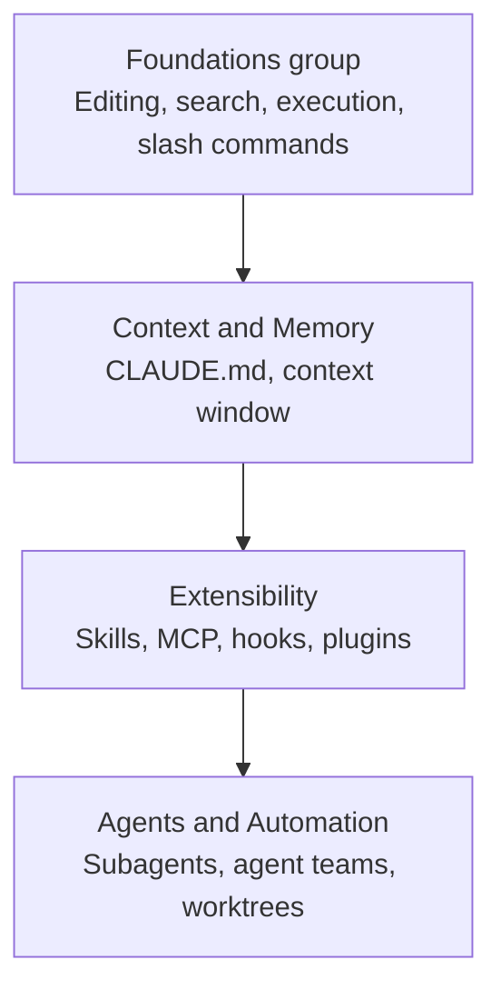

# Features at a Glance

This page is a hub that gives you a bird's-eye view of everything Claude Code offers and helps you quickly grasp exactly which problem each feature solves.


**One-line summary**: Claude Code is a model that reasons about code with built-in tools for file editing, search, and execution attached, with context, extension, and automation layers stacked on top.


## The Role of This Page

Claude Code's features split into two branches. One is the **built-in tools** the model always uses to work with code; the other is the **extension layer** users add as needed. This page lays out both branches and, alongside a one-line description of each feature, points the way to the in-depth detail documents.

MoAI-ADK is an agentic development kit that runs on top of this very Claude Code. The features listed here are also the raw materials of MoAI-ADK's three pillars — the context window and caching feed **Tokenomics**, subagents, teams, and worktrees feed **Agentic Loop Engineering**, and skills, hooks, MCP, and plugins feed the **Agentic Harness**. Getting the concepts down here makes it much faster to understand how MoAI-ADK orchestrates them.

## Feature Catalog

The table below summarizes Claude Code's major features with one-line descriptions. Follow the link in the last column to reach each feature's detailed document.

| Feature | One-line description | Learn more |
| --- | --- | --- |
| Code editing | The core built-in capability: the model reads and modifies files directly. | [Foundations group](/claude-code/foundations) |
| Search | Built-in tools for finding patterns, files, and symbols in the codebase. | [Foundations group](/claude-code/foundations) |
| Command execution | Runs shell commands for builds, tests, and git work. | [Foundations group](/claude-code/foundations) |
| Slash commands | Commands starting with `/` that instantly invoke skills or built-in behaviors. | [Foundations group](/claude-code/foundations) |
| Interactive mode | Session modes that change permission handling or working style. | [Foundations group](/claude-code/foundations) |
| CLAUDE.md / memory | Holds persistent context loaded automatically every session. | [Context and Memory](/claude-code/context-memory) |
| Context window | The token limit a session can hold and strategies for managing it. | [Context and Memory](/claude-code/context-memory) |
| Skills | Markdown units carrying reusable knowledge and workflows. | [Extensibility](/claude-code/extensibility) |
| MCP | The protocol connecting external services and tools to the model. | [Extensibility](/claude-code/extensibility) |
| Hooks | Automatically run scripts, requests, or prompts on lifecycle events. | [Extensibility](/claude-code/extensibility) |
| Artifacts store | Structures and shares HTML, markdown, and snippets Claude generates. | [Extensibility](/claude-code/extensibility) |
| Plugins | Packaging units bundling skills, hooks, subagents, and MCP for distribution. | [Extensibility](/claude-code/extensibility) |
| Subagents | Workers that execute independently in isolated contexts and return only a summary. | [Agents and Automation](/claude-code/agentic) |
| Agent teams | Multiple independent sessions collaborating via shared tasks and messages. | [Agents and Automation](/claude-code/agentic) |
| Worktrees | Parallel development on the same repository in separated working directories. | [Agents and Automation](/claude-code/agentic) |
| Checkpoints | Save state mid-work so you can go back. | [Agents and Automation](/claude-code/agentic) |

### The Built-in Tool Family

Built-in tools always work without any setup, and most coding tasks can be handled with these tools alone.

- **Code editing**: the most fundamental capability — the model opens files, reads them, and fixes them directly.
- **Search**: finds text patterns or files across the whole codebase. For typed languages or a large codebase, language-server-based code intelligence makes symbol-level navigation more precise.
- **Command execution**: runs shell commands like build, test, lint, and git.
- **Slash commands**: instantly invokes bundled commands like `/code-review` and `/debug`, or skills you built yourself.
- **Interactive mode**: switches session behavior such as auto-accepting edits or bypassing permissions.

### The Context and Memory Family

- **CLAUDE.md / memory**: persistent context whose full contents are auto-loaded at every session start. Put coding rules and "always do X" instructions here. The official docs recommend keeping `CLAUDE.md` under 200 lines and moving growing reference material into skills or `.claude/rules/`.
- **Context window**: the limit on input and output tokens a session can hold. Understanding how much context each feature occupies is the key to efficient configuration.

### The Extension Layer

The extension layer grows what the model knows, connects it to external services, or automates workflows.

- **Skills**: markdown files carrying knowledge, workflows, and instructions. Invoke directly with `/<name>`, or the model loads them automatically when highly relevant. The most flexible means of extension.
- **MCP**: the protocol connecting external services and data to the model — querying databases, posting to Slack, controlling a browser.
- **Hooks**: run scripts, HTTP requests, prompts, or subagents on lifecycle events like `PostToolUse` and `SessionStart`. Suited to automation that must happen identically every time (e.g., lint after edit).
- **Plugins**: bundle skills, hooks, subagents, and MCP servers into one installable unit. Use them to reuse the same setup across repositories or distribute it to others.

### The Agents and Automation Family

- **Subagents**: process work in their own context window and return only a summary to the main conversation. Useful when intermediate output must not clutter the main context, such as research that reads dozens of files.
- **Agent teams**: multiple mutually independent Claude Code sessions collaborating via a shared task list and messages. Suited to investigations testing competing hypotheses or parallel code review; an experimental feature that is disabled by default.
- **Worktrees**: keep the same repository in separated working directories so multiple branch efforts proceed in parallel without conflicts.
- **Checkpoints**: record state as work progresses, so you can revert changes or return to a safe point.

## The Difference Between Skills and Subagents

Let's pin down the two extension features that are most often confused. The key is how each handles **context**.

| Aspect | Skills | Subagents |
| --- | --- | --- |
| What it is | Reusable instructions, knowledge, workflows | An isolated worker with its own context |
| Strength | Shareable in any context | Work is separated; only a summary returns |
| Context impact | Added to the main window | Uses a separate window |
| Best for | Reference material, invocable workflows | Reading many files, parallel or specialized work |

A skill can be an invocable action (`/deploy`) or reference knowledge (an API style guide). When the context window is filling up or the intermediate work does not need to be visible, a subagent is the right fit. The two can also combine — a subagent can preload specific skills, or a skill can run in an isolated context.

## Where to Start Reading

The documents in this section are grouped into four groups with the learning order in mind. Follow the flow below to build the full picture without strain.

```mermaid
flowchart TD
    A[Foundations group<br>Editing, search, execution, slash commands] --> B[Context and Memory<br>CLAUDE.md, context window]
    B --> C[Extensibility<br>Skills, MCP, hooks, plugins]
    C --> D[Agents and Automation<br>Subagents, agent teams, worktrees]
```

| Order | Group | What you gain |
| --- | --- | --- |
| 1 | [Foundations group](/claude-code/foundations) | The core everyday actions — editing, search, execution |
| 2 | [Context and Memory](/claude-code/context-memory) | How to pin rules with CLAUDE.md and conserve context |
| 3 | [Extensibility](/claude-code/extensibility) | How to grow capability with skills, MCP, hooks, plugins |
| 4 | [Agents and Automation](/claude-code/agentic) | How to parallelize work with subagents and agent teams |

The **best practice** the official docs recommend is not to configure every feature from the start. Make the same mistake twice, add a rule to CLAUDE.md; repeat the same prompt, save it as a skill; find an action that must happen automatically every time, write a hook — building up one piece at a time as the need reveals itself. This "one at a time, when needed" principle is also right from a token perspective — unused extensions only occupy context, and context is cost.

## Related Documents

- [Foundations group](/claude-code/foundations)
- [Context and Memory](/claude-code/context-memory)
- [Extensibility](/claude-code/extensibility)
- [Agents and Automation](/claude-code/agentic)
- [Quickstart](/getting-started/quickstart)

## References

- [Extend Claude Code — Features overview](https://code.claude.com/docs/en/features-overview)


If you are new to Claude Code, do not switch everything on at once. Learn the Foundations group first, then each time real work makes you think "I keep repeating this," add one thing in order: CLAUDE.md → skill → hook.

