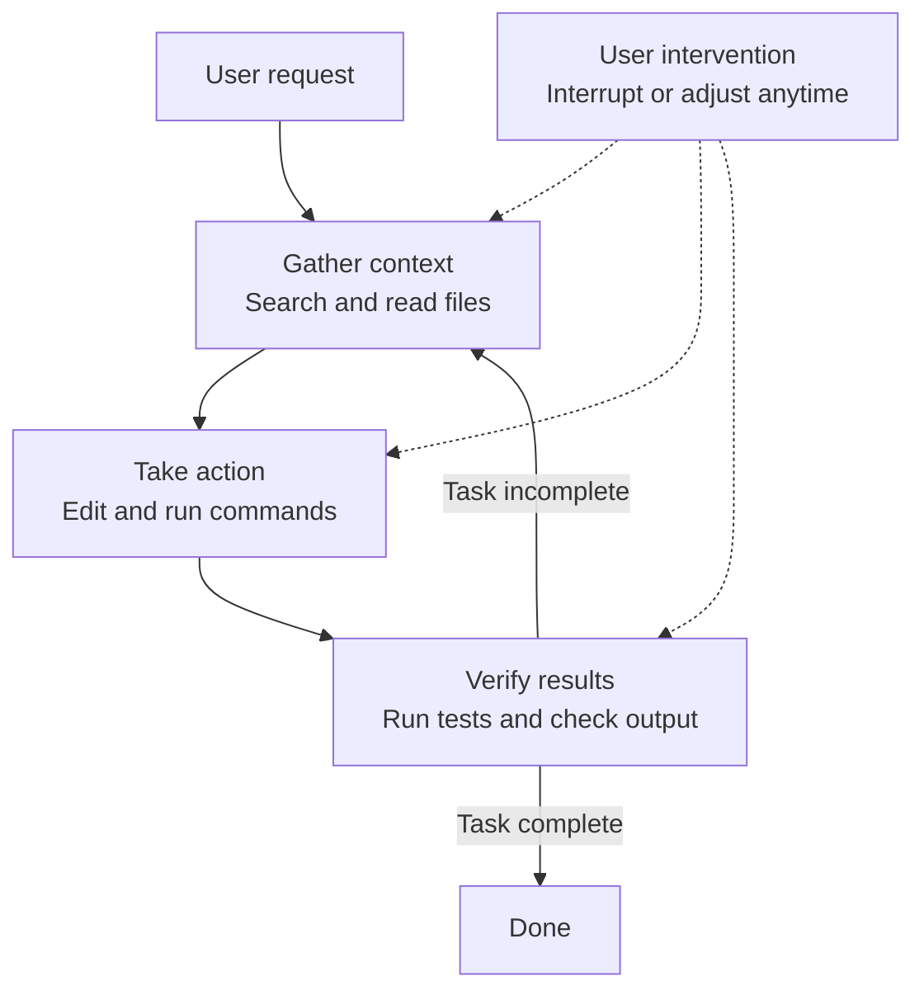

This page explains how Claude Code's agentic loop works as it understands your code and runs tools directly to complete tasks.


**TL;DR**: Claude Code is a terminal-native coding agent that pairs a reasoning model with acting tools and repeats "gather context → take action → verify results" on its own.


## What Is Claude Code

Claude Code is an agentic assistant that runs in the **terminal**. It is especially strong at coding, but it can help with anything you can do at the command line — writing documentation, running builds, searching files, even researching a topic.

The core concept is the **agentic harness**. Claude Code wraps the Claude model and provides it with tools, context management, and an execution environment. In other words, it is the shell that turns a language model that only generated text into a capable coding agent that actually works with your codebase.

## The Agentic Loop

When you hand Claude a task, it goes through three stages. Rather than being cleanly separated, these stages blend into one another.

```text
request → gather context → take action → verify results → repeat
```

| Stage | What it does |
|-------|--------------|
| **gather context** | Searches and reads files to understand the code structure |
| **take action** | Makes changes by editing files or running commands |
| **verify results** | Checks whether the work is correct by running tests or inspecting output |

The loop adapts to the nature of the request. A question about the codebase may end with just gathering context, a bug fix cycles through all three stages several times, and a refactor may put heavy weight on verification. Claude decides its next action based on what it learned in the previous stage, stringing together dozens of actions while correcting its own course.



You are part of this loop too. At any time you can interrupt the work (`Esc`) or send a corrective message without stopping it (`Enter`) to change direction. Claude works autonomously while continuing to respond to your input.

## Core Components

The agentic loop runs on two axes: a **reasoning model** and **acting tools**. Added to these are the context that holds the conversation and files, plus the permissions that govern actions.

### Model

Claude Code uses the Claude model to understand code and reason about tasks. It can read code in any language, grasp how the components connect, and break complex tasks into steps to execute them.

| Model | Characteristics |
|-------|-----------------|
| Sonnet | Handles most coding tasks comfortably |
| Opus | Provides strong reasoning for complex architectural decisions |

Switch models with the `/model` command during a session, or with `claude --model <name>` at startup.

### Tools

Tools are what let Claude move beyond text responses to actually take action. The built-in tools fall into roughly five categories.

| Category | What Claude can do |
|----------|--------------------|
| **file operations** | Read files, edit code, create new files, rename and reorganize |
| **search** | Find files by pattern, search content with regex, explore the codebase |
| **execution** | Run shell commands, start servers, run tests, use git |
| **web** | Search the web, fetch documentation, look up error messages |
| **code intelligence** | Check for type errors and warnings after edits, go to definition, find references |

Beyond these are orchestration tools such as spawning subagents and asking the user questions. Each tool use returns new information, and that information feeding into the next decision is exactly the agentic loop.

### Context

The moment you run `claude` in a directory, Claude has access to the following.

- **Project**: Files in the current directory and its subdirectories (and files beyond that, given permission)
- **Terminal**: Everything you can do at the command line, such as build tools, git, and package managers
- **git state**: The current branch, uncommitted changes, and recent commit history
- **`CLAUDE.md`**: A markdown file that holds project-specific rules and conventions Claude needs to know in every session
- **Auto memory**: Patterns and preferences learned while working are saved automatically (the beginning of `MEMORY.md` is loaded at session start)
- **Extensions**: Configured MCP servers, skills, subagents, and more

When the context window fills up, Claude automatically compresses it. The compression process first summarizes early tool call results, then compacts remaining information. Additionally, MCP tool definitions are loaded only when explicitly requested, not upfront, so only necessary tools load at the time you need them.

### Permissions

The permission model that governs actions is covered in the [Permission Model](#permission-model) section below.

## Where It Runs and the Interfaces

The agentic loop, tools, and features are the same wherever you use them. What changes is **where the code runs** and **how you interact with it**.

### Execution Environments

| Environment | Where code runs | Use |
|-------------|-----------------|-----|
| **local** | Your computer | The default. Full access to files, tools, and environment |
| **cloud** | An Anthropic-managed VM | Delegating work, working on repositories you don't have locally |
| **remote control** | Your computer, controlled from a browser | Using a web UI while keeping everything local |

### Interfaces

You can access it through the terminal, the desktop app, IDE extensions (VS Code and JetBrains), the `claude.ai/code` web app, remote control, Slack, and CI/CD pipelines. The interface only changes how you see and operate it; the agentic loop underneath stays the same.

## Sessions and the Context Window

While you work, Claude Code saves the conversation locally as JSONL files under `~/.claude/projects/`. This lets you rewind, resume, or fork a session.

- **Sessions are independent**: A new session starts with an empty context window and does not bring over previous conversation history. To persist across sessions, use auto memory and `CLAUDE.md`.
- **Resume and fork**: `claude --continue` and `claude --resume` pick up under the same session ID, while `--fork-session` and `/branch` copy the history into a new session ID.

The **context window** holds the conversation history, file contents, command output, `CLAUDE.md`, auto memory, loaded skills, and system instructions. As work proceeds and the context fills up, Claude compacts it automatically, and early instructions may be lost in the process. Keep rules that must always be honored in `CLAUDE.md` rather than the conversation history, and use `/context` to see what is taking up space.

## Checkpointing and Permissions

Claude has two safety mechanisms: checkpointing, which undoes file changes, and permissions, which set the scope of actions it can take without asking.

### Undoing with Checkpointing

**Every file edit can be undone.** Before editing a file, Claude saves a snapshot of its current content. If something goes wrong, press `Esc` twice to rewind to the previous state, or ask Claude to revert.

Checkpointing is scoped to the session, is separate from git, and handles only file changes. Actions that affect remote systems — such as databases, APIs, and deployments — cannot be undone, so Claude asks before running commands with external side effects.

### Permission Model

Press `Shift+Tab` to cycle through the permission modes.

| Mode | Behavior |
|------|----------|
| **default** | Confirms before every file edit and shell command |
| **plan** | Uses read-only tools only and writes a plan for you to approve before execution |
| **acceptEdits** | Runs common file commands like `mkdir` and `mv` and edits without asking, while confirming other commands |
| **bypassPermissions** | Bypasses permission prompts (limited use, such as in isolated sandbox environments) |

If you pre-allow specific commands in `.claude/settings.json`, you won't be asked every time. This is useful for trusted commands like `npm test` or `git status`, and the settings can be scoped from organization-wide policy down to personal preference.

## What Sets It Apart from Other Tools

Claude Code differs from inline code assistants in two ways.

- **Terminal-native**: It directly handles everything you can do at the command line — builds, tests, git, and package managers.
- **Whole-codebase awareness at scale**: It sees the entire project, not just the current file. Tell it "fix the auth bug" and it searches for the relevant files, reads several of them to understand the context, makes consistent edits across files, verifies with tests, and even commits if you ask.

## Related Docs

- [Features at a Glance](/claude-code/foundations/features-overview)
- [What Is MoAI-ADK?](/core-concepts/what-is-moai-adk)

## References

- [How Claude Code works](https://code.claude.com/docs/en/how-claude-code-works)
- [Extend Claude Code (Features overview)](https://code.claude.com/docs/en/features-overview)


For complex tasks, rather than diving straight into code, press `Shift+Tab` twice to enter plan mode and have it analyze the codebase first. Review and refine the plan, then have it implement — you'll get more accurate results from the very first attempt.

