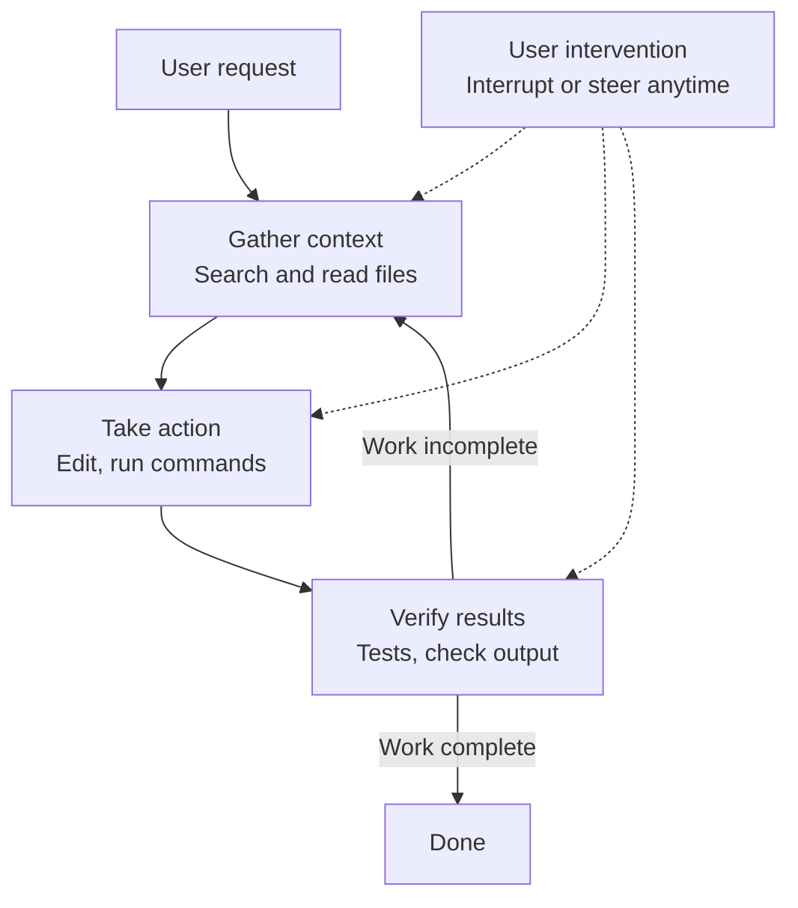

# How It Works

This page explains the workings of the agentic loop, in which Claude Code understands code and completes tasks by executing tools directly.




**One-line summary**: Claude Code is a terminal-native coding agent that pairs a reasoning model with acting tools and repeats "gather context → take action → verify results" on its own — and all three MoAI-ADK pillars stand on this loop.


## What Is Claude Code

Claude Code is an agentic assistant that runs in the **terminal**. It is especially strong at coding, but it helps broadly with anything you can do from the command line — writing documents, running builds, searching files, researching topics.

The key concept is the **agentic harness**. A harness is the system that surrounds a base model and coordinates execution — the layer that decides how the model thinks and plans, which tools it calls, how context is managed, where outputs are stored, and how results are evaluated. Claude Code wraps the Claude model with tools, context management, and an execution environment, turning a language model that only generated text into a capable coding agent that actually works on a codebase. The harness engineering MoAI-ADK talks about — "design an environment where the agent works well instead of writing the code yourself" — is an extension of exactly this concept.

## The Agentic Loop

When given a task, Claude goes through three stages. Rather than being cleanly separated, they blend and flow into one another.

```text
Request → gather context → take action → verify results → repeat
```

| Stage | What it does |
|------|---------|
| **Gather context** | Searches and reads files to understand the code structure |
| **Take action** | Modifies files or runs commands to make changes |
| **Verify results** | Runs tests or checks output to confirm the work is correct |

The loop adapts to the nature of the request. A question about the codebase may end with context gathering alone, a bug fix may cycle through all three stages multiple times, and a refactor may weight verification heavily. Claude decides its next action based on what it learned in the previous step, chaining dozens of actions and correcting its own course along the way.


```mermaid
flowchart TD
    A[User request] --> B[Gather context<br/>Search and read files]
    B --> C[Take action<br/>Edit, run commands]
    C --> D[Verify results<br/>Tests, check output]
    D -->|Work incomplete| B
    D -->|Work complete| E[Done]
    F[User intervention<br/>Interrupt or steer anytime] -.-> B
    F -.-> C
    F -.-> D
```

You are part of this loop too. You can interrupt the work at any time (`Esc`), or send a corrective message without stopping (`Enter`) to change direction. Claude works autonomously while continuing to respond to your input.

## Core Components

The agentic loop runs on two axes: a **reasoning model** and **acting tools**. On top of these come the context that holds the conversation and files, and the permissions that govern actions.

### Model

Claude Code uses Claude models to understand code and reason about tasks. It can read code in any language, figure out how components connect, and split complex tasks into steps.

| Model | Characteristics |
|------|------|
| Sonnet | Handles most coding tasks comfortably |
| Opus | Provides strong reasoning for complex architecture decisions |

Switch models mid-session with the `/model` command, or at startup with `claude --model <name>`.

### Tools

Tools are what let Claude go beyond text responses and actually act. The built-in tools fall into five broad categories.

| Category | What Claude can do |
|------|------------------------|
| **File operations** | Read files, edit code, create new files, rename and restructure |
| **Search** | Find files by pattern, search contents with regex, explore the codebase |
| **Execution** | Run shell commands, start servers, run tests, use git |
| **Web** | Search the web, fetch documentation, look up error messages |
| **Code intelligence** | Check type errors and warnings after edits, go to definition, find references |

Beyond these there are orchestration tools such as spawning subagents and asking the user questions. Each tool use returns new information, and that information feeding into the next decision is exactly the agentic loop.

### Context

The moment you run `claude` in a directory, Claude gains access to:

- **The project**: files in the current directory and subdirectories (and beyond, with permission)
- **The terminal**: everything you can do from the command line — build tools, git, package managers
- **Git state**: the current branch, uncommitted changes, recent commit history
- **`CLAUDE.md`**: a markdown file holding project-specific rules and conventions Claude should know every session
- **Auto memory**: patterns and preferences learned while working, saved automatically (the top of `MEMORY.md` is loaded at session start)
- **Extensions**: configured MCP servers, skills, subagents, and more

When the context window fills up, Claude compacts the context automatically. Compaction first clears out early tool-call results, then summarizes the remaining information. MCP tool definitions are also deferred until explicitly requested, so only the tools you need are loaded when you need them.

### Permissions

The permission model that governs actions is covered in the [Permission Model](#permission-model) section below.

## Where It Runs and How You Interface

The agentic loop, tools, and features are identical wherever you use them. What changes is **where the code executes** and **how you interact**.

### Execution Environments

| Environment | Where code runs | Use case |
|------|----------------|------|
| **Local** | Your computer | Default. Full access to files, tools, environment |
| **Cloud** | Anthropic-managed VM | Delegating work, working on repos not on your machine |
| **Remote control** | Your computer, controlled from a browser | Use a web UI while keeping everything local |

### Interfaces

You can access Claude Code through the terminal, the desktop app, IDE extensions (VS Code, JetBrains), the `claude.ai/code` web app, remote control, Slack, and CI/CD pipelines. The interface only changes how you view and handle things — the agentic loop underneath is the same.

## Sessions and the Context Window

While you work, Claude Code stores the conversation locally as JSONL files under `~/.claude/projects/`. This lets you rewind, resume, or fork sessions.

- **Sessions are independent**: a new session starts with an empty context window and does not carry over prior conversation history. To persist across sessions, use auto memory and `CLAUDE.md`.
- **Resume and fork**: `claude --continue` and `claude --resume` continue under the same session ID, while `--fork-session` or `/branch` copies the history into a new session ID.

The **context window** holds the conversation history, file contents, command output, `CLAUDE.md`, auto memory, loaded skills, and system instructions. As work progresses and context fills up, Claude compacts it automatically — and early instructions can be lost in the process. Keep rules that must always hold in `CLAUDE.md` rather than in conversation history, and check what is taking up space with `/context`.

## Checkpointing and Permissions

Claude has two safety mechanisms: checkpointing, which reverts file changes, and permissions, which define the range of actions it can take without asking.

### Undoing with Checkpointing

**Every file edit is reversible.** Before editing a file, Claude saves a snapshot of its current contents. If something goes wrong, press `Esc` twice to rewind to a previous state, or ask Claude to revert.

Checkpointing is session-scoped, separate from git, and covers file changes only. Actions with remote effects — databases, APIs, deployments — cannot be undone, which is why Claude asks before running commands with external side effects.

### Permission Model

Press `Shift+Tab` to cycle through permission modes.

| Mode | Behavior |
|------|------|
| **Default** | Confirms before every file edit and shell command |
| **Auto-accept edits** | Runs edits and common file commands like `mkdir` and `mv` without asking; confirms other commands |
| **Plan mode** | Uses read-only tools only and writes a plan for approval before executing |
| **Auto mode** | Evaluates all actions with background safety checks (research preview) |

Pre-allowing specific commands in `.claude/settings.json` removes the repeated prompts. This is useful for trusted commands like `npm test` or `git status`, and settings can be scoped from organization-wide policy down to personal preference.

## What Sets It Apart from Other Tools

Claude Code differs from inline code assistants in two ways.

- **Terminal-native**: it directly handles everything you can do from the command line — builds, tests, git, package managers.
- **Whole-codebase awareness at scale**: it sees the entire project, not just the current file. Ask it to "fix the auth bug" and it searches for related files, reads several to build context, makes consistent edits across files, verifies with tests, and commits if you ask.

## Connection to MoAI-ADK — Three Pillars Built on the Loop

The agentic loop you saw on this page is the shared foundation of MoAI-ADK's three pillars.

- **Tokenomics**: every turn of the loop consumes context and tokens. MoAI-ADK assigns the right model and reasoning depth to each work stage, puts context on a diet, and has the system enforce budgets — running the same loop at lower cost.
- **Agentic Loop Engineering**: instead of a human watching every iteration of "gather context → take action → verify results", completion conditions (`/goal`) and diagnostic loops (`/moai loop`) make the loop itself a design target.
- **Agentic Harness**: the elements on this page — the permission model, CLAUDE.md, tool configuration — are the harness's parts. MoAI-ADK layers the SPEC workflow and agent catalog on top of them.

## Related Documents

- [Features at a Glance](/claude-code/foundations/features-overview)
- [What is MoAI-ADK?](/core-concepts/what-is-moai-adk)

## References

- [How Claude Code works](https://code.claude.com/docs/en/how-claude-code-works)
- [Extend Claude Code (Features overview)](https://code.claude.com/docs/en/features-overview)


For complex tasks, instead of diving straight into code, press `Shift+Tab` twice to enter plan mode and have Claude analyze the codebase first. Review and refine the plan before letting it implement — you get more accurate results on the first attempt.

