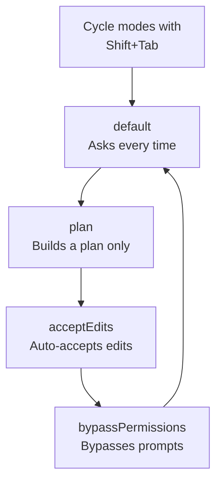

This page covers the input methods, shortcuts, and permission modes of the interactive session (REPL) you encounter when you run Claude Code in the terminal.


**TL;DR**: Interactive mode is the **cockpit** of Claude Code — everything from a one-line prompt to `/` commands, `!` bash execution, `@` file references, and image pasting flows through this single input.


## The Basic Flow of an Interactive Session (REPL)

Running the `claude` command opens an interactive REPL (Read-Eval-Print Loop). Here you send requests in natural language, and Claude reads and edits code, runs commands, and responds. A single request-and-response cycle is called a **turn**, and the conversation context accumulates for as long as the session stays alive.

The basic flow is simple.

```text
1. Run claude → start an interactive session
2. Enter a prompt → submit with Enter
3. Claude responds (tool calls + results)
4. Repeat follow-up requests → context accumulates
5. /clear for a new session, Ctrl+D to quit
```

While the session is running, input history is saved per working directory, and for complex multi-step tasks Claude builds a task list to track progress.

## Five Input Methods

The input field of an interactive session is not just a plain text editor. Its behavior changes depending on the first character.

| Input Method | Trigger | Description |
|-----------|--------|------|
| **Plain prompt** | Just type | A natural-language request. Claude interprets it and gets to work. |
| **Slash command** | Starts with `/` | Invokes built-in commands, skills, and plugin/MCP commands. |
| **bash execution** | Starts with `!` | Runs a shell command directly without going through Claude. |
| **File reference** | Type `@` | Brings up file-path autocompletion to add a specific file to the context. |
| **Image paste** | `Ctrl+V` (paste) | Inserts a clipboard image as an `[Image #N]` chip. |

### Slash Commands (/)

Typing `/` at the very start of the input field brings up a menu of all available commands. Not only built-in commands but also bundled skills, user-authored skills, and commands contributed by plugins and MCP servers gather in this single menu. Continue typing characters after `/` to narrow the candidates in real time. For the full list, see the [Slash Commands](/claude-code/foundations/commands) document.

### bash Execution (!)

Starting with `!` switches to shell mode, where the command runs immediately without Claude's interpretation.

```bash
! npm test
! git status
! ls -la
```

Shell mode adds the command and its output to the conversation context, so you can do quick shell tasks while still letting Claude see the results. Long-running commands can be sent to the background with `Ctrl+B`, and you exit shell mode with `Escape` or `Backspace` on an empty input.

### File Reference (@)

Typing `@` brings up file-path autocompletion. Selecting the file you want pulls that file into Claude's context, letting you send precise requests like "fix this file."

### Image Paste

Pasting a screenshot or design mockup with `Ctrl+V` inserts an `[Image #N]` chip at the cursor position. You can reference the chip by its position within the prompt, so you can mix text and images in your explanation.

| Environment | Image Paste Key |
|------|---------------------|
| Default | `Ctrl+V` |
| iTerm2 (macOS) | `Cmd+V` |
| Windows / WSL | `Alt+V` |

## Keyboard Shortcuts

These are the core shortcuts of the interactive session. Some behaviors may differ depending on the platform and terminal.

| Shortcut | Action |
|--------|------|
| `Esc` | Interrupt Claude's response (stop midway and change direction; work is preserved) |
| `Esc` `Esc` | Clear the draft if there is input; open the rewind menu if empty |
| `Ctrl+C` | Cancel execution or clear input (press twice to quit) |
| `Ctrl+D` | End the session (EOF) |
| `Shift+Tab` | Cycle through permission modes |
| `Ctrl+R` | Reverse-search command history |
| `Ctrl+O` | Toggle the transcript viewer (detailed tool-use view) |
| `Ctrl+T` | Toggle the task list |
| `Ctrl+B` | Move a running task to the background |
| `Ctrl+L` | Redraw the screen (recover broken output) |
| `Up` / `Down` | Move the cursor; navigate history once you reach the end |

### Rewind (Esc Esc)

When the input field is empty, pressing `Esc` twice opens the **rewind menu**. This feature lets you restore code and conversation to an earlier point in time or summarize it; see the [Checkpointing](/claude-code/context-memory/checkpointing) document for details.

### History Search (Ctrl+R)

Use `Ctrl+R` to interactively search previous commands. As you type a search term, matching parts are highlighted, and pressing `Ctrl+R` again moves to an older match. Use `Ctrl+S` to change the search scope (this session / this project / all projects), `Tab` or `Esc` to accept and edit, and `Enter` to run immediately.

### A Note on the Option Key on macOS

Option-key combinations like `Alt+B`, `Alt+F`, and `Alt+P` require the terminal to treat Option as Meta on macOS. In iTerm2, set Option to "Esc+" in the Keys settings; in Apple Terminal, enable "Use Option as Meta Key."

## Permission Modes

Claude Code controls how far file modifications and command execution are automatically allowed through **permission modes**. You can cycle through the modes with `Shift+Tab`.

| Mode | Behavior | Suited For |
|------|------|-------------|
| **default** | Asks the user for approval on each operation | Cautious everyday work |
| **plan** | Builds a plan only, without modifying code | Reviewing the approach before changes |
| **acceptEdits** | Automatically accepts file edits | Trusted, repetitive edits |
| **bypassPermissions** | Bypasses permission prompts | Limited use, such as in isolated sandbox environments |



bypass mode skips permission checks, so it is safest to use it only in trusted, isolated environments. MoAI-ADK also leverages these modes to match its workflow stages; plan mode in particular pairs well with the plan-review gate.

## Multiline Input, vim Mode, and Output Styles

### Multiline Input

How you enter multiple lines in a single prompt varies by terminal.

| Method | Shortcut | Notes |
|------|--------|------|
| Quick line break | `\` + `Enter` | Works in all terminals |
| Shift+Enter | `Shift+Enter` | Supported by default in iTerm2, WezTerm, Ghostty, Kitty, Warp, and others |
| Control sequence | `Ctrl+J` | Works anywhere without configuration |
| Paste mode | Paste directly | Suited for code blocks and logs |

If you need `Shift+Enter` binding in VS Code, Cursor, Windsurf, Zed, and the like, run `/terminal-setup`.

### vim Mode

You can enable vim-style editing under Editor mode in `/config`. You switch between NORMAL and INSERT mode with `Esc` and `i`/`a`, and use familiar vim operations as-is: `h`/`j`/`k`/`l` movement, `dd`/`yy`/`p` editing, and even text objects like `iw`/`a"`. Note that `Ctrl+V` block visual mode is not supported.

### Output Styles and Extras

In `/config` you adjust settings such as the theme, display options, and Session recap. Other commonly used extras include the following.

- **`/btw`**: Quickly ask a question about the current task without polluting the conversation history. The answer is shown only as a transient overlay.
- **Task list**: Expand or collapse the task list Claude builds during multi-step tasks with `Ctrl+T`.
- **Extended thinking toggle**: Turn extended thinking mode on and off with `Option+T` (macOS) or `Alt+T`.

## Related Docs

- [Slash Commands](/claude-code/foundations/commands)
- [Checkpointing](/claude-code/context-memory/checkpointing)
- [Quickstart](/getting-started/quickstart)

## References

- [Claude Code Interactive mode (official docs)](https://code.claude.com/docs/en/interactive-mode)


The safest and fastest flow is to start with plan mode via `Shift+Tab` to check Claude's approach, then switch to acceptEdits once you've built up trust.

