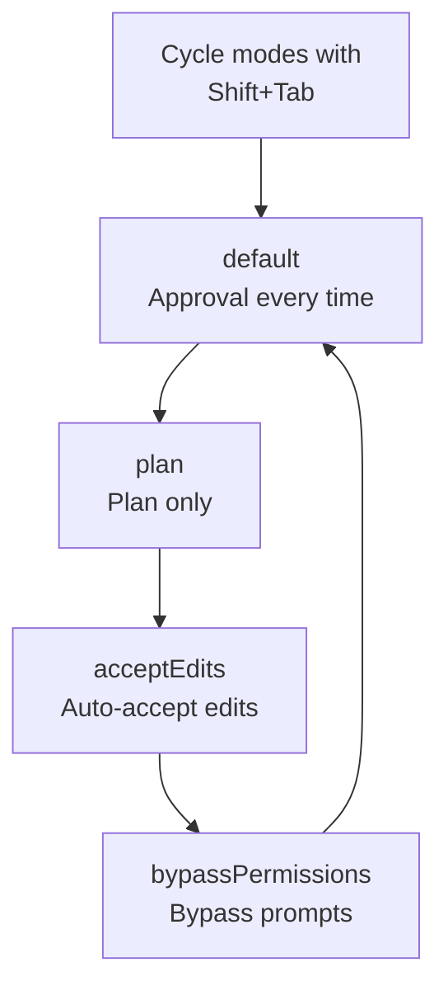

# Interactive Mode

This page covers the input methods, shortcuts, and permission modes of the interactive session (REPL) you meet when running Claude Code in the terminal.


**One-line summary**: Interactive mode is Claude Code's **cockpit** — the place where every input converges, from a one-line prompt to `/` commands, `!` bash execution, `@` file references, and image pasting.


## The Basic Flow of an Interactive Session (REPL)

Running the `claude` command opens an interactive REPL (Read-Eval-Print Loop). Here you send requests in natural language, and Claude responds by reading and modifying code and running commands. One request and response is called a **turn**, and conversational context accumulates while the session is alive.

The basic flow is simple.

```text
1. Run claude → interactive session starts
2. Type a prompt → submit with Enter
3. Claude responds (tool calls + results)
4. Repeat follow-up requests → context accumulates
5. /clear for a new session, Ctrl+D to exit
```

While a session runs, input history is saved per working directory, and for complex multi-step work Claude creates a task list to track progress.

## The Five Input Methods

The input box in an interactive session is not a plain text field. Its behavior changes based on the first character.

| Input method | Trigger | Description |
|-----------|--------|------|
| **Regular prompt** | Just type | A natural-language request. Claude interprets and works on it. |
| **Slash command** | Starts with `/` | Invokes built-in commands, skills, plugin/MCP commands. |
| **Bash execution** | Starts with `!` | Runs a shell command directly, without going through Claude. |
| **File reference** | Type `@` | Opens file-path autocomplete to add a specific file to context. |
| **Image paste** | `Ctrl+V` (paste) | Inserts a clipboard image as an `[Image #N]` chip. |

### Slash Commands (/)

Typing `/` at the very start of the input box brings up a menu of all available commands. Built-in commands, bundled skills, user-written skills, and commands contributed by plugins and MCP servers all gather in one menu. Continue typing after `/` and candidates narrow in real time. See the [Slash Commands](/claude-code/foundations/commands) document for the full list.

### Bash Execution (!)

Starting with `!` switches to shell mode, where the command runs immediately without Claude's interpretation.

```bash
! npm test
! git status
! ls -la
```

Shell mode adds the command and its output to the conversation context, so Claude stays aware of the results even during quick shell work. Long commands can be sent to the background with `Ctrl+B`, and you exit shell mode with `Escape` or `Backspace` on an empty input.

### File References (@)

Typing `@` brings up file-path autocomplete. Selecting a file pulls it into Claude's context, so requests like "fix this file" land precisely.

### Image Pasting

Paste a screenshot or design mock with `Ctrl+V` and an `[Image #N]` chip is inserted at the cursor. Chips can be referenced positionally within the prompt, letting you mix text and images in an explanation.

| Environment | Image paste key |
|------|---------------------|
| Default | `Ctrl+V` |
| iTerm2 (macOS) | `Cmd+V` |
| Windows / WSL | `Alt+V` |

## Keyboard Shortcuts

Key shortcuts for the interactive session. Some behaviors may differ by platform and terminal.

| Shortcut | Action |
|--------|------|
| `Esc` | Interrupt Claude's response (stop mid-way and steer; work is preserved) |
| `Esc` `Esc` | Clear the draft if there is input; open the rewind menu if empty |
| `Ctrl+C` | Interrupt execution or clear input (press twice to exit) |
| `Ctrl+D` | End the session (EOF) |
| `Shift+Tab` or `Alt+M` | Cycle through permission modes |
| `Ctrl+R` | Reverse search command history |
| `Ctrl+B` | Send the running task to the background |
| `Ctrl+T` | Toggle the task list |
| `Ctrl+O` | Toggle the transcript viewer (tool-use detail) |
| `Ctrl+X` `Ctrl+K` | Stop all background subagents |
| `Ctrl+L` | Redraw the screen (recover broken output) |
| `Opt+P` | Switch models |
| `Opt+T` | Toggle extended thinking mode |
| `Opt+O` | Quick mode switch |
| `Up` / `Down` | Move the cursor; browse history when reaching the edge |

### Rewind (Esc Esc)

Pressing `Esc` twice with an empty input box opens the **rewind menu**. It restores code and conversation to an earlier point or summarizes them; details are covered in the [Checkpointing](/claude-code/context-memory/checkpointing) document.

### History Search (Ctrl+R)

`Ctrl+R` searches previous commands interactively. Type a query and matches are highlighted; press `Ctrl+R` again to move to older matches. `Ctrl+S` changes the search scope (this session / this project / all projects), `Tab` or `Esc` accepts for editing, and `Enter` runs immediately.

### A Note on the Option Key on macOS

Option-key combos like `Alt+B`, `Alt+F`, and `Alt+P` require the terminal's Option key to be set as Meta on macOS. In iTerm2, set Option to "Esc+" under Keys; in Apple Terminal, enable "Use Option as Meta Key".

## Permission Modes

Claude Code controls how far file modifications and command execution are allowed automatically via **permission modes**. Cycle through modes with `Shift+Tab`.

| Mode | Behavior | Best for |
|------|------|-------------|
| **default** | Requests user approval for each action | Careful everyday work |
| **plan** | Builds a plan only, without modifying code | Reviewing the approach before changes |
| **acceptEdits** | Auto-accepts file edits | Trusted repetitive edits |
| **bypassPermissions** | Bypasses permission prompts | Limited use, e.g., isolated sandbox environments |


```mermaid
flowchart TD
    A[Cycle modes with<br>Shift+Tab] --> B[default<br>Approval every time]
    B --> C[plan<br>Plan only]
    C --> D[acceptEdits<br>Auto-accept edits]
    D --> E[bypassPermissions<br>Bypass prompts]
    E --> B
```

Bypass mode skips permission checks, so it is only safe in trusted, isolated environments. MoAI-ADK uses these modes to match its workflow stages as well. Plan mode in particular sits on exactly the same philosophy as MoAI-ADK's Implementation Kickoff Approval gate (the plan→run human gate) — "review the plan deeply, start implementation only after approval." Fixing direction with cheap read-only turns before entering the expensive implementation turns is also the most economical choice in token terms.

## Multiline Input, Vim Mode, Output Styles

### Multiline Input

How to enter multiple lines in one prompt varies by terminal.

| Method | Shortcut | Notes |
|------|--------|------|
| Quick newline | `\` + `Enter` | Works in every terminal |
| Shift+Enter | `Shift+Enter` | Supported by default in iTerm2, WezTerm, Ghostty, Kitty, Warp, etc. |
| Control sequence | `Ctrl+J` | Works everywhere without configuration |
| Paste mode | Paste directly | Suited to code blocks and logs |

If you need the `Shift+Enter` binding in VS Code, Cursor, Windsurf, Zed, and similar, run `/terminal-setup`.

### Vim Mode

Enable vim-style editing under Editor mode in `/config`. Move between NORMAL and INSERT modes with `Esc` and `i`/`a`, and use familiar vim behaviors as-is — `h`/`j`/`k`/`l` movement, `dd`/`yy`/`p` editing, and text objects like `iw`/`a"`. Note that `Ctrl+V` block visual mode is not supported.

### Output Styles and Extras

Adjust the theme, display options, and settings like Session recap in `/config`. Other frequently used extras include:

- **`/btw`**: quickly ask about the current work without polluting the conversation history. The answer appears only as a transient overlay.
- **`/recap`**: generates a session recap. It activates automatically for sessions longer than 3 minutes or beyond 3 turns.
- **Task list**: expand or collapse the task list Claude built for multi-step work with `Ctrl+T`. The task list survives context compaction.
- **Extended thinking toggle**: turn extended thinking mode on and off with `Option+T` (macOS) or `Alt+T`.

## Related Documents

- [Slash Commands](/claude-code/foundations/commands)
- [Checkpointing](/claude-code/context-memory/checkpointing)
- [Quickstart](/getting-started/quickstart)

## References

- [Claude Code Interactive mode (official docs)](https://code.claude.com/docs/en/interactive-mode)


The safest and fastest flow is to start in plan mode with `Shift+Tab`, confirm Claude's approach first, then switch to acceptEdits once trust is established.

