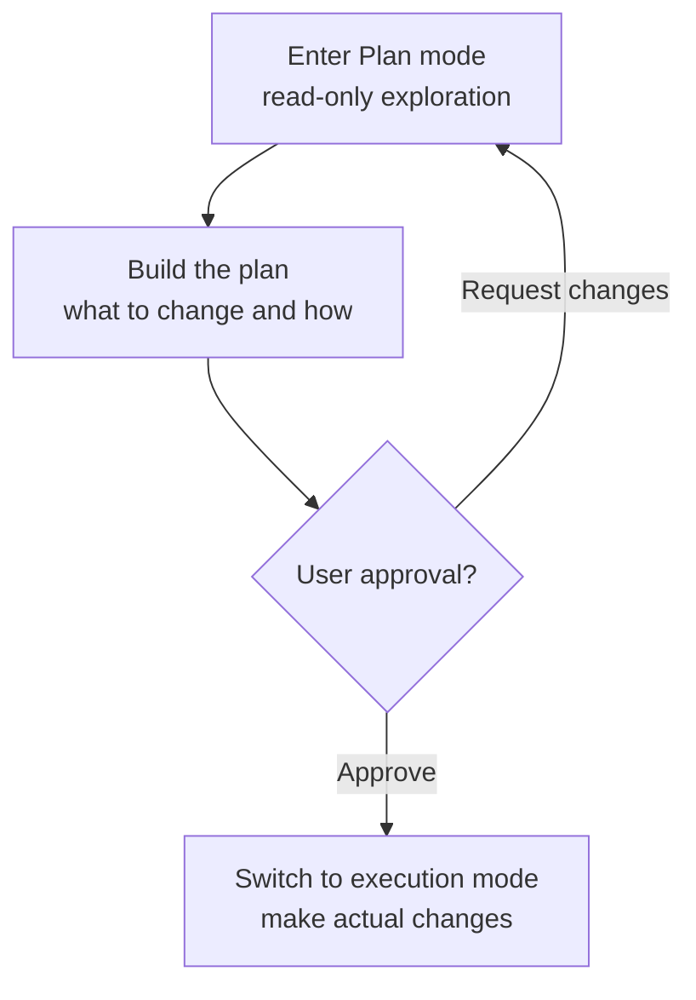

# Permissions and Plan Mode

Every time Claude Code calls a tool, a gatekeeper asks whether to allow it. This page summarizes that permission system and Plan mode, which approves a plan before execution.


**One-line summary**: The permission system is the **gatekeeper** at a building entrance. It checks who (which tool) is trying to do what, and decides to pass, ask, or block. Plan mode is the procedure of **approving the estimate first** before construction starts — it only reads, builds a plan, and enters actual changes only after receiving the user's approval.


## The Permission System

Whenever Claude tries to use a tool with side effects — modifying a file, running a command, and so on — the permission system intercepts the call and decides how to handle it. The decision is expressed through three rule types.

| Rule | Behavior |
|------|------|
| allow | Allow without asking |
| ask | Prompt the user for confirmation |
| deny | Always block |

These rules are declared per tool and per pattern in the `permissions` block of `settings.json`.

```json
{
  "permissions": {
    "allow": ["Read", "Grep", "Bash(go test:*)"],
    "ask": ["Bash"],
    "deny": ["Read(./.env)"]
  }
}
```

Pre-registering frequently repeated, safe read-only commands in `allow` can greatly reduce prompt frequency.  Conversely, block sensitive files or dangerous commands firmly with `deny`.

## Permission Modes

The default posture for the whole session is set by the permission mode. There are four modes, and in an interactive session you can cycle through them with `Shift+Tab`.

| Mode | Behavior |
|------|------|
| `default` | Confirm each tool with side effects (the safest default) |
| `acceptEdits` | Auto-accept file edits; still confirm other dangerous actions |
| `plan` | Read-only. Explore and plan only, with no changes |
| `bypassPermissions` | Skip all confirmations |


`bypassPermissions` skips all confirmations, so use it only in a trusted, isolated environment. It can let unvetted code or prompts run dangerous commands without confirmation.


Subagents can also declare their own default permission posture via the `permissionMode` field (see [Subagents](/claude-code/agentic/sub-agents) for the exact values).

## Plan Mode

Plan mode is the workflow produced by the `plan` permission mode in the table above. Claude first explores the codebase **read-only** to build a plan of what to change and how, and presents that plan to the user. Only after the user approves does it enter actual changes.



It is like approving the construction estimate first and then starting the build. The bigger the change, the more this step of eyeballing the plan before touching code reduces mistakes.

## MoAI-ADK's Implementation Kickoff Approval

MoAI-ADK inscribes this "approve the plan first" culture into the workflow as an explicit gate. Even after the Plan-phase artifacts have passed audit, just before entering the Run phase (actual implementation) the orchestrator must stop the autonomous flow and obtain **Implementation Kickoff Approval** from the user.

This gate implements Claude Code's Plan-mode approval culture at the SPEC-lifecycle level — a procedure that separately confirms the user's intent to proceed, independent of the plan-audit score. That is, if Plan mode provides the "approve the plan before changing code" principle at the session level, MoAI-ADK extends the same principle into a mandatory human gate at the plan→run boundary.

## Related Documents

- [Interactive Mode](/claude-code/foundations/interactive-mode)
- [Tools Reference](/claude-code/foundations/tools-reference)
- [The .claude Directory](/claude-code/foundations/claude-directory)

## References

- [Claude Code Docs — Permissions](https://code.claude.com/docs/en/permissions)
- [Claude Code Docs — Permission modes](https://code.claude.com/docs/en/permission-modes)


When delegating a big change, first enter Plan mode with `Shift+Tab` and get a plan. Reading the plan and approving it only when the direction is right lets you avoid the costly rollback of discovering problems only after touching the code.

