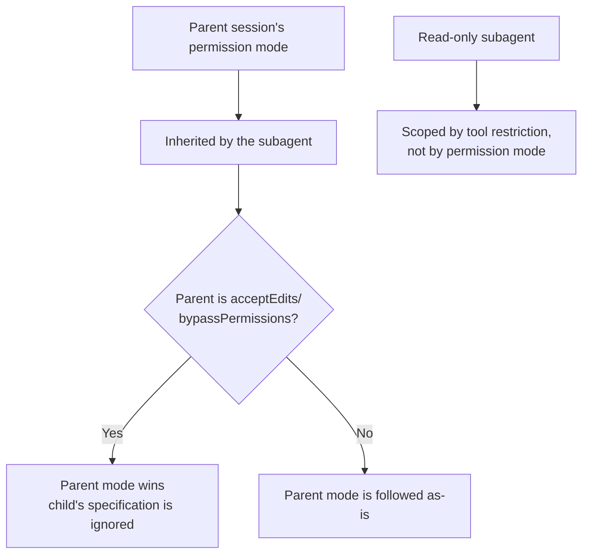
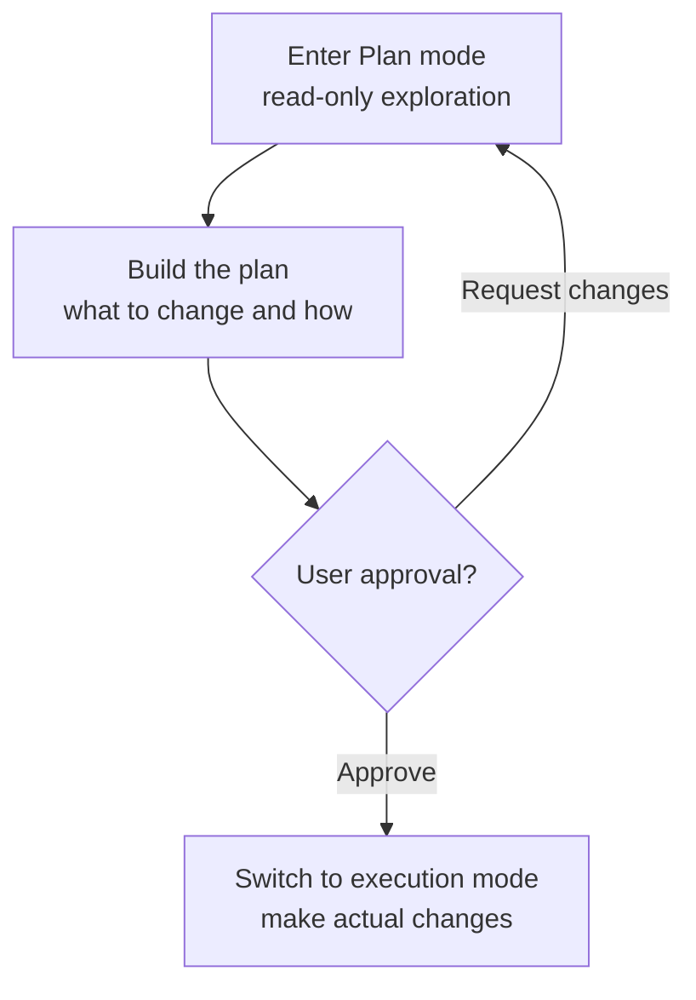

# Permissions and Plan Mode

To put it as if explaining to a friend: every time Claude Code modifies a file or runs a command, it sets up a gatekeeper that asks once more, "is it okay to go ahead with this?" The rules that gatekeeper follows — what to allow automatically and what to block — are the **permission system**, and the procedure of getting the plan approved before touching code is **Plan mode**.


**One-line summary**: The permission system is the **gatekeeper** at a building entrance. It checks who (which tool) is trying to do what, and decides to pass, ask, or block. Plan mode is the procedure of **approving the estimate first** before construction starts — it only reads, builds a plan, and enters actual changes only after receiving the user's approval.


## The Permission System: Three Rules

Whenever Claude tries to use a tool with side effects — modifying a file, running a command, and so on — the permission system intercepts the call and decides how to handle it. The decision is expressed through three rule types.

| Rule | Behavior |
|------|------|
| `allow` | Allow without asking |
| `ask` | Prompt the user for confirmation |
| `deny` | Always block |

These rules are declared per tool and per pattern in the `permissions` block of `settings.json`.

```json
{
  "permissions": {
    "allow": ["Read", "Grep", "Bash(go test:*)"],
    "ask": ["Bash"],
    "deny": ["Read(./.env)"]
  }
}
```

Pre-registering frequently repeated, safe read-only commands in `allow` can greatly reduce prompt frequency.  Conversely, block sensitive files or dangerous commands firmly with `deny`. Evaluation starts with `deny`, then `ask`, then `allow`, and the first rule to match wins — so `deny` is your safety net.

## Permission Modes

The default posture for the whole session is set by the permission mode. There are four modes, and in an interactive session you can cycle through them with `Shift+Tab`.

| Mode | Behavior |
|------|------|
| `default` | Confirm each tool with side effects (the safest default) |
| `acceptEdits` | Auto-accept file edits; still confirm other dangerous actions |
| `plan` | Read-only. Explore and plan only, with no changes |
| `bypassPermissions` | Skip all confirmations |


`bypassPermissions` skips all confirmations, so use it only in a trusted, isolated environment. It can let unvetted code or prompts run dangerous commands without confirmation.


## Subagents and Permission-Mode Inheritance

When one agent calls another, the called one is a **subagent**. A subagent does not build its own independent permission mode — it **inherits** the parent session's permission mode. In particular, when the parent is in `acceptEdits` or `bypassPermissions` mode, that mode takes **priority** over the child, so even if the child tries to specify a different mode, it is ignored.



This rule settled in Claude Code 2.1.213 and later. Previously, you could specify a permission mode via the `mode` parameter when calling an agent, but that **spawn-time `mode` parameter** is now **deprecated and ignored**.


**Make read-only subagents with tools, not with permission modes.** If the parent is in `acceptEdits`, specifying `plan` on the subagent does nothing — the parent mode wins and writes are allowed. To truly lock a subagent to read-only, remove write tools like `Write`/`Edit`/`NotebookEdit` from its `tools` list, or use the inherently read-only `Explore` agent.


### Background Execution and Permission Prompts

Since Claude Code 2.1.198, subagents run in the **background by default**. When a subagent does something that needs a permission check, the prompt appears on the **main session**, and from 2.1.186 it even carries **the name of which subagent is asking**. `Esc` denies just that one request, so you stay in control of every moment something tries to change things in the background.

### Nesting Depth

Since 2.1.219, **nesting** — a subagent calling another subagent — is allowed by default. The default depth is 3 levels, and the environment variable `CLAUDE_CODE_MAX_SUBAGENT_SPAWN_DEPTH=1` turns nesting off. Thanks to this depth limit, permission-mode inheritance chains not just one parent→child level but across several levels — the outermost session's mode propagates all the way inward.

Note that even if the subagent's definition file declares a default via the `permissionMode` field, the inheritance and priority rules above win at runtime. For field-level detail, see the [Subagents](/en/claude-code/agentic/sub-agents) document.

## Plan Mode

Plan mode is the workflow produced by the `plan` permission mode in the table above. Claude first explores the codebase **read-only** to build a plan of what to change and how, and presents that plan to the user. Only after the user approves does it enter actual changes.



It is like approving the construction estimate first and then starting the build. The bigger the change, the more this step of eyeballing the plan before touching code reduces mistakes.

## MoAI-ADK's Implementation Kickoff Approval

MoAI-ADK inscribes this "approve the plan first" culture into the workflow as an explicit gate. Even after the Plan-phase artifacts have passed audit, just before entering the Run phase (actual implementation) the orchestrator must stop the autonomous flow and obtain **Implementation Kickoff Approval** from the user.

This gate is Claude Code's Plan-mode approval culture moved up to the SPEC-lifecycle level. No matter how high the plan-audit score, whether to proceed is asked of the user separately. If Plan mode enforced "approve the plan before changing code" at the session level, MoAI-ADK widens the same principle into a mandatory human gate at the plan→run boundary.

## Related Documents

- [Interactive Mode](/en/claude-code/foundations/interactive-mode)
- [Tools Reference](/en/claude-code/foundations/tools-reference)
- [The .claude Directory](/en/claude-code/foundations/claude-directory)

## References

- [Claude Code Docs — Permissions](https://code.claude.com/docs/en/permissions)
- [Claude Code Docs — Permission modes](https://code.claude.com/docs/en/permission-modes)


When delegating a big change, first enter Plan mode with `Shift+Tab` and get a plan. Reading the plan and approving it only when the direction is right lets you avoid the costly rollback of discovering problems only after touching the code.

