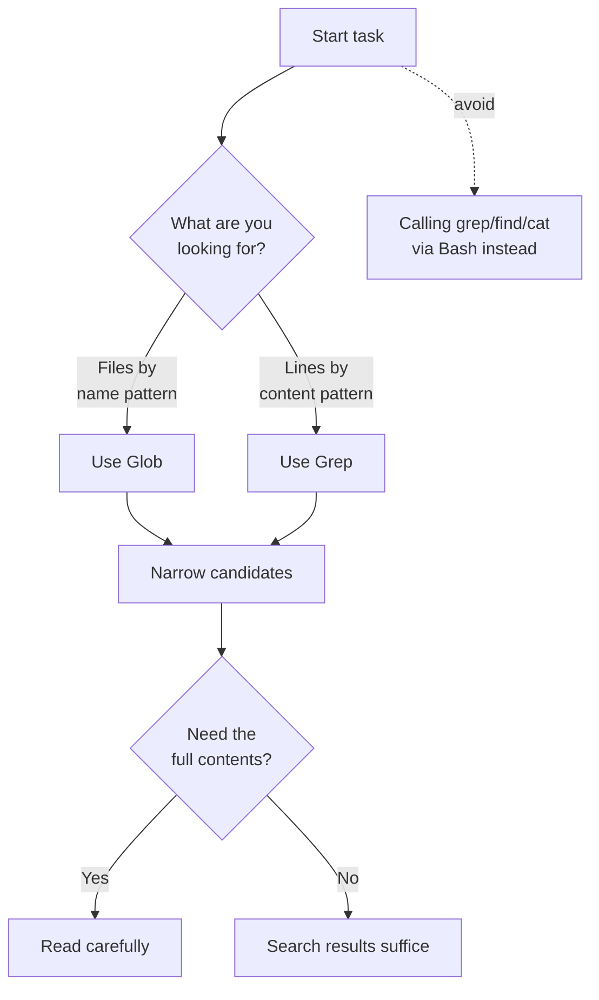

# Tools Reference

A reference for the built-in tools Claude Code uses to understand and modify a codebase, and how permissions connect to each tool.


**TL;DR**: Tool names are the identifiers used verbatim in permission rules, subagent tool lists, and hook matchers. Once you know each tool's read/write nature and permission behavior, you can directly design Claude Code's safety boundaries.


## How Built-in Tools Relate to Permissions

Claude Code ships with a set of **built-in tools** for reading and modifying code. The key insight is that a tool's name is itself the identifier. Exact strings like `Read`, `Bash`, and `Edit` are used identically in these three places:

- Permission rules (`permissions.allow` / `permissions.deny` in `settings.json`)
- The `tools` / `disallowedTools` entries in a subagent definition
- Hook matchers

Tools fall broadly into those that **require no permission** and those that **require permission**. As a rule, read-only tools operate without permission, while tools that create or modify files or run commands go through a permission check. To disable a tool entirely, add its name to the `deny` array.

## Key Built-in Tools Table

The following are the tools used most often in day-to-day coding work, listed with their read/write distinction and whether they require permission.

| Tool | Purpose | Nature | Permission required |
| :--- | :--- | :--- | :--- |
| `Read` | Read file contents with line numbers (including images, PDFs, notebooks) | Read | - |
| `Write` | Create a new file or overwrite the whole file | Write | Yes |
| `Edit` | Exact string replacement in an existing file | Write | Yes |
| `Bash` | Execute shell commands | Execute | Yes |
| `Glob` | Find files by name pattern | Read | - |
| `Grep` | Search file contents by pattern (ripgrep-based) | Read | - |
| `WebFetch` | Fetch a URL, convert to Markdown, and extract | Read (external) | Yes |
| `WebSearch` | Perform a web search and return titles and URLs | Read (external) | Yes |
| `Agent` | Spawn a subagent with a separate context window | Delegate | - |
| `TaskCreate` / `TaskUpdate` / `TaskList` / `TaskGet` | Manage the session task list | Manage | - |
| `LSP` | Language-server-based code intelligence (go to definition, find references, report type errors) | Read | - |
| `Skill` | Run a skill within the main conversation | Execute | Yes |

Since v2.1.142, task-list functionality is managed through the `TaskCreate`, `TaskUpdate`, `TaskList`, and `TaskGet` tools. To enable task-list editing features, set the environment variable `CLAUDE_CODE_ENABLE_TASKS=1`.

### Small Differences Among Read Tools

Even among read tools, there are subtle behavioral differences.

- `Glob` does not ignore `.gitignore` by default, so it finds untracked files too. Results are sorted by modification time and truncated at 100 entries.
- `Grep`, conversely, respects `.gitignore` and skips ignored files. It has three output modes: `files_with_matches` (default), `content`, and `count`.
- `Read` is always instructed to take absolute paths, and for large files exceeding the token limit it reads in pages via `offset` and `limit`.

## Permission Configuration: allow / deny / ask

Tool permissions are handled with the same rule format across the `permissions` entry in `settings.json`, the `/permissions` interface, and the CLI flags (`--allowedTools`, `--disallowedTools`). The rule format is `ToolName(specifier)`.

```json
{
  "permissions": {
    "allow": [
      "Read(~/project/**)",
      "Bash(npm run *)",
      "WebFetch(domain:docs.example.com)"
    ],
    "deny": [
      "Read(~/.ssh/**)",
      "Bash(rm -rf *)"
    ]
  }
}
```

The specifier varies by tool category, and several tools share a format.

| Rule format | Applicable tools | Description |
| :--- | :--- | :--- |
| `Bash(npm run *)` | Bash, Monitor | Command pattern matching |
| `Read(~/secrets/**)` | Read, Grep, Glob, LSP | Path pattern matching |
| `Edit(/src/**)` | Edit, Write, NotebookEdit | Path pattern matching |
| `WebFetch(domain:example.com)` | WebFetch | Domain matching |
| `WebSearch` | WebSearch | No specifier; allow/deny the tool as a whole |
| `Agent(Explore)` | Agent | Subagent type matching |

Two useful behaviors are worth remembering about rules.

- An `Edit(...)` allow rule also grants read permission for the same path, so you do not need a separate paired `Read(...)` rule.
- `WebFetch` asks once the first time it accesses a new domain in default and `acceptEdits` modes. Set up a `WebFetch(domain:...)` rule in advance and it is allowed without asking.

The `ask` behavior is not a separate key; it surfaces as the default flow of asking the user whenever a case matches neither an allow nor a deny rule. In other words, if a tool call is neither `allow` nor `deny`, it requests confirmation from the user.

## Tool-Selection Best Practices

Claude generally picks the right tool on its own, but there are more accurate and efficient paths to the same goal. The following flow is the recommended priority for search tasks.



The core principles are as follows.

- For **finding files by name** use `Glob`, and for **finding lines by content** use `Grep`. The two tools have dedicated indexing and a safe output format.
- **Avoid using `Bash` as a substitute for `grep`, `find`, or `cat`.** Bash goes through a permission check, presses on context the longer the output grows, and loses the structure that dedicated tools provide — sorting, truncation, line numbers.
- When fixing a file, prefer `Edit`, which sends only the changed portion, over `Write`, which overwrites the whole file. `Edit` prevents unintended overwrites with its read-before-modify rule.
- For broad-scope exploration such as understanding codebase structure, delegate to a subagent via `Agent` to preserve the main context.

## Built-in Tools vs MCP Tools

The two kinds of tools differ in origin and registration method.

| Aspect | Built-in tools | MCP tools |
| :--- | :--- | :--- |
| Origin | Provided by Claude Code | Added by connecting an external MCP server |
| Name format | Fixed names like `Read`, `Bash` | Tool names exposed by the server |
| How to add | No separate install needed | Connect an MCP server |
| How to check | Ask "what tools can I use?" | Confirm the exact name with the `/mcp` command |

When you need a new tool, connect an MCP server. Conversely, when you need a reusable prompt-based workflow, write a skill — a skill does not add a new tool entry; it runs through the existing `Skill` tool.

The set of tools actually loaded in a session varies by the provider, platform, and configuration in use. If you are curious which tools the current session has, ask Claude directly, and confirm the exact names of MCP tools with `/mcp`.

## Related Docs

- [Hooks](/claude-code/extensibility/hooks)
- [The .claude Directory](/claude-code/foundations/claude-directory)

## References

- [Claude Code Tools reference](https://code.claude.com/docs/en/tools-reference)


If search permission prompts are frequent, register your commonly used read-only commands up front in `permissions.allow` in `settings.json` to keep your flow uninterrupted. That said, always put destructive patterns like `Bash(rm -rf *)` in `deny` to make the safety boundary explicit.

