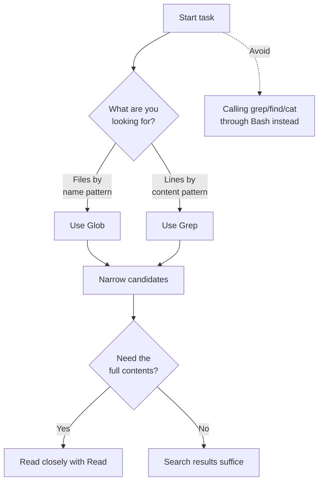

# Tools Reference

This page covers the built-in tools Claude Code uses to understand and modify a codebase, and how permissions attach to each tool.



**One-line summary**: Tool names are identifiers used verbatim in permission rules, subagent tool lists, and hook matchers — so knowing each tool's read/write nature and permission behavior lets you design Claude Code's safety boundaries yourself.


## The Relationship Between Built-in Tools and Permissions

Claude Code ships with a set of **built-in tools** for reading and modifying code. The key point here is that the tool name itself is an identifier. Exact strings like `Read`, `Bash`, and `Edit` are used identically in three places:

- Permission rules (`permissions.allow` / `permissions.deny` in `settings.json`)
- The `tools` / `disallowedTools` entries in subagent definitions
- Hook matchers

Tools broadly divide into **those that need no permission** and **those that do**. In general, read-only tools work without permission, while tools that create or modify files or execute commands go through a permission check. To disable a tool entirely, add its name to the `deny` array.

## Major Built-in Tools

The following are the tools used most often in everyday coding work, with their read/write nature and permission requirements.

| Tool | Purpose | Nature | Permission needed |
| :--- | :--- | :--- | :--- |
| `Read` | Read file contents with line numbers (including images, PDFs, notebooks) | Read | - |
| `Write` | Create a new file or overwrite entirely | Write | Required |
| `Edit` | Exact string replacement in an existing file | Write | Required |
| `Bash` | Execute shell commands | Execute | Required |
| `Glob` | Find files by name pattern | Read | - |
| `Grep` | Search file contents by pattern (ripgrep-based) | Read | - |
| `WebFetch` | Fetch a URL, convert to Markdown, and extract | Read (external) | Required |
| `WebSearch` | Web search returning titles and URLs | Read (external) | Required |
| `Agent` | Spawn a subagent with a separate context window | Delegation | - |
| `TaskCreate` / `TaskUpdate` / `TaskList` / `TaskGet` | Manage the session task list | Management | - |
| `LSP` | Language-server-based code intelligence (go to definition, find references, type-error reporting) | Read | - |
| `Skill` | Run a skill inside the main conversation | Execute | Required |

`TodoWrite` has been disabled by default since v2.1.142, replaced by the `TaskCreate`/`TaskUpdate`/`TaskList`/`TaskGet` family.

### Subtle Differences Among Read Tools

Even among read tools, behavior differs subtly.

- `Glob` does not respect `.gitignore` by default, so it also finds untracked files. Results are sorted by modification time and truncated at 100.
- `Grep`, conversely, respects `.gitignore` and skips ignored files. Its output modes are `files_with_matches` (default), `content`, and `count`.
- `Read` is always directed to take absolute paths, and large files exceeding the token limit are read in pages with `offset` and `limit`.

## Permission Configuration: allow / deny / ask

Tool permissions use the same rule format across the `permissions` entry in `settings.json`, the `/permissions` interface, and CLI flags (`--allowedTools`, `--disallowedTools`). The rule format is `ToolName(specifier)`.

```json
{
  "permissions": {
    "allow": [
      "Read(~/project/**)",
      "Bash(npm run *)",
      "WebFetch(domain:docs.example.com)"
    ],
    "deny": [
      "Read(~/.ssh/**)",
      "Bash(rm -rf *)"
    ]
  }
}
```

The specifier varies by tool kind, and several tools share a format.

| Rule format | Applies to | Description |
| :--- | :--- | :--- |
| `Bash(npm run *)` | Bash, Monitor | Command pattern matching |
| `Read(~/secrets/**)` | Read, Grep, Glob, LSP | Path pattern matching |
| `Edit(/src/**)` | Edit, Write, NotebookEdit | Path pattern matching |
| `WebFetch(domain:example.com)` | WebFetch | Domain matching |
| `WebSearch` | WebSearch | No specifier; allow/deny the whole tool |
| `Agent(Explore)` | Agent | Subagent type matching |

Two useful behaviors are worth remembering.

- An `Edit(...)` allow rule also grants read permission for the same path, so a paired `Read(...)` rule is unnecessary.
- `WebFetch` asks once on first access to a new domain in default and `acceptEdits` modes. A pre-set `WebFetch(domain:...)` rule allows it without asking.

The `ask` behavior is not a separate key — it appears as the default flow of asking the user whenever a call matches neither an allow nor a deny rule. In other words, if it is neither `allow` nor `deny`, the tool call requests user confirmation.

## Tool-Selection Best Practices

Claude generally picks the right tool on its own, but more precise and efficient paths to the same goal exist. The flow below is the recommended priority for search work.


```mermaid
flowchart TD
    A[Start task] --> B{What are you<br>looking for?}
    B -->|Files by<br>name pattern| C[Use Glob]
    B -->|Lines by<br>content pattern| D[Use Grep]
    C --> E[Narrow candidates]
    D --> E
    E --> F{Need the<br>full contents?}
    F -->|Yes| G[Read closely with Read]
    F -->|No| H[Search results suffice]
    A -.Avoid.-> I[Calling grep/find/cat<br>through Bash instead]
```

The core principles:

- Use `Glob` to **find files by name** and `Grep` to **find lines by content**. Both tools have dedicated indexing and safe output formats.
- **Avoid substituting `Bash` calls to `grep`, `find`, and `cat`.** Bash goes through permission checks, longer output pressures context, and you lose the structure the dedicated tools provide — sorting, truncation, line numbers.
- When modifying files, prefer `Edit`, which sends only the change, over `Write`, which overwrites the whole file. `Edit`'s read-before-modify rule prevents unintended overwrites.
- Delegate broad exploration, like mapping the codebase structure, to a subagent via `Agent` to preserve the main context.

## Built-in Tools vs MCP Tools

The two kinds of tools differ in origin and registration.

| Aspect | Built-in tools | MCP tools |
| :--- | :--- | :--- |
| Origin | Provided by Claude Code out of the box | Added by connecting external MCP servers |
| Name format | Fixed names like `Read`, `Bash` | Tool names the server exposes |
| How to add | No installation needed | Connect an MCP server |
| How to check | Ask "what tools can you use?" | Check exact names with the `/mcp` command |

When you need a new tool, connect an MCP server. Conversely, when you need a reusable prompt-based workflow, write a skill — skills run through the existing `Skill` tool rather than adding new tool entries.

The set of tools actually loaded in a session depends on the provider, platform, and configuration in use. If you are unsure about the current session's tools, ask Claude directly, and check exact MCP tool names with `/mcp`.

## MoAI-ADK and Tool Boundaries

The fact that a tool name is the identifier in permission rules, subagent tool lists, and hook matchers is the starting point of harness design. MoAI-ADK draws its safety boundaries with this mechanism — read-only exploration agents get only `Read`/`Grep`/`Glob`, write-capable implementation agents never run two at once, and destructive Bash patterns are blocked with deny rules. The "dedicated tools first" principle (`Grep` over Bash `grep`, `Read` over `cat`) is not only about safety but also about tokens: the structured output of dedicated tools (sorting, truncation, line numbers) occupies far less context than the raw output of shell commands.

## Related Documents

- [Hooks](/claude-code/extensibility/hooks)
- [.claude Directory](/claude-code/foundations/claude-directory)

## References

- [Claude Code Tools reference](https://code.claude.com/docs/en/tools-reference)


If search permission prompts are frequent, register your commonly used read-only commands in `settings.json`'s `permissions.allow` first so the flow never breaks. But always put destructive patterns like `Bash(rm -rf *)` in `deny` to make the safety boundary explicit.

