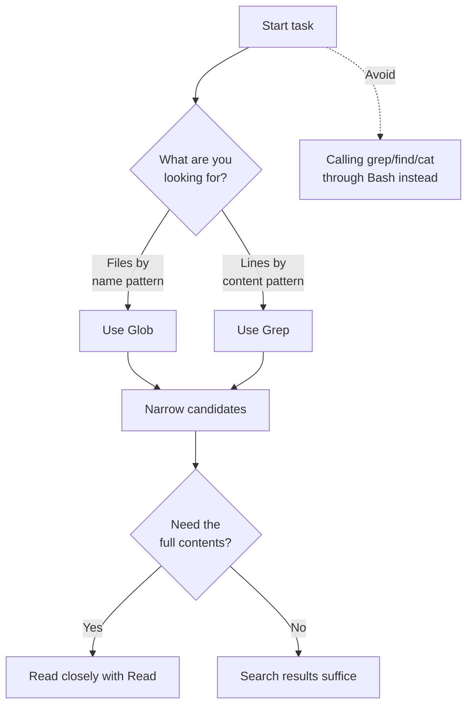
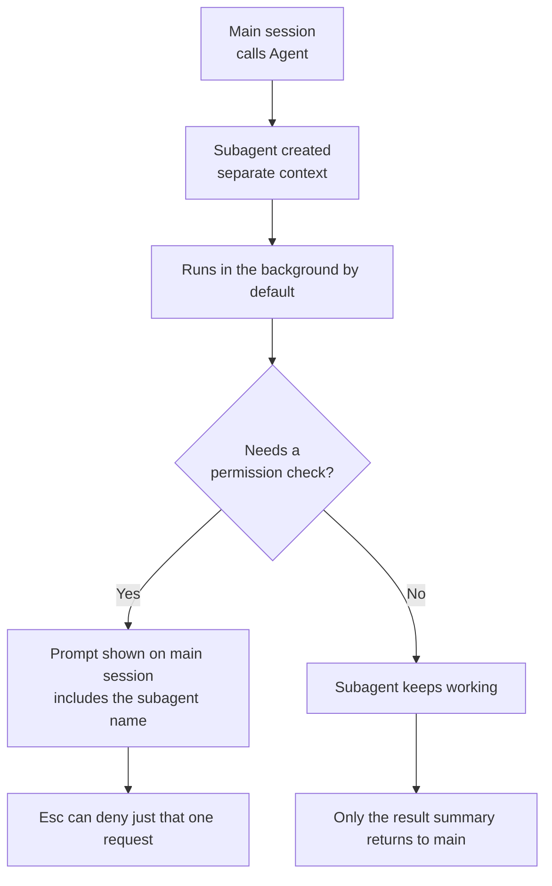

# Tools Reference

To put it as if explaining to a friend: Claude Code is not a chatbot that only talks. It is a worker that actually reads files, modifies them, and runs commands. The tools this worker uses like its hands and eyes are the **built-in tools** covered on this page, and once you know what permissions attach to each tool, you can design yourself where Claude reaches and where it stops.


This page is background material on **Claude Code itself**, the platform MoAI-ADK runs on. MoAI-ADK's own features are covered in the sections above it in the sidebar.



**One-line summary**: Tool names are identifiers used verbatim in permission rules, subagent tool lists, and hook matchers — so knowing each tool's read/write nature and permission behavior lets you design Claude Code's safety boundaries yourself.


## Why Tools Matter

What an agent does in one turn is, in the end, a sequence of "calling a few tools, then composing an answer from their results." We call this flow the **agentic loop**, and Claude Code lays down a bundle of built-in tools by default to run this loop — each dedicated to file reading, file writing, command execution, web lookup, delegation, and so on.

The key point here is that the tool name itself is an **identifier**. Exact strings like `Read`, `Bash`, and `Edit` are used identically in three places:

- Permission rules — `permissions.allow` / `permissions.deny` in `settings.json`
- The `tools` / `disallowedTools` entries in subagent definitions
- Hook matchers

In other words, the "allow this tool / block this tool" setting is what decides "what Claude can and cannot do." Tool lists and permission rules are therefore not separate settings but a single blueprint expressed in the same language. The full structure of the permission system and the behavior of permission modes is covered in depth in the [Permissions and Plan Mode](/en/claude-code/foundations/permissions) document.

Tools broadly divide into **those that need no permission** and **those that do**. In general, read-only tools work without permission, while tools that create or modify files or execute commands go through a permission check. To disable a tool entirely, add its name to the `deny` array.

## Major Built-in Tools

The following are the tools used most often in everyday coding work, with their read/write nature and permission requirements.

| Tool | Purpose | Nature | Permission needed |
| :--- | :--- | :--- | :--- |
| `Read` | Read file contents with line numbers (including images, PDFs, notebooks) | Read | - |
| `Write` | Create a new file or overwrite entirely | Write | Required |
| `Edit` | Exact string replacement in an existing file | Write | Required |
| `Bash` | Execute shell commands | Execute | Required |
| `Glob` | Find files by name pattern | Read | - |
| `Grep` | Search file contents by pattern (ripgrep-based) | Read | - |
| `WebFetch` | Fetch a URL, convert to Markdown, and extract | Read (external) | Required |
| `WebSearch` | Web search returning titles and URLs | Read (external) | Required |
| `Agent` | Spawn a subagent with a separate context window | Delegation | - |
| `TaskCreate` / `TaskUpdate` / `TaskList` / `TaskGet` | Manage the session task list | Management | - |
| `LSP` | Language-server-based code intelligence (go to definition, find references, type-error reporting) | Read | - |
| `Skill` | Run a skill inside the main conversation | Execute | Required |

The old `TodoWrite` has been disabled by default since v2.1.142, and the `TaskCreate` / `TaskUpdate` / `TaskList` / `TaskGet` family of tools takes its place. The task list is created and updated by these tools directly inside the main conversation.

### Subtle Differences Among Read Tools

Even among read tools, behavior differs subtly depending on where they look. This difference is the starting point of "why use dedicated tools."

- `Glob` **ignores** `.gitignore`. So it finds untracked and ignored files together. Results are sorted by modification time and truncated at 100 by default.
- `Grep`, conversely, **respects** `.gitignore` and skips ignored files. Its output modes are `files_with_matches` (default), `content`, and `count`.
- `Read` takes absolute paths, and large files exceeding the token limit are read in pages with `offset` and `limit`. Images, PDFs, and Jupyter notebooks are also read with the same tool.

In short, `Glob` "scans wide by file name," `Grep` "digs deep by file content," and `Read` "reads chosen files closely" — that is how the roles split.

## Permission Rule Format

Tool permissions use the **same rule format** in `settings.json`'s `permissions` entry, the `/permissions` interface, and CLI flags (`--allowedTools`, `--disallowedTools`). The format is unified as `ToolName(specifier)`.

```json
{
  "permissions": {
    "allow": [
      "Read(~/project/**)",
      "Bash(npm run *)",
      "WebFetch(domain:docs.example.com)"
    ],
    "deny": [
      "Read(~/.ssh/**)",
      "Bash(rm -rf *)"
    ]
  }
}
```

The specifier varies by tool kind, and several tools share a format.

| Rule format | Applies to | Description |
| :--- | :--- | :--- |
| `Bash(npm run *)` | Bash, Monitor | Command pattern matching |
| `Read(~/secrets/**)` | Read, Grep, Glob, LSP | Path pattern matching |
| `Edit(/src/**)` | Edit, Write, NotebookEdit | Path pattern matching |
| `WebFetch(domain:example.com)` | WebFetch | Domain matching |
| `WebSearch` | WebSearch | No specifier; allow/deny the whole tool |
| `Agent(Explore)` | Agent | Subagent type matching |

Two useful behaviors are worth remembering.

- An `Edit(...)` allow rule also grants read permission for the same path, so a paired `Read(...)` rule is unnecessary.
- `WebFetch` asks once on first access to a new domain in default and `acceptEdits` modes. A pre-set `WebFetch(domain:...)` rule allows it without asking.

`ask` is not a separate key — it is the **default flow** where a call that matches neither an allow nor a deny rule requests user confirmation. In other words, if it is neither `allow` nor `deny`, the tool call is treated as "ask the user." Rule evaluation order and the full structure of permission modes continue in the [Permissions and Plan Mode](/en/claude-code/foundations/permissions) document.

## Tool-Selection Best Practices

Claude generally picks the right tool on its own. But more precise, token-saving paths to the same goal exist. The flow below is the recommended priority for search work.


```mermaid
flowchart TD
    A[Start task] --> B{What are you<br>looking for?}
    B -->|Files by<br>name pattern| C[Use Glob]
    B -->|Lines by<br>content pattern| D[Use Grep]
    C --> E[Narrow candidates]
    D --> E
    E --> F{Need the<br>full contents?}
    F -->|Yes| G[Read closely with Read]
    F -->|No| H[Search results suffice]
    A -.Avoid.-> I[Calling grep/find/cat<br>through Bash instead]
```

The core principles, one line each:

- Use `Glob` to **find files by name** and `Grep` to **find lines by content**.  Both tools have dedicated indexing and safe output formats.
- **Do not substitute `Bash` calls for `grep`, `find`, and `cat`.**  Bash goes through permission checks, longer output pressures context, and you lose the structure the dedicated tools provide — sorting, truncation, line numbers.
- When modifying files, prefer `Edit`, which sends only the change, over `Write`, which overwrites the whole file. `Edit`'s read-before-modify rule prevents unintended overwrites.
- Delegate broad exploration, like mapping the codebase structure, to a subagent via `Agent` to preserve the main context.

## The Agent Tool and Subagent Spawn

The `Agent` tool creates a subagent with a **separate context window** from the main conversation. The subagent concept and how to define one are covered in depth in the [Subagents](/en/claude-code/agentic/sub-agents) document; here we focus on what happens when the `Agent` tool is **called**, that is, spawn semantics.


```mermaid
flowchart TD
    A[Main session<br/>calls Agent] --> B[Subagent created<br/>separate context]
    B --> C[Runs in the background by default]
    C --> D{Needs a<br/>permission check?}
    D -->|Yes| E[Prompt shown on main session<br/>includes the subagent name]
    D -->|No| F[Subagent keeps working]
    E --> G[Esc can deny just that one request]
    F --> H[Only the result summary returns to main]
```

Subagents are the core means to delegate side tasks while keeping the main conversation clean. Across recent Claude Code versions, a few important behaviors of this tool have changed.

### Background Is the Default

Since Claude Code 2.1.198, subagents run in the **background by default**. The runtime lifts a subagent to the foreground only when it needs the result right away; otherwise it runs in the back. The important thing is that "running in the background" does **not** loosen permission control — when a subagent does something that needs a permission check, the prompt appears on the **main session**. From 2.1.186 the prompt carries **the name of which subagent is asking**. `Esc` can deny just that one request, so you stay in control of every moment something tries to change things in the background.

### Nested Spawns Enabled by Default (Depth 3)

In the past, a flat hierarchy — "a subagent cannot call another subagent" — was a structural constraint. But since 2.1.219, nesting is **enabled by default** — per the changelog, a subagent can nest-spawn up to depth 3 by default. To turn nesting off, set the environment variable `CLAUDE_CODE_MAX_SUBAGENT_SPAWN_DEPTH=1`.

| Setting | Behavior | Meaning |
|------|------|------|
| Default (2.1.219+) | Nesting allowed up to depth 3 | One subagent can call another subagent |
| `CLAUDE_CODE_MAX_SUBAGENT_SPAWN_DEPTH=1` | Nesting disabled | Delegation only goes one level: main → subagent |


**If you need a flat hierarchy, build it with the tools list.** Now that nesting is the default, the surest way to stop "a subagent calling another subagent" is to remove `Agent` itself from that subagent definition's `tools` list. Without the tool, it cannot call.


### The spawn-time mode Parameter Is Ignored

In the past, you could specify a child's permission mode separately via a `mode` parameter when calling `Agent`. But since 2.1.213, this **spawn-time `mode` parameter** is **deprecated and ignored**. A subagent does not build its own permission mode — it **inherits** the parent session's mode.

One strong rule binds this. When the parent is in `acceptEdits` or `bypassPermissions` mode, that mode takes **priority** over the child — even if the child tries to specify a different mode, it has no effect.


**Make read-only subagents with tools, not with permission modes.** If the parent is in `acceptEdits`, specifying `plan` on the subagent is ignored — the parent mode wins and writes are allowed. To truly lock a subagent to read-only, remove write tools like `Write`/`Edit`/`NotebookEdit` from its `tools` list, or use the inherently read-only `Explore` agent. The full structure of permission-mode inheritance is covered in the [Permissions and Plan Mode](/en/claude-code/foundations/permissions) document.


### State the Model per Call

When calling a subagent with `Agent`, it is recommended to state explicitly **which model** to run it on, via the `model` argument (per-spawn model injection). Most agent definitions default to `model: inherit`, so omitting `model` makes the subagent simply inherit the parent session's model — the model the profile assigned can be silently ignored. As of August 2026, the Claude Code lineup includes Fable 5, Opus 5, Sonnet 5, and Haiku 4.5; pick per the subagent's role (a light, fast model for exploration, a stronger model for complex reasoning) and pass it in to balance cost and quality.

## Built-in Tools vs MCP Tools

The two kinds of tools differ in origin and registration.

| Aspect | Built-in tools | MCP tools |
| :--- | :--- | :--- |
| Origin | Provided by Claude Code out of the box | Added by connecting external MCP servers |
| Name format | Fixed names like `Read`, `Bash` | Tool names the server exposes |
| How to add | No installation needed | Connect an MCP server |
| How to check | Ask "what tools can you use?" | Check exact names with the `/mcp` command |

When you need a new tool, connect an MCP server. Conversely, when you need a reusable prompt-based workflow, write a skill — skills run through the existing `Skill` tool rather than adding new tool entries.

The set of tools actually loaded in a session depends on the provider, platform, and configuration in use. If you are unsure about the current session's tools, ask Claude directly, and check exact MCP tool names with `/mcp`.

## MoAI-ADK and Tool Boundaries

The fact that a tool name is the identifier in permission rules, subagent tool lists, and hook matchers is the starting point of MoAI-ADK harness design. MoAI-ADK draws its safety boundaries with this mechanism.

- Read-only exploration agents get only `Read`/`Grep`/`Glob`.
- Write-capable implementation agents never run two at once.
- Destructive Bash patterns are blocked with `deny` rules.
- Read-only scoping of a subagent is built with tool restriction, not with permission mode.

The "dedicated tools first" principle (`Grep` over Bash `grep`, `Read` over `cat`) is not only about safety but also a **tokenomics** question. The structured output of dedicated tools (sorting, truncation, line numbers) occupies far less context than the raw output of shell commands. Picking one tool is itself an act of saving the context window.

## Related Documents

- [Permissions and Plan Mode](/en/claude-code/foundations/permissions)
- [Subagents](/en/claude-code/agentic/sub-agents)
- [Hooks](/en/claude-code/extensibility/hooks)
- [.claude Directory](/en/claude-code/foundations/claude-directory)

## References

- [Claude Code Tools reference](https://code.claude.com/docs/en/tools-reference)
- [Claude Code Docs — Permissions](https://code.claude.com/docs/en/permissions)


If search permission prompts are frequent, register your commonly used read-only commands in `settings.json`'s `permissions.allow` first so the flow never breaks. But always put destructive patterns like `Bash(rm -rf *)` in `deny` to make the safety boundary explicit.

