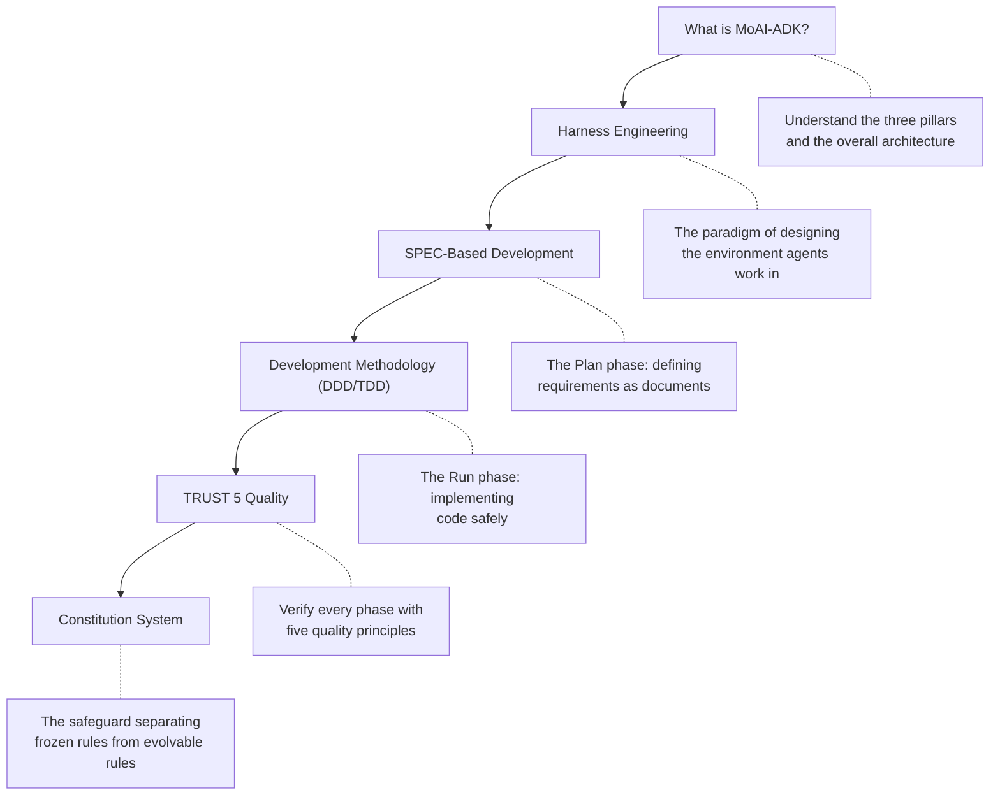

 <strong>Belongs to</strong>: 🛡️ Agentic Harness

<!-- @value: agentic-harness -->

This section introduces the core concepts you need to understand MoAI-ADK v3.0. The value of v3.0 comes down to three pillars — **Tokenomics** (Token Economics), **Agentic Loop Engineering**, and the **Agentic Harness**. The documents in this section unpack, one by one, how those three pillars work in a real development flow.


New here? Read top to bottom in order and the full picture of MoAI-ADK falls into place naturally. Each document can also be read on its own.


## The Three Pillars

| Pillar | Key Question | Representative Document |
|------|----------|----------|
| **Tokenomics** | How do we get the same quality with fewer tokens? | [What is MoAI-ADK?](/en/core-concepts/what-is-moai-adk) |
| **Agentic Loop Engineering** | How does the loop work and learn on its own? | [Harness Engineering](/en/core-concepts/harness-engineering) |
| **Agentic Harness** | How do we design an environment where agents work well? | [SPEC-Based Development](/en/core-concepts/spec-based-dev) · [TRUST 5](/en/core-concepts/trust-5) |

## Learning Order

| Order | Document | Key Question |
|------|------|----------|
| 1 | [What is MoAI-ADK?](/en/core-concepts/what-is-moai-adk) | What is MoAI-ADK, and why does it aim for tokenomics? |
| 2 | [Harness Engineering](/en/core-concepts/harness-engineering) | What does it mean to design the environment instead of writing code directly? |
| 3 | [SPEC-Based Development](/en/core-concepts/spec-based-dev) | How do we define and manage requirements clearly? |
| 4 | [Development Methodology (DDD/TDD)](/en/core-concepts/ddd) | How do we improve existing code without breaking it? |
| 5 | [TRUST 5 Quality](/en/core-concepts/trust-5) | By what standards is code quality guaranteed? |
| 6 | [Constitution System](/en/core-concepts/constitution) | When the harness evolves on its own, what governs that evolution? |


Summarized as a flow: decide what to build with a **SPEC**, build it safely with **DDD/TDD**, and verify quality with **TRUST 5**. The **harness** wraps this entire loop, and as the loop runs the harness learns and its guidance evolves — the safeguard for that evolution is the **Constitution**.

