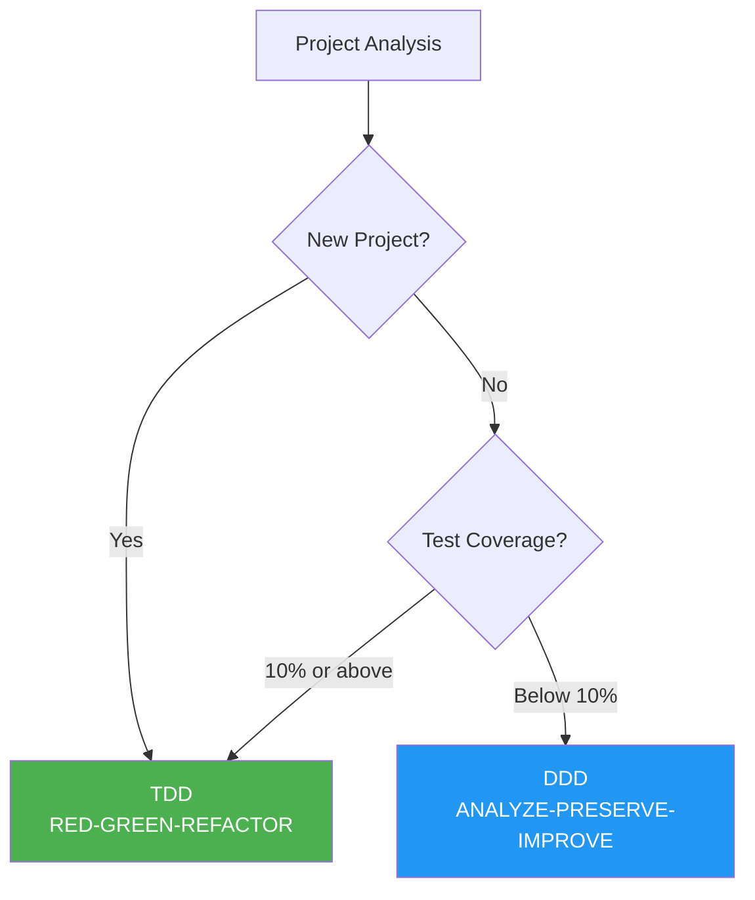
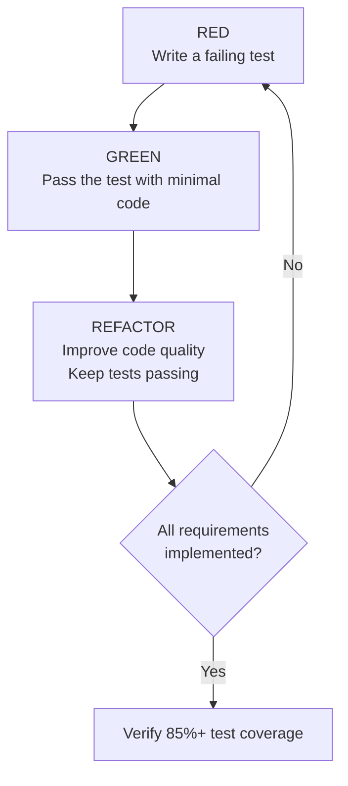
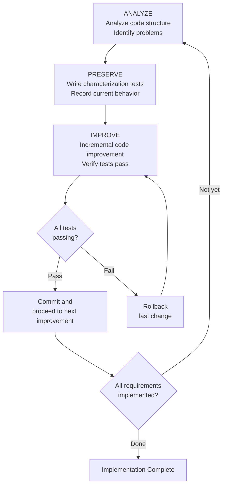
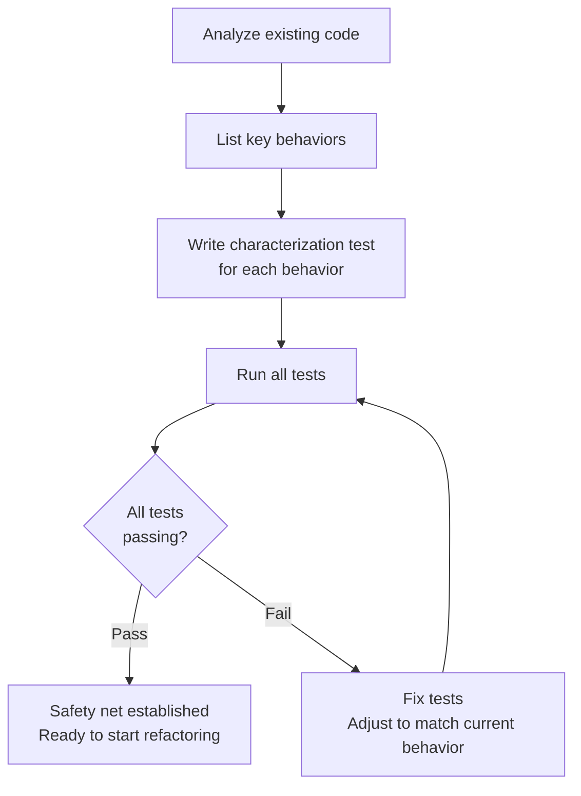
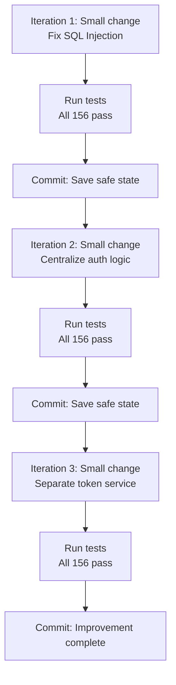
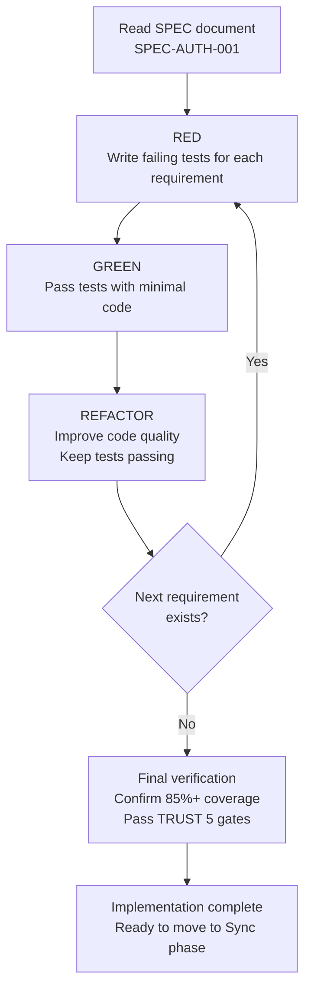
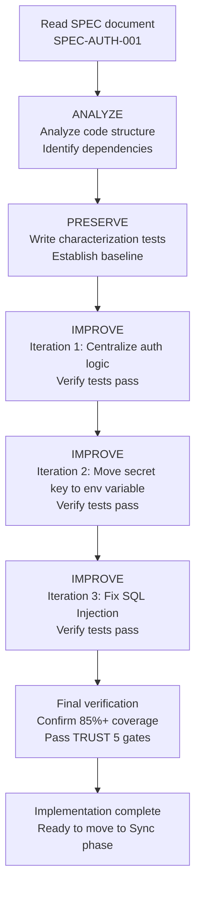

# Development Methodology (DDD/TDD)

A detailed guide to MoAI-ADK's development methodology. Choose either TDD or DDD
depending on your project's state.


  **One-line summary:** New projects use **TDD** (RED-GREEN-REFACTOR), while
  existing projects with little to no tests use **DDD** (ANALYZE-PRESERVE-IMPROVE).
  You can also manually select the methodology in `quality.yaml`.


## Methodology Overview

MoAI-ADK automatically selects the optimal development methodology based on your project's state.



| Project Type                              | Methodology | Cycle                     | Description                                      |
| ----------------------------------------- | ----------- | ------------------------- | ------------------------------------------------ |
| **New Project**                           | **TDD**     | RED-GREEN-REFACTOR        | Write tests first, then implement                |
| **Existing Project** (Coverage >= 10%)    | **TDD**     | RED-GREEN-REFACTOR        | Extend TDD on partial test base                  |
| **Existing Project** (Coverage < 10%)     | **DDD**     | ANALYZE-PRESERVE-IMPROVE  | Safe incremental improvement with characterization tests |


  **You can choose the methodology manually:** Set `development_mode` to `tdd` or
  `ddd` in `.moai/config/sections/quality.yaml` to override the automatic selection
  and use your preferred methodology.


## What is TDD?

**TDD** (Test-Driven Development) is a development methodology where you **write
tests first, then implement the minimal code to pass those tests**. It is
MoAI-ADK's default methodology and is used for most projects.

### RED-GREEN-REFACTOR Cycle

TDD proceeds as a cycle that repeats three phases.



### Step 1: RED (Write a Failing Test)

Write a **test first** for the feature you want to implement. Since no code exists
yet, the test must fail.

**Key principles:**

- Write only one test at a time
- Clearly describe the intended behavior using Given-When-Then
- Confirm the test fails (if it doesn't fail, the test is meaningless)

### Step 2: GREEN (Pass the Test with Minimal Code)

Write the **simplest code** that makes the test pass.

**Key principles:**

- Do not optimize or abstract prematurely
- Focus on correctness, elegance comes later
- Stop once the test passes

### Step 3: REFACTOR (Improve Code Quality)

Clean up the code while keeping all tests passing.

**Key principles:**

- Remove duplicate code
- Improve variable and function names
- Apply SOLID principles
- Tests must continue to pass

### TDD Practical Example

```python
# RED: Write a failing test first
def test_user_registration():
    """
    GIVEN: Valid user information exists
    WHEN: User registers
    THEN: User is created and a welcome email is sent
    """
    user_service = UserService()
    result = user_service.register(
        email="newuser@example.com",
        password="SecurePass123!"
    )

    assert result.success is True
    assert result.user.id is not None
    assert email_service.welcome_email_sent("newuser@example.com") is True

# Run test (expected to fail - not implemented yet)
# > pytest test_user_service.py - test_user_registration FAILED

# ====================================

# GREEN: Pass the test with minimal code
class UserService:
    def register(self, email: str, password: str) -> RegistrationResult:
        user = User.create(email, password)
        user_repository.save(user)
        email_service.send_welcome(email)
        return RegistrationResult.success(user)

# Run test (passes)
# > pytest test_user_service.py - test_user_registration PASSED

# ====================================

# REFACTOR: Improve code quality (tests keep passing)
class UserService:
    def __init__(
        self,
        user_repo: UserRepository,
        email_service: EmailService,
        password_validator: PasswordValidator
    ):
        self.user_repo = user_repo
        self.email_service = email_service
        self.password_validator = password_validator

    def register(self, email: str, password: str) -> RegistrationResult:
        if not self.password_validator.validate(password):
            return RegistrationResult.failure("Invalid password")

        user = User.create(email, password)
        self.user_repo.save(user)
        self.email_service.send_welcome(email)
        return RegistrationResult.success(user)

# Run test (still passes)
# > pytest test_user_service.py - test_user_registration PASSED
```

### TDD on Existing Projects (Brownfield Enhancement)

When using TDD on a project with existing code, a **Pre-RED step** is added:

1. **(Pre-RED)** Read the existing code in the target area and understand its current behavior
2. **RED:** Write a failing test informed by your understanding of the existing code
3. **GREEN:** Pass the test with minimal code
4. **REFACTOR:** Improve code while keeping tests passing


  Even with existing code, you can use TDD if test coverage is 10% or above.
  Because the Pre-RED step identifies existing behavior before writing tests,
  you can safely preserve existing functionality while adding new features.


## What is DDD?

**DDD** (Domain-Driven Development) is a **safe code improvement method**. It is
an approach that incrementally improves while respecting existing code. It is used
for existing projects with very low test coverage (below 10%).

### Home Remodeling Analogy

For those new to DDD, here is a **home remodeling** analogy. Imagine remodeling
a 10-year-old house.

| Home Remodeling Stage       | DDD Stage             | What You Do                                    | Why It Matters                                                            |
| --------------------------- | --------------------- | ---------------------------------------------- | ------------------------------------------------------------------------- |
| Inspect the house           | **ANALYZE** (Analyze) | Check for wall cracks, plumbing condition       | You cannot fix what you do not understand                                 |
| Take photos of current state | **PRESERVE** (Preserve) | Photograph every room to record               | Later when you wonder "was there a wall here?", you can check             |
| Remodel one room at a time  | **IMPROVE** (Improve)  | Work on one room at a time and verify each time | If you demolish everything at once, you cannot tell where problems started |

**Wrong approach vs. right approach:**

```
Wrong approach: "Let's change all the code at once!"
  --> High risk of breaking existing functionality
  --> Hard to identify where problems occurred

Right approach: "Record current behavior with tests, then change incrementally!"
  --> Tests immediately tell you if existing functionality breaks
  --> Just rollback the last change if problems occur
```

### ANALYZE-PRESERVE-IMPROVE Cycle

MoAI-ADK's DDD proceeds as a cycle that repeats three phases.



### Step 1: ANALYZE (Analyze)

Thoroughly analyze the existing code structure. Like a doctor examining a patient.

**Analysis items:**

| Analysis Target | What to Check                               | Analogy                          |
| --------------- | ------------------------------------------- | -------------------------------- |
| File Structure  | What files exist and how they are connected | Check the house blueprints       |
| Dependencies    | Which modules depend on which               | Check the plumbing and wiring    |
| Test Status     | How many existing tests there are           | Check existing insurance         |
| Problems        | Duplicate code, security vulnerabilities, performance bottlenecks | Check for cracked walls, leaks |

**Example analysis report generated by manager-ddd:**

```markdown
## Code Analysis Report

- Target: src/auth/ (authentication module)
- Files: 8 Python files
- Lines of code: 1,850 lines
- Test coverage: 5%

## Discovered Problems
1. Duplicate authentication logic (same code repeated in 3 places)
2. Hardcoded secret key (written directly in config.py)
3. SQL Injection vulnerability (user_repository.py)
4. Insufficient tests (5%, target 85%)
```

### Step 2: PRESERVE (Preserve)

Build a **safety net** to preserve existing behavior. The core of this phase is
writing **characterization tests**.


  **What are characterization tests?**

  They are like **taking photos of the house before remodeling**.

  Regular tests check "is this working correctly?" But characterization tests
  record "how is this currently working?"

  They do not judge right or wrong -- they **record the fact that "it originally
  worked like this."** Later, if tests fail after code changes, you immediately
  know that existing behavior has changed.


**Characterization test example:**

```python
class TestExistingLoginBehavior:
    """Characterization test recording the current login function behavior"""

    def test_valid_login_returns_token(self):
        """
        GIVEN: A registered user exists
        WHEN: Login with correct password
        THEN: Record the response returned by current implementation
        """
        user = create_test_user(
            email="test@example.com",
            password="password123"
        )

        result = login_service.login("test@example.com", "password123")

        # Record current behavior as-is (not judging right or wrong)
        assert result["status"] == "success"
        assert result["token"] is not None
        assert result["expires_in"] == 3600  # Current expiration time

    def test_wrong_password_returns_error(self):
        """Record current behavior for login with wrong password"""
        create_test_user(email="test@example.com", password="password123")

        result = login_service.login("test@example.com", "wrongpassword")

        assert result["status"] == "error"
        assert result["code"] == 401
```

**Test writing strategy:**



### Step 3: IMPROVE (Improve)

Once characterization tests are in place, you can safely improve the code. The
core principle is **divide changes into small steps**.

**Improvement process:**

```python
# BEFORE: Code before improvement
def login(email, password):
    # SQL Injection vulnerability
    user = db.query("SELECT * FROM users WHERE email = '" + email + "'")
    if user and check_password(user.password, password):
        token = generate_token(user.id)
        return {"status": "success", "token": token}
    return {"status": "error", "code": 401}

# ====================================

# AFTER: Code after improvement (completed over 3 iterations)
def login(email: str, password: str) -> LoginResult:
    """Process user login."""
    # Iteration 1: Use parameterized query to prevent SQL Injection
    user = user_repository.find_by_email(email)

    if not user:
        return LoginResult.failure("Invalid credentials")

    # Iteration 2: Centralize authentication logic
    if not auth_service.verify_password(user, password):
        return LoginResult.failure("Invalid credentials")

    # Iteration 3: Separate token service
    token = token_service.generate(user.id)
    return LoginResult.success(token)
```

**Incremental improvement steps:**




  **Core principle:** Always run tests after each change. If tests fail, just
  rollback the last change. This is the power of "small steps." If you change
  too much at once, it becomes hard to identify where the problem occurred.


## Methodology Comparison

| Aspect              | TDD                          | DDD                           |
| ------------------- | ---------------------------- | ----------------------------- |
| **Test timing**     | Before writing code (RED)    | After analysis (PRESERVE)     |
| **Coverage approach** | Strict per-commit standard | Gradual improvement           |
| **Best for**        | New projects, 10%+ coverage  | Legacy with < 10% coverage    |
| **Risk level**      | Medium (requires discipline) | Low (preserves behavior)      |
| **Coverage exemptions** | Not allowed              | Allowed                       |
| **Run Phase cycle** | RED-GREEN-REFACTOR           | ANALYZE-PRESERVE-IMPROVE      |


  **Methodology selection guide:**

  - **New projects** (greenfield): TDD (default)
  - **Existing projects** (coverage 50% or above): TDD
  - **Existing projects** (coverage 10-49%): TDD (using the Pre-RED step)
  - **Existing projects** (coverage below 10%): DDD (gradual characterization testing)


## What are Characterization Tests?

Characterization tests are the core tool of DDD. Let us take a closer look.

### Difference from Regular Tests

| Aspect          | Regular Tests                   | Characterization Tests           |
| --------------- | ------------------------------- | -------------------------------- |
| **Purpose**     | "Is this working correctly?"    | "How is this currently working?" |
| **When written** | Before/after writing new code  | Before refactoring existing code |
| **Criteria**    | Requirements (specification)    | Current actual behavior          |
| **Analogy**     | Check if built to blueprint     | Take photos of the current house state |

### Writing Principles

1. **Record only, do not judge**: Even if the current code has bugs, record that behavior as-is
2. **Include edge cases**: Record all exceptional cases, not just normal ones
3. **Make reproducible**: Tests must produce the same results every time they run
4. **Make fast**: Characterization tests must run quickly so you can verify after each change

## How to Execute

### Running TDD

Once the SPEC document is ready, execute the TDD cycle with the following command.

```bash
# Run TDD (when development_mode: tdd)
> /moai run SPEC-AUTH-001
```

This command causes the **manager-tdd agent** to automatically perform the
RED-GREEN-REFACTOR cycle:



### Running DDD

```bash
# Run DDD (when development_mode: ddd)
> /moai run SPEC-AUTH-001
```

This command causes the **manager-ddd agent** to automatically perform the
ANALYZE-PRESERVE-IMPROVE cycle:



## Methodology Configuration

Configure the development methodology in the `.moai/config/sections/quality.yaml` file.

### TDD Configuration (Default)

```yaml
constitution:
  development_mode: tdd  # Use TDD methodology

  tdd_settings:
    test_first_required: true         # Tests must be written before implementation
    red_green_refactor: true          # Follow RED-GREEN-REFACTOR cycle
    min_coverage_per_commit: 80       # Minimum coverage per commit
    mutation_testing_enabled: false   # Mutation testing (optional)

  test_coverage_target: 85            # Overall coverage target
```

### DDD Configuration

```yaml
constitution:
  development_mode: ddd  # Use DDD methodology

  ddd_settings:
    require_existing_tests: true      # Existing tests required before refactoring
    characterization_tests: true      # Auto-generate characterization tests
    behavior_snapshots: true          # Use snapshot tests
    max_transformation_size: small    # Limit change size
    preserve_before_improve: true     # Must preserve before improving

  test_coverage_target: 85            # Overall coverage target
```

**DDD max_transformation_size options:**

| Value    | Change Scope                      | Recommended Situation                   |
| -------- | --------------------------------- | --------------------------------------- |
| `small`  | 1-2 files, simple refactoring     | General code improvement (recommended)  |
| `medium` | 3-5 files, medium complexity      | Module structure changes                |
| `large`  | 10+ files                         | Architecture changes (use with caution) |


  Setting `max_transformation_size` to `large` changes many files at once,
  making it difficult to identify the root cause when problems occur. It is
  recommended to keep it at `small` whenever possible.


## Practical Example: Legacy Code Refactoring

This is a scenario for refactoring an authentication module written 3 years ago.
With test coverage at only 5%, the DDD methodology is used.

### Situation

```
Problems:
- 2 SQL Injection vulnerabilities
- Hardcoded secret key
- Duplicate authentication logic in 3 places
- Test coverage 5%
- High code complexity
```

### Execution Process

```bash
# Step 1: Create SPEC (Plan)
> /moai plan "Refactor legacy authentication system. Fix SQL Injection, move secret key to environment variables, centralize authentication logic"

# manager-spec creates SPEC-AUTH-REFACTOR-001
```

```bash
# Step 2: Run DDD (Run)
> /moai run SPEC-AUTH-REFACTOR-001

# manager-ddd executes ANALYZE-PRESERVE-IMPROVE cycle
# ANALYZE: Analyze code, generate list of problems
# PRESERVE: Write 156 characterization tests
# IMPROVE: Incremental improvement over 3 iterations
```

```bash
# Step 3: Sync documentation (Sync)
> /moai sync SPEC-AUTH-REFACTOR-001

# manager-docs updates API documentation, generates refactoring report
```

### Results

| Metric                       | Before | After       | Change               |
| ---------------------------- | ------ | ----------- | -------------------- |
| Test Coverage                | 5%     | 87%         | +82%                 |
| SQL Injection Vulnerabilities | 2     | 0           | Fully removed        |
| Hardcoded Secret Key         | Yes    | No          | Moved to env variable |
| Duplicate Code               | 3      | 0           | Fully centralized    |
| Code Complexity              | High   | 35% reduced | Structure improved   |


  **Key takeaway:** Not a single existing behavior was changed during the
  refactoring process. All 156 characterization tests passed on every iteration,
  which means code quality was significantly improved without affecting existing
  users.


## Related Documents

- [SPEC-Based Development](/core-concepts/spec-based-dev) -- A SPEC document is
  required before executing the development methodology
- [TRUST 5 Quality](/core-concepts/trust-5) -- Review the quality validation
  criteria after implementation is complete
