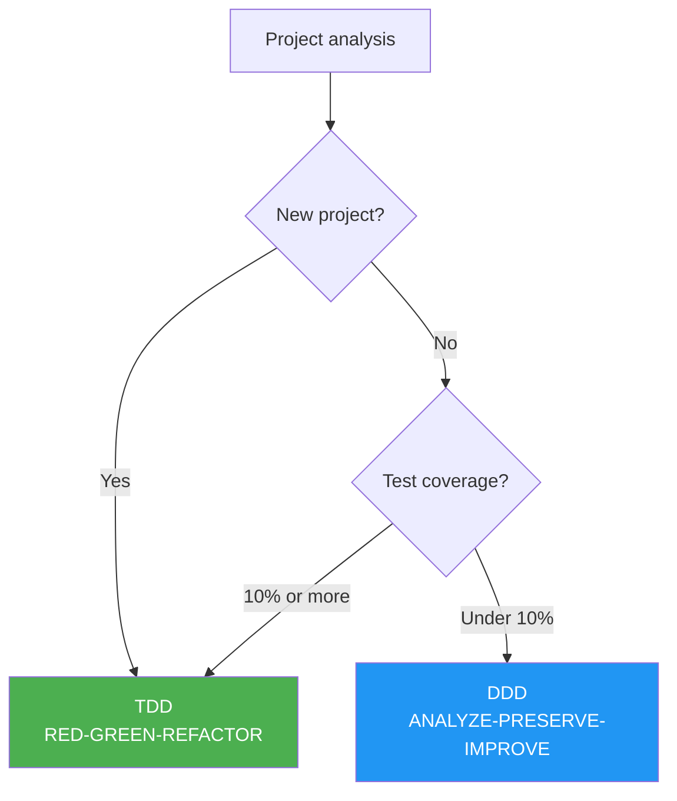
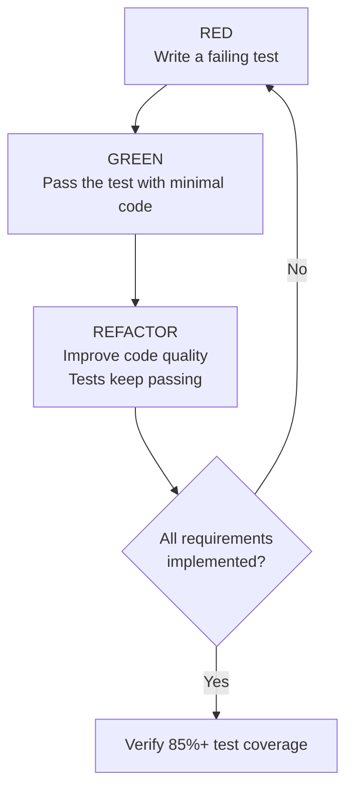
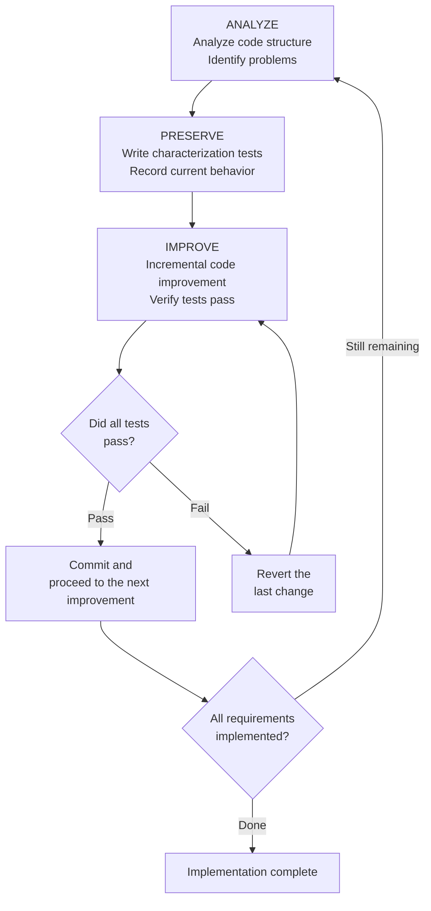
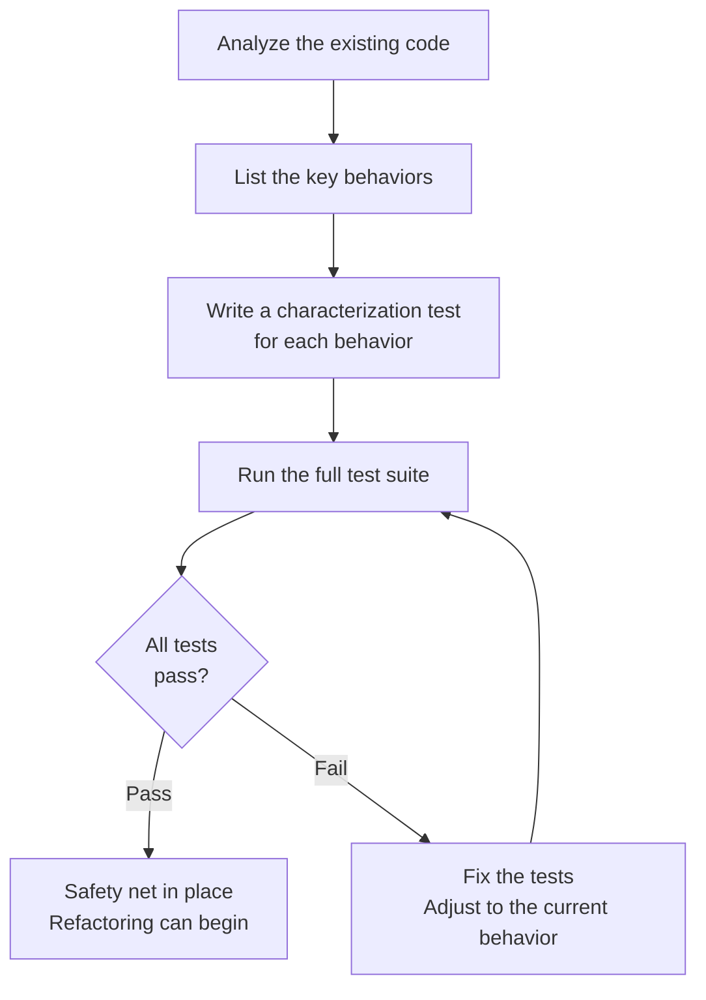
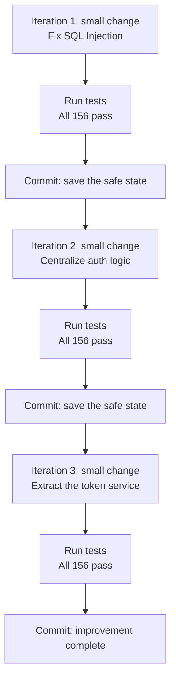
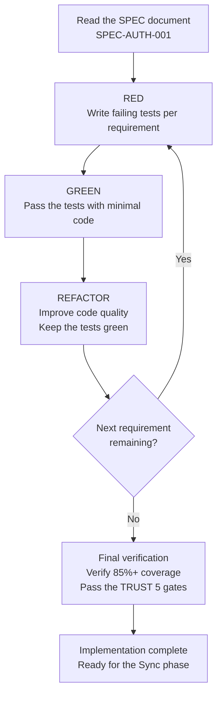
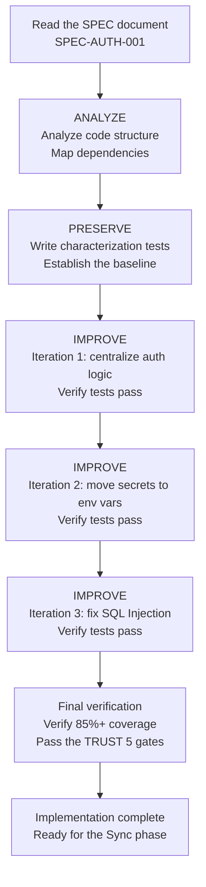

A detailed guide to MoAI-ADK's development methodologies. This is the discipline the agent
follows when implementing code in the Run phase, choosing TDD or DDD according to the project's
state. When the methodology is clear, the agent does not wander — the tests become the completion
condition, the loop converges on its own, and no tokens are wasted on unnecessary retries.


  **One-line summary:** New projects use **TDD** (RED-GREEN-REFACTOR); existing projects with
  almost no tests use **DDD** (ANALYZE-PRESERVE-IMPROVE).
  You can also choose directly in `quality.yaml`.


## Methodology Overview

MoAI-ADK automatically selects the optimal development methodology based on the project's state.


```mermaid
flowchart TD
    A["Project analysis"] --> B{"New project?"}
    B -->|"Yes"| C["TDD\nRED-GREEN-REFACTOR"]
    B -->|"No"| D{"Test coverage?"}
    D -->|"10% or more"| C
    D -->|"Under 10%"| E["DDD\nANALYZE-PRESERVE-IMPROVE"]

    style C fill:#4CAF50,color:#fff
    style E fill:#2196F3,color:#fff
```

| Project type                      | Methodology  | Cycle                    | Description                                     |
| ---------------------------------- | ------- | ------------------------- | ---------------------------------------- |
| **New project**                  | **TDD** | RED-GREEN-REFACTOR        | Write tests first, then implement              |
| **Existing project** (coverage ≥ 10%) | **TDD** | RED-GREEN-REFACTOR        | Extend TDD on the partial test base          |
| **Existing project** (coverage < 10%) | **DDD** | ANALYZE-PRESERVE-IMPROVE  | Safe incremental improvement with characterization tests       |


  **You can choose the methodology yourself:** setting `development_mode` to `tdd` or `ddd` in
  `.moai/config/sections/quality.yaml` overrides the automatic selection and uses the
  methodology you want.


## What is TDD?

**TDD** (Test-Driven Development) is a development methodology where you **write the tests first,
then implement the minimum code that passes those tests**. It is MoAI-ADK's default methodology,
used in most projects.

### The RED-GREEN-REFACTOR Cycle

TDD proceeds as a cycle repeating three phases.


```mermaid
flowchart TD
    A["RED\nWrite a failing test"] --> B["GREEN\nPass the test with minimal code"]
    B --> C["REFACTOR\nImprove code quality\nTests keep passing"]
    C --> D{"All requirements\nimplemented?"}
    D -->|"No"| A
    D -->|"Yes"| E["Verify 85%+ test coverage"]
```

### Phase 1: RED (Write a Failing Test)

Write the **tests first** for the feature you will implement. Since the code does not exist yet,
the tests must fail.

**Core principles:**

- Write only one test at a time
- Describe the intended behavior clearly with Given-When-Then
- Confirm the test fails (a test that does not fail is meaningless)

### Phase 2: GREEN (Pass the Test with Minimal Code)

Write the **simplest code** that passes the test.

**Core principles:**

- No premature optimization or abstraction
- Focus on correctness; elegance comes later
- Stop when the test passes

### Phase 3: REFACTOR (Improve Code Quality)

Clean up the code while keeping the tests passing.

**Core principles:**

- Remove duplicated code
- Improve variable and function names
- Apply SOLID principles
- The tests must keep passing

### A TDD Example in Practice

```python
# RED: write the failing test first
def test_user_registration():
    """
    GIVEN: valid user information exists, and
    WHEN: the user registers,
    THEN: the user is created and a welcome email is sent
    """
    user_service = UserService()
    result = user_service.register(
        email="newuser@example.com",
        password="SecurePass123!"
    )

    assert result.success is True
    assert result.user.id is not None
    assert email_service.welcome_email_sent("newuser@example.com") is True

# Run the tests (expected to fail - not implemented yet)
# > pytest test_user_service.py - test_user_registration FAILED

# ====================================

# GREEN: pass the test with minimal code
class UserService:
    def register(self, email: str, password: str) -> RegistrationResult:
        user = User.create(email, password)
        user_repository.save(user)
        email_service.send_welcome(email)
        return RegistrationResult.success(user)

# Run the tests (passing)
# > pytest test_user_service.py - test_user_registration PASSED

# ====================================

# REFACTOR: improve code quality (tests keep passing)
class UserService:
    def __init__(
        self,
        user_repo: UserRepository,
        email_service: EmailService,
        password_validator: PasswordValidator
    ):
        self.user_repo = user_repo
        self.email_service = email_service
        self.password_validator = password_validator

    def register(self, email: str, password: str) -> RegistrationResult:
        if not self.password_validator.validate(password):
            return RegistrationResult.failure("Invalid password")

        user = User.create(email, password)
        self.user_repo.save(user)
        self.email_service.send_welcome(email)
        return RegistrationResult.success(user)

# Run the tests (still passing)
# > pytest test_user_service.py - test_user_registration PASSED
```

### TDD in Existing Projects (Brownfield Enhancement)

When using TDD in a project with existing code, a **Pre-RED phase** is added:

1. **(Pre-RED)** Read the existing code in the target area and understand its current behavior
2. **RED:** Write failing tests based on your understanding of the existing code
3. **GREEN:** Make the tests pass with minimal code
4. **REFACTOR:** Improve the code while keeping the tests green


  Even with existing code, TDD can be used if test coverage is 10% or higher.
  Because tests are written after the Pre-RED phase establishes current behavior, you can add
  new features while safely preserving existing functionality.


## What is DDD?

**DDD** (Domain-Driven Development) is a **safe way to improve code**. It is an approach that
respects existing code while improving it incrementally. It is used in existing projects with
almost no tests (under 10%).

### The House-Remodeling Analogy

For those new to DDD, here is an explanation by analogy to **remodeling a house**. Imagine
remodeling a 10-year-old house.

| Remodeling step      | DDD phase              | What happens                            | Why it matters                                                 |
| --------------------- | --------------------- | ---------------------------------- | ----------------------------------------------------------- |
| Inspect the house           | **ANALYZE**    | Find cracked walls, check the plumbing    | You cannot fix what you cannot locate                      |
| Photograph the current state   | **PRESERVE**   | Photograph and record every room       | Later, when you wonder "was there a wall here?", you can check     |
| Remodel one room at a time    | **IMPROVE**    | Work on one room at a time, verify each time | Demolish everything at once and you cannot tell where things broke     |

**The wrong way vs the right way:**

```
Wrong way: "I'll change the entire codebase at once!"
  --> High risk of breaking existing features
  --> When something goes wrong, it is hard to find where

Right way: "I'll record the current behavior with tests, then change things bit by bit!"
  --> If an existing feature breaks, the tests tell you immediately
  --> If something goes wrong, just revert the last change
```

### The ANALYZE-PRESERVE-IMPROVE Cycle

MoAI-ADK's DDD proceeds as a cycle repeating three phases.


```mermaid
flowchart TD
    A["ANALYZE\nAnalyze code structure\nIdentify problems"] --> B["PRESERVE\nWrite characterization tests\nRecord current behavior"]
    B --> C["IMPROVE\nIncremental code improvement\nVerify tests pass"]
    C --> D{"Did all tests\npass?"}
    D -->|"Pass"| E["Commit and\nproceed to the next improvement"]
    D -->|"Fail"| F["Revert the\nlast change"]
    F --> C
    E --> G{"All requirements\nimplemented?"}
    G -->|"Still remaining"| A
    G -->|"Done"| H["Implementation complete"]
```

### Phase 1: ANALYZE

Analyze the structure of the existing code thoroughly. It is like a doctor examining a patient.

**What is analyzed:**

| Analysis target  | What is checked                          | Analogy               |
| ---------- | ---------------------------------- | ------------------ |
| File structure  | Which files exist and how they connect | Reviewing the house's floor plan     |
| Dependencies     | Which modules depend on which modules | Checking plumbing and electrical wiring |
| Test coverage | How many existing tests there are        | Checking existing insurance     |
| Problems     | Duplicated code, security vulnerabilities, performance bottlenecks  | Cracked walls, leaks |

**Example analysis report generated by manager-develop:**

```markdown
## Code Analysis Report

- Target: src/auth/ (authentication module)
- Files: 8 Python files
- Lines of code: 1,850
- Test coverage: 5%

## Problems Found
1. Duplicated authentication logic (same code repeated in 3 places)
2. Hardcoded secret key (written directly in config.py)
3. SQL Injection vulnerability (user_repository.py)
4. Insufficient tests (5%, target 85%)
```

### Phase 2: PRESERVE

Build a **safety net** to preserve existing behavior. The core of this phase is writing
**characterization tests**.


  **What are characterization tests?**

  They are like **taking photographs** of the current state before remodeling a house.

  A normal test checks "does this behave correctly?". A characterization
  test records "how does this currently behave?".

  In other words, it does not judge right or wrong — it **records the fact that
  "it originally behaved this way"**. Later, if a test fails after a code change, you know
  immediately that existing behavior has changed.


**Characterization test example:**

```python
class TestExistingLoginBehavior:
    """Characterization tests recording the current behavior of the existing login function"""

    def test_valid_login_returns_token(self):
        """
        GIVEN: a registered user exists, and
        WHEN: they log in with the correct password,
        THEN: record whatever response the current implementation returns
        """
        user = create_test_user(
            email="test@example.com",
            password="password123"
        )

        result = login_service.login("test@example.com", "password123")

        # Record the current behavior as-is (no judgment of right or wrong)
        assert result["status"] == "success"
        assert result["token"] is not None
        assert result["expires_in"] == 3600  # current expiry time

    def test_wrong_password_returns_error(self):
        """Record the current behavior when logging in with a wrong password"""
        create_test_user(email="test@example.com", password="password123")

        result = login_service.login("test@example.com", "wrongpassword")

        assert result["status"] == "error"
        assert result["code"] == 401
```

**Test-writing strategy:**


```mermaid
flowchart TD
    A["Analyze the existing code"] --> B["List the key behaviors"]
    B --> C["Write a characterization test\nfor each behavior"]
    C --> D["Run the full test suite"]
    D --> E{"All tests\npass?"}
    E -->|"Pass"| F["Safety net in place\nRefactoring can begin"]
    E -->|"Fail"| G["Fix the tests\nAdjust to the current behavior"]
    G --> D
```

### Phase 3: IMPROVE

With characterization tests in place, you can now improve the code safely. The core principle is
**changing in small steps**.

**The improvement process:**

```python
# BEFORE: code before improvement
def login(email, password):
    # SQL Injection vulnerability
    user = db.query("SELECT * FROM users WHERE email = '" + email + "'")
    if user and check_password(user.password, password):
        token = generate_token(user.id)
        return {"status": "success", "token": token}
    return {"status": "error", "code": 401}

# ====================================

# AFTER: code after improvement (completed across 3 iterations)
def login(email: str, password: str) -> LoginResult:
    """Handles user login."""
    # Iteration 1: prevent SQL Injection with parameterized queries
    user = user_repository.find_by_email(email)

    if not user:
        return LoginResult.failure("Invalid credentials")

    # Iteration 2: centralize authentication logic
    if not auth_service.verify_password(user, password):
        return LoginResult.failure("Invalid credentials")

    # Iteration 3: extract the token service
    token = token_service.generate(user.id)
    return LoginResult.success(token)
```

**Incremental improvement steps:**


```mermaid
flowchart TD
    S1["Iteration 1: small change\nFix SQL Injection"] --> T1["Run tests\nAll 156 pass"]
    T1 --> C1["Commit: save the safe state"]
    C1 --> S2["Iteration 2: small change\nCentralize auth logic"]
    S2 --> T2["Run tests\nAll 156 pass"]
    T2 --> C2["Commit: save the safe state"]
    C2 --> S3["Iteration 3: small change\nExtract the token service"]
    S3 --> T3["Run tests\nAll 156 pass"]
    T3 --> C3["Commit: improvement complete"]
```


  **Core principle:** Run the tests after every change, without exception. If a test fails,
  just revert the last change. This is the power of "small steps". Change too much at once
  and it becomes hard to find where the problem crept in.


## Methodology Comparison

| Aspect              | TDD                         | DDD                          |
| ----------------- | --------------------------- | ---------------------------- |
| **Test timing** | Before writing code (RED)          | After analysis (PRESERVE)           |
| **Coverage approach** | Strict per-commit criteria            | Incremental improvement                  |
| **Best situation**     | New projects, 10%+ coverage | Legacy under 10% coverage     |
| **Risk level**     | Medium (discipline required)            | Low (behavior preserved)             |
| **Coverage exceptions** | Not allowed                  | Allowed                         |
| **Run Phase cycle** | RED-GREEN-REFACTOR       | ANALYZE-PRESERVE-IMPROVE     |


  **Methodology selection guide:**

  - **New project** (greenfield): TDD (default)
  - **Existing project** (coverage 50% or more): TDD
  - **Existing project** (coverage 10-49%): TDD (using the Pre-RED phase)
  - **Existing project** (coverage under 10%): DDD (incremental characterization tests)


## What Are Characterization Tests?

Characterization tests are the core tool of DDD. Let's take a closer look.

### Difference from Normal Tests

| Aspect          | Normal tests                     | Characterization tests                  |
| ------------- | ------------------------------- | ------------------------------ |
| **Purpose**      | "Does this behave correctly?"   | "How does this currently behave?" |
| **When written** | Before/after writing new code              | Before refactoring existing code          |
| **Standard**      | Requirements (the design document)               | Current actual behavior                 |
| **Analogy**      | Verifying the house matches the blueprint        | Photographing the house's current state   |

### Writing Principles

1. **Record without judging**: even if the current code has bugs, record its behavior as-is
2. **Include edge cases**: record not only normal cases but all exception cases too
3. **Reproducible**: running the tests any number of times must yield the same result
4. **Fast**: characterization tests must run fast so you can verify right after every change

## How to Run

### Running TDD

Once the SPEC document is ready, run the TDD cycle with the command below.

```bash
# Run TDD (when development_mode: tdd)
> /moai run SPEC-AUTH-001
```

Running this command has the **manager-develop agent** automatically execute the RED-GREEN-REFACTOR
cycle:


```mermaid
flowchart TD
    A["Read the SPEC document\nSPEC-AUTH-001"] --> B["RED\nWrite failing tests per requirement"]
    B --> C["GREEN\nPass the tests with minimal code"]
    C --> D["REFACTOR\nImprove code quality\nKeep the tests green"]
    D --> E{"Next requirement\nremaining?"}
    E -->|"Yes"| B
    E -->|"No"| F["Final verification\nVerify 85%+ coverage\nPass the TRUST 5 gates"]
    F --> G["Implementation complete\nReady for the Sync phase"]
```

### Running DDD

```bash
# Run DDD (when development_mode: ddd)
> /moai run SPEC-AUTH-001
```

Running this command has the **manager-develop agent** automatically execute the
ANALYZE-PRESERVE-IMPROVE cycle:


```mermaid
flowchart TD
    A["Read the SPEC document\nSPEC-AUTH-001"] --> B["ANALYZE\nAnalyze code structure\nMap dependencies"]
    B --> C["PRESERVE\nWrite characterization tests\nEstablish the baseline"]
    C --> D["IMPROVE\nIteration 1: centralize auth logic\nVerify tests pass"]
    D --> E["IMPROVE\nIteration 2: move secrets to env vars\nVerify tests pass"]
    E --> F["IMPROVE\nIteration 3: fix SQL Injection\nVerify tests pass"]
    F --> G["Final verification\nVerify 85%+ coverage\nPass the TRUST 5 gates"]
    G --> H["Implementation complete\nReady for the Sync phase"]
```

## Methodology Configuration

The development methodology is configured in the `.moai/config/sections/quality.yaml` file.

### TDD Configuration (Default)

```yaml
constitution:
  development_mode: tdd            # Use the TDD methodology (overrides and pins the SPEC's automatic harness-level selection)
  session_effort_default: "xhigh" # Opus 4.7+ default session reasoning depth (when there is no per-agent override)

  tdd_settings:
    test_first_required: true         # Tests required before implementation
    red_green_refactor: true          # Follow the RED-GREEN-REFACTOR cycle
    min_coverage_per_commit: 80       # Minimum coverage per commit
    mutation_testing_enabled: false   # Mutation testing (optional)

  test_coverage_target: 85            # Overall coverage target
```

> Explicitly pinning `development_mode` overrides the complexity estimator's automatic
> harness-level selection (minimal/standard/thorough) and forces the specified methodology
> (TDD/DDD).

### DDD Configuration

```yaml
constitution:
  development_mode: ddd  # Use the DDD methodology

  ddd_settings:
    require_existing_tests: true      # Existing tests required before refactoring
    characterization_tests: true      # Auto-generate characterization tests
    behavior_snapshots: true          # Use snapshot tests
    max_transformation_size: small    # Change-size limit
    preserve_before_improve: true     # Preserve before improve is mandatory

  test_coverage_target: 85            # Overall coverage target
```

**DDD max_transformation_size options:**

| Value       | Change scope                | Recommended situation                        |
| -------- | ------------------------ | -------------------------------- |
| `small`  | 1-2 files, simple refactoring | Typical code improvement (recommended)        |
| `medium` | 3-5 files, medium complexity  | Module-structure changes                   |
| `large`  | 10+ files           | Architecture changes (use with caution)        |


  Setting `max_transformation_size` to `large` changes many files at once, making it
  hard to diagnose problems when they occur. Keeping it at `small` is
  recommended whenever possible.


## In Practice: Refactoring Legacy Code

A scenario refactoring an authentication module written 3 years ago. Test coverage is very low
at 5%, so the DDD methodology is used.

### The Situation

```
Problems:
- 2 SQL Injection vulnerabilities
- Hardcoded secret key
- Duplicated authentication logic in 3 places
- Test coverage 5%
- High code complexity
```

### The Process

```bash
# Step 1: create the SPEC (Plan)
> /moai plan "Refactor the legacy auth system. Fix SQL Injection, move secrets to env vars, centralize auth logic"

# manager-spec creates SPEC-AUTH-REFACTOR-001
```

```bash
# Step 2: run DDD (Run)
> /moai run SPEC-AUTH-REFACTOR-001

# manager-develop runs the ANALYZE-PRESERVE-IMPROVE cycle
# ANALYZE: analyze the code, produce the list of problems
# PRESERVE: write 156 characterization tests
# IMPROVE: incremental improvement across 3 iterations
```

```bash
# Step 3: sync documentation (Sync)
> /moai sync SPEC-AUTH-REFACTOR-001

# manager-docs updates the API docs and generates a refactoring report
```

### The Results

| Metric               | Before | After    | Change           |
| ------------------ | ------ | -------- | -------------- |
| Test coverage    | 5%     | 87%      | +82%           |
| SQL Injection vulnerabilities | 2  | 0      | Fully removed      |
| Hardcoded secret key  | Present   | None     | Moved to env vars    |
| Duplicated code          | 3 places    | 0      | Fully centralized    |
| Code complexity        | High   | Reduced 35% | Structure improved      |


  **Key point:** Not a single existing behavior changed during the refactoring.
  All 156 characterization tests passed on every iteration, so code quality was
  greatly improved without affecting existing users.


## Related Documents

- [SPEC-Based Development](/en/core-concepts/spec-based-dev) -- A SPEC document is needed
  before running the development methodology
- [TRUST 5 Quality](/en/core-concepts/trust-5) -- The quality-verification criteria
  applied after implementation completes
