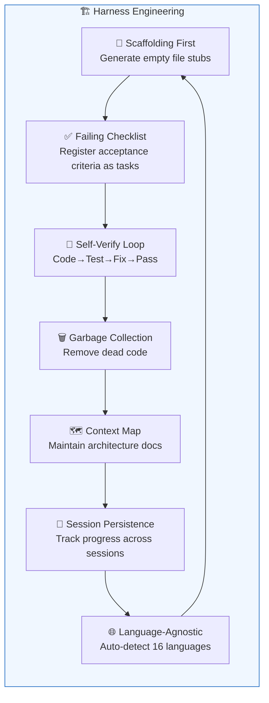
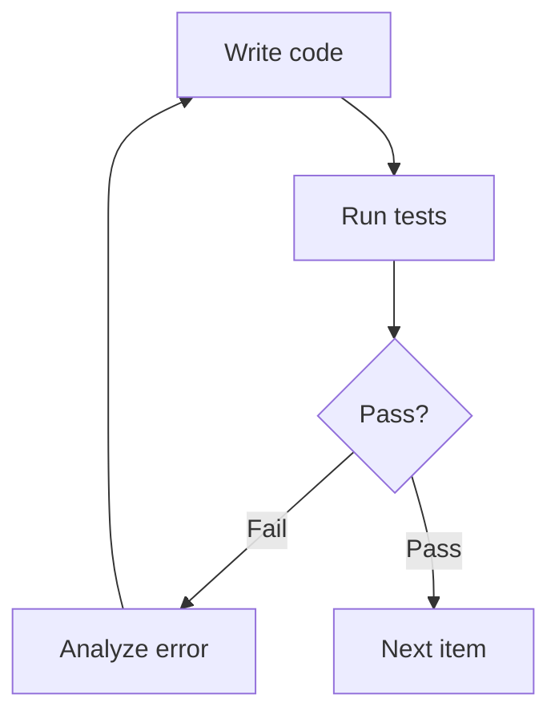

# Harness Engineering


## What Is Harness Engineering?

MoAI-ADK implements the **Harness Engineering** paradigm. Rather than having developers write code directly, this approach **designs the environment (the harness) in which an AI agent can produce optimal code**.

> "Human steers, agents execute."
> — The engineer's role shifts from writing code to designing the harness: the SPEC, the quality gates, the feedback loops.

Traditional vibe coding lets the AI generate code freely and then reviews the result manually. Harness engineering is the opposite — it guides the AI agent with a **specification (SPEC), automated validation, and a continuous feedback loop** to produce consistently high-quality code.

## 7 Core Components



Each component maps to a specific MoAI command:

| Component | Description | Command |
|----------|------|--------|
| **Self-Verify Loop** | The agent autonomously repeats the write-code → run-tests → fail → fix → pass cycle | [`/moai loop`](/utility-commands/moai-loop) |
| **Context Map** | Always gives the agent a codebase architecture map and documentation | [`/moai codemaps`](/quality-commands/moai-codemaps) |
| **Session Persistence** | `progress.md` tracks completed steps across sessions and automatically resumes interrupted work | [`/moai run SPEC-XXX`](/workflow-commands/moai-run) |
| **Failing Checklist** | Registers every acceptance criterion as a pending task at the start of the run, and checks it off once implementation is complete | [`/moai run SPEC-XXX`](/workflow-commands/moai-run) |
| **Language-Agnostic** | Supports 16 languages: auto-detects the language and selects the correct LSP/linter/test/coverage tools | Every workflow |
| **Garbage Collection** | Periodically scans for and removes dead code, AI slop, and unused imports | [`/moai clean`](/utility-commands/moai-clean) |
| **Scaffolding First** | Generates empty file stubs before implementation begins, preventing code entropy | [`/moai run SPEC-XXX`](/workflow-commands/moai-run) |

## How It Works

### 1. Scaffolding First

When `/moai run` starts, the agent first creates the necessary file structure before writing any code:

```
src/
├── auth/
│   ├── handler.go      ← empty stub
│   ├── handler_test.go  ← empty test
│   ├── service.go       ← empty stub
│   └── service_test.go  ← empty test
└── middleware/
    └── jwt.go           ← empty stub
```

This approach prevents the agent from creating files haphazardly and keeps the project structure consistent.

### 2. Failing Checklist

The SPEC's acceptance criteria are automatically registered on the task list:

```
- [ ] JWT token generation endpoint
- [ ] Token verification middleware
- [ ] Refresh token logic
- [ ] Expired token handling
- [ ] 85%+ test coverage
```

Each item is checked off once it is implemented and its tests pass. The work is complete only when every item is checked.

### 3. Self-Verify Loop

The core cycle the agent runs autonomously:



This loop repeats up to 100 times within `/moai loop`, and includes convergence detection (applying an alternative strategy when the same error repeats).

### 4. Context Map

The architecture documentation `/moai codemaps` generates gives the agent the codebase's full structure. This lets the agent:

- Choose an implementation approach that does not conflict with existing code
- Follow the appropriate patterns and conventions
- Understand dependency relationships and gauge the scope of impact

### 5. Session Persistence

Even if a Claude Code session is interrupted, `progress.md` records the steps that were completed:

```markdown
## Progress
- [x] Phase 1: Analysis complete
- [x] Phase 2: Handler implemented
- [ ] Phase 3: Writing tests ← resume here
- [ ] Phase 4: Refactoring
```

`/moai run --resume SPEC-XXX` automatically resumes from the point where it was interrupted.

## Traditional Development vs Harness Engineering

| Aspect | Traditional Development | Harness Engineering |
|------|-----------|-----------------|
| **Developer's role** | Code author | Environment designer |
| **Code production** | Written by hand | Produced automatically by an AI agent |
| **Quality assurance** | Reviewed after the fact | Built-in automated validation loop |
| **Session continuity** | Manual notes | Automatic progress tracking |
| **Code cleanup** | Technical debt accumulates | Automatic garbage collection |
| **Documentation** | A separate task | Automatically generated architecture maps |

## Harness namespace policy (template-managed vs user-owned)

When you author your own custom skills or agents, you need to know which assets `moai update` overwrites and which it preserves. MoAI-ADK clearly separates namespaces into **"package-distributed (template-managed)"** and **"user-created (user-owned)"**.

| Category | Namespace / path | Source | `moai update` behavior |
| --- | --- | --- | --- |
| **template-managed** | `moai-*` skills (including `moai-foundation-*`, `moai-workflow-*`, `moai-domain-*`, `moai-ref-*`, `moai-meta-*`), `moai-harness-*` skills, `moai-meta-harness` | MoAI-ADK package (template) | **overwrite** — deleted and reinstalled on sync |
| **user-owned** | `harness-*` skills, `.claude/agents/harness/` agents | user project | **preserve** — `moai update` never deletes or modifies them (backed up and preserved) |

### template-managed (overwritten)

`moai-*` prefix skills and `moai-harness-*` / `moai-meta-harness` are **package-distributed assets provided by MoAI-ADK**. They are deployed to every user project and are **overwritten** with the latest template when `moai update` runs. Therefore, if you modify these assets directly, your changes are lost on the next update.

### user-owned (preserved)

`harness-*` prefix skills and the `.claude/agents/harness/` directory are **owned by the user project**. `moai update` **never deletes or modifies them** — it backs them up before updating and preserves them as-is.

### Implication for custom-skill authors

To make sure your custom domain-specific skills or agents survive `moai update`, **always use the `harness-*` prefix** (place agents under `.claude/agents/harness/`). If you author them with a `moai-*` or `moai-harness-*` prefix, they are treated as template-managed and will be overwritten on the next update.

> This namespace separation policy originates from `SPEC-V3R6-HARNESS-NAMESPACE-V2-001` (completed).

## Next Steps

- [SPEC-Based Development](/core-concepts/spec-based-dev) — How to write the SPEC document that feeds the harness
- [TRUST 5 Quality](/core-concepts/trust-5) — The 5 quality criteria the harness validates
