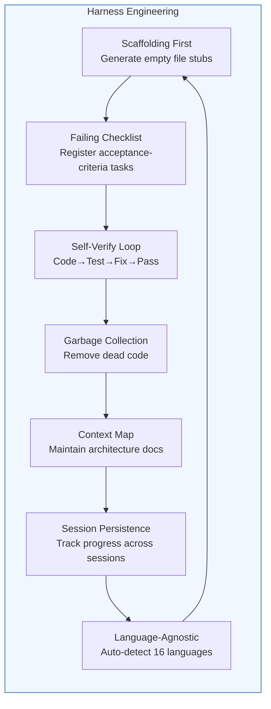
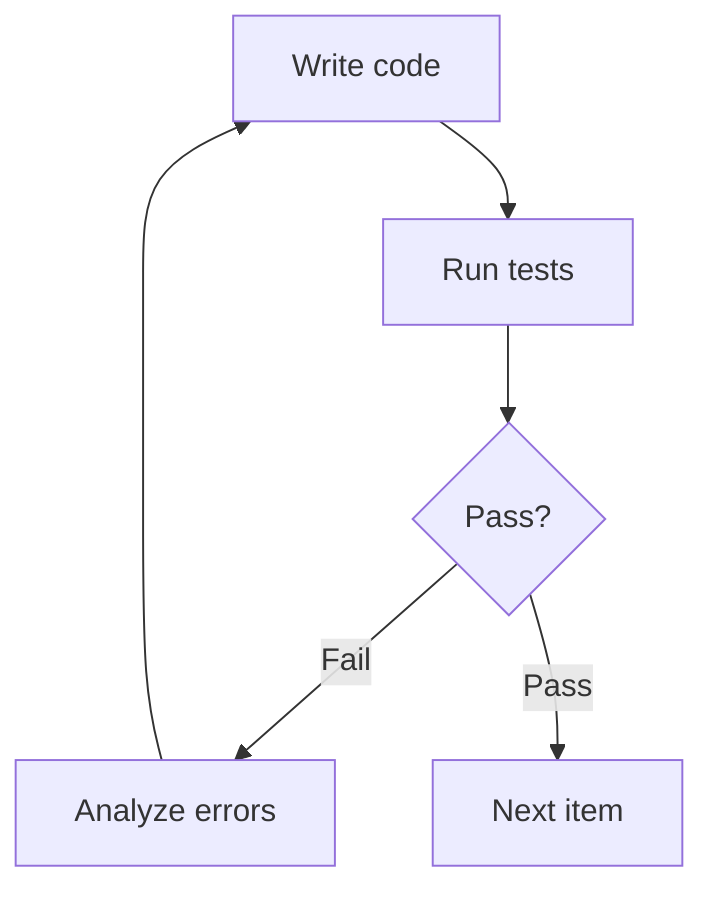

# Harness Engineering

## What is Harness Engineering?

MoAI-ADK implements the **Harness Engineering** paradigm. Instead of writing code themselves, developers **design the environment (the harness) in which AI agents can produce optimal code**.

> "Human steers, agents execute."
> — The engineer's role shifts from writing code to designing the harness: SPECs, quality gates, feedback loops.

Traditional vibe coding lets the AI generate code freely and then reviews the result manually. Harness engineering is the opposite — it guides AI agents with **specifications (SPECs), automated verification, and a continuous feedback loop** to produce code of consistent quality.

So what is a harness? It is the entire system that surrounds the base model and orchestrates execution — the layer that decides how the model thinks and plans, how it calls tools, how it perceives and manages context, where it stores its artifacts, and how its results are evaluated. MoAI-ADK is exactly this harness, layered on top of Claude Code.

## The Three Pillars and the Harness

Harness engineering is where the three pillars of v3.0 meet.

| Pillar | Role within the harness |
|------|------------------|
| **Tokenomics** | The harness assigns model and reasoning depth per task and keeps the token budget |
| **Agentic Loop Engineering** | Loops (`/moai loop`, the goal engine) run and accumulate observations, and the harness learns from them |
| **Agentic Harness** | The 10-agent catalog, the 3-phase workflow, and the TRUST 5 gates form the execution environment |

The second pillar in particular is the key innovation. The realistic near-term path to AI's recursive self-improvement (RSI) is not modifying model weights directly, but **improving the harness around the model**. MoAI-ADK takes exactly this path — it recursively improves the harness (skills and agent guidance), not the model.

## The 7 Core Components


```mermaid
graph TB
    subgraph Harness["Harness Engineering"]
        direction TB
        SF["Scaffolding First<br/>Generate empty file stubs"] --> FC["Failing Checklist<br/>Register acceptance-criteria tasks"]
        FC --> SV["Self-Verify Loop<br/>Code→Test→Fix→Pass"]
        SV --> GC["Garbage Collection<br/>Remove dead code"]
        GC --> CM["Context Map<br/>Maintain architecture docs"]
        CM --> SP["Session Persistence<br/>Track progress across sessions"]
        SP --> LA["Language-Agnostic<br/>Auto-detect 16 languages"]
        LA --> SF
    end

    style Harness fill:#f0f7ff,stroke:#1565C0
```

Each component maps to a specific MoAI command:

| Component | Description | Command |
|----------|------|--------|
| **Self-Verify Loop** | The agent autonomously repeats the write code → test → fail → fix → pass cycle | [`/moai loop`](/en/utility-commands/moai-loop) |
| **Context Map** | Always provides the agent with an architecture map and docs of the codebase | [`/moai codemaps`](/en/quality-commands/moai-codemaps) |
| **Session Persistence** | `progress.md` tracks completed steps across sessions and auto-resumes interrupted work | [`/moai run SPEC-XXX`](/en/workflow-commands/moai-run) |
| **Failing Checklist** | Registers every acceptance criterion as a pending task at run start and checks it off on completion | [`/moai run SPEC-XXX`](/en/workflow-commands/moai-run) |
| **Language-Agnostic** | 16-language support: auto-detects the language and selects the right LSP/linter/test/coverage tools | Every workflow |
| **Garbage Collection** | Periodically scans for and removes dead code, AI slop, and unused imports | [`/moai clean`](/en/utility-commands/moai-clean) |
| **Scaffolding First** | Creates empty file stubs before implementation to prevent code entropy | [`/moai run SPEC-XXX`](/en/workflow-commands/moai-run) |

## How It Works

### 1. Scaffolding First

When `/moai run` starts, the agent creates the required file structure before writing any code:

```
src/
├── auth/
│   ├── handler.go      ← empty stub
│   ├── handler_test.go  ← empty test
│   ├── service.go       ← empty stub
│   └── service_test.go  ← empty test
└── middleware/
    └── jwt.go           ← empty stub
```

This prevents the agent from creating files chaotically and keeps the project structure consistent.

### 2. Failing Checklist

The SPEC's acceptance criteria are automatically registered as a task list:

```
- [ ] JWT token issuance endpoint
- [ ] Token verification middleware
- [ ] Refresh token logic
- [ ] Expired token handling
- [ ] 85%+ test coverage
```

Each item is checked off once it is implemented and its tests pass. Work is complete only when every item is checked.

### 3. Self-Verify Loop

The core cycle the agent runs autonomously:


```mermaid
graph TD
    A["Write code"] --> B["Run tests"]
    B --> C{"Pass?"}
    C -->|"Fail"| D["Analyze errors"]
    D --> A
    C -->|"Pass"| E["Next item"]
```

This loop repeats up to 100 times in `/moai loop` and includes convergence detection (applying an alternative strategy when the same error repeats). If you want to declare the completion condition yourself, use the goal engine (`/moai goal "<condition>"`) — the session keeps working on its own until the condition is met or the turn limit is reached.

### 4. Context Map

The architecture documents generated by `/moai codemaps` give the agent the full structure of the codebase. With them, the agent can:

- Choose an implementation approach that does not conflict with existing code
- Follow the appropriate patterns and conventions
- Understand dependency relationships and gauge the blast radius

### 5. Session Persistence

Even if a Claude Code session is interrupted, `progress.md` records the completed steps:

```markdown
## Progress
- [x] Phase 1: Analysis complete
- [x] Phase 2: Handler implementation
- [ ] Phase 3: Write tests ← resume here
- [ ] Phase 4: Refactoring
```

`/moai run --resume SPEC-XXX` automatically resumes from where it left off.

## The Self-Evolving Harness — the Loop Grows the Harness

The harness is not a fixed environment. As the loop runs, observations accumulate, and the harness learns from them and improves its own guidance.

```
Loop runs → Observations accumulate → Patterns learned → Guidance evolves (approval gate)
```

### The 4-Tier Learning Ladder

| Tier | Observations | Behavior |
|------|---------|------|
| **Observation** | ≥1 | Simple recording |
| **Heuristic** | ≥3 | Pattern recognition |
| **Rule** | ≥5 | Rule formation |
| **AutoUpdate** | ≥10 | Automatic guidance updates — **user approval required** |

### Safeguards

Automatic evolution never runs in a closed loop without human oversight. The evaluator and the permission controls sit **outside** the evolution loop:

- **5-layer safety pipeline** — snapshots and rollback (`moai harness rollback`) let you restore at any time
- **User approval gate** — Tier-4 auto-updates always pass through user approval
- **Constitution system** — immutable rules (FROZEN) are excluded from evolution (see [Constitution System](/en/core-concepts/constitution))

```bash
moai harness status      # Check learning status (observation count, patterns, proposals)
moai harness apply       # Apply a proposal (must pass the user approval gate)
moai harness rollback    # Roll back the last apply
moai harness disable     # Disable learning
```

## Traditional Development vs Harness Engineering

| Aspect | Traditional Development | Harness Engineering |
|------|-----------|-----------------|
| **Developer's role** | Code author | Environment designer |
| **Code production** | Manual writing | Automatic production by AI agents |
| **Quality assurance** | After-the-fact review | Built-in automated verification loop |
| **Session continuity** | Manual notes | Automatic progress tracking |
| **Code cleanup** | Technical debt accumulates | Automatic garbage collection |
| **Documentation** | Separate task | Automatic architecture map generation |
| **Direction of improvement** | Tools stay fixed, humans adapt | The loop accumulates observations and the harness evolves |

## Harness Namespace Policy (template-managed vs user-owned)

When you build your own custom skills or agents, you need to know which assets `moai update` overwrites and which it preserves. MoAI-ADK cleanly separates the namespaces into **"template-managed"** (universally distributed) and **"user-owned"** (user-created).

| Category | Namespace / Path | Origin | `moai update` behavior |
| --- | --- | --- | --- |
| **template-managed** | `moai-*` skills (including `moai-foundation-*`, `moai-workflow-*`, `moai-domain-*`, `moai-ref-*`, `moai-meta-*`), `moai-harness-*` skills | MoAI-ADK package (template) | **Overwrite** — deleted and freshly installed on sync |
| **user-owned** | `hns-*` skills (canonical) + legacy `harness-*` / `my-harness-*` skills, `.claude/agents/harness/` agents | User project | **Preserve** — `moai update` never deletes or modifies them (backed up, then preserved) |

### template-managed (subject to overwrite)

Skills with the `moai-*` prefix and `moai-harness-*` are **universal assets provided by the MoAI-ADK package**. They are distributed to every user project and are **overwritten** with the latest template when `moai update` runs. If you edit these assets directly, your changes will be lost on the next update.

### user-owned (preserved)

Skills with the `hns-*` prefix (the canonical namespace generated by the Harness v4 Builder) and the `.claude/agents/harness/` directory are **owned by the user project**. The previous-generation prefixes `harness-*` / `my-harness-*` are recognized the same way. `moai update` **never deletes or modifies** them; it backs them up before updating and preserves them as-is.

### Implications for Custom Skill Authors

If you want your own domain-specific skills or agents to survive `moai update`, **always use the `hns-*` prefix** (and place agents in `.claude/agents/harness/`). If you create them with a `moai-*` or `moai-harness-*` prefix, they are treated as template-managed and will be overwritten on the next update. When you create a harness with `/moai harness "<natural-language request>"`, the Builder automatically assigns names that follow this rule.

## Next Steps

- [SPEC-Based Development](/en/core-concepts/spec-based-dev) — How to write the SPEC documents that feed the harness
- [TRUST 5 Quality](/en/core-concepts/trust-5) — The five quality criteria the harness verifies
- [Constitution System](/en/core-concepts/constitution) — The immutable rules governing harness evolution
