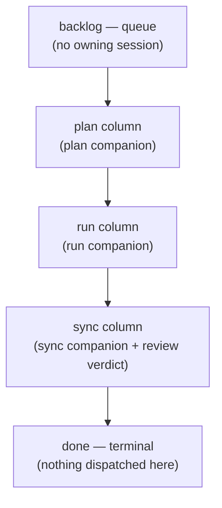
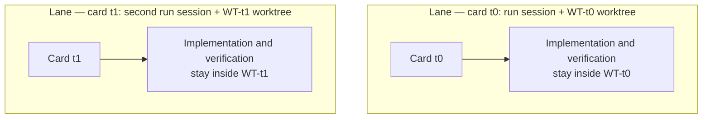

# Kanban Board Terms

The documents that cover Kanban Mode and the operating notes share a vocabulary of nine terms — open the board, the chain, or the session launcher guide anywhere and the same words appear. This page defines those terms in one place. Each entry is one definition plus one example; the rest of the documentation assumes these meanings.

Start with the point that trips people up most: a **lane** and a **column** are different words. The distinction gets its own section below.

## What the board looks like

The board has five columns, fixed and ordered:

`backlog` and `done` deliberately have no owning session. The three middle columns each map to exactly one companion role, which is what makes dispatch a lookup rather than a decision — where the card sits determines who receives it. There is no review column: the sync gate absorbs the review verdict and runs the review lenses itself.

## The nine terms

| Term | Meaning | Example |
|---|---|---|
| **lane** | One parallel work stream that carries a card end to end: one session paired with one worktree. Like a swimlane on a physical kanban board, each stream keeps to its own band and never shares a working tree. "Lane-local verification" means that lane runs only the tests its own change can affect. | The `run` session working in worktree `WT-t0` is one lane |
| **card** | One unit of work on the board. The operator enters it via `/moai todo "<description>"` and refers to it by a short id. A card owns one worktree, one progress record, and its completion evidence. | `t0` — a one-line fix card |
| **column** | One stage of the board, in fixed order: `backlog → plan → run → sync → done`. The three middle columns each map to exactly one companion role. | `/moai run <SPEC-ID>` happens in the `run` column |
| **backlog** | The entry queue of the board. No session owns it by design — work enters only when the operator puts it there. | `/moai todo "rename hint is stale"` appends a card to the backlog |
| **lead** | The single coordinating session (`moai cc -k`). Moves cards between columns only on evidence it read itself, asks the operator to `/clear` companions between phases, and never writes code. | The session that dispatched a card with its worktree instruction |
| **companion** | A worker session launched by hand, one terminal at a time (`moai cc -k --name <role>`), owning one column's work at a time. Named by its bare role; a second live session claiming the same role takes the next free number. | `plan`, `run`, `sync` |
| **run-id** | The short identifier the lead prints at launch. It names the LEAD alone (its session name, leader socket, `MOAI_KANBAN_ID`) — companions are named by role and never carry it. | `a1b2c3` — the lead's own session name |
| **worktree** | The isolated checkout where a card's work happens, entered through the launcher (`moai cc -w <name>` / `EnterWorktree`) — never created with raw `git worktree add`. Branch named `WT-<card-id>`. A worktree outlives a phase: one spans run through sync. | `.claude/worktrees/t0` on branch `WT-t0` |
| **dispatch** | The lead's instruction to one companion: a pointer — card id, SPEC id, phase command, completion signal — never a copy of the work. Written in the operator's conversation language. | "card: t0 — wt: EnterWorktree(t0) … evidence: .moai/reports/t0/" |

## Lane vs column — the most confused pair

A **column** names a phase of the work; a **lane** names who carries one card through those phases. One is a stop on the board, the other is the route through the stops.

Two lanes can flow on the same board at once, and they never enter each other's working trees. That is what makes parallelism safe — no lane's commits leak into another lane's working tree.

## The journey of one card

A real flow in which every term appears once:

1. The operator enters **card** `t0` into the **backlog** via `/moai todo "rename hint is stale"`.
2. The **lead** picks `t0` from the queue and **dispatches** it to the plan companion.
3. The `plan` **companion** writes the SPEC; the lead reads the evidence itself and moves the card to the next **column**.
4. `run` implements in **worktree** `WT-t0` — that session-worktree pair is the **lane**, and verification runs inside the lane too (only the tests the change can affect). The `a1b2c3` naming the lead session is the **run-id**.
5. The sync column passes the same way — the sync gate absorbs the review verdict — and when sync opens the PR, the card reaches done.

Throughout, the card's work happens in `WT-t0` alone. It never mixes with the working tree of a lane that ran in parallel.

## Related documentation

- [Kanban Mode](/en/advanced/kanban-mode) — entry conditions, Origin-Trail Chain design, chain stages
- [`/moai todo`](/en/utility-commands/moai-todo) — the backlog queue that puts cards on the board
- [Harness Engineering](/en/core-concepts/harness-engineering) — how phase chaining and observation sit on the harness design
