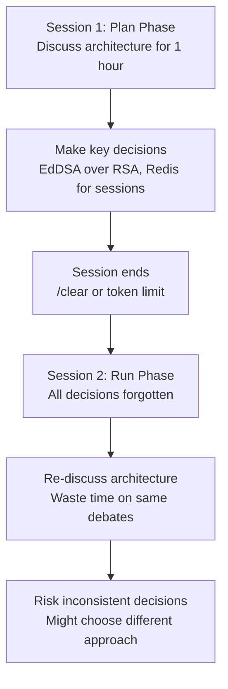
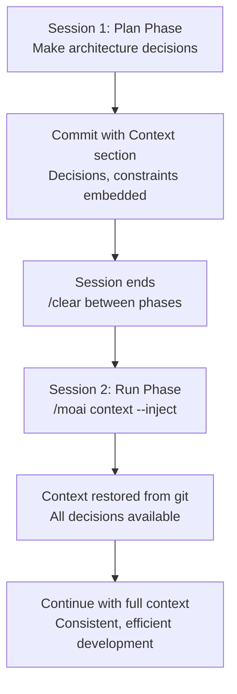
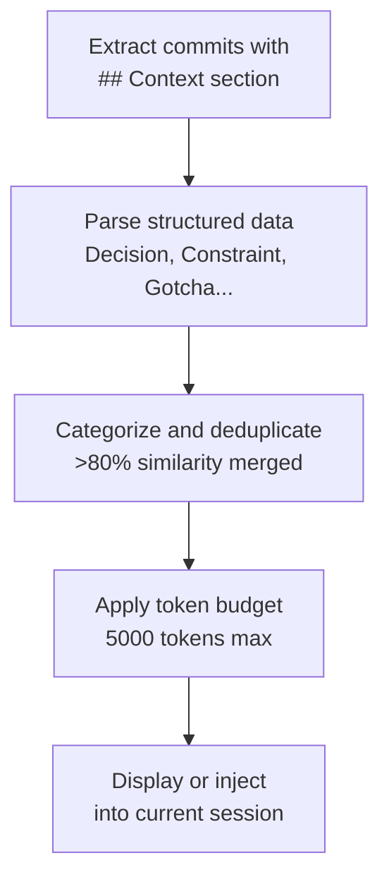
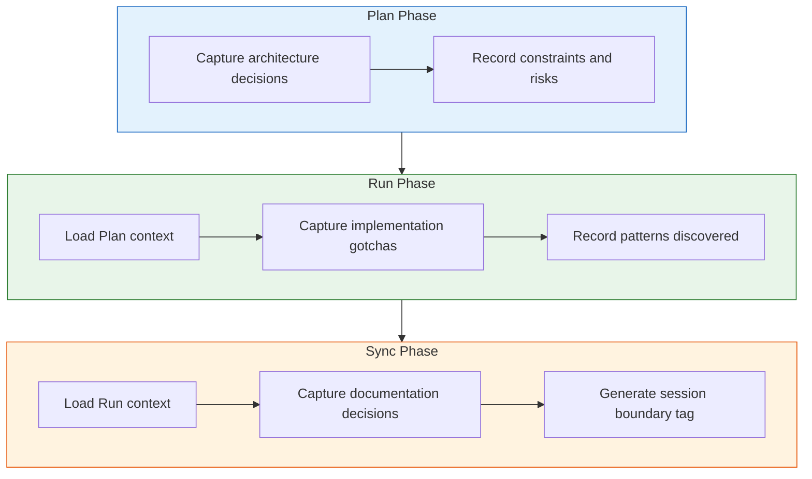

# MoAI Memory

A detailed guide to MoAI-ADK's Git-Based Context Memory System that preserves
AI-developer interaction context across sessions.


  **One-line summary:** MoAI Memory embeds structured context (decisions,
  constraints, gotchas) into git commit messages so that future sessions can
  pick up exactly where you left off.


## What is MoAI Memory?

MoAI Memory is a **Git-Based Context Memory System** that preserves
AI-developer interaction context across sessions using structured git commit
messages. Every implementation commit includes a `## Context` section that
captures the decisions, constraints, and patterns discovered during
development.

Using an everyday analogy, MoAI Memory is like a **doctor's medical chart**.
Every visit, the doctor writes down the diagnosis, prescriptions, and
observations. On the next visit, the doctor reads the chart and immediately
knows the patient's history without asking the same questions again.

| Doctor's Chart | MoAI Memory | Common Point |
|----------------|-------------|--------------|
| Diagnosis and prescriptions | Decisions and constraints | Records what was determined |
| Side effects observed | Gotchas discovered | Records unexpected findings |
| Treatment plan | Patterns and risks | Records approach and cautions |
| Patient preferences | UserPrefs | Records personal preferences |

## Why Do We Need MoAI Memory?

### The Session Continuity Problem

When developing with AI across multiple sessions, the biggest problem is
**losing the context of previous decisions**.



**Common situations where context is lost:**

| Situation | What Happens | Impact |
|-----------|-------------|--------|
| Phase transition | `/clear` between Plan and Run phases | All plan decisions lost |
| Token limit | Long sessions trim early context | Critical architecture decisions lost |
| Team handoff | Different agent handles next phase | Agent lacks previous context |
| Multi-day work | Resume after a day or weekend | Have to re-explain everything |

### How MoAI Memory Solves This

MoAI Memory embeds structured context directly into git commits, so context
**travels with the code**.




**Without MoAI Memory:**

Session 2 starts with zero context. The AI might choose RSA instead of EdDSA,
or forget that Redis was selected for sessions. You spend time re-debating
decisions already made.

**With MoAI Memory:**

A single command loads all previous decisions:

```bash
> /moai context --spec SPEC-AUTH-001 --inject
```



## How It Works

Every implementation commit includes a structured `## Context` section that
captures 6 categories of context:

| Category | Purpose | Example |
|----------|---------|---------|
| **Decision** | Technical choices + rationale | "EdDSA over RSA256 (performance priority)" |
| **Constraint** | Active constraints | "Must maintain /api/v1 backward compatibility" |
| **Gotcha** | Discovered pitfalls | "Redis TTL unreliable for token storage" |
| **Pattern** | Reference implementations used | "middleware chain pattern from auth.go:45" |
| **Risk** | Known risks / deferred items | "Rate limiting deferred to Phase 2" |
| **UserPref** | Developer preferences | "Prefers functional style over OOP" |

### Context Flow Across Sessions

```
Session 1 (Plan)          Session 2 (Run)           Session 3 (Sync)
    |                          |                          |
    v                          v                          v
 Decisions --> git commit --> Context --> git commit --> Context
 Constraints   with ## Context  loaded     with ## Context  loaded
 Patterns      section          from git   section          from git
```

## Commit Format

Both DDD and TDD workflows produce structured commits with context sections.

### TDD Mode Commit

```
🔴 RED: Add failing test for token expiry validation
SPEC: SPEC-AUTH-001
Phase: RUN-RED

## Context (AI-Developer Memory)
- Decision: 15-minute access token TTL (security best practice)
- Gotcha: Clock skew between services requires 30s grace period
- Pattern: Token validation pattern from middleware/auth.go:89

## MX Tags Changed
- Added: @MX:TODO auth_test.go:15 (test for token expiry)
```

### DDD Mode Commit

```
🔴 ANALYZE: Document JWT validation behavior
SPEC: SPEC-AUTH-001
Phase: RUN-ANALYZE

## Context (AI-Developer Memory)
- Decision: Use EdDSA for JWT signing (performance priority)
- Constraint: Must support existing RSA tokens during migration
- Risk: Token rotation deferred to Phase 2

## MX Tags Changed
- Added: @MX:ANCHOR jwt.go:42 (fan_in: 5)
```


  The `## Context` section is automatically generated by the **manager-git
  agent** during commit creation. You do not need to write it manually.


## Context Retrieval

Use the `/moai context` command to retrieve and inject previous context.

### View Context for a SPEC

```bash
# View all context for a specific SPEC
/moai context --spec SPEC-AUTH-001

# View only decisions from the last 7 days
/moai context --category Decision --days 7

# Display compressed summary only
/moai context --spec SPEC-AUTH-001 --summary
```

### Inject Context into Current Session

```bash
# Load previous context into the current session
/moai context --spec SPEC-AUTH-001 --inject
```

This command extracts all context from git commits related to the SPEC and
injects it into the current session, enabling seamless continuation.

### How Retrieval Works



**Token Budget Priority:**

| Priority | Categories | Rationale |
|----------|-----------|-----------|
| 1 (Critical) | Decisions, Constraints | Core architectural context |
| 2 (Important) | Gotchas, Risks | Prevent repeating mistakes |
| 3 (Nice-to-have) | Patterns, UserPrefs | Efficiency improvements |

## Context Categories in Detail

### Decision

Records **what was chosen and why**. The most important category for session
continuity.

```
- Decision: EdDSA over RSA256 (user requested, performance priority)
- Decision: Use Redis for session storage (low latency requirement)
- Decision: Separate auth service from main API (microservice boundary)
```

### Constraint

Records **active limitations** that must be respected.

```
- Constraint: Must maintain /api/v1 backward compatibility
- Constraint: API response time within 500ms (P95)
- Constraint: Cannot use external OAuth providers (air-gapped environment)
```

### Gotcha

Records **unexpected pitfalls** discovered during development. Prevents the
same mistakes from being repeated.

```
- Gotcha: Redis TTL unreliable for RefreshToken storage, use DB instead
- Gotcha: Clock skew between services requires 30s grace period
- Gotcha: bcrypt cost factor 12 causes 300ms delay on low-end hardware
```

### Pattern

Records **reference implementations** that guided the current work.

```
- Pattern: middleware chain pattern from auth.go:45
- Pattern: error handling pattern from pkg/errors/handler.go
- Pattern: repository pattern from internal/user/repository.go
```

### Risk

Records **known risks** and deferred items for future sessions.

```
- Risk: Rate limiting deferred to Phase 2
- Risk: Token rotation not yet implemented (security debt)
- Risk: No load testing for concurrent session handling
```

### UserPref

Records **developer preferences** for consistent interaction style.

```
- UserPref: Prefers functional style over OOP
- UserPref: Wants detailed commit messages with context
- UserPref: Prefers Go table-driven tests
```

## Key Benefits

| Benefit | Description |
|---------|-------------|
| **Zero Dependencies** | Uses git itself as the memory store -- no external databases or services |
| **Team Sharing** | Context travels with `git clone` -- automatic team knowledge transfer |
| **Full Audit Trail** | `git log` provides complete decision history |
| **Session Continuity** | Resume work with full context after `/clear` or session breaks |
| **Phase Transitions** | Context flows naturally from Plan to Run to Sync |

## Integration with MoAI Workflow

MoAI Memory integrates with each phase of the Plan-Run-Sync pipeline:



### Session Boundary Tags

After each phase completes, a git tag is created to mark the boundary:

```bash
# Example session boundary tag
git tag -a "moai/SPEC-AUTH-001/run-complete" \
  -m "Run phase completed
SPEC: SPEC-AUTH-001
Decisions: 5, Constraints: 3, Risks: 2
Next action: /moai sync SPEC-AUTH-001"
```

These tags help `/moai context` quickly locate phase transitions.

## Design Inspiration

MoAI Memory is inspired by
[claude-mem](https://github.com/thedotmack/claude-mem),
[claude-brain](https://github.com/memvid/claude-brain), and
[memory-mcp](https://github.com/yuvalsuede/memory-mcp), adapted for a
Git-native approach that requires zero additional infrastructure.

## Related Documents

- [What is MoAI-ADK?](/core-concepts/what-is-moai-adk) -- Understand the
  overall architecture of MoAI-ADK
- [SPEC-Based Development](/core-concepts/spec-based-dev) -- Learn how SPEC
  documents are created and managed
- [TRUST 5 Quality](/core-concepts/trust-5) -- Learn the quality validation
  criteria for all code changes
