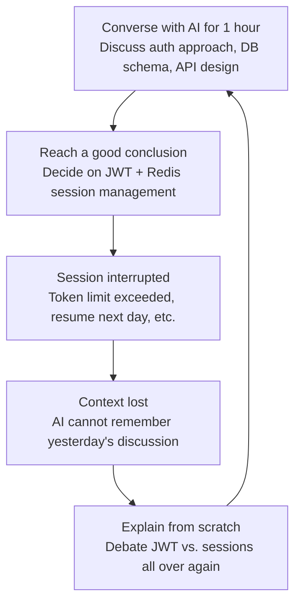
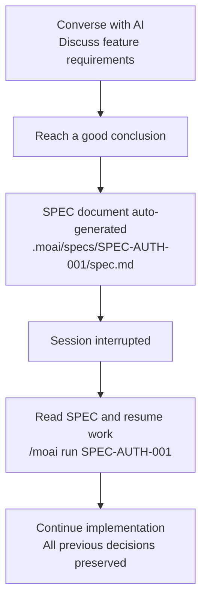
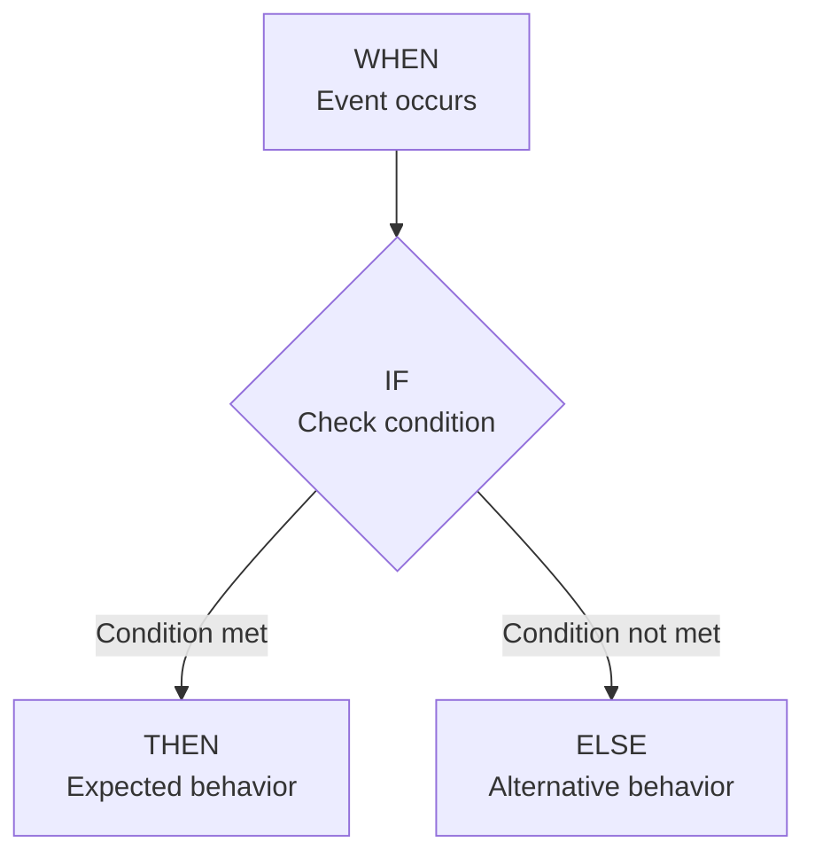
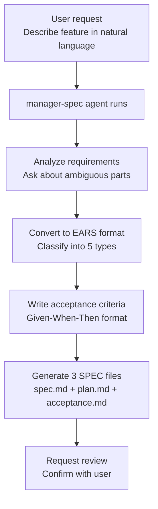
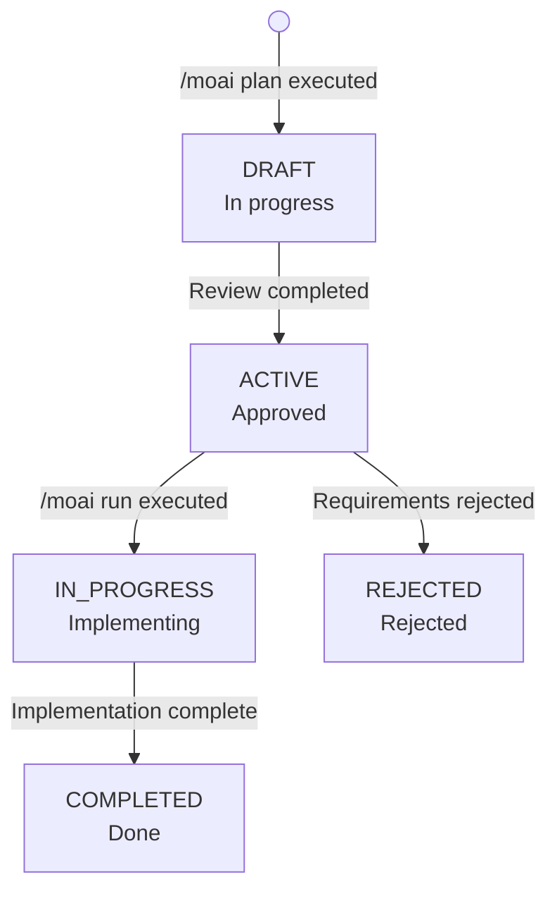

# SPEC-Based Development

A detailed guide to MoAI-ADK's SPEC-based development methodology.


  **One-line summary:** SPEC is "documenting your conversations with AI." Even
  if the session is interrupted, you can always pick up where you left off as
  long as you have the SPEC.



  **SPEC is for Agents:** SPEC is not something developers need to memorize or
  study. It is a document that agents reference when performing tasks. A
  conceptual understanding of SPEC principles and usage is sufficient.



  **SPEC consists of 3 files:** When you run `/moai plan`, three files are
  generated simultaneously: `spec.md` (EARS requirements), `plan.md`
  (implementation plan), and `acceptance.md` (acceptance criteria).


## What is SPEC?

**SPEC** (Specification) is a document that defines project requirements in a
structured format.

Using an everyday analogy, SPEC is like a **cooking recipe**. When cooking from
memory alone, it is easy to forget ingredients or mix up the order. But if you
write down the recipe, anyone can prepare the same dish accurately.

| Cooking Recipe                            | SPEC Document            | Common Point                              |
| ----------------------------------------- | ------------------------ | ----------------------------------------- |
| List of required ingredients              | List of requirements     | Defines what is needed                    |
| Cooking order                             | Implementation order     | Defines the sequence of steps             |
| Photo of the finished dish                | Acceptance criteria      | Defines what the finished result looks like |
| No vague expressions like "a pinch of salt" | Clear with EARS format | Removes ambiguity                         |

## Why Do We Need SPEC?

### Vibe Coding's Context Loss Problem

When writing code while conversing with AI, the biggest problem is **context loss**.



**Specific situations where context loss occurs:**

| Situation             | What Happens                                        | Result                        |
| --------------------- | --------------------------------------------------- | ----------------------------- |
| Session timeout       | Previous conversation disappears after some time    | Decisions lost                |
| `/clear` executed     | Context is reset to save tokens                     | Entire previous context lost  |
| Token limit exceeded  | Long conversations trim old content first           | Early decisions lost          |
| Resume the next day   | New session has no knowledge of yesterday's chat    | Must re-explain everything    |

### Solving the Problem with SPEC

SPEC fundamentally solves this problem by **saving conversations to files**.



**The difference with and without SPEC:**


**Working without SPEC:**

Suppose you spent 1 hour discussing "user authentication" with AI yesterday.
JWT or sessions? Token expiration time? Where to store refresh tokens? You have
to discuss all of this again from scratch.

**Working with SPEC:**

A single line is all it takes to start implementing exactly where you left off:

```bash
> /moai run SPEC-AUTH-001
```



## EARS Format

**EARS** (Easy Approach to Requirements Syntax) is a method for writing
unambiguous requirements. It removes natural language ambiguity and converts
requirements into a testable format.

EARS provides 5 types of requirement patterns.

### 1. Ubiquitous (Always True)

Requirements the system must **always** comply with. They apply unconditionally.

**Format:** "The system shall ~"

**Example:**

```yaml
- id: REQ-001
  type: ubiquitous
  priority: HIGH
  text: "The system shall validate all user inputs"
  acceptance_criteria:
    - "Perform type validation for all input values"
    - "Use parameterized queries to prevent SQL Injection"
    - "Escape output to prevent XSS"
```

**Everyday analogy:** Like "always wear a seatbelt when driving." No special
conditions -- just always follow it.

### 2. Event-driven (Event-Based)

Defines how the system should respond when a specific event occurs.

**Format:** "WHEN ~, IF ~, THEN ~"



**Example:**

```yaml
- id: REQ-002
  type: event-driven
  priority: HIGH
  text: |
    WHEN user clicks the login button,
    IF email and password are valid,
    THEN the system shall issue a JWT token and redirect to the dashboard
  acceptance_criteria:
    - given: "A registered user account exists"
      when: "Login with correct email and password"
      then: "200 response with JWT token issued"
      and: "Token expiration time is 1 hour"
```

**Everyday analogy:** Like "When the doorbell rings (WHEN), check the monitor
and if it is someone I know (IF), open the door (THEN)."

### 3. State-driven (State-Based)

Defines how the system should behave while a specific state is maintained.

**Format:** "WHILE ~, the system shall ~"

**Example:**

```yaml
- id: REQ-003
  type: state-driven
  priority: MEDIUM
  text: |
    WHILE user is logged in,
    the system shall refresh the session every 5 minutes
  acceptance_criteria:
    - "Auto-refresh 5 minutes after last activity"
    - "Show notification 5 minutes before session expires"
    - "Auto-logout after 30 minutes of inactivity"
```

**Everyday analogy:** Like "While the air conditioner is on (WHILE), maintain
the room temperature at 25 degrees Celsius."

### 4. Unwanted (Prohibited)

Defines what the system must **never** do. Primarily used for security-related
requirements.

**Format:** "The system shall not ~"

**Example:**

```yaml
- id: REQ-004
  type: unwanted
  priority: CRITICAL
  text: "The system shall not store passwords in plain text"
  acceptance_criteria:
    - "Passwords hashed with bcrypt (cost factor 12)"
    - "Unhashed passwords not included in logs"
    - "Cannot store plain text passwords in the database"

- id: REQ-005
  type: unwanted
  priority: CRITICAL
  text: "The system shall not use hardcoded secret keys"
  acceptance_criteria:
    - "All secret keys use environment variables or a secret manager"
    - "No secret keys included in code"
    - "Prevent secret keys from appearing in Git commits"
```

**Everyday analogy:** Like "Never hide the house key under the doormat."
Explicitly states what must NOT be done.

### 5. Optional (Nice-to-Have)

Features that are recommended but not required.

**Format:** "Where possible, the system shall ~"

**Example:**

```yaml
- id: REQ-006
  type: optional
  priority: LOW
  text: "Where possible, the system shall send an email notification on login"
  acceptance_criteria:
    - "Only works if an email server is configured"
    - "Provide an option to disable notifications"
```

**Everyday analogy:** Like "Make dessert too if there is time." Nice to have,
but not a problem if skipped.

### EARS at a Glance

| Type             | Format                                 | Purpose                     | Priority         |
| ---------------- | -------------------------------------- | --------------------------- | ---------------- |
| **Ubiquitous**   | "The system shall ~"                   | Always-applicable rules     | Usually HIGH     |
| **Event-driven** | "WHEN ~, THEN ~"                       | Define event responses      | Varies by feature |
| **State-driven** | "WHILE ~, the system shall ~"          | State-maintaining behavior  | Usually MEDIUM   |
| **Unwanted**     | "The system shall not ~"               | Prohibitions (security)     | Usually CRITICAL |
| **Optional**     | "Where possible, the system shall ~"   | Optional features           | Usually LOW      |

## SPEC Document Structure

SPEC documents are automatically generated by the **manager-spec agent**.
Developers do not need to memorize the EARS format -- simply make a request in
natural language and the agent handles the conversion.

When you run `/moai plan`, **3 files** are generated simultaneously inside a
single SPEC directory:

| File | Role | Contents |
| --- | --- | --- |
| `spec.md` | EARS requirements definition | YAML frontmatter, requirements (5 EARS types), constraints, dependencies |
| `plan.md` | Implementation plan | Task breakdown, tech stack specification, risk analysis and mitigation |
| `acceptance.md` | Acceptance criteria | Given/When/Then scenarios, edge cases, performance and quality gates |

### spec.md -- EARS Requirements

```yaml
---
id: SPEC-AUTH-001               # Unique identifier
title: User Authentication System # Clear and concise title
priority: HIGH                  # HIGH, MEDIUM, LOW
status: ACTIVE                  # DRAFT, ACTIVE, IN_PROGRESS, COMPLETED
created: 2025-01-12             # Creation date
updated: 2025-01-12             # Last modified date
author: Development Team         # Author
version: 1.0.0                  # Document version
---

# User Authentication System

## Overview
Implement JWT-based user authentication system

## Requirements
### Ubiquitous
- The system shall require authentication for all API requests

### Event-driven
- WHEN user logs in, THEN the system shall issue a JWT

### Unwanted
- The system shall not store passwords in plain text

## Constraints
- API response time within 500ms
- Password bcrypt hashing (cost factor 12)

## Dependencies
- Redis (session management)
- PostgreSQL (user data)
```

### plan.md -- Implementation Plan

```markdown
# Implementation Plan

## Task Breakdown
1. Create user model and migration
2. Implement JWT token issuance/verification utility
3. Implement login/signup API endpoints
4. Implement authentication middleware
5. Implement refresh token renewal logic

## Tech Stack
- Go 1.23 + Fiber v2
- PostgreSQL 16 + GORM
- Redis 7 (session/token storage)

## Risk Analysis
| Risk | Impact | Mitigation Strategy |
| --- | --- | --- |
| Token theft | HIGH | Refresh token rotation, HttpOnly cookies |
| Brute force attack | MEDIUM | Rate limiting, account lockout |
```

### acceptance.md -- Acceptance Criteria

```markdown
# Acceptance Criteria

## Scenarios

### AC-01: Successful Login
- **Given** a registered user account exists
- **When** logging in with correct email and password
- **Then** return 200 response with JWT token set

### AC-02: Invalid Credentials
- **Given** a registered user account exists
- **When** logging in with an incorrect password
- **Then** return 401 response with a generic error message

## Edge Cases
- Return 401 when attempting renewal with an expired refresh token
- Expire the oldest session when concurrent login limit is exceeded

## Quality Gates
- API response time: within 500ms (P95)
- Test coverage: 85% or above
```

## SPEC Workflow

SPEC creation starts with a single `/moai plan` command.



**How to run:**

```bash
# SPEC creation command
> /moai plan "Implement user authentication feature"
```

Running this command automatically proceeds through the following steps:

1. **Requirements analysis:** manager-spec analyzes what "user authentication
   feature" means
2. **Clarification questions:** If anything is ambiguous, it asks the user
   (e.g., "Do you prefer JWT or sessions?")
3. **EARS conversion:** Automatically classifies the natural language request
   into the 5 EARS types
4. **3-file generation:** Creates `spec.md`, `plan.md`, and `acceptance.md`
   simultaneously in the `.moai/specs/SPEC-AUTH-001/` directory
5. **Review request:** Shows the generated SPEC to the user and asks for
   confirmation


  **Important:** Always review SPEC documents generated by agents at least once.
  AI may misinterpret or omit requirements. In particular, verify that
  acceptance criteria are testable and that priorities are appropriate.


## SPEC File Location and Management

### File Structure

```
.moai/
└── specs/
    ├── SPEC-AUTH-001/
    │   ├── spec.md          # EARS requirements
    │   ├── plan.md          # Implementation plan
    │   └── acceptance.md    # Acceptance criteria
    ├── SPEC-PAYMENT-001/
    │   ├── spec.md
    │   ├── plan.md
    │   └── acceptance.md
    └── SPEC-SEARCH-001/
        ├── spec.md
        ├── plan.md
        └── acceptance.md
```

### SPEC Status Management

Each SPEC transitions through statuses over its lifecycle.



| Status        | Meaning                                 | Possible Next Statuses  |
| ------------- | --------------------------------------- | ----------------------- |
| `DRAFT`       | In progress, needs review               | ACTIVE, REJECTED        |
| `ACTIVE`      | Approved, ready for implementation      | IN_PROGRESS, REJECTED   |
| `IN_PROGRESS` | Implementation underway                 | COMPLETED, REJECTED     |
| `COMPLETED`   | All acceptance criteria met, done       | (Final status)          |
| `REJECTED`    | Requirements rejected, needs rewriting  | (Final status)          |

## Practical Example: JWT Authentication SPEC

Here is an example of a SPEC actually generated by running `/moai plan`.

```bash
# Generate the SPEC
> /moai plan "JWT-based user authentication system. Includes login, signup, and token renewal features"
```

The following 3 files are created in the `.moai/specs/SPEC-AUTH-001/` directory.

**spec.md -- EARS Requirements:**

```yaml
---
id: SPEC-AUTH-001
title: JWT-Based User Authentication System
priority: HIGH
status: ACTIVE
created: 2025-01-15
version: 1.0.0
---

# JWT-Based User Authentication System

## Overview
A user authentication system using JWT tokens.
Implements login, signup, and token renewal features.

## Requirements

### Ubiquitous
- REQ-U01: The system shall transmit all authentication tokens over HTTPS only
- REQ-U02: The system shall validate all user inputs

### Event-driven
- REQ-E01: WHEN user submits the signup form,
  IF the email is not already taken,
  THEN the system shall create an account and send a welcome email
- REQ-E02: WHEN user logs in,
  IF credentials are valid,
  THEN the system shall issue an Access Token (1 hour) and Refresh Token (7 days)

### Unwanted
- REQ-N01: The system shall not store passwords in plain text
- REQ-N02: The system shall not issue new tokens using an expired Refresh Token

### Optional
- REQ-O01: Where possible, the system shall support social login (Google, GitHub)

## Constraints
- Password: bcrypt (cost factor 12)
- Access Token expiration: 1 hour
- Refresh Token expiration: 7 days
- API response time: within 500ms (P95)
```

**plan.md -- Implementation Plan:**

```markdown
# Implementation Plan

## Task Breakdown
1. Create user model and DB migration
2. Implement password hashing utility
3. Implement JWT token issuance/verification utility
4. Implement signup API endpoint
5. Implement login API endpoint
6. Implement authentication middleware
7. Implement refresh token renewal logic

## Tech Stack
- Go 1.23 + Fiber v2
- PostgreSQL 16 + GORM
- Redis 7 (Refresh Token storage)

## Risk Analysis
| Risk | Impact | Mitigation Strategy |
| --- | --- | --- |
| Token theft | HIGH | Refresh token rotation, HttpOnly cookies |
| Brute force attack | MEDIUM | Rate limiting, account lockout |
```

**acceptance.md -- Acceptance Criteria:**

```markdown
# Acceptance Criteria

## Scenarios

### AC-01: Successful Login
- **Given** a registered user account exists
- **When** logging in with correct email and password
- **Then** return 200 response with JWT token set (Access + Refresh)

### AC-02: Wrong Password
- **Given** a registered user account exists
- **When** logging in with an incorrect password
- **Then** return 401 response

### AC-03: Duplicate Signup
- **Given** an email is already registered
- **When** attempting to sign up with the same email
- **Then** return 409 response

### AC-04: Token Renewal
- **Given** a valid Refresh Token exists
- **When** requesting token renewal
- **Then** return a new Access Token

## Quality Gates
- API response time: within 500ms (P95)
- Test coverage: 85% or above
```

**Starting implementation with this SPEC:**

```bash
# After reviewing the SPEC, start implementation
> /moai run SPEC-AUTH-001
```

This single command automatically implements all SPEC requirements according to
the configured development methodology (DDD or TDD). New projects use **TDD**
(RED-GREEN-REFACTOR), while existing projects use **DDD**
(ANALYZE-PRESERVE-IMPROVE).

## Tips for Writing SPECs

### Converting Natural Language to EARS

Here is a comparison of how everyday requests are transformed into EARS format.

| Natural Language Request          | EARS Format                                                                             |
| --------------------------------- | --------------------------------------------------------------------------------------- |
| "Build me a login feature"        | WHEN user presents valid credentials, THEN the system shall issue an authentication token |
| "Keep passwords secure"           | The system shall not store passwords in plain text (Unwanted)                            |
| "It needs to be fast"             | Login response time shall be within 500ms (Ubiquitous)                                  |
| "Handle errors properly"          | WHEN an error occurs, THEN the system shall display a clear message to the user         |
| "Would be nice to have"           | Where possible, the system shall support real-time notifications (Optional)              |


  You do not need to write EARS format yourself. Just make a natural language
  request with `/moai plan` and the **manager-spec agent will automatically
  convert it to EARS format**. The table above is a reference to help you
  understand how the conversion works.


## Related Documents

- [What is MoAI-ADK?](/core-concepts/what-is-moai-adk) -- Understand the
  overall architecture of MoAI-ADK
- [Development Methodologies (DDD/TDD)](/core-concepts/ddd) -- Learn the
  DDD/TDD methodologies for safely implementing code based on SPECs
- [TRUST 5 Quality](/core-concepts/trust-5) -- Learn the quality validation
  criteria for implemented code
