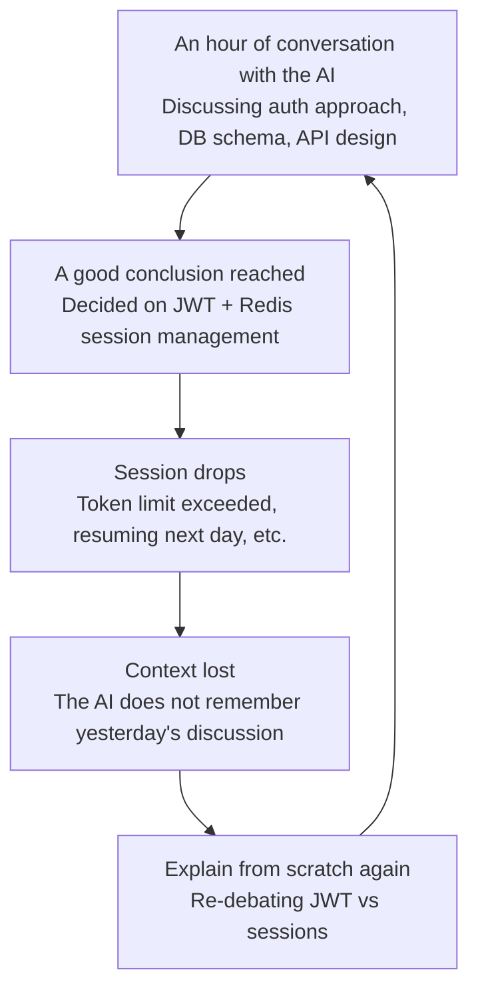
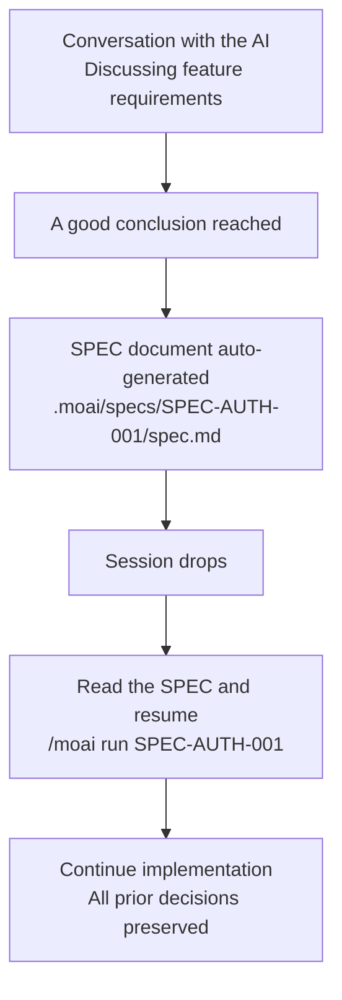
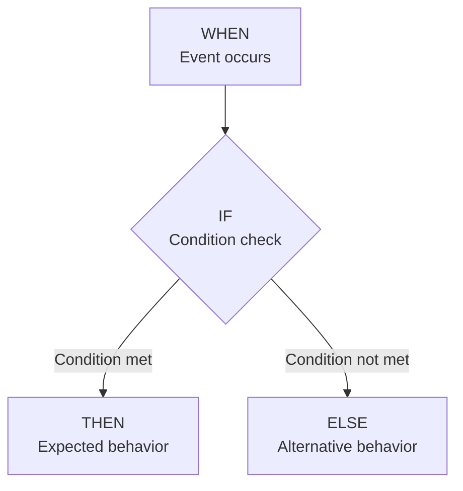
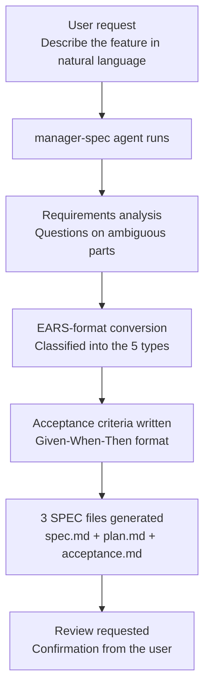
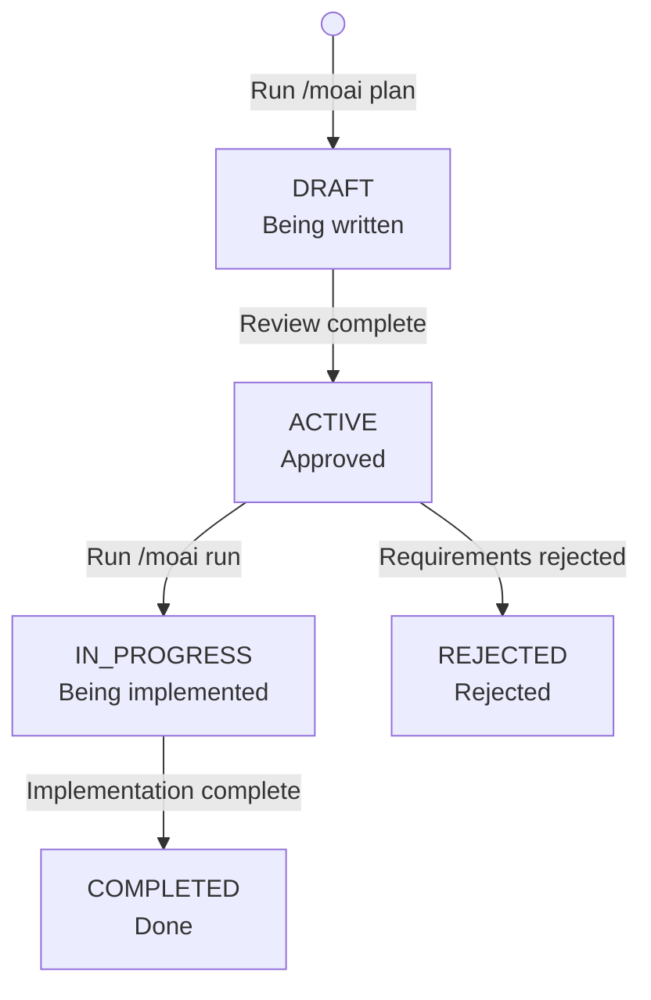

A detailed guide to MoAI-ADK's SPEC-based development methodology. The SPEC is the input to the agentic harness and a hidden tool of tokenomics — with requirements preserved as files, you can end a session or empty the context with `/clear` and still continue the work from a single SPEC line, never burning tokens on repeating the same explanation.


  **One-line summary:** A SPEC is "recording your conversation with the AI as a document". Even
  when a session drops, as long as the SPEC exists you can continue the work at any time.



  **SPECs are for the Agent:** A SPEC is not something for developers to memorize or study.
  It is the document the agent references when performing the work. A conceptual understanding of
  how SPECs work and how they are used is enough.



  **A SPEC consists of 3 files:** running `/moai plan` generates `spec.md` (EARS requirements), `plan.md` (implementation plan), and `acceptance.md` (acceptance criteria) at the same time.


## What is a SPEC?

A **SPEC** (Specification) is a document defining the project's requirements in a structured
format.

By everyday analogy, a SPEC is like a **cooking recipe**. If you keep a dish only in your head,
it is easy to forget ingredients or steps. But with a written recipe, anyone can cook
the exact same dish.

| Cooking recipe                       | SPEC document              | What they share                           |
| --------------------------------- | ---------------------- | -------------------------------- |
| The list of ingredients                  | The list of requirements          | Defines what is needed             |
| Cooking steps                         | Implementation order              | Defines the order of work        |
| A photo of the finished dish                         | Acceptance criteria              | Defines what the finished result looks like |
| No vague phrases like "a pinch of salt" | Clear via the EARS format | Removes ambiguity                      |

## Why Do You Need a SPEC?

### The Context-Loss Problem of Vibe Coding

When writing code through conversation with an AI, the biggest problem is **context loss**.


```mermaid
flowchart TD
    A["An hour of conversation with the AI\nDiscussing auth approach, DB schema, API design"] --> B["A good conclusion reached\nDecided on JWT + Redis session management"]
    B --> C["Session drops\nToken limit exceeded, resuming next day, etc."]
    C --> D["Context lost\nThe AI does not remember yesterday's discussion"]
    D --> E["Explain from scratch again\nRe-debating JWT vs sessions"]
    E --> A
```

**Concrete situations where context loss happens:**

| Situation              | What happens                 | Result                   |
| ----------------- | ------------------------------------ | ---------------------- |
| Session timeout     | Earlier conversation disappears after a while | Discussed decisions are lost |
| Running `/clear`     | Context reset to save tokens | The entire prior context is wiped  |
| Token limit exceeded    | Long conversations get truncated from the oldest content | Early decisions are lost     |
| Resuming the next day | The new session knows nothing of yesterday's conversation       | Everything must be re-explained  |

### Solving It with a SPEC

A SPEC fundamentally solves this problem by **saving the conversation as files**. Decisions recorded in files survive independently of the context window — the flagship example of what harness engineering calls "durable state in files".


```mermaid
flowchart TD
    A["Conversation with the AI\nDiscussing feature requirements"] --> B["A good conclusion reached"]
    B --> C["SPEC document auto-generated\n.moai/specs/SPEC-AUTH-001/spec.md"]
    C --> D["Session drops"]
    D --> E["Read the SPEC and resume\n/moai run SPEC-AUTH-001"]
    E --> F["Continue implementation\nAll prior decisions preserved"]
```

**The difference with and without a SPEC:**


**Working without a SPEC:**

Suppose you spent an hour yesterday discussing "user authentication" with the AI. JWT or
sessions? What token expiry? Where to store the refresh token?... You have to
debate all of it again.

**With a SPEC:**

The single line below starts the implementation exactly as decided yesterday.

```bash
> /moai run SPEC-AUTH-001
```



## The EARS Format

**EARS** (Easy Approach to Requirements Syntax) is a method for writing requirements
clearly. It removes the ambiguity of natural language and converts requirements into a form
that tests can verify.

EARS provides five types of requirement patterns.

### 1. Ubiquitous (Always True)

Requirements the system must **always** satisfy. They apply unconditionally, at all times.

**Form:** "The system shall ..."

**Example:**

```yaml
- id: REQ-001
  type: ubiquitous
  priority: HIGH
  text: "The system shall validate all user input"
  acceptance_criteria:
    - "Type validation performed on every input value"
    - "Parameterized queries used to prevent SQL Injection"
    - "Output escaping to prevent XSS"
```

**Everyday analogy:** Like "always wear a seatbelt when driving". It must be observed at all
times, no special conditions.

### 2. Event-driven

Defines how the system must react when a specific event occurs.

**Form:** "WHEN ..., IF ..., THEN the system shall ..."


```mermaid
flowchart TD
    A["WHEN\nEvent occurs"] --> B{"IF\nCondition check"}
    B -->|Condition met| C["THEN\nExpected behavior"]
    B -->|Condition not met| D["ELSE\nAlternative behavior"]
```

**Example:**

```yaml
- id: REQ-002
  type: event-driven
  priority: HIGH
  text: |
    WHEN the user clicks the login button,
    IF the email and password are valid,
    THEN issue a JWT token and redirect to the dashboard
  acceptance_criteria:
    - given: "a registered user account exists, and"
      when: "logging in with the correct email and password"
      then: "a 200 response with a JWT token issued"
      and: "token expiry is 1 hour"
```

**Everyday analogy:** Like "when the doorbell rings (WHEN), if the monitor shows someone you know (IF),
open the door (THEN)".

### 3. State-driven

Defines how the system must behave while a particular state holds.

**Form:** "WHILE ..., the system shall ..."

**Example:**

```yaml
- id: REQ-003
  type: state-driven
  priority: MEDIUM
  text: |
    WHILE the user is logged in,
    the system shall refresh the session every 5 minutes
  acceptance_criteria:
    - "Automatic refresh 5 minutes after the last activity"
    - "Notification displayed 5 minutes before session expiry"
    - "Automatic logout after 30 minutes of inactivity"
```

**Everyday analogy:** Like "while the air conditioner is on (WHILE), keep the room at
25 degrees".

### 4. Unwanted (Prohibitions)

Defines what the system must **never** do. Mostly used for security requirements.

**Form:** "The system shall not ..."

**Example:**

```yaml
- id: REQ-004
  type: unwanted
  priority: CRITICAL
  text: "The system shall not store passwords in plain text"
  acceptance_criteria:
    - "Passwords hashed with bcrypt (cost factor 12)"
    - "Unhashed passwords never included in logs"
    - "Plain-text passwords cannot be stored in the database"

- id: REQ-005
  type: unwanted
  priority: CRITICAL
  text: "The system shall not use hardcoded secret keys"
  acceptance_criteria:
    - "All secrets use environment variables or a secrets manager"
    - "No secrets included in the code"
    - "Secrets prevented from entering Git commits"
```

**Everyday analogy:** Like "do not leave the key under the doormat". It states what must not
be done.

### 5. Optional (Optional Features)

Features whose implementation is recommended but not required.

**Form:** "Where possible, the system shall ..."

**Example:**

```yaml
- id: REQ-006
  type: optional
  priority: LOW
  text: "Where possible, the system shall send an email notification on login"
  acceptance_criteria:
    - "Works only when an email server is configured"
    - "An option to disable notifications is provided"
```

**Everyday analogy:** Like "it would be nice to make dessert too, time permitting". Nice
to have, fine without.

### EARS at a Glance

| Type             | Form                          | Use               | Priority         |
| ---------------- | ----------------------------- | ------------------ | ---------------- |
| **Ubiquitous**   | "The system shall ..."         | Rules that always apply | Usually HIGH        |
| **Event-driven** | "WHEN ..., THEN the system shall ..." | Defining event reactions   | Varies by feature |
| **State-driven** | "WHILE ..., the system shall ..."  | Behavior while a state holds     | Usually MEDIUM      |
| **Unwanted**     | "The system shall not ..."      | Prohibitions (security)   | Usually CRITICAL    |
| **Optional**     | "Where possible, the system shall ..."      | Optional features        | Usually LOW         |

## SPEC Document Structure

SPEC documents are generated automatically by the **manager-spec agent**. Developers do not need
to memorize the EARS format — make the request in natural language and the agent converts it.

Running `/moai plan` generates **3 files** at once inside a single SPEC directory:

| File | Role | Content |
| --- | --- | --- |
| `spec.md` | EARS requirements definition | YAML frontmatter, requirements (5 EARS types), constraints, dependencies |
| `plan.md` | Implementation plan | Work breakdown, tech-stack specification, risk analysis and mitigation strategies |
| `acceptance.md` | Acceptance criteria | Given/When/Then scenarios, edge cases, performance and quality gates |

### spec.md -- EARS Requirements

```yaml
---
id: SPEC-AUTH-001               # Unique identifier
title: User Authentication System         # Clear, concise title
priority: HIGH                  # HIGH, MEDIUM, LOW
status: ACTIVE                  # DRAFT, ACTIVE, IN_PROGRESS, COMPLETED
created: 2025-01-12             # Creation date
updated: 2025-01-12             # Last modified date
author: Dev Team                   # Author
version: 1.0.0                  # Document version
---

# User Authentication System

## Overview
Implement a JWT-based user authentication system

## Requirements
### Ubiquitous
- The system shall require authentication for every API request

### Event-driven
- WHEN the user logs in, THEN issue a JWT

### Unwanted
- The system shall not store passwords in plain text

## Constraints
- API response time within 500ms
- Password hashing with bcrypt (cost factor 12)

## Dependencies
- Redis (session management)
- PostgreSQL (user data)
```

### plan.md -- Implementation Plan

```markdown
# Implementation Plan

## Work Breakdown
1. Create the user model and migrations
2. Implement JWT token issuance/verification utilities
3. Implement the login/signup API endpoints
4. Implement the authentication middleware
5. Implement the refresh-token renewal logic

## Tech Stack
- Go 1.23 + Fiber v2
- PostgreSQL 16 + GORM
- Redis 7 (session/token storage)

## Risk Analysis
| Risk | Impact | Mitigation |
| --- | --- | --- |
| Token theft | HIGH | Refresh-token rotation, HttpOnly cookies |
| Brute force | MEDIUM | Rate limiting, account lockout |
```

### acceptance.md -- Acceptance Criteria

```markdown
# Acceptance Criteria

## Scenarios

### AC-01: Successful login
- **Given** a registered user account exists, and
- **When** logging in with the correct email and password
- **Then** return a 200 response with the JWT token set

### AC-02: Invalid credentials
- **Given** a registered user account exists, and
- **When** logging in with a wrong password
- **Then** return a 401 response with a generic error message

## Edge Cases
- Renewal with an expired refresh token returns 401
- When the concurrent-login limit is exceeded, expire the oldest session

## Quality Gates
- API response time: within 500ms (P95)
- Test coverage: 85% or higher
```

## The SPEC Workflow

SPEC creation starts with a single `/moai plan` command.


```mermaid
flowchart TD
    A["User request\nDescribe the feature in natural language"] --> B["manager-spec agent runs"]
    B --> C["Requirements analysis\nQuestions on ambiguous parts"]
    C --> D["EARS-format conversion\nClassified into the 5 types"]
    D --> E["Acceptance criteria written\nGiven-When-Then format"]
    E --> F["3 SPEC files generated\nspec.md + plan.md + acceptance.md"]
    F --> G["Review requested\nConfirmation from the user"]
```

**How to run it:**

```bash
# SPEC creation command
> /moai plan "Implement user authentication"
```

Running this command proceeds automatically as follows:

1. **Requirements analysis:** manager-spec analyzes what "user authentication" means
2. **Clarifying questions:** if anything is ambiguous, the user is asked (e.g., "Do you prefer JWT
   or sessions?")
3. **EARS conversion:** the natural language is automatically classified into the 5 EARS types
4. **3 files generated:** `spec.md`, `plan.md`, and
   `acceptance.md` are created at once in the `.moai/specs/SPEC-AUTH-001/` directory
5. **Review requested:** the generated SPEC is shown to the user for confirmation


  **Important:** Always review the SPEC document the agent generates. The AI may
  misinterpret or omit requirements. In particular, check that the acceptance criteria are
  testable and the priorities are appropriate.


## SPEC File Location and Management

### File Structure

```
.moai/
└── specs/
    ├── SPEC-AUTH-001/
    │   ├── spec.md          # EARS requirements
    │   ├── plan.md          # Implementation plan
    │   └── acceptance.md    # Acceptance criteria
    ├── SPEC-PAYMENT-001/
    │   ├── spec.md
    │   ├── plan.md
    │   └── acceptance.md
    └── SPEC-SEARCH-001/
        ├── spec.md
        ├── plan.md
        └── acceptance.md
```

### SPEC Status Management

Each SPEC's status changes along its lifecycle.


```mermaid
flowchart TD
    Start(( )) -->|"Run /moai plan"| DRAFT["DRAFT\nBeing written"]
    DRAFT -->|"Review complete"| ACTIVE["ACTIVE\nApproved"]
    ACTIVE -->|"Run /moai run"| IN_PROGRESS["IN_PROGRESS\nBeing implemented"]
    IN_PROGRESS -->|"Implementation complete"| COMPLETED["COMPLETED\nDone"]
    ACTIVE -->|"Requirements rejected"| REJECTED["REJECTED\nRejected"]
```

| Status          | Meaning                       | Possible next statuses      |
| ------------- | -------------------------- | --------------------- |
| `DRAFT`       | Being written, needs review         | ACTIVE, REJECTED      |
| `ACTIVE`      | Approved, ready for implementation     | IN_PROGRESS, REJECTED |
| `IN_PROGRESS` | Implementation in progress               | COMPLETED, REJECTED   |
| `COMPLETED`   | All acceptance criteria met, done  | (final state)           |
| `REJECTED`    | Requirements rejected, needs rewrite | (final state)           |

## A Practical Example: A JWT Authentication SPEC

An example SPEC actually generated by running `/moai plan`.

```bash
# Create the SPEC
> /moai plan "JWT-based user authentication system. Includes login, signup, and token renewal"
```

The 3 files below are generated in the `.moai/specs/SPEC-AUTH-001/` directory.

**spec.md -- EARS requirements:**

```yaml
---
id: SPEC-AUTH-001
title: JWT-Based User Authentication System
priority: HIGH
status: ACTIVE
created: 2025-01-15
version: 1.0.0
---

# JWT-Based User Authentication System

## Overview
A user authentication system using JWT tokens.
Implements login, signup, and token renewal.

## Requirements

### Ubiquitous
- REQ-U01: The system shall transmit all auth tokens over HTTPS only
- REQ-U02: The system shall validate all user input

### Event-driven
- REQ-E01: WHEN the user submits the signup form,
  IF the email is not a duplicate,
  THEN create the account and send a welcome email
- REQ-E02: WHEN the user logs in,
  IF the credentials are valid,
  THEN issue an Access Token (1 hour) and a Refresh Token (7 days)

### Unwanted
- REQ-N01: The system shall not store passwords in plain text
- REQ-N02: The system shall not issue new tokens for an expired Refresh Token

### Optional
- REQ-O01: Where possible, the system shall support social login (Google, GitHub)

## Constraints
- Passwords: bcrypt (cost factor 12)
- Access Token expiry: 1 hour
- Refresh Token expiry: 7 days
- API response time: within 500ms (P95)
```

**plan.md -- implementation plan:**

```markdown
# Implementation Plan

## Work Breakdown
1. Create the user model and DB migrations
2. Implement the password-hashing utility
3. Implement JWT token issuance/verification utilities
4. Implement the signup API endpoint
5. Implement the login API endpoint
6. Implement the authentication middleware
7. Implement the refresh-token renewal logic

## Tech Stack
- Go 1.23 + Fiber v2
- PostgreSQL 16 + GORM
- Redis 7 (refresh-token storage)

## Risk Analysis
| Risk | Impact | Mitigation |
| --- | --- | --- |
| Token theft | HIGH | Refresh-token rotation, HttpOnly cookies |
| Brute force | MEDIUM | Rate limiting, account lockout |
```

**acceptance.md -- acceptance criteria:**

```markdown
# Acceptance Criteria

## Scenarios

### AC-01: Successful login
- **Given** a registered user account exists, and
- **When** logging in with the correct email and password
- **Then** return a 200 response with the JWT token set (Access + Refresh)

### AC-02: Wrong password
- **Given** a registered user account exists, and
- **When** logging in with a wrong password
- **Then** return a 401 response

### AC-03: Duplicate signup
- **Given** an email is already registered, and
- **When** signing up with the same email
- **Then** return a 409 response

### AC-04: Token renewal
- **Given** a valid Refresh Token exists, and
- **When** requesting a token renewal
- **Then** return a new Access Token

## Quality Gates
- API response time: within 500ms (P95)
- Test coverage: 85% or higher
```

**Starting implementation from this SPEC:**

```bash
# Review the SPEC, then start implementing
> /moai run SPEC-AUTH-001
```

This single command implements every requirement in the SPEC automatically, following the
configured development methodology (DDD or TDD). New projects use the **TDD** (RED-GREEN-REFACTOR)
cycle; existing projects use **DDD** (ANALYZE-PRESERVE-IMPROVE).

## SPEC Writing Tips

### Converting Natural Language to EARS

A comparison of how everyday requests turn into the EARS format.

| Natural-language request            | EARS format                                                                |
| ---------------------- | ------------------------------------------------------------------------ |
| "Build me a login feature" | WHEN the user presents valid credentials, THEN issue an auth token |
| "Keep passwords safe"  | The system shall not store passwords in plain text (Unwanted)                 |
| "It has to be fast"            | Login response time shall be within 500ms (Ubiquitous)                      |
| "Handle errors well"     | WHEN an error occurs, THEN display a clear message to the user      |
| "Would be nice to have"        | Where possible, the system shall support real-time notifications (Optional)              |


  You do not need to write the EARS format yourself. Make a natural-language request to
  `/moai plan` and the **manager-spec agent converts it into EARS automatically**. The table
  above is reference material for understanding how the conversion works.


## The SPEC Lifecycle and Era Classification

A SPEC is not a write-once document — it follows the lifecycle **plan → run → sync**. MoAI-ADK automatically classifies which era's conventions each SPEC was written under, and applies drift (convention-deviation) checks only to SPECs following the modern conventions.

### The 3-Phase Close (plan → run → sync)

Every V3R6 SPEC completes in **3 phases**. The former 4th phase (Mx-phase) has been **retired** — MX tag verification is not a separate phase but a cross-cutting concern handled within the sync phase.

| Phase | Command | What it does | Recorded in |
| --- | --- | --- | --- |
| **plan** | `/moai plan` | Author the SPEC artifacts (spec/plan/acceptance) | `progress.md` §E.1 |
| **run** | `/moai run` | Implement per the methodology (DDD/TDD) | `progress.md` §E.2 / §E.3 |
| **sync** | `/moai sync` | Documentation sync + completion commit | `progress.md` §E.4 |

When the sync phase finishes, that commit's SHA is recorded as the **`sync_commit_sha`** field in the **`§E.4 Sync-phase Audit-Ready Signal`** section of `progress.md`. The presence of this field is the key signal for determining whether a SPEC fully followed the modern conventions (V3R6).


  **Mx-phase retirement:** earlier versions had a 4th phase called `Mx-phase` after plan/run/sync, along with an `mx_commit_sha` field. It has been retired and folded into the 3 phases. MX code-annotation (@MX tag) management is now performed within the sync phase.


### The 5 Era Buckets

Every SPEC is classified into exactly one era bucket according to the conventions of when it was written.

| Era | Period | Lifecycle standard |
| --- | --- | --- |
| **V2.x** | Before 2026-02 | No `progress.md`; implemented via direct commits |
| **V3R2-R4** | 2026-02 ~ 2026-03 | `progress.md` introduced; no `sync_commit_sha` |
| **V3R5** | 2026-03 ~ 2026-04 | Sync section appears; `sync_commit_sha` not enforced |
| **V3R6** | 2026-04 ~ present | The 3-phase modern standard (plan/run/sync); `sync_commit_sha` required |
| **unclassified** | — | Cannot be auto-classified (matches no heuristic) |

Era classification is determined automatically by inspecting the `created:` date in `spec.md`'s frontmatter and the section structure of `progress.md`. For ambiguous boundary cases, you can specify it directly by adding an explicit field like `era: V3R6` to the frontmatter.

### The Grandfather Clause

SPECs classified as **V2.x · V3R2-R4 · V3R5** are **protected by the grandfather clause**. These three eras were legitimate under the conventions of their time, so the modern V3R6 conventions are not applied retroactively.

- Grandfather SPECs are marked `era_final: true` in audit results.
- No pattern — missing sections, absent commit SHAs, or anything else — is **reported as a drift defect**.
- Bulk-normalizing old SPECs to the modern conventions is operationally infeasible and yields no real benefit.

### Drift Checks Are V3R6-Only

Lifecycle drift checks (`moai spec audit`) apply **only to V3R6 SPECs**.

- The modern-era boundary date is **`2026-04-01`**. Only SPECs written after this date with V3R6 signals are subject to drift checks.
- Internally, the `IsModern()` judgment returns **true only for V3R6**.
- In other words, the grandfather eras (V2.x/V3R2-R4/V3R5) are always excluded from drift checks and never classified as defects.

Thanks to this classification scheme, only the convention compliance of SPECs currently being written is verified precisely, with no false positives against old SPECs.

## Related Documents

- [What is MoAI-ADK?](/en/core-concepts/what-is-moai-adk) -- Understand the overall structure
  of MoAI-ADK
- [Development Methodology (DDD/TDD)](/en/core-concepts/ddd) -- Learn the DDD/TDD methodologies for
  implementing code safely from a SPEC
- [TRUST 5 Quality](/en/core-concepts/trust-5) -- Learn the criteria for verifying the quality
  of implemented code
