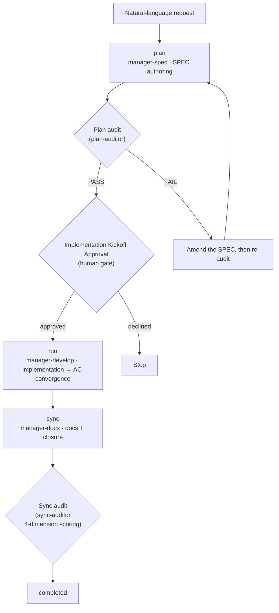



# SPEC Lifecycle

Every piece of MoAI work follows the three-phase lifecycle **plan → run → sync**. This page covers **how that lifecycle flows** — what goes in and comes out of each phase, what the three gates between phases protect, and how the size of the work decides its tier and route.


 **Division of labor**: [SPEC-Based Development](/en/core-concepts/spec-based-dev) covers <strong>what</strong> a SPEC document <strong>is</strong> (the GEARS requirement format, the 3-file composition, Era classification and drift checks). This page covers <strong>how the lifecycle flows</strong> — the two pages link to each other rather than repeating each other.


## The three phases

| Phase | Command | Owning agent | Token budget | What it does |
|-------|---------|--------------|--------------|--------------|
| **plan** | `/moai plan` | manager-spec | 30K | Authors the SPEC document (GEARS requirements + implementation plan + acceptance criteria) |
| **run** | `/moai run` | manager-develop | 180K | Implements via the DDD / TDD methodology — until AC convergence |
| **sync** | `/moai sync` | manager-docs | 40K | Doc sync + changelog + closure (PR) |

Each phase is owned by a different agent. `manager-spec` authors the SPEC, `manager-develop` implements it, and `manager-docs` tidies the result into docs and closes it — the owner changes per phase so that no agent audits its own output.

### Per-phase artifacts

| Phase | Input | Output |
|-------|-------|--------|
| **plan** | natural-language request + codebase investigation | the `.moai/specs/SPEC-XXX/` artifact set (per tier — table below): spec.md, plan.md, acceptance.md (+ design.md, research.md for Tier L) |
| **run** | the SPEC artifact set | implementation commits + tests. Every Acceptance Criterion (AC) must pass before the next phase |
| **sync** | the tree run leaves behind + the progress record | updated docs (README · CHANGELOG · API docs) + a Pull Request. The `completed` status transition and the `sync_commit_sha` record |

For the file composition and format of the SPEC document, see [SPEC-Based Development](/en/core-concepts/spec-based-dev); for run's methodology cycle, see [Development Methodology (DDD/TDD)](/en/core-concepts/ddd).

## The three gates

Three gates sit between the phases. Each protects something different.

### Implementation Kickoff Approval

The **human gate** at the plan → run boundary. It is the last human check standing between an unreviewed plan and implementation; the orchestrator requests approval through `AskUserQuestion`.

- **Mandatory and score-independent.** Even when the plan audit PASSes, even with a high score, this gate is never skipped automatically.
- Passing the gate lets you pick the **autonomous vs semi-autonomous progression mode** in the same place — that choice decides only what happens after approval; it never relaxes or substitutes for the gate itself.

### Plan audit (plan-audit)

At the start of every `/moai run` — before implementation begins — the **plan-auditor** sub-agent independently reviews the full SPEC plan artifacts. It cannot be turned off at any harness level (including `minimal`).

| Verdict | Meaning |
|---------|---------|
| `PASS` | all must-pass criteria met — on to the next phase |
| `FAIL` | must-pass criteria missed — blocks; the report is surfaced and the user is asked |
| `BYPASSED` | bypassed via `--skip-audit` or an environment variable — the bypass is recorded and work proceeds |
| `INCONCLUSIVE` | the auditor hit a timeout, an error, or non-standard output — blocks, then asks retry / proceed / abort |

The PASS bar is the tier-specific passing score — **Tier S 0.75 · Tier M 0.80 · Tier L 0.85** (tier table below). If the previous verdict was PASS, the score clears the tier bar, and the artifact hash is unchanged, re-running the audit can be skipped — but this skip covers **only the audit re-run**. It never passes the Implementation Kickoff Approval human gate on your behalf.

### Sync audit (sync-auditor)

The independent review of sync quality. The **sync-auditor** scores it in a fresh context with no attachment to the code just written, across four dimensions — **Functionality / Security / Craft / Consistency**. Each dimension is scored separately and the overall verdict follows the harmonic mean of the dimension scores, so a collapsed dimension cannot be escaped by making up the average.

## Complexity tiers S/M/L

Every SPEC is classified into one of three tiers during the plan phase. The tier decides the artifact set and the plan-audit passing score — over-formalization that forces big ceremonies on small work is why this classification exists.

| Tier | Size guide | Files touched | Artifact set | Audit passing score |
|------|------------|---------------|--------------|---------------------|
| **S** (Simple) | under 300 LOC | fewer than 5 | **2**: spec.md + plan.md (ACs inline in spec.md §3) | 0.75 |
| **M** (Medium) | 300 – 1000 LOC | 5 – 15 | **3**: spec.md + plan.md + acceptance.md | 0.80 |
| **L** (Large) | over 1000 LOC, or constitution-related | more than 15 | **5**: spec.md + plan.md + acceptance.md + design.md + research.md | 0.85 |

The tier also sets the budget for requirements and acceptance criteria — up to **8 for S, 16 for M, and 25 for L**. The two caps apply **independently** to the requirement count and the acceptance-criteria count (not a combined total). Exceeding either cap is a signal to raise the tier or split the SPEC, not to grow the budget.

## Route A and Route B

Which event triggers the transition between phases is decided by the route the SPEC takes. **Route A — hybrid trunk (direct to `main`)** is the default (Tier S/M): each phase commits and pushes directly to `main`, and the transition fires on the commit·push event plus green CI. **Route B — the PR route** applies to Tier L or an explicit `--pr`: `manager-git` creates a branch and opens a PR per phase, and the transition fires on the PR merge. Neither route changes the phase order (plan → run → sync) or the artifact set — only the vocabulary of the event that drives the transition differs.

## /clear strategy

The principle is to clear the session context as each phase ends:

- **Right after `/moai plan` completes — mandatory.** Do not carry the tokens spent on plan authoring into implementation. This one `/clear` frees 45–50K more tokens for implementation.
- When context exceeds 150K.
- Just before a major phase transition.

Even when the session is cut, the SPEC stays in its files — that is the starting point of SPEC-based development — so the next session picks the work up with a single line (`/moai run SPEC-XXX`). For the full procedure of cutting and resuming sessions safely, see [Token Budget Management and Graceful Stop](/en/advanced/token-budget).

## Related docs

- [SPEC-Based Development](/en/core-concepts/spec-based-dev) — what the SPEC document is: the GEARS format, the 3-file composition, Era classification and drift checks
- [`/moai plan`](/en/workflow-commands/moai-plan) · [`/moai run`](/en/workflow-commands/moai-run) · [`/moai sync`](/en/workflow-commands/moai-sync) — execution detail of each phase command
- [Development Methodology (DDD/TDD)](/en/core-concepts/ddd) — the two methodology cycles the run phase follows
- [TRUST 5 Quality Framework](/en/core-concepts/trust-5) — the quality frame run artifacts must pass
- [Kanban Mode](/en/advanced/kanban-mode) — the shape that runs this lifecycle on a multi-session board
