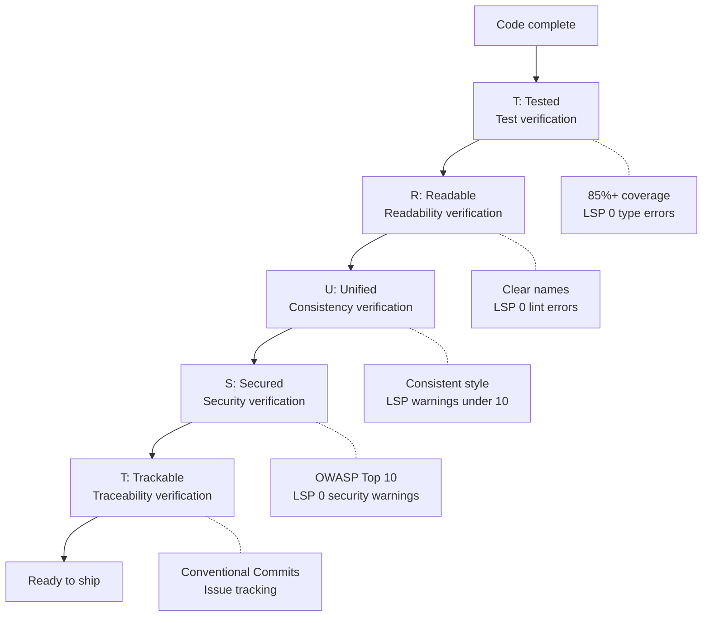
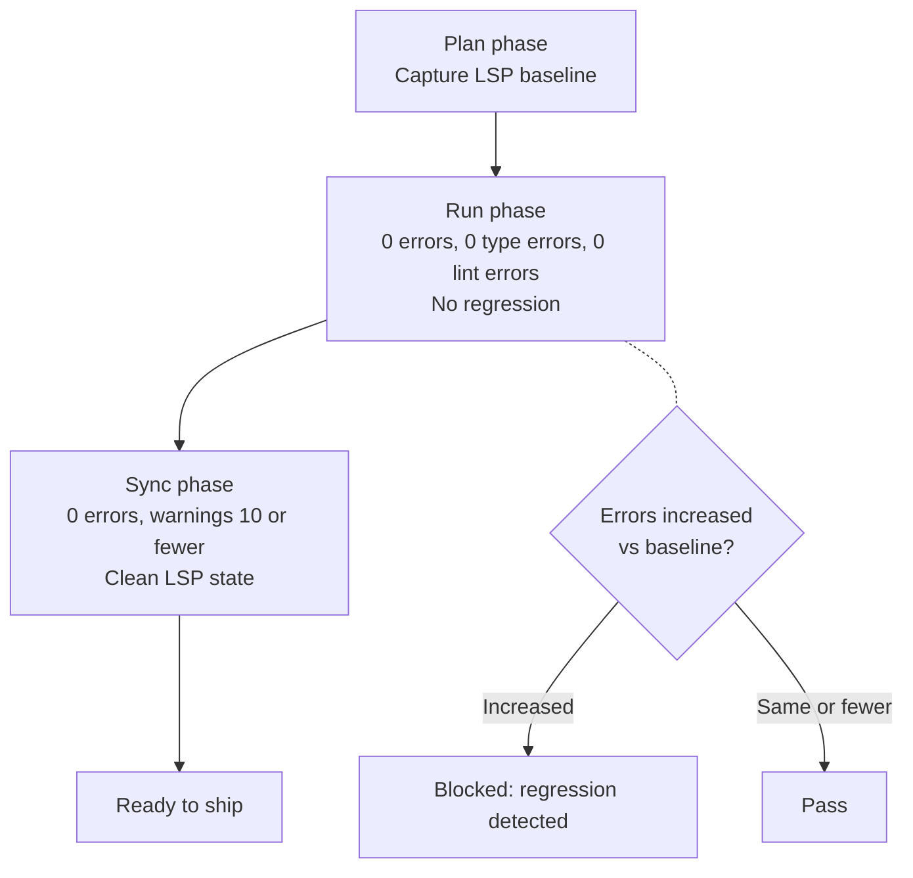
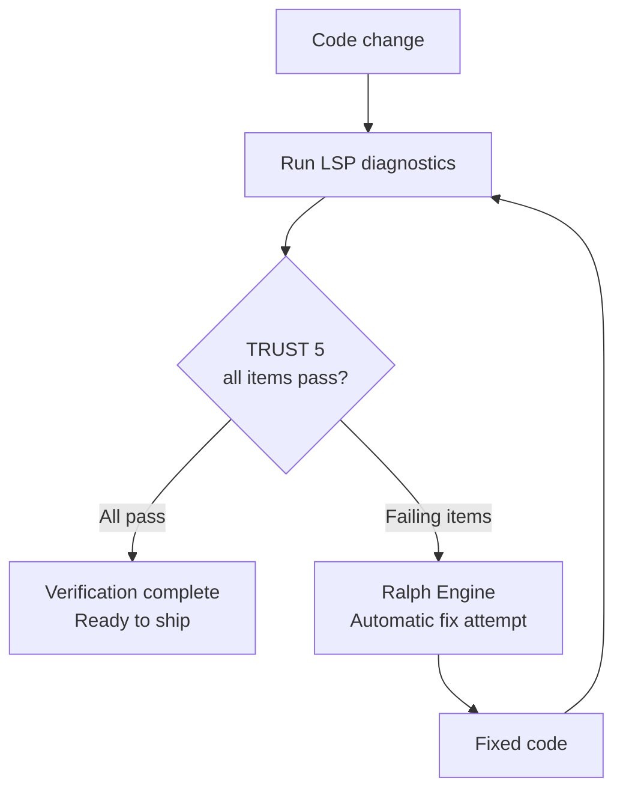

A detailed guide to the five quality principles every piece of MoAI-ADK code must pass. TRUST 5 is
the quality gate of the agentic harness — no matter how fast an agent produces code, work is not
recognized as complete unless it passes this gate.


  **One-line summary:** TRUST 5 is an automated quality gate verifying "is the code tested, readable, consistent,
  secure, and trackable?"


### Harness levels (3 tiers)

The TRUST 5 quality gate is applied at three depths depending on the SPEC scope. The Complexity
Estimator automatically determines the harness level based on the SPEC scope.

| Level        | Name | Verification scope                                       |
| ----------- | ---- | ----------------------------------------------------- |
| `minimal`   | Minimal | Fast verification — only the core gates pass          |
| `standard`  | Standard | Basic verification — runs the basic quality gates (default) |
| `thorough`  | Thorough | Full verification — sync-auditor independent assessment + full TRUST 5 |

## What is TRUST 5?

TRUST 5 is the set of **five quality principles** MoAI-ADK applies to all code. AI-generated
code and human-written code alike must pass these criteria.

By everyday analogy, it is like the final inspection of a building. Structural
safety, electrical wiring, plumbing, fire safety, and permit paperwork must all be verified before
anyone can move in. Code is the same.

| Building inspection | TRUST 5           | What is checked                              |
| ---------------- | ----------------- | -------------------------------------- |
| Structural safety      | **T** (Tested)    | Verify the code actually works, via tests |
| Electrical/plumbing blueprints | **R** (Readable)  | Can other developers understand the code?  |
| Building-code compliance   | **U** (Unified)   | Does it match the project's coding conventions?          |
| Fire/security systems   | **S** (Secured)   | Are there security vulnerabilities?                   |
| Permit paperwork      | **T** (Trackable) | Is the change history clearly recorded?        |



## T - Tested

**Core idea:** All code must be verified by tests.

### What Is Checked

| Verification item       | Criterion           | Description                                                    |
| --------------- | -------------- | ------------------------------------------------------- |
| Test coverage | 85% or higher       | At least 85% of the code must be verified by tests       |
| Characterization tests   | Protect existing code | Refactoring must be backed by tests preserving existing behavior |
| LSP type errors   | 0            | Type checking must report no errors                      |
| LSP diagnostic errors   | 0            | The language server must report no diagnostic errors                   |

### Why 85%?

There is a reason 100% is not required.

| Coverage   | What it means in practice                                               |
| ---------- | ----------------------------------------------------------- |
| Under 60%   | Even major features may go untested                     |
| 60-84%     | Basic functionality is tested but edge cases may be missed |
| **85-95%** | **Core logic and most edge cases are verified (recommended)**    |
| 95-100%    | The return on test maintenance cost starts to diminish        |

### Best Practice

```python
def calculate_discount(price: float, discount_rate: float) -> float:
    """Calculates the discounted price.

    Args:
        price: Original price (0 or greater)
        discount_rate: Discount rate (0.0 ~ 1.0)

    Returns:
        The discounted price

    Raises:
        ValueError: Invalid input values
    """
    if price < 0:
        raise ValueError("Price cannot be less than 0")
    if not 0 <= discount_rate <= 1:
        raise ValueError("Discount rate must be between 0.0 and 1.0")
    return price * (1 - discount_rate)

# Tests: verify both normal and exception cases
def test_calculate_discount_normal():
    assert calculate_discount(10000, 0.1) == 9000
    assert calculate_discount(5000, 0.5) == 2500
    assert calculate_discount(0, 0.5) == 0

def test_calculate_discount_invalid_price():
    with pytest.raises(ValueError, match="Price cannot"):
        calculate_discount(-1000, 0.1)

def test_calculate_discount_invalid_rate():
    with pytest.raises(ValueError, match="Discount rate"):
        calculate_discount(10000, 1.5)
```

---

## R - Readable

**Core idea:** Code must be clear and easy to understand.

### What Is Checked

| Verification item     | Criterion                 | Description                                               |
| ------------- | -------------------- | -------------------------------------------------- |
| Naming conventions     | Intention-revealing names | Variable, function, and class names must be clear          |
| Code comments     | Explanations for complex logic   | Comments should explain "why" it was done this way |
| LSP lint errors | 0                  | All linter rules must pass                   |
| Function length     | Appropriate size            | No single function should be too long                  |

### Best Practice

```python
# Bad: the name alone tells you nothing
def calc(d, r):
    return d * (1 - r)

# Good: the name alone tells you the role
def calculate_discounted_price(original_price: float, discount_rate: float) -> float:
    """Calculates the price discounted from the original price by the discount rate."""
    return original_price * (1 - discount_rate)
```


  **Readability tip:** Ask yourself whether "you, six months from now" could understand this code
  immediately. If not, rename things or add comments.


---

## U - Unified

**Core idea:** Maintain a consistent code style across the entire project.

### What Is Checked

| Verification item | Criterion               | Description                                      |
| --------- | ------------------ | ----------------------------------------- |
| Code format | Auto-formatter applied   | Unified with ruff/black for Python, prettier for JS |
| Naming rules | Follows the project standard | No mixing of snake_case, camelCase, etc.        |
| Error handling | Unified patterns        | The same error-handling approach everywhere    |
| LSP warnings  | Fewer than 10          | Language server warnings below the threshold              |

### Best Practice

```python
# A unified error-handling pattern
class AppError(Exception):
    """Base application error"""
    def __init__(self, message: str, code: int = 500):
        self.message = message
        self.code = code

class NotFoundError(AppError):
    """Resource not found"""
    def __init__(self, resource: str, id: str):
        super().__init__(f"{resource} '{id}' not found", code=404)

class ValidationError(AppError):
    """Input validation failure"""
    def __init__(self, field: str, reason: str):
        super().__init__(f"Validation failed for '{field}': {reason}", code=400)

# The same pattern used in every service
def get_user(user_id: str) -> User:
    user = user_repository.find_by_id(user_id)
    if not user:
        raise NotFoundError("User", user_id)
    return user
```

---

## S - Secured

**Core idea:** All code must pass security verification.

### What Is Checked

| Verification item     | Criterion               | Description                                      |
| ------------- | ------------------ | ----------------------------------------- |
| OWASP Top 10  | Full compliance          | Prevent the 10 most common web security vulnerabilities      |
| Dependency scanning   | No vulnerable packages | No libraries with known vulnerabilities |
| Encryption policy   | Protect sensitive data   | Passwords, tokens, etc. must be encrypted         |
| LSP security warnings | 0                | No security-related warnings            |

### Key Security Checks

| Vulnerability                | Prevention         | Example                                                     |
| --------------------- | ----------------- | -------------------------------------------------------- |
| **SQL Injection**     | Parameterized queries | `db.execute("SELECT * FROM users WHERE id = %s", (id,))` |
| **XSS**               | Output escaping   | Auto-escape when rendering HTML                             |
| **Password exposure**     | bcrypt hashing       | `bcrypt.hashpw(password, salt)`                          |
| **Hardcoded secrets** | Environment variables    | `os.environ["SECRET_KEY"]`                               |
| **CSRF**              | Token verification         | Include a CSRF token in every state-changing request                     |

### Best Practice

```python
# Bad: SQL Injection vulnerability
def get_user(username: str) -> dict:
    query = f"SELECT * FROM users WHERE username = '{username}'"
    return db.execute(query)

# Good: safe with a parameterized query
def get_user(username: str) -> dict:
    query = "SELECT * FROM users WHERE username = %s"
    return db.execute(query, (username,))
```

---

## T - Trackable

**Core idea:** Every change must be clearly traceable.

### What Is Checked

| Verification item     | Criterion                 | Description                                      |
| ------------- | -------------------- | ----------------------------------------- |
| Commit messages   | Conventional Commits | Standard formats like `feat:`, `fix:`, `refactor:` |
| Issue linking     | GitHub Issues references   | Include related issue numbers in commits                |
| CHANGELOG     | Change log maintained       | Record user-facing change history          |
| LSP state tracking | Diagnostic history recorded       | Track LSP state changes to detect regressions        |

### The Conventional Commits Format

```bash
# Structure: <type>(<scope>): <description>
# Examples:

# Add a new feature
$ git commit -m "feat(auth): add JWT-based login API"

# Fix a bug
$ git commit -m "fix(auth): fix token expiry calculation error"

# Refactor
$ git commit -m "refactor(auth): extract auth logic into AuthService"

# Security improvement
$ git commit -m "security(db): prevent SQL Injection with parameterized queries"
```

**Commit types:**

| Type       | Description                       | Example                                         |
| ---------- | -------------------------- | -------------------------------------------- |
| `feat`     | New feature                | `feat(api): add user list API`            |
| `fix`      | Bug fix                  | `fix(auth): fix error message on login failure` |
| `refactor` | Code improvement (no behavior change) | `refactor(db): optimize queries`                  |
| `security` | Security improvement                  | `security(auth): move secret key to environment variable`         |
| `docs`     | Documentation changes                  | `docs(readme): update installation guide`         |
| `test`     | Test additions/changes           | `test(auth): add login test cases`      |

---

## The LSP Quality Gate

MoAI-ADK uses the **LSP** (Language Server Protocol) to verify code quality in real
time. LSP is the very system that underlines errors in red in your IDE.

### Per-Phase LSP Thresholds

Each of the Plan, Run, and Sync phases applies different LSP criteria.

| Phase     | Errors allowed       | Type errors allowed  | Lint errors allowed  | Warnings allowed | Regression allowed |
| -------- | --------------- | --------------- | --------------- | --------- | --------- |
| **Plan** | Baseline captured | Baseline captured | Baseline captured | -         | -         |
| **Run**  | 0             | 0             | 0             | -         | Not allowed      |
| **Sync** | 0             | -               | -               | Up to 10 | Not allowed      |

**What each phase means:**

- **Plan phase:** The current code's LSP state is captured as the "baseline". This becomes
  the reference line.
- **Run phase:** LSP errors must be 0 when implementation completes. Errors must not increase
  relative to the baseline (no regression).
- **Sync phase:** LSP must be clean before documentation and PR creation. Up to
  10 warnings are allowed.



## Integration with the Ralph Engine

The **Ralph Engine** is MoAI-ADK's autonomous quality-verification loop. Based on LSP
diagnostics, it automatically detects code problems and iterates on fixes.



**How it works:**

1. When code changes, LSP runs diagnostics
2. If any item falls short of the TRUST 5 criteria, the Ralph Engine attempts an automatic fix
3. After the fix, LSP diagnostics run again to check for a pass
4. Repeats until it passes (up to 3 retries)

**Related commands:**

```bash
# Run auto-fix
> /moai fix

# Auto-iterate fixes until done
> /moai loop
```

## quality.yaml Configuration

TRUST 5 settings are managed in the `.moai/config/sections/quality.yaml` file.

### Key Settings

```yaml
constitution:
  # Enable TRUST 5 quality verification
  enforce_quality: true

  # Target test coverage
  test_coverage_target: 85

  # LSP quality gate settings
  lsp_quality_gates:
    enabled: true

    plan:
      require_baseline: true # Capture the baseline at Plan start

    run:
      max_errors: 0 # Errors allowed in Run phase: 0
      max_type_errors: 0 # Type errors allowed: 0
      max_lint_errors: 0 # Lint errors allowed: 0
      allow_regression: false # No regression vs baseline

    sync:
      max_errors: 0 # Errors allowed in Sync phase: 0
      max_warnings: 10 # Warnings allowed: up to 10
      require_clean_lsp: true # Requires a clean LSP state

    cache_ttl_seconds: 5 # LSP diagnostics cache duration
    timeout_seconds: 3 # LSP diagnostics timeout
```

### Configuration Customization Tips

| Situation                                   | How to adjust                                                  |
| -------------------------------------- | ---------------------------------------------------------- |
| Early project with almost no tests | Lower `test_coverage_target` to 70 and raise it gradually |
| Lots of legacy code                | Temporarily set `allow_regression` to true          |
| Strict security requirements              | Set `max_warnings` to 0                          |

## In Practice: A Quality-Gate Pass Scenario

Let's see how TRUST 5 applies in real development.

### Scenario: Implementing a User Search API

```bash
# 1. Plan: create the SPEC (LSP baseline captured)
> /moai plan "Implement a user search API"
```

```bash
# 2. Run: implement with DDD (TRUST 5 verification)
> /moai run SPEC-SEARCH-001
```

**TRUST 5 verification in the Run phase:**

| Item              | What was verified                            | Result |
| ----------------- | ------------------------------------ | ---- |
| **T** (Tested)    | Test coverage 85%, 0 type errors   | Pass |
| **R** (Readable)  | 0 lint errors, clear function names    | Pass |
| **U** (Unified)   | ruff/black formatting applied, 3 LSP warnings | Pass |
| **S** (Secured)   | SQL Injection prevented, input validation      | Pass |
| **T** (Trackable) | Conventional Commit format, SPEC referenced  | Pass |

```bash
# 3. Sync: generate docs and PR (final clean-LSP check)
> /moai sync SPEC-SEARCH-001
```

**Final check in the Sync phase:**

```
LSP diagnostic results:
- Errors: 0
- Type errors: 0
- Lint errors: 0
- Warnings: 3 (below the threshold of 10)
- Security warnings: 0

TRUST 5 fully passed: ready to ship
```

## TRUST 5 at a Glance

| Principle              | Key question                   | Automated verification tools         | Criteria                       |
| ----------------- | --------------------------- | ---------------------- | -------------------------- |
| **T** (Tested)    | Is it verified by tests?      | pytest, LSP type checking  | 85%+ coverage, 0 type errors |
| **R** (Readable)  | Can others read it? | ruff, eslint, LSP lint | 0 lint errors, clear names   |
| **U** (Unified)   | Does it match project conventions?     | black, prettier, LSP   | Consistent format, fewer than 10 warnings  |
| **S** (Secured)   | Are there security vulnerabilities?       | bandit, semgrep, LSP   | OWASP compliance, 0 security warnings    |
| **T** (Trackable) | Is the change history traceable?  | commitlint, git        | Conventional Commits       |

## Related Documents

- [What is MoAI-ADK?](/en/core-concepts/what-is-moai-adk) -- Understand the overall structure
  of MoAI-ADK
- [SPEC-Based Development](/en/core-concepts/spec-based-dev) -- Learn the Plan phase
  where TRUST 5 applies
- [Domain-Driven Development](/en/core-concepts/ddd) -- Learn the Run phase
  where TRUST 5 applies
