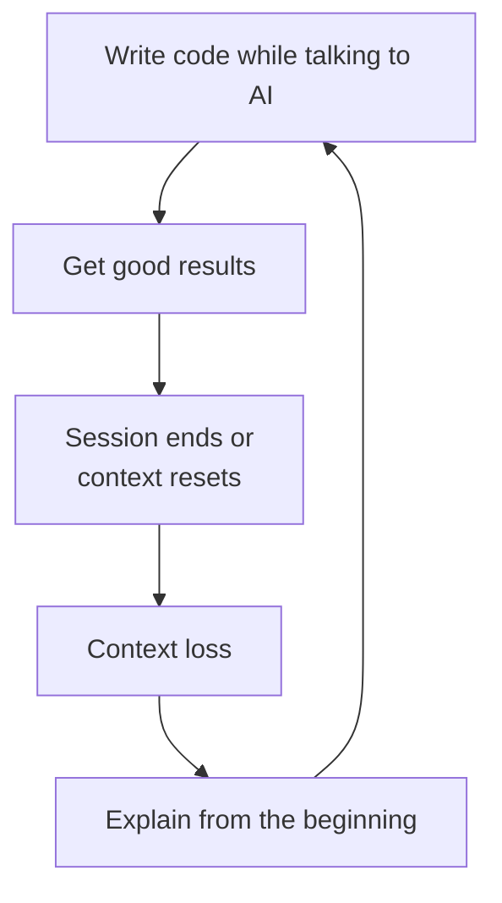
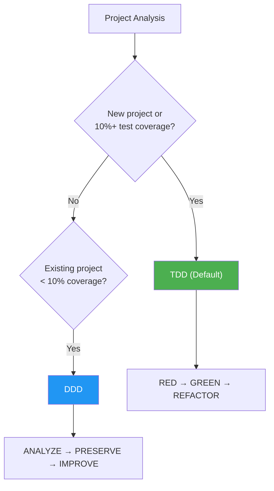
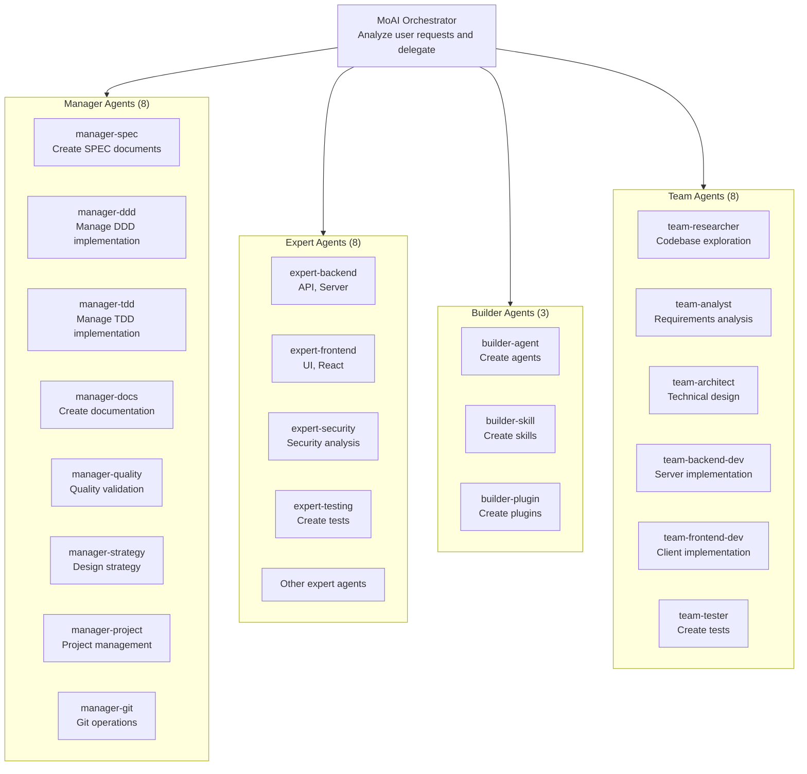
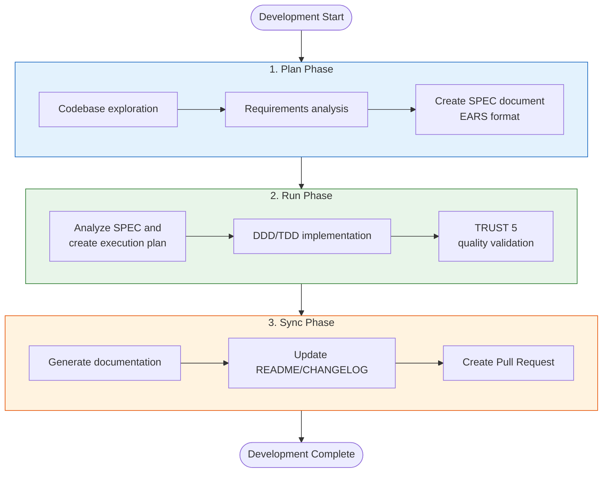
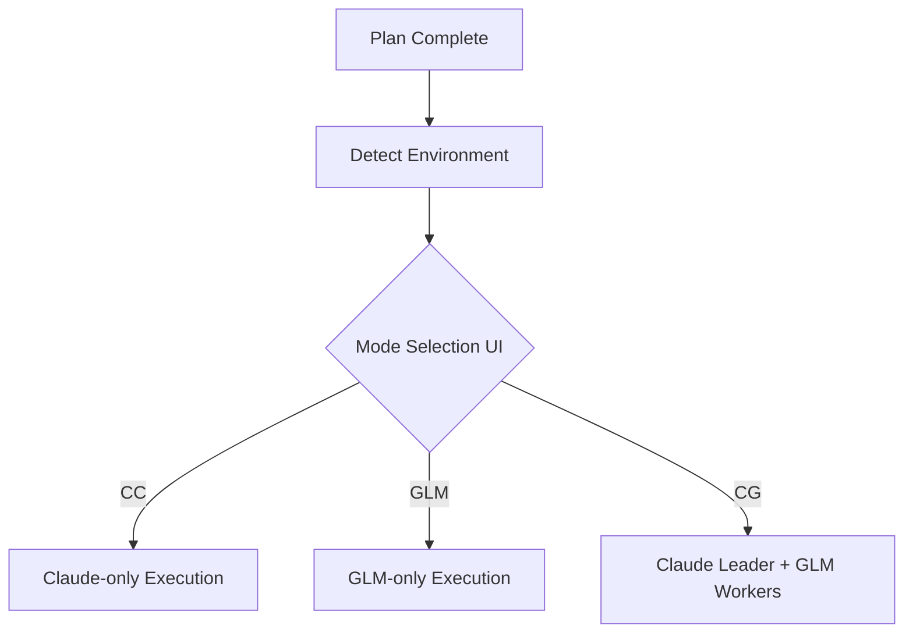
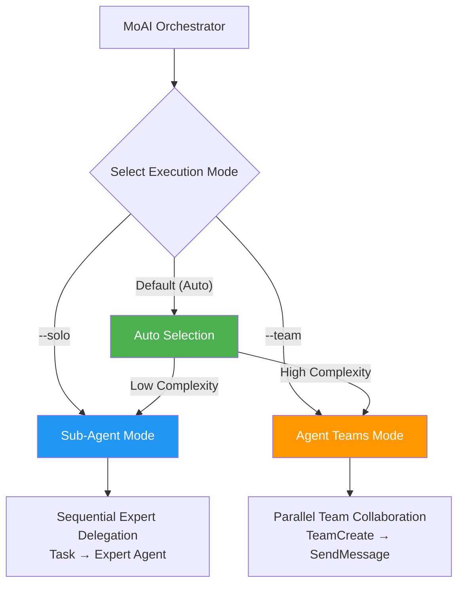

MoAI-ADK is a **high-performance AI development environment** for Claude Code. 28 specialized AI agents and 52 skills collaborate to produce high-quality code. It automatically applies TDD (default) for new projects and feature development, and DDD for existing projects with low test coverage, while supporting both Sub-Agent and Agent Teams dual execution modes.

Written as a single Go binary -- runs instantly on all platforms with zero dependencies.


**One-line summary:** MoAI-ADK is an AI development framework that "documents conversations with AI as specs (SPEC), safely improves code (DDD/TDD), and automatically validates quality (TRUST 5)."


## MoAI-ADK Introduction

**MoAI** means "Everybody's AI" (MoAI - Everybody's AI). **ADK** stands for Agentic Development Kit, a toolkit where AI agents lead the development process.

MoAI-ADK is an **Agentic Development Kit that enables agents to perform agentic coding through interaction within Claude Code**. Just like an AI development team collaborating to complete a project, MoAI-ADK's AI agents perform development work in their respective areas of expertise while collaborating with each other.

| AI Development Team | MoAI-ADK | Role |
|---------------------|----------|------|
| Product Owner | User (Developer) | Decides what to build |
| Team Lead / Tech Lead | MoAI Orchestrator | Coordinates overall work and delegates to team members |
| Planner / Spec Writer | manager-spec | Documents requirements |
| Developers / Engineers | expert-backend, expert-frontend | Implements actual code |
| QA / Code Reviewer | manager-quality | Validates quality standards |

## Why MoAI-ADK?

### Complete Rewrite from Python to Go

The Python-based MoAI-ADK (~73,000 lines) was completely rewritten in Go.

| Item | Python Edition | Go Edition |
|------|---------------|-----------|
| Distribution | pip + venv + dependencies | **Single binary**, zero dependencies |
| Startup Time | ~800ms interpreter boot | **~5ms** native execution |
| Concurrency | asyncio / threading | **Native goroutines** |
| Type Safety | Runtime (mypy optional) | **Compile-time enforcement** |
| Cross-Platform | Python runtime required | **Pre-built binaries** (macOS, Linux, Windows) |
| Hook Execution | Shell wrapper + Python | **Compiled binary**, JSON protocol |

### Key Numbers

- **34,220 lines** of Go code, **32** packages
- **85-100%** test coverage
- **28** specialized AI agents + **52** skills
- **18** programming languages supported
- **16** Claude Code Hook events

### Problems with Vibe Coding

**Vibe Coding** is a method of writing code while naturally conversing with AI. You say "create this feature" and AI generates code. It's intuitive and fast, but causes serious problems in practice.



**Specific problems encountered in practice:**

| Problem | Situation Example | Result |
|---------|-------------------|--------|
| **Context Loss** | Have to re-explain the authentication method discussed for 1 hour yesterday | Time waste, reduced consistency |
| **Quality Inconsistency** | AI sometimes generates good code, sometimes bad code | Unpredictable code quality |
| **Breaking Existing Code** | Said "fix this part" but other features broke | Bugs, rollback needed |
| **Repeated Explanations** | Have to re-explain project structure and coding rules every time | Reduced productivity |
| **No Validation** | No way to verify if AI-generated code is safe | Security vulnerabilities, missing tests |

### MoAI-ADK Solutions

| Problem | MoAI-ADK Solution |
|---------|-------------------|
| Context loss | Permanently preserve requirements as files with **SPEC documents** |
| Quality inconsistency | Apply consistent quality standards with **TRUST 5** framework |
| Breaking existing code | Protect existing functionality by writing tests first with **DDD/TDD** |
| Repeated explanations | Automatically load project context with **CLAUDE.md and skill system** |
| No validation | Automatically validate code quality with **LSP quality gates** |

## System Requirements

| Platform | Supported Environments | Notes |
|----------|----------------------|-------|
| macOS | Terminal, iTerm2 | Fully supported |
| Linux | Bash, Zsh | Fully supported |
| Windows | **WSL (recommended)**, PowerShell 7.x+ | Native cmd.exe is not supported |

**Prerequisites:**
- **Git** must be installed on all platforms
- **Windows users**: [Git for Windows](https://gitforwindows.org/) is **required** (includes Git Bash)
  - **WSL** (Windows Subsystem for Linux) is recommended for the best experience
  - PowerShell 7.x or later is supported as an alternative
  - Legacy Windows PowerShell 5.x and cmd.exe are **not supported**

## Quick Start

### 1. Installation

#### macOS / Linux / WSL

```bash
curl -fsSL https://raw.githubusercontent.com/modu-ai/moai-adk/main/install.sh | bash
```

#### Windows (PowerShell 7.x+)

> **Recommended**: Use WSL with the Linux install command above for the best experience.

```powershell
irm https://raw.githubusercontent.com/modu-ai/moai-adk/main/install.ps1 | iex
```

> [Git for Windows](https://gitforwindows.org/) must be installed first.

#### Build from Source (Go 1.26+)

```bash
git clone https://github.com/modu-ai/moai-adk.git
cd moai-adk && make build
```

> Pre-built binaries can be downloaded from the [Releases](https://github.com/modu-ai/moai-adk/releases) page.

### 2. Project Initialization

```bash
moai init my-project
```

An interactive wizard auto-detects your language, framework, and methodology, then generates Claude Code integration files.

### 3. Start Development in Claude Code

```bash
# After launching Claude Code
/moai project                            # Generate project docs (product.md, structure.md, tech.md)
/moai plan "Add user authentication"     # Create SPEC document
/moai run SPEC-AUTH-001                  # DDD/TDD implementation
/moai sync SPEC-AUTH-001                 # Sync documentation and create PR
```

## Core Philosophy


**"The purpose of vibe coding is not fast productivity, but code quality."**

MoAI-ADK is not a tool for quickly churning out code. The goal is to create **higher quality** code than what humans write directly, while leveraging AI. Fast speed is a secondary effect that naturally follows while maintaining quality.


This philosophy is concretized in three principles:

1. **SPEC-First**: Before writing code, clearly define what to build in a document
2. **Safe Improvement** (DDD/TDD): Incrementally improve while preserving existing code behavior
3. **Auto Quality Validation** (TRUST 5): Automatically validate all code with 5 quality principles

## MoAI Development Methodology

MoAI-ADK automatically selects the optimal development methodology based on the project state.



### TDD Methodology (Default)

The default methodology for new projects and feature development. Write tests first, then implement.

| Phase | Description |
|-------|-------------|
| **RED** | Write a failing test that defines the expected behavior |
| **GREEN** | Write the minimal code to pass the test |
| **REFACTOR** | Improve code quality while keeping tests green. |

For brownfield projects (existing codebases), TDD adds a **pre-RED analysis phase**: read existing code to understand current behavior before writing tests.

### DDD Methodology (Existing Projects, < 10% Coverage)

A methodology for safely refactoring existing projects with low test coverage.

```
ANALYZE   → Analyze existing code and dependencies, identify domain boundaries
PRESERVE  → Write characterization tests, capture current behavior snapshots
IMPROVE   → Improve incrementally under test protection.
```


The methodology is auto-selected during `moai init` (`--mode <ddd|tdd>`, default: tdd) and can be changed in `development_mode` within `.moai/config/sections/quality.yaml`.

**Note**: MoAI-ADK v2.5.0+ uses binary methodology selection (TDD or DDD only). Hybrid mode has been removed for clarity and consistency.


## Harness Engineering Architecture

MoAI-ADK implements the **Harness Engineering** paradigm — designing the environment for AI agents rather than writing code directly.

| Component | Description | Command |
|-----------|-------------|---------|
| **Self-Verify Loop** | Agents write code → test → fail → fix → pass cycle autonomously | `/moai loop` |
| **Context Map** | Codebase architecture maps and documentation always available to agents | `/moai codemaps` |
| **Session Persistence** | `progress.md` tracks completed phases across sessions; interrupted runs resume automatically | `/moai run SPEC-XXX` |
| **Failing Checklist** | All acceptance criteria registered as pending tasks at run start; marked complete as implemented | `/moai run SPEC-XXX` |
| **Language-Agnostic** | 18 languages supported: auto-detects language, selects correct LSP/linter/test/coverage tools | All workflows |
| **Garbage Collection** | Periodic scan and removal of dead code, AI Slop, and unused imports | `/moai clean` |
| **Scaffolding First** | Empty file stubs created before implementation to prevent entropy | `/moai run SPEC-XXX` |


"Human steers, agents execute." — The engineer's role shifts from writing code to designing the harness: SPECs, quality gates, and feedback loops.


## AI Agent Orchestration

MoAI is a **strategic orchestrator**. It does not write code directly, but delegates work to 28 specialized agents.

### Agent Categories

| Category | Count | Agents | Role |
|----------|-------|--------|------|
| **Manager** | 8 | spec, ddd, tdd, docs, quality, project, strategy, git | Workflow coordination, SPEC creation, quality management |
| **Expert** | 8 | backend, frontend, security, devops, performance, debug, testing, refactoring | Domain-specific implementation, analysis, optimization |
| **Builder** | 3 | agent, skill, plugin | Create new MoAI components |
| **Team** | 8 | researcher, analyst, architect, designer, backend-dev, frontend-dev, tester, quality | Parallel team-based development |



### 52 Skills (Progressive Disclosure)

Managed token-efficiently with a 3-level Progressive Disclosure system:

| Category | Count | Examples |
|----------|-------|---------|
| **Foundation** | 5 | core, claude, philosopher, quality, context |
| **Workflow** | 11 | spec, project, ddd, tdd, testing, worktree, thinking... |
| **Domain** | 5 | backend, frontend, database, uiux, data-formats |
| **Language** | 18 | Go, Python, TypeScript, Rust, Java, Kotlin, Swift, C++... |
| **Platform** | 9 | Vercel, Supabase, Firebase, Auth0, Clerk, Railway... |
| **Library** | 3 | shadcn, nextra, mermaid |
| **Tool** | 2 | ast-grep, svg |
| **Specialist** | 10 | Figma, Flutter, Pencil... |

## MoAI Workflow

### Plan → Run → Sync Pipeline

MoAI's core workflow consists of 3 phases:



**Actual usage example:**

```bash
# 1. Plan: Define requirements
> /moai plan "Implement JWT-based user authentication"

# 2. Run: Implement with DDD/TDD
> /moai run SPEC-AUTH-001

# 3. Sync: Generate documentation and PR
> /moai sync SPEC-AUTH-001
```

#### Execution Mode Selection Gate

When transitioning from Plan to Run phase, MoAI automatically detects the current execution environment (cc/glm/cg) and presents a selection UI for the user to confirm or change the mode before implementation begins.



This gate ensures the correct execution mode is used regardless of the environment state, preventing mode mismatches during implementation.

### /moai Subcommands

All subcommands are invoked within Claude Code as `/moai <subcommand>`.

#### Core Workflow

| Subcommand | Aliases | Purpose | Key Flags |
|------------|---------|---------|-----------|
| `plan` | `spec` | Create SPEC document (EARS format) | `--worktree`, `--branch`, `--resume SPEC-XXX`, `--team` |
| `run` | `impl` | DDD/TDD implementation of a SPEC | `--resume SPEC-XXX`, `--team` |
| `sync` | `docs`, `pr` | Sync documentation, codemaps, and create PR | `--merge`, `--skip-mx` |

#### Quality and Testing

| Subcommand | Aliases | Purpose | Key Flags |
|------------|---------|---------|-----------|
| `fix` | -- | Auto-fix LSP errors, lint, type errors (single pass) | `--dry`, `--seq`, `--level N`, `--resume`, `--team` |
| `loop` | -- | Iterative auto-fix until completion (max 100 iterations) | `--max N`, `--auto-fix`, `--seq` |
| `review` | `code-review` | Code review with security and @MX tag compliance | `--staged`, `--branch`, `--security` |
| `coverage` | `test-coverage` | Test coverage analysis and gap filling (16 languages) | `--target N`, `--file PATH`, `--report` |
| `e2e` | -- | E2E testing (Chrome, Playwright, Agent Browser) | `--record`, `--url URL`, `--journey NAME` |
| `clean` | `refactor-clean` | Dead code identification and safe removal | `--dry`, `--safe-only`, `--file PATH` |

#### Documentation and Codebase

| Subcommand | Aliases | Purpose | Key Flags |
|------------|---------|---------|-----------|
| `project` | `init` | Generate project docs (product.md, structure.md, tech.md, codemaps/) | -- |
| `mx` | -- | Scan codebase and add @MX code-level annotations | `--all`, `--dry`, `--priority P1-P4`, `--force`, `--team` |
| `codemaps` | `update-codemaps` | Generate architecture docs | `--force`, `--area AREA` |
| `feedback` | `fb`, `bug`, `issue` | Collect feedback and create GitHub issues | -- |

#### Default Workflow

| Subcommand | Purpose | Key Flags |
|------------|---------|-----------|
| *(none)* | Full autonomous plan → run → sync pipeline. Auto-creates SPEC when complexity score >= 5. | `--loop`, `--max N`, `--branch`, `--pr`, `--resume SPEC-XXX`, `--team`, `--solo` |

### Execution Mode Flags

Controls how agents are deployed during workflow execution:

| Flag | Mode | Description |
|------|------|-------------|
| `--team` | Agent Teams | Parallel team-based execution. Multiple agents work simultaneously. |
| `--solo` | Sub-Agent | Sequential single-agent delegation per phase. |
| *(default)* | Auto | Complexity-based auto-selection (domains >= 3, files >= 10, score >= 7). |

**`--team` supports 3 execution environments:**

| Environment | Command | Leader | Workers | Best For |
|-------------|---------|--------|---------|----------|
| Claude Only | `moai cc` | Claude | Claude | Maximum quality |
| GLM Only | `moai glm` | GLM | GLM | Maximum cost savings |
| CG (Claude+GLM) | `moai cg` | Claude | GLM | Quality + cost balance |


**New in v2.7.1**: CG mode is now the **default** team mode. When using `--team`, the system runs in CG mode unless explicitly changed with `moai cc` or `moai glm`.

`moai cg` uses tmux session-level env isolation to separate Claude Leader from GLM Workers. If switching from `moai glm`, `moai cg` automatically resets GLM settings first.


### Autonomous Development Loop (Ralph Engine)

An autonomous error-fixing engine that combines LSP diagnostics with AST-grep:

```bash
/moai fix       # Single pass: scan → classify → fix → verify
/moai loop      # Iterative fix: repeat until completion marker detected (max 100)
```

**How Ralph Engine works:**
1. **Parallel Scan**: Run LSP diagnostics + AST-grep + linters simultaneously
2. **Auto Classification**: Classify errors from Level 1 (auto-fix) to Level 4 (user intervention)
3. **Convergence Detection**: Apply alternative strategies when the same errors repeat
4. **Completion Criteria**: 0 errors, 0 type errors, 85%+ coverage

### Recommended Workflow Chains

**New feature development:**
```
/moai plan → /moai run SPEC-XXX → /moai sync SPEC-XXX
```

**Bug fix:**
```
/moai fix (or /moai loop) → /moai review → /moai sync
```

**Refactoring:**
```
/moai plan → /moai clean → /moai run SPEC-XXX → /moai review → /moai coverage → /moai codemaps
```

**Documentation update:**
```
/moai codemaps → /moai sync
```

## TRUST 5 Quality Framework

All code changes are validated against 5 quality criteria:

| Criterion | Meaning | Validation |
|-----------|---------|------------|
| **T**ested | Tested | 85%+ coverage, characterization tests, unit tests passing |
| **R**eadable | Readable | Clear naming conventions, consistent code style, 0 lint errors |
| **U**nified | Unified | Consistent formatting, import sorting, project structure compliance |
| **S**ecured | Secured | OWASP compliance, input validation, 0 security warnings |
| **T**rackable | Trackable | Conventional Commits, issue references, structured logging |

## @MX Tag System

MoAI-ADK uses the **@MX code-level annotation system** to communicate context, invariants, and danger zones between AI agents.

| Tag Type | Purpose | When Added |
|----------|---------|------------|
| `@MX:ANCHOR` | Important contracts | Functions with fan_in >= 3, wide impact on change |
| `@MX:WARN` | Danger zones | Goroutines, complexity >= 15, global state mutation |
| `@MX:NOTE` | Context delivery | Magic constants, missing documentation, business rules |
| `@MX:TODO` | Incomplete work | Missing tests, unimplemented features |

The @MX tag system is designed to **mark only the most dangerous and important code**. Most code does not need tags, and this is by design.

```bash
# Scan entire codebase
/moai mx --all

# Preview only (no file modifications)
/moai mx --dry

# Scan by priority
/moai mx --priority P1
```

## Model Policy (Token Optimization)

MoAI-ADK assigns optimal AI models to 28 agents based on your Claude Code subscription plan. It maximizes quality within your plan's rate limits.

| Policy | Plan | 🟣 Opus | 🔵 Sonnet | 🟡 Haiku | Best For |
|--------|------|---------|-----------|----------|----------|
| **High** | Max $200/mo | 23 | 1 | 4 | Maximum quality, highest throughput |
| **Medium** | Max $100/mo | 4 | 19 | 5 | Balance of quality and cost |
| **Low** | Plus $20/mo | 0 | 12 | 16 | Budget-friendly, no Opus |

### Configuration

```bash
# During project initialization
moai init my-project          # Select model policy in interactive wizard

# Reconfigure existing project
moai update                   # Interactive prompts for each configuration step
```


The default policy is `High`. GLM settings are isolated in `settings.local.json` (not committed to Git).


## Dual Execution Modes

MoAI-ADK provides both **Sub-Agent** and **Agent Teams** execution modes supported by Claude Code.



### Agent Teams Mode (Default)

MoAI-ADK automatically analyzes project complexity to select the optimal execution mode:

| Condition | Selected Mode | Reason |
|-----------|---------------|--------|
| 3+ domains | Agent Teams | Multi-domain coordination |
| 10+ affected files | Agent Teams | Large-scale changes |
| Complexity score 7+ | Agent Teams | High complexity |
| Otherwise | Sub-Agent | Simple, predictable workflow |

**Agent Teams mode** uses parallel team-based development:

- Multiple agents work simultaneously, collaborating via shared task list
- Real-time coordination through `TeamCreate`, `SendMessage`, and `TaskList`
- Ideal for large-scale feature development and multi-domain tasks

```bash
/moai plan "large-scale feature"    # Auto: researcher + analyst + architect in parallel
/moai run SPEC-XXX                  # Auto: backend-dev + frontend-dev + tester in parallel
/moai run SPEC-XXX --team           # Force Agent Teams mode
```


**Quality hooks for Agent Teams:**

- **TeammateIdle hook**: Validates LSP quality gates (errors, type errors, lint errors) before a teammate transitions to idle
- **TaskCompleted hook**: Verifies SPEC document existence when a task references a SPEC-XXX pattern
- All validations use graceful degradation -- warnings are logged but work continues


### CG Mode (Claude + GLM Hybrid)

CG mode is a hybrid mode where the Leader uses the **Claude API** and Workers use the **GLM API**. It is implemented through tmux session-level environment variable isolation.

```
┌─────────────────────────────────────────────────────────────┐
│  LEADER (current tmux pane, Claude API)                      │
│  - Orchestrates workflow when /moai --team is executed        │
│  - Handles plan, quality, sync phases                        │
│  - No GLM env → uses Claude API                              │
└──────────────────────┬──────────────────────────────────────┘
                       │ Agent Teams (new tmux panes)
                       ▼
┌─────────────────────────────────────────────────────────────┐
│  TEAMMATES (new tmux panes, GLM API)                         │
│  - Inherits tmux session env → uses GLM API                  │
│  - Executes implementation tasks in run phase                │
│  - Communicates with leader via SendMessage                  │
└─────────────────────────────────────────────────────────────┘
```

```bash
# 1. Store GLM API key (one-time)
moai glm sk-your-glm-api-key

# 2. Activate CG mode
moai cg

# 3. Start Claude Code in the same pane (important!)
claude

# 4. Execute team workflow
/moai --team "task description"
```

| Command | Leader | Workers | tmux Required | Cost Savings | Use Case |
|---------|--------|---------|---------------|-------------|----------|
| `moai cc` | Claude | Claude | No | - | Complex tasks, maximum quality |
| `moai glm` | GLM | GLM | Recommended | ~70% | Cost optimization |
| `moai cg` | Claude | GLM | **Required** | **~60%** | Quality + cost balance |

### Sub-Agent Mode (`--solo`)

A sequential agent delegation approach using the existing Claude Code `Task()` API.

- Delegates work to a single expert agent and receives results
- Proceeds step by step in Manager → Expert → Quality order
- Suitable for simple, predictable workflows

```bash
/moai run SPEC-AUTH-001 --solo    # Force Sub-Agent mode
```

## CLI Commands

| Command | Description |
|---------|-------------|
| `moai init` | Interactive project setup (auto-detects language/framework/methodology) |
| `moai doctor` | System health check and environment verification |
| `moai status` | Project status summary including Git branch and quality metrics |
| `moai update` | Update to the latest version (with auto-rollback support) |
| `moai update --check` | Check for updates without installing |
| `moai update --project` | Sync project templates only |
| `moai worktree new <name>` | Create a new Git worktree (parallel branch development) |
| `moai worktree list` | List active worktrees |
| `moai worktree switch <name>` | Switch worktree |
| `moai worktree sync` | Sync with upstream |
| `moai worktree remove <name>` | Remove a worktree |
| `moai worktree clean` | Clean up stale worktrees |
| `moai worktree go <name>` | Navigate to worktree directory in current shell |
| `moai hook <event>` | Claude Code Hook dispatcher |
| `moai glm` | Start Claude Code with GLM API (cost-efficient alternative) |
| `moai cc` | Start Claude Code without GLM settings (Claude-only mode) |
| `moai cg` | Activate CG mode -- Claude Leader + GLM Workers (tmux pane-level isolation) |
| `moai version` | Display version, commit hash, and build date |

## Task Metrics Logging

MoAI-ADK automatically captures Task tool metrics during development sessions:

- **Location**: `.moai/logs/task-metrics.jsonl`
- **Captured Metrics**: Token usage, tool calls, duration, agent type
- **Purpose**: Session analytics, performance optimization, cost tracking

The PostToolUse hook logs metrics when a Task tool completes. Use this data to analyze agent efficiency and optimize token consumption.

## Project Structure

When you install MoAI-ADK, the following structure is created in your project.

```
my-project/
├── CLAUDE.md                  # MoAI execution guidelines
├── .claude/
│   ├── agents/moai/           # 28 AI agent definitions
│   ├── skills/moai-*/         # 52 skill modules
│   ├── hooks/moai/            # Automation hook scripts
│   └── rules/moai/            # Coding rules and standards
└── .moai/
    ├── config/                # MoAI configuration files
    │   └── sections/
    │       └── quality.yaml   # TRUST 5 quality settings
    ├── specs/                 # SPEC document storage
    │   └── SPEC-XXX/
    │       └── spec.md
    └── memory/                # Cross-session context persistence
```

**Key file descriptions:**

| File/Directory | Role |
|----------------|------|
| `CLAUDE.md` | Execution guidelines that MoAI reads. Contains project rules, agent catalog, and workflow definitions |
| `.claude/agents/` | Defines each agent's area of expertise and tool permissions |
| `.claude/skills/` | Knowledge modules containing best practices for programming languages and platforms |
| `.moai/specs/` | Where SPEC documents are stored. Each feature has its own directory |
| `.moai/config/` | Manages project settings such as TRUST 5 quality standards and DDD/TDD configuration |

## Multilingual Support

MoAI-ADK supports 4 languages. When users request in Korean, it responds in Korean; when requested in English, it responds in English.

| Language | Code | Support Range |
|----------|------|---------------|
| Korean | ko | Conversation, documentation, commands, error messages |
| English | en | Conversation, documentation, commands, error messages |
| Japanese | ja | Conversation, documentation, commands, error messages |
| Chinese | zh | Conversation, documentation, commands, error messages |


**Language Settings:** In `.moai/config/sections/language.yaml`, you can set the conversation language, code comment language, and commit message language separately. For example, you can converse in Korean while writing code comments and commit messages in English.


## Next Steps

Now that you understand the big picture of MoAI-ADK, it's time to learn each core concept in detail.

- [SPEC-Based Development](/core-concepts/spec-based-dev) -- Learn how to define requirements as documents
- [Domain-Driven Development](/core-concepts/ddd) -- Learn how to safely improve existing code
- [TRUST 5 Quality](/core-concepts/trust-5) -- Learn how to automatically validate code quality
- [MoAI Memory](/core-concepts/moai-memory) -- Learn how context is preserved across sessions
